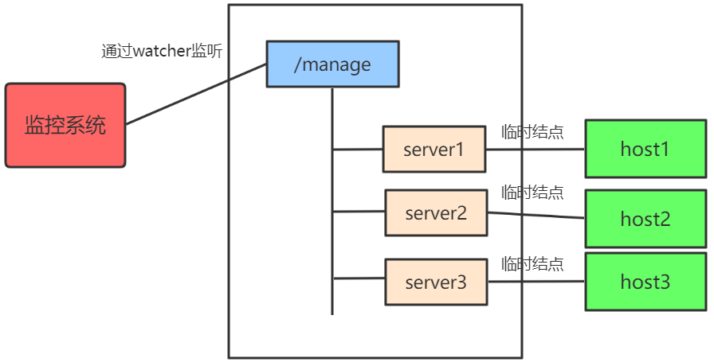
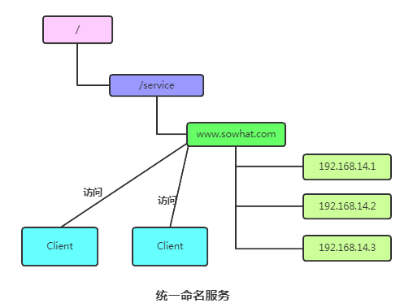

## zookeeper 的应用场景

zookeeper 是一个开源的分布式协调服务框架，为分布式系统提供一致性服务

### 一、数据发布/订阅

当某些数据由几个机器共享，且这些信息经常变化、数据量小的时候，这些数据就适合存储在 zookeeper 中

- 数据存储：将数据存储到 Zookeeper 上的一个数据节点
- 数据获取：应用在启动初始化时，从 Zookeeper 数据节点读取数据，并在该节点上注册一个 Watcher 用来监听数据变更
- 数据变更：当变更数据时会更新 Zookeeper 对应节点数据，Zookeeper会将数据变更**通知**到各客户端，客户端接到通知后重新读取变更后的数据即可

### 二、统一配置管理

本质上，统一配置管理和数据发布/订阅是一样的。分布式环境下，配置文件的同步可以由 zookeeper 来实现

- 将配置文件写入 zookeeper 的一个 znode
- 各个客户端服务监听这个 znode
- 一旦 znode 发生改变，zookeeper 将通知各个客户端服务

### 三、统一集群管理

我们想了解整个集群中有多少机器在工作，我们想对集群的每台机器的运行时状态进行数据采集等，那我们可以利用 zookeeper 的两个特性，监控集群中机器的存活

- 客户端在某个节点上注册一个Watcher，那么如果该节点的子节点变化了，会通知该客户端
- 创建 ephemeral（短暂的） 类型的节点，一旦客户端和服务器的会话结束或过期，那么该节点就会消失

比如，监控系统在 `/manage` 节点上注册一个 watcher，如果 `/manage` 子节点列表有变动，监控系统就能够实时知道集群中机器的增减情况，然后进行后续处理

### 四、命名服务

通过指定的名字来获取资源或者服务的地址，利用 zookeeper 创建一个全局唯一的路径，这个路径可以作为一个名字，指向集群中某个具体的服务器，提供服务的地址。所有向 zookeeper 上注册的地址都是临时节点，这样就能够保证服务提供者和消费者能够自动感知资源的变化。

### 五、其他

分布式锁和选举也是 zookeeper 的典型应用场景

