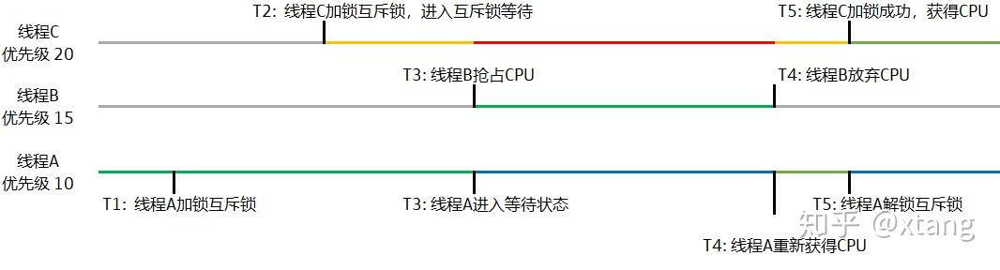

实时操作系统的一个基本要求就是基于优先级的抢占系统，保证高优先级的线程在 “第一时间” 抢到执行权，是实时系统的第一黄金法则。

但是基于优先级抢占的系统，有一个著名问题就是：优先级反转。也就是说，有低优先级的线程占据了 CPU，妨碍了高优先级线程的执行。

有一个比较著名的案例，就是 1997 年美国宇航局的火星探路车，在登陆火星后的一段时间里无法工作，最后查明是因为优先级反转导致探路车的计算机不断重启的问题。

### 一、什么是优先级反转

如下是经典的优先级反转案例



- 线程 A 优先级为 10（低优先级），在 T1 时刻锁定了一把互斥锁，并开始操作互斥数据
- 线程 C 优先级为 20（高优先级），在 T2 时刻被唤醒，他也需要互斥数据，当他加锁时，因为互斥锁在 T1 时刻被线程 A 锁掉了，所以线程 C 放弃了 CPU 进入了阻塞等待状态。
- 此时，优先级为 10 的线程 A 看上去 “抢了” 优先级为 20 的线程 C 的时间。但是因为程序逻辑如此，线程 C 确实需要退出 CPU 等待，直到互斥数据操作完成之后，才能获得 CPU。但是，假设有一个优先级为 15 的线程 B，在 T3 时刻醒了，因为线程 B 比线程 A 的优先级高，所以他会立即抢占 CPU。而线程 A 被迫进行 READY 状态等待。
- 假设一直到 T4 时刻，线程 B 才放弃 CPU，此时优先级为 10 的线程 A 是唯一的 READY（就绪）线程，他再次占据 CPU 继续执行，最后在 T5 时刻解锁。
- 那么在 T5 时刻，优先级最高的线程 C 此时才有机会抢占 CPU，系统才会调用线程 C 执行。

在这个过程中，线程 B 从 T3 时刻到 T4 时刻占据 CPU 运行的行为，就是优先级反转。一个优先级为 15 的线程 B，通过压制优先级为 10 的线程 A，从而导致优先级最高的线程 C 无法得到 CPU。而且这段时间是不可控的。因为线程 B 可以长时间占据 CPU，即使轮询时间片到达，因为线程 A 和线程 B 都处于就绪状态，但是线程 B 的优先级高，线程 B 依然可以占据 CPU。最终的结果就是高优先级的线程 C 可能长时间无法得到 CPU。

而 1997 年美国宇航局的火星车，就是因为有高优先级的线程被压制，从而在指定时间内无法获得 CPU，导致“看门狗” 认为系统出了无法恢复的故障，直接重启了系统。重启后系统再次进入相同状态，导致不断重启，无法正常工作。

下面谈谈解决方案

### 二、人工防止优先级反转的方法

低优先级的线程获得互斥锁前，需要先将自己的优先级临时提高，最后处理完后再退回原优先级。如下的逻辑：

假设还是如刚才的案例，优先级为 10 的线程 A；优先级为 15 的线程 B；优先级为 20 的线程 C。那么在优先级为 10 的线程 A 获取互斥锁之前，先提升优先级到 20，解锁后，又恢复到原优先级。

```
set_priority(20);
pthread_mutex_lock();
...
pthread_mutex_unlock();
set_priority(10);
```

这样，在 T3 的时刻，线程 B 虽然有 15 的优先级，但是对于已经提升到 20 的线程 A 无法形成压制，线程 A 就会继续执行，直到 T5，线程 A 解锁。优先级为 20 的线程 C 立即获取互斥锁运行，线程 B 因为优先级低，无法抢到线程 C 的 CPU。


当然，这里把优先级提高只是特例。在实际场景中，我们需要评估所有可能上锁的线程，找到最高优先级，然后提高到最高优先级。

但是这种方式对于程序员来说显然比较复杂。而且，在现代的实时操作系统中，这个事情操作系统已经帮我们完成了。

还有一点注意，在现代的实时操作系统上，如果需要互斥保护，应该尽量使用互斥锁（mutex）。对于初始值为 1 的信号量，虽然在功能上也能互斥，但信号量一般无法做优先级继承，所以会有优先级反转的隐患。

引用：https://zhuanlan.zhihu.com/p/146132061