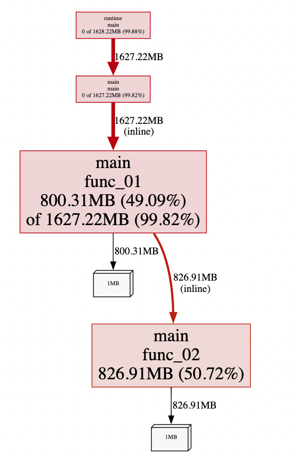
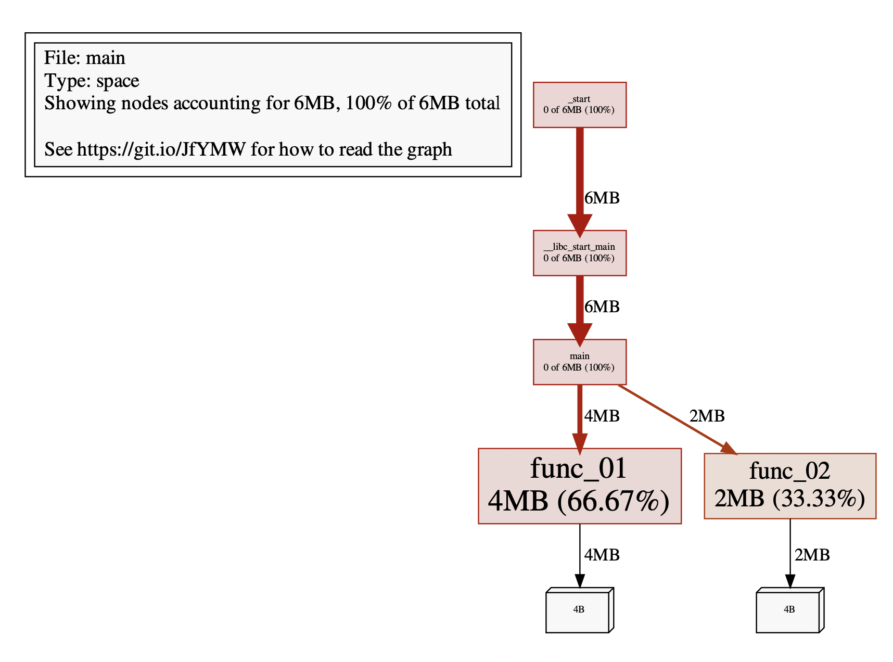
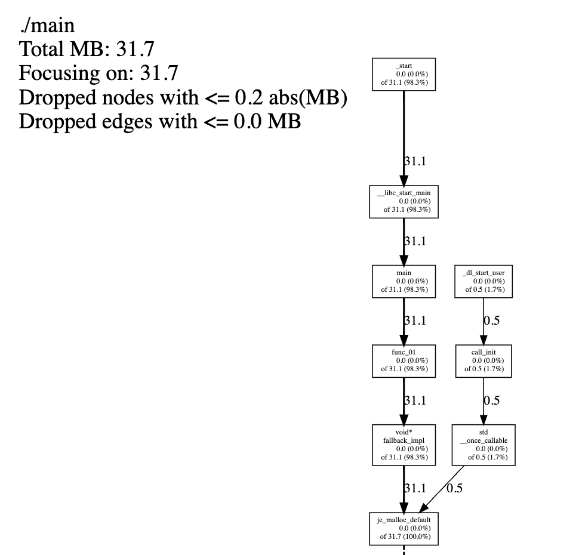
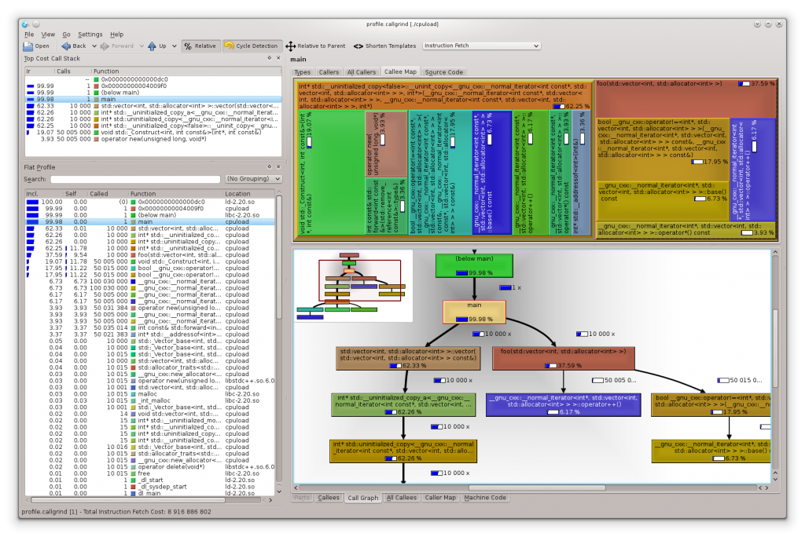

## 性能分析方案

本文主要对 linux 下程序的性能如何分析进行讨论。

性能分析是一种动态的程序分析方法，在运行阶段采集程序的各种信息，再整合、研究，找出软件运行的“瓶颈”，为进一步优化性能提供依据，指明方向。性能分析的范围非常广，可以从 CPU 利用率、内存占用率、网络吞吐量、系统延迟等许多维度来评估。

本文目前主要针对 CPU、内存 这两个方面的性能进行分析。

### 一、调研

#### 1. 系统级工具

Linux 的性能分析工具太多，这里我推荐几个“高性价比”的工具：top、pstack、strace 和 perf。

- top ：可以获取到 **线程级别的 CPU 使用率**、**进程级别的内存使用率** 信息。

- pstack：可以打印进程的调用栈信息，就像是给正在运行的进程拍了个快照，让我们可以看到某个时刻的进程里调用的函数关系，让我们对进程的运行有个初步的印象。

- strace：可以显示出进程的正在运行的系统调用，实时查看进程与系统内核交换了那些信息。

  因此一般我们结合 pstack 和 strace ，大概就可以知道，进程在用户空间和内核空间干了什么事情，当进程的 CPU 利用率过高或者过低的时候，我们很大概率能直接发现瓶颈所在。

- perf：按照固定的频率去采样，相当于连续执行多次的 pstack，然后再统计函数的调用次数，算出百分比。只要采样的频率足够大，把这些时刻的“瞬时截面”组合在一起，就可以得到进程运行时的可信数据，比较全面的描述出 CPU 的使用情况。**可以精确到函数级别的 cpu 占用以及调用堆栈**。

  而对于内存信息，采用内存，要使用`perf mem record` 指令，但这个指令大多数机器上都不能工作，得到的信息也有限（内存延迟、内存访问类型、缓存命中或丢失等），因此我们不讨论。

  而 `perf kmem` 是分析内核内存的使用，这里我们也不讨论

- `/proc/meminfo`：列出了操作系统级别内存的使用信息。free 命令也是来源于此

- `/proc/<pid>/statm` 和 `/proc/<pid>/status`：列出了进程的内存的使用信息。top、ps 命令中关于内存的信息也来源于此

- memstat：可以列出某个进程的虚拟内存使用情况、此进程中共享库占用的虚拟内存占用等等

- nmon、smem、vmstat 等这些关于内存的统计都来自 proc 文件系统。都只能精确到进程级别

因此在系统级工具中，我们想要分析 cpu 使用率情况。我们可以使用 top 定位到线程级别，然后 pstack 和 strace 可以大概率发现是程序中那块逻辑的问题。最后还有 perf 大杀器，我们可以精确到函数级别的 cpu 占用率。

但是对于内存的使用监控。程序申请一块内存，其中可能包括 malloc 库的算法调度、虚拟内存和物理内存之间的映射、进程虚拟地址空间不同段的占用以及进程下线程之间共享内存等等，导致想要监控内存信息，精确到线程、函数级别是比较困难的。

而且系统级工具一般都属于“非侵入”式的分析工具，不需要修改源代码，就可以在程序的外部观察、收集数据。他们虽然方便易用，但毕竟是“隔岸观火”，还是不能非常细致的分析程序，效果不是太理想。所以我们还需要“侵入”式的分析工具。

#### 2. 源码级工具

“侵入”式的分析工具，我们可以在源码中“埋点”，直接写特别的性能分析代码。这样针对性更强，能够有目的的对系统的某个模块做精细化分析，拿到更准确、更详细的数据。

以上系统级非侵入的工具中，我们对于 CPU 的性能分析已经特别具体了，以下的几款工具我们着重对于内存的性能分析。我们先简单介绍下 CPU Profiler 的工作原理。

当我们准备进行 CPU Profiler 时，通常需要选定某一时间窗口，在该窗口内，CPU Profiler 会向目标程序注册一个定时执行的 hook（有多种手段，譬如 SIGPROF 信号、settimer 等），在这个 hook 内我们每次会获取业务线程此刻的 stack trace。我们将 hook 的执行频率控制在特定的数值，譬如 100HZ，这样就可以每 10ms 采集一个业务代码的调用栈样本。当时间窗口结束后，我们将采集到的所有样本进行聚合，最终得到每个函数被采集到的次数，相较于总样本数也就得到了每个函数的相对占比。于是，我们即可发现占比较高的函数，从而定位 CPU 热点。

HeapProfiler 需要侵入到内存分配路径内，这样才能拿到内存分配的数量。通常的做法是直接将自己集成在内存分配器内，当应用程序进行内存分配时拿到当前的 stack trace，最终将所有样本聚合在一起，这样就可以知道每个函数直接或间接的内存分配数量了。

下面介绍几款 CPU Profiler 和 Heap Profiler

##### (1). Go 语言的 Heap Profiler

Go runtime 内置了方便的 profiler，heap 是其中一种类型，我们可以通过如下方式开启一个 debug 端口：

```c++
import _ "net/http/pprof"

go func() {
		log.Print(http.ListenAndServe(":8888", nil))
}
```

然后程序运行期间使用命令行拿到当前的 heap profiling 快照：`go tool pprof http://127.0.0.1:8888/debug/pprof/heap` 
或者也可以在应用程序代码的特定位置直接获取一次 Heap Profiling 快照

```
import "runtime/pprof"
pprof.WriteHeapProfile(writer)
```

程序运行一段时间后，我们使用如下命令拿到 profile 快照并开启一个 web 服务来进行查看内存使用情况：

```
go tool pprof -http=":9999" localhost:8888/debug/pprof/heap
```



当然支持火焰图等等多种不同的展示。 go 语言的 Heap Profiling 是直接将自己集成在内存分配器中，当应用程序进行内存分配时拿到当前的 stack trace。也是通过采样收集内存信息的，默认每分配 512K 采样一次，这个数值可以修改。这部分实现见 go 语言源代码：`src/runtime/malloc.go` 中的 `mallocgc()` 、`profilealloc()` 等函数实现。所以监控展示的内存大小要小于实际分配的内存大小。和 CPU Profiling 一样，这个数值仅仅是用于计算相对占比，进而定位内存分配热点函数。

选择性的采样是为了在功能和性能上做一个平衡。举一个极端情况下的例子，如果我们每次都申请内存都记录下当前的 stack trace，那就可以完全精确的拿到所有函数的内存分配，但每次申请内存都伴随一次栈回溯，但带来的性能开销是巨大的、不可接受的。选择采样并非结果更优，而仅仅是一种妥协。

大部分 Heap Profiler 的实现原理都是类似的，Go Heap Profiling 其实就是从 Google tcmalloc 改造而来的，实现上基本是相同的。

##### (2). gpertools

推荐一款源码级性能分析工具：Google Performance Tools。他是一个 C++ 工具集，里面还包含一个 tcmalloc。gperftools 的性能分析工具有 CPUProfiler 和 HeapProfiler、HeapChecker 等，用来分析 CPU 和内存。

tcmalloc 的官方文档：https://goog-perftools.sourceforge.net/doc/tcmalloc.html
heap profile 的文档：https://goog-perftools.sourceforge.net/doc/heap_profiler.html

前面提到的 Go runtime 所移植的 Google tcmalloc 从内部分化出两个社区版本：一个是 tcmalloc，即纯粹的 malloc 实现，不包含其他附加功能；另一个就是 gperftools，是带 Heap Profiling 能力的 malloc 实现，以及包含其他监控的工具集。其中 pprof 工具，早期是一个 perl 脚本，后来演化并且集成进 Go 语言主干，`go tool pprof`命令就是直接使用 pprof 包。

CPUProfiler 的原理和 perf 差不多，也是按频率采样，默认是每秒 100 次（100HZ），也就是每 10 毫秒采样一次程序的函数调用情况。用法较为简单，只需要在源码中添加三个函数即可：

- ProfilerStart()，开始性能分析，把数据存入指定的文件里；
- ProfilerRegisterThread()，允许对线程做性能分析；
- ProfilerStop()，停止性能分析。

将想要分析 CPU 性能的代码“夹”在三个函数之间就可以了。分析结束后可以得到一个二进制的结果文件，我们使用 pprof 便可以解析生成我们想要的展示图。比如火焰图。

HeapProfiler 的实现，gperftools 则是在他提供的 tcmalloc 实现中植入采集代码。程序使用 tcmalloc 即可实现内存的监控。在默认情况下，每当我们的程序分配了 1G 的内存时，或每当程序的内存使用高水位增加 100MB 时，都会进行一次 Heap Profiler 的 dump。gperftools 自带的 pprof  工具可以分析 dump 出来的 profile 文件。

如下展示关于 HeapProfile 的用法：

```c++
#include <iostream>
#include <gperftools/profiler.h>

void func_01() {
    for (size_t i = 0; i < 1024*1024; ++i) {
        int* p = new int;
        // delete p;
    }
}

void func_02() {
    for (size_t i = 0; i < 1024*512; ++i) {
        int* p = new int;
        // delete p;
    }
}

int main() {
    func_01();
    func_02();
    return 0;
}
```

记得提前安装 gperftools，程序运行起来后，进行检测

```shell
# g++ main.cpp -o main -ltcmalloc

# env HEAPPROFILE=./test_heap.prof ./main
Starting tracking the heap
Dumping heap profile to ./test_heap.prof.0001.heap (Exiting, 6 MB in use)

# pprof --text ./main ./test_heap.prof.0001.heap
File: main
Type: space
Showing nodes accounting for 6MB, 100% of 6MB total
      flat  flat%   sum%        cum   cum%
       4MB 66.67% 66.67%        4MB 66.67%  func_01
       2MB 33.33%   100%        2MB 33.33%  func_02
         0     0%   100%        6MB   100%  __libc_start_main
         0     0%   100%        6MB   100%  _start
         0     0%   100%        6MB   100%  main

# 生成火焰图
# pprof --pdf ./main ./test_heap.prof.0001.heap > ./test_heap.pdf
```



再研究下实现细节，见 gperftools 的源码 `src/heap-profiler.cc` 文件中

```c++
// Record an allocation in the profile.
static void RecordAlloc(const void* ptr, size_t bytes, int skip_count) {
  // Take the stack trace outside the critical section.
  void* stack[HeapProfileTable::kMaxStackDepth];
  int depth = HeapProfileTable::GetCallerStackTrace(skip_count + 1, stack);
  SpinLockHolder l(&heap_lock);
  if (is_on) {
    heap_profile->RecordAlloc(ptr, bytes, depth, stack);
    MaybeDumpProfileLocked();
  }
}

void HeapProfileTable::RecordAlloc(
    const void* ptr, size_t bytes, int stack_depth,
    const void* const call_stack[]) {
  Bucket* b = GetBucket(stack_depth, call_stack);
  b->allocs++;
  b->alloc_size += bytes;
  total_.allocs++;
  total_.alloc_size += bytes;

  AllocValue v;
  v.set_bucket(b);  // also did set_live(false); set_ignore(false)
  v.bytes = bytes;
  address_map_->Insert(ptr, v);
}

// Record a deallocation in the profile.
static void RecordFree(const void* ptr) {
  SpinLockHolder l(&heap_lock);
  if (is_on) {
    heap_profile->RecordFree(ptr);
    MaybeDumpProfileLocked();
  }
}

void HeapProfileTable::RecordFree(const void* ptr) {
  AllocValue v;
  if (address_map_->FindAndRemove(ptr, &v)) {
    Bucket* b = v.bucket();
    b->frees++;
    b->free_size += v.bytes;
    total_.frees++;
    total_.free_size += v.bytes;
  }
}
```

tcmalloc 在 malloc() 和 operator new 中增加一些采样逻辑，当采样条件触发后，执行流程大致为：

- 调用 HeapProfileTable::GetCallerStackTrace() 获取调用栈
- 以调用栈作为 hashmap 的 key 调用 GetBucket() 获取相应的 Bucket
- 累加 Bucket 中的统计数据

tcmalloc 在 free() 和 operator delete 中增加一些逻辑来记录内存释放情况。逻辑大概为：找到相应的 Bucket，累加 free 相关的字段即可。

现代 C/C++/Rust 程序获取调用栈的过程通常是依赖 libunwind 库进行的，libunwind 进行栈回溯的原理上与 Go 类似，都没有选择 Frame Pointer 回溯模式，都是依赖程序中的某个特定 section 所记录的 unwind table。不同的是，Go 所依赖的是自己生态内创建的名为 gopclntab 的特定 section，而 C/C++/Rust 程序依赖的是 .debug_frame section 或 .eh_frame section。GCC 只有开启 -g 参数时才会向 .debug_frame 写入调试信息。

而 .eh_frame 更加现代一些，在 Linux 标准中（https://refspecs.linuxfoundation.org/LSB_5.0.0/LSB-Core-generic/LSB-Core-generic/ehframechpt.html）定义。原理是让编译器在汇编代码的相应位置插入一些伪指令，来协助汇编器生成最终包含 unwind table 的 .eh_frame section。

由于和单纯的 tcmalloc 原理一致，tcmalloc 的 heap profiler 不再举例。

gperftools 研究至此暂时停止。

##### (3). jemalloc 的 heap profiler

jemalloc 自带来 heap profiling 能力，但默认不开启，需要在编译时指定 `--enable-prof` 参数，`--enable-prof-libunwind` 打开 libunwind 堆栈。

测试程序比较简单，就不贴了。记得将 jemalloc 链接到程序中，或者使用 LD_PRELOAD 用 jemalloc 覆盖 ptmalloc。还有 `-g` 选项，否则无法看到符号。接下来我们介绍下如何使用 jemalloc 的 heap profiler。

```
export MALLOC_CONF="prof:true,lg_prof_interval:10"
LD_PRELOAD=xxx/libjemalloc.so ./main
```

MALLOC_CONF 中 `prof:true` 表示开启 profiler，`log_prof_interval:10` 表示每分配 `2^10 字节 (1K)` 堆内存便 dump 一份 profiler 文件。程序执行一段时间，即可看到一些 profiler 文件产生。

```
# ls
jeprof.18751.0.i0.heap    jeprof.18751.13.i13.heap  jeprof.18751.17.i17.heap  jeprof.18751.20.i20.heap  jeprof.18751.24.i24.heap  jeprof.18751.4.i4.heap  jeprof.18751.8.i8.heap
jeprof.18751.2.i2.heap    jeprof.18751.6.i6.heap  main
```

jemalloc 提供了 jeprof 工具，可以用来查看 profile 文件

```
# jeprof ./main jeprof.18751.5.i5.heap
Using local file ./main.
Using local file jeprof.18751.5.i5.heap.
Welcome to jeprof!  For help, type 'help'.
(jeprof) top
Total: 3.0 MB
     3.0 100.0% 100.0%      3.0 100.0% prof_backtrace_impl
     0.0   0.0% 100.0%      2.5  82.2% __libc_start_main
     0.0   0.0% 100.0%      0.5  17.8% _dl_start_user
     0.0   0.0% 100.0%      2.5  82.2% _start
     0.0   0.0% 100.0%      0.5  17.8% call_init
     0.0   0.0% 100.0%      2.5  82.2% func_01
     0.0   0.0% 100.0%      3.0 100.0% imalloc (inline)
     0.0   0.0% 100.0%      3.0 100.0% imalloc_body (inline)
     0.0   0.0% 100.0%      3.0 100.0% je_malloc_default
     0.0   0.0% 100.0%      3.0 100.0% je_prof_backtrace
```



如上，和 tcmalloc 一样，也有生成各种各样的展示形式，火焰图、函数调用图、top 信息等。

jemalloc 的 heap profiler 能力也是在 malloc 中增加采样逻辑，每分配一定大小的内存块便 dump 一份 profile 文件，也是依赖 libunwind 来进行栈回溯。在 free 中注入的逻辑和 tcmalloc 基本一致。

关于接口调用：

```
opt.prof: 启用/禁用内存分析
opt.prof_prefix: 分析文件转储的文件名前缀
opt.prof_active: 分析文件已激活/已停止
opt.prof_thread_active_init:

opt.lg_prof_sample: 分配样本之间的平均间（对数基数为2），以分配活跃的字节数衡量。默认采样间隔为 512KB（2^19 B）；也就是说每分配 512KB 就会采样一次。

opt.prof_accum:

opt.lg_prof_interval: 内存分析文件转储的平均间隔（对数基数为2），以分配活跃的字节数衡量。也就是说内存申请量超过此值，就转储一次到分析文件。默认情况下是禁用的。

opt.prof_dump: 每次总虚拟内存超过先前的最大值时都会触发内存分析文件转储
opt.prof_final: 
opt.prof_leak: 启用/禁用内存泄漏
opt.prof_leak_error: 检测到内存泄漏，则使进程退出并返回错误码

thread.prof.name: 获取/设置与内存分析文件转储中的调用线程关联的描述性名称
thread.prof.active: 控制调用线程的采样当前是否处于活跃状态

prof.thread_active_init: 
prof.active: 控制采样当前是否处于活跃状态
prof.dump: 将内存分析文件转储到指定文件，或者如果指定 NULL，则根据模式转储到文件 <prefix>.<pid>.<seq>.m<mseq>.heap，其中<prefix>由 opt.prof_prefix 和prof.prefix 选项
prof.prefix: 设置分析文件转储的文件名前缀，opt.prof_prefix 为默认设置。设置文件存储路径
prof.gdump: 启用后，每次总虚拟内存超过先前的最大值时出发内存分析文件转储
prof.reset: 重置所有内存分析文件统计信息
prof.lg_sample: 获取当前采样率

prof.interval: 在基于事件间隔的分析文件转储之间分配的平均字节数。和 opt.lg_prof_interval 的信息一致。
```

jemalloc heap profiler ：https://github.com/jemalloc/jemalloc/wiki/Use-Case%3A-Heap-Profiling

- 每申请一定大小的字节数，就是转储

- 每次总虚拟内存超过先前的最大值时触发内存配置文件转储。配置为一个 bool 类型

- 手动通过 mallctl  “prof.dump”  来触发转储。

  - 转储到指定的文件名

    ```
    export MALLOC_CONF="prof:true,prof_prefix:jeprof.out"
    
    const char *fileName = "heap_info.out";
    mallctl("prof.dump", NULL, NULL, &fileName, sizeof(const char *));
    ```

问题记录：

- 无法通过接口设置“当申请内存量超过某值时，转储文件”。只能通过环境变量设置。这个内存量为总的申请内存量
- 可以通过接口设置 “转储文件存储目录，以及转储文件前缀”。prof.prefix 

##### (4). Bytehound

github 地址：https://github.com/koute/bytehound

基于 C 语言和 rust 语言的一款 Linux 平台下的 Mem Profiler。前端功能比较丰富。

在使用上，也是通过 LD_PRELOAD 链接 Bytehound 的动态库文件。如下：

```
LD_PRELOAD=xxx/libbytehound.so ./main
```

然后程序的工作目录会产生一个 `memory-profiling_*.dat` 文件，这个文件就是 heap profiling 的结果。与其他 heap profiler 不同的是，这个文件是持续更新的，而非每隔特定时间或特定条件生成一个新文件。接下来，可以针对这个文件开启一个 web 端口用于实时分析此文件。

```
bytehound server memory-profiling_*.dat
```

bytehound 提供了特别丰富的 GUI，可以参考说明文档：https://koute.github.io/bytehound/introduction.html

关于 bytehound 的原理实现，bytehound 是使用 jemalloc 做了包装，截取出来一段 rust 的实现：

```rust
// 入口
#[cfg_attr(not(test), no_mangle)]
pub unsafe extern "C" fn malloc( size: size_t ) -> *mut c_void {
    allocate( size, AllocationKind::Malloc )
}

#[inline(always)]
unsafe fn allocate( requested_size: usize, kind: AllocationKind ) -> *mut c_void {
    // ...
    // 调用 jemalloc 进行内存分配
    let pointer = match kind {
        AllocationKind::Malloc => {
            if opt::get().zero_memory {
                calloc_real( effective_size as size_t, 1 )
            } else {
                malloc_real( effective_size as size_t )
            }
        },
        // ...
    };
    // ...
    // 栈回溯
    let backtrace = unwind::grab( &mut thread );
    // ...
    // 记录样本
    on_allocation( id, allocation, backtrace, thread );
    pointer
}

// xxx_real 链接到 jemalloc 实现
#[cfg(feature = "jemalloc")]
extern "C" {
    #[link_name = "_rjem_mp_malloc"]
    fn malloc_real( size: size_t ) -> *mut c_void;
    // ...
}
```

从代码逻辑上看，每次 malloc 时都会固定的进行栈回溯和记录，没有采样逻辑。在 on_allocation 的实现中，此记录通过 channel（管道）由其他线程统一进行异步处理。

在测试中，bytehound 的性能开销是比较大的。

##### (5). gprof

GNU 的 gperf 使用编译器辅助检测和采样的混合方法。通过使用操作系统中断来使程序中断，实现定期探测程序相关的计数器。同样的，抽样的统计过程，使生成的分析数据并不准确，仅用来定位热点问题。

常见的使用如下：

```
g++ main.cpp -std=c++11 -pg -o main
./main
gprof main
```

`gcc -pg` 能产生供gprof剖析用的可执行文件。生成的二进制可以使用 gprof 来分析。grpof 生成的结果，可以查看官方文档：https://ftp.gnu.org/old-gnu/Manuals/gprof-2.9.1/html_chapter/gprof_5.html#SEC12

gprof 的开销相当高，主要由检测引起。根据一些报告提供的数据：估计为 30% - 260%

重要的是，**gprof 不支持分析多线程应用程序，也不支持分析共享库。也有一些可以线程支持的变通方法，但无法分析对共享库的调用这一事实使 gprof 完全不适合现代的项目，直接 drop**。

##### (6). valgrind/callgrind

官方的文档：https://valgrind.org/docs/pubs.html

valgrind 是一款比较有历史性的工具。简单来说下他的实现，他可以将 x86 机器码重新编译为更加简单的一种中间代码，他不直接执行 x86 机器代码，因此 valgrind 的性能是比较差的。

callgrind 是将函数调用栈转换为调用图的分析工具。

```
g++ main.cpp -std=c++11 -o main
valgrind --tool=callgrind ./main
```

会生成 profile.callgrind 文件，我们可以选择工具，比如 kCachegrind 来分析。



valgrind 的一个缺点是使应用程序的执行速度大幅下降，因此不适用于比较大、长时间运行的程序。

#### 3. 另辟蹊径，BPF 技术

我们可以使用 BPF 对 Linux 内核进行跟踪，收集我们想要的内核数据，从而对 Linux 中的程序进行分析和调试。与其它的跟踪技术相比，使用BPF的主要优点是几乎可以访问 Linux 内核和应用程序的任何信息，同时，BPF 对系统性能影响很小，执行效率很高，而且开发人员不需要因为收集数据而修改程序。

关于 BPF 技术，可参考：https://lwn.net/Articles/740157/  。这里不过多介绍，他是一个庞大的话题。

虽然 BPF 的性能开销比较低，但基于 BPF 很大程度上只能拿到系统层面的指标，通常意义上的 heap profiler 需要在内存分配链路上进行统计，但是**内存分配是分层的**。解释一下：

我们在程序中 malloc 了一块内存，接下来可能会使用 ptmalloc/jemalloc/tcmalloc 等内存分配方案来分配内存，然后这些内存分配器的实现都会有内存池等等的实现。那么我们 BPF 的 heap profiler 就没法用了。因为他只能告诉用户，在启动阶段申请了一大段内存，其他时候的内存申请数量为 0。而这种场景几乎基本覆盖了我们程序想要检测的所有场景，我们就只能侵入到自己设计的内存分配代码中，在申请内存的入口处做 heap profiler 该做的事情。

使用 BPF 可以 hook 在 brk/sbrk 调用上，当用户态向内核申请扩容堆内存时，对当前的 stack trace 进行记录。但是由于中间的内存分配器这个黑盒，是我们很大概率获取不到我们想要的结果。

推荐一个开源项目：https://github.com/parca-dev/parca 。实现了基于 BPF 的 CPU Profiler。但对于 Heap Profiler 并没有基于 BPF 实现。

### 二、方向目标

我们几乎调研了业界绝大部分性能分析方案。而鉴于此，我们再来回顾一下我们想要做的事情。我们想要性能较优、功能较全的解决方案或者工具来检测 CPU、内存问题。包括但限于：

- CPU、MEM 冲高时可以比较详细的定位到线程、函数堆栈级别。
- 不同维度下（线程、业务模块等）在不同场景下 CPU、MEM 占用情况。
- 在整体程序运行过程中，定位热点函数或热点调用，为我们优化提供方向。

#### 1. CPU 的性能分析

对于 CPU 的性能分析，我们通过 proc 文件系统即可精确的获取到线程级别的 CPU 占用；通过 perf 等系统工具可以在整体程序运行过程中，定位到 CPU 占用热点函数。**但当前无法做到当 CPU 冲高时，这个时间段的热点函数堆栈**。

我们无法做到未卜先知，得知 CPU 冲高的时间点。只能在一个时间段（比如 1 秒）得知了 CPU 冲高，但此时再去做一些统计分析操作相对的已经为时已晚。不过可以定位到线程级别。一般已经可以解决了 99% 的问题。

因此 CPU 的性能分析，目前我们的 "proc 文件系统 + pref" 是完全够用的。下文不在详细的分析。

#### 2. 内存的性能分析

如上文中关于内存的性能分析介绍中，我们在做 heap profiler 时，将内存信息的收集放在“内存分配器”中是最恰当的实现方式。

用户申请内存 -> 内存分配器（ptmalloc、jemalloc、tcmalloc） -> （操作系统层面）进程的 heap 段页面和物理内存页面映射 -> 真实的内存介质

对于物理内存的信息监控涉及到 Linux 操作系统的实现，而且我们去监控物理内存的使用情况没有特别大的意义。而且一般的操作系统对于用户申请的空间，还没有使用（写）的时候，是不会进行进程虚拟页面到系统物理页面的映射的。也就是说，我们不用将精力花费在一个进程/线程的物理内存的性能分析上。实际上，想要做到也比较难，比如需要获取 Linux 缺页中断的实现做 Hook。

那么我们在“内存分配器”中加入相关的检测逻辑，也即在业务申请内存、释放内存的调用中，以采样的方式，获取当前的函数堆栈信息、内存分配大小等信息。那么重点就在于如何采样？

一般的 heap profiler，比如 tcmalloc ，默认情况下，每分配 512KB 的内存，就记录一次内存分配的调用栈。每当程序分配了 1G 内存时，或每当程序的内存使用高水位线增加 100MB 时，会进行一次 heap profiler 的 dump。（关于为什么是 512K 记录一次，gperftools 实现的采样器中有测试结果，推荐为 512K。详见：`src/sampler.h`）

这样即可将内存占用信息具体到函数级别，但注意此内存信息只能用于定位内存热点函数，不可作为实际内存分配值。

### 三、profiler 如何做

我们自己造轮子去实现一款内存分配器是没有必要的。业界已经有比较良好的实现了，而且提供了比较灵活的接口，也就没有改造源项目的必要了。没错，就是 gperftools 的封装即可，已经提供了 CPU、内存的分析实现，我们只需要进行业务层面需要的封装即可。

为什么不直接使用 gperftools 工具呢？

gperftools 工具可以通过链接动态库文件（程序链接时 或 LD_PRELOAD 方式）和设置环境变量的方式；做到 CPU、内存分析。

- 但是操作比较麻烦，不够灵活。设置的环境多，有理解成本。想要做成一个可快速插拔的插件比较困难。
- 想要在满足一些业务条件下做分析比较困难。比如对于 CPU profiler，我们想要程序运行中某一段时间的分析；只能使用信号的方式，这种方式对程序的逻辑有一定侵入性，也不够友好。比如对于 MEM profiler，我们想要即时开始、即时关闭；是做不到的。
- 如果我们想要增加其他的，比如锁竞争相关的性能分析。不能做到良好的封装性。

因此我们通过封装 gperftools 工具，使用它的接口做一款业务友好型、适合当前项目的工具。

#### 1. CPU Profiler

```
gperftools 提供的接口
int ProfilerStart(const char* fname);
void ProfilerStop(void);
```

#### 2. Heap Mem Profiler

```
tcmalloc(gperftools) 提供的接口
void GetHeapSample(MallocExtensionWriter* writer);
```

#### 3. Growth Profiler（分析内存的分配去向（不考虑释放））

```
tcmalloc(gperftools) 提供的接口
void GetHeapGrowthStacks(MallocExtensionWriter* writer);
```

#### 4. 其他

比如锁竞争等等，我们可以参考其他实现完成；并将其统一放入我们的 profiler 工具中。完成对 profiler 工具能力的补齐。

---

- 提供一个动态库文件，通过链接或者 LD_PRELOAD 的方式加载到我们的程序中。
- 增加配置文件，提供配置来控制 profiler 工具的起停、检测时机、检测条件等等。

具体代码设计方案 doing 中