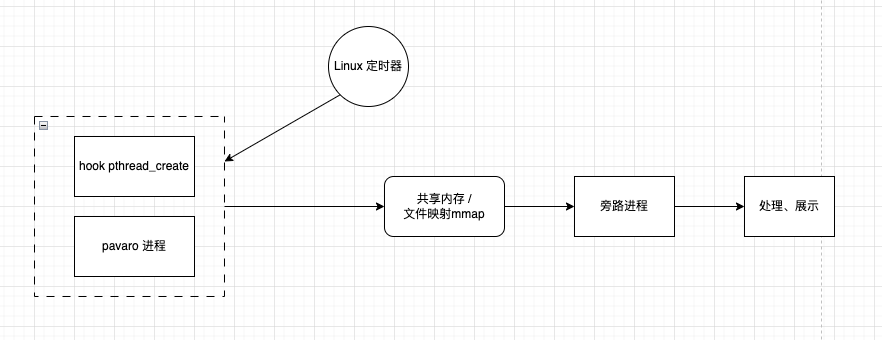

## 线程内存监控优化方案

### 一、背景

目前我们使用 jemalloc 这个第三方库来对我们的项目进行内存管理。我们需要对线程级别的内存进行监控。因此使用 jemalloc 提供的一些接口来设计。方案：https://ku.baidu-int.com/knowledge/HFVrC7hq1Q/pKzJfZczuc/WRJGZXv7Ts/1Qi2RRW2Vf2y2v

简单来说，jemalloc 内部会使用 TLS（thread local storage）对线程分配内存，减少多线程竞争，提高性能。**而 jemalloc 内部有两个变量分别用来记录当前线程申请的内存累加值、释放的内存累加值**。我们获取到这两个变量的值，即可得到线程在一定周期的内存使用情况。

**当前方案：我们使用 LD_PRELOAD 的方式 hook pthread_create 系统调用，当创建线程的时候，我们获取到 jemalloc 内部保存内存申请、释放情况的两个指针，将这两个指针进行保存。然后 pavaro 会每秒调度 resmon 执行器，由 resmon 执行器将这两个指针的值进行处理后，录到 bag 包中。**

如上是我们的背景。下面说明我们遇到的问题。

线程内存监控的目的：监控线程内存使用的稳定性，查看是否有内存泄漏，线程的内存使用是否有冲高等等。但是目前发现：

- 当 pavaro 进程资源占用过多时，高频率出现 resmon 执行器无法被调度的情况。也就是说，某几个周期（某几秒）是 pavaro 进程异常，我们需要监控数据，但是发现 pavaro 调度器并没有调度 resmon 执行器，进而无法采集到到出现异常时监控数据。导致异常问题无法排查。
- 当 pavaro 进程资源占用过多时，此时虽然 resmon 执行器被调度了，但是监控数据录包却失败了（pavaro 内部录包是异步的操作），导致采集到的数据无法保存下来。导致异常问题同样无法排查。

现在出现大量 case，当 pavaro 进程 CPU 冲高、内存冲高时，resmon 执行器没有被调度到，或者录包失败，数据没有录到 bag 包中。并且大部分场景是进程在运行，并且可以打印日志，但是就是无法录包。

### 二、方向

针对这两个问题，我们有以下想法：

- 我们的目的是：当 pavaro 进程异常时，我们要获取到监控数据，并且将这个数据保存下来。
- 我们的方向是：撇弃由 pavaro 框架调度 resmon 执行器采集数据的方式；撇弃数据录 bag 包以保存监控数据的方式。

### 三、方案设计

针对线程内存监控，我们做如下方案

LD_PERLOAD hook pthread_create + linux 定时器 + 共享内存 / 文件映射 + 旁路进程

如上，我们 hook pthread_create 获取到 jemalloc 存储线程申请、释放内存信息的两个指针 allocated_ptr 、deallocated_ptr 。

Linux 定时器一定时间周期触发，获取 allocated_ptr 、deallocated_ptr 两个指针的数据，将数据存储到共享内存、或者存储到文件映射中。

旁路进程从共享内存或者文件中读取线程内存数据，然后处理、展示。

其中我们设定有 500 个线程，一个线程保存 16 字节的数据，一共申请 8KB 左右的共享内存或文件大小。 

#### 1. 为什么使用共享内存 / 文件映射

当前想要一个进程间通信方式，而当前的场景使用共享内存、或者使用文件映射的方式，效率比较高的。保证我们保存数据的时候直接操作内存，性能较高。

而且重要的一点是固定的数据量，我们的线程数量是固定的、大致不变的，每个线程有一个内存增加量、内存释放量，两个数据。所以可以开启定长的共享内存，或者一定大小的文件。

而且我们一次会处理所有线程的内存信息，因此是顺序写，而不是随机写。效率更高。

#### 2. 如何保证安全

我们当前只有一个进程对临界区进行写操作，因此对于当下 64 位的操作系统，我们可以认为不会出现读写冲突，可以同时进行。

#### 3. 比较当前的方案，有哪些优缺点

之前的方案严重依赖 pavaro 框架调度、录制 bag 包，而这种方式相对来说，太不稳定。因此我们希望尽可能的在占用资源低的情况下，在异常发生时，收集到监控数据。

优点是：本方案尽可能的可以保证出现异常时可以收集到监控数据

缺点是：游离于pavaro 框架之外，无法统一管理

#### 4. 使用共享内存、文件映射的优缺点

共享内存的优点：

- 速度快：因为进程直接访问内存区域，省去了数据的拷贝和系统调用的开销。
- 实时性强：由于数据直接在内存中共享，所以多个进程可以实时地读写共享内存区域。
- 空间效率高：共享内存可以使用页表的机制实现进程间的内存共享，节省了内存空间。

共享内存的缺点：

- 容易出现竞态条件：多个进程同时访问共享内存，需要使用同步机制来避免竞争条件。
- 安全性难以保障：共享内存区域不受限于文件系统的权限控制，可能会被非法访问。

文件映射的优点：

- 安全性高：文件系统可以对文件进行权限控制，可以有效地保障文件的安全性。
- 易于实现：文件映射是一种通用的技术，应用场景广泛，易于实现。
- 支持文件的增量更新：如果文件发生变化，只需要重新映射即可。

文件映射的缺点：

- 速度相对较慢：由于数据需要通过文件系统进行读写，所以速度相对较慢。
- 对实时性要求较高的场景不适用：文件映射需要通过文件系统进行读写，多个进程之间读写文件需要频繁地进行系统调用，因此不适用于对实时性要求较高的场景。

共享内存适用于对速度和实时性要求较高的场景。文件映射适用于对安全性要求较高的场景

因此当前方案我优先选择共享内存

#### 5. 为什么使用 linux 定时器

可以和新开一个线程的方式进行对比。线程的执行依赖于 Linux 调度，说白了也是依赖软中断。Linux 定时器也是依赖于软中断。两种方式本质上没有区别。

我认为都可以。

测试：进程卡住的场景下，定时器的调度是否比 LInux 线程调度的优先级要高。

经过测试，模拟 pavaro 进程异常情况（OOM、CPU 冲高时），受 linux 调度的线程执行正常，但是受 pavaro 框架二次封装调度的线程几乎必现无法定频调度。

因此，pavaro 异常情况下，主要是 pavaro 框架的调度策略导致的 resmon 模块不能被调度。和 linux 本身的调度几乎没有关系。因此选择 linux 定时器或者线程调度都可以，重点是不要受 pavaro 框架调度即可。

### 四、展望

- 系统总体的 CPU、系统中进程的 CPU、pavaor 进程中所有线程的 CPU 可以由旁路进程来收集、处理、展示。完全不用嵌套到 pavaro 进程中。
- 系统总体的内存、系统中进程的内存。可以由旁路进程来收集、处理、展示。完全不用嵌套到 pavaro 进程中。
- 系统磁盘的 IO、系统中进程的 IO、pavaro 进程中所有线程的 IO 。可以由旁路进程来收集、处理、展示。完全不用嵌套到 pavaro 进程中。

pavaro 进程中所有线程的内存信息，通过 pavaro 进程本身采集，将数据通过“中介”暴露给旁路进程，由旁路进程处理、展示。