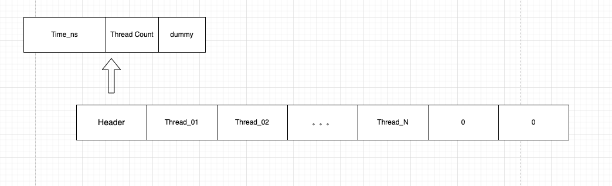

## 线程内存监控优化框架

### 一、数据存储方式

我们已经验证我们的方案是可以在异常情况发生时，收集到监控数据。因此我们对共享内存中的数据结构进行设计。

```c++
struct ThreadMemMonitor {
    union {
        struct {
            uint32_t tid;
            uint32_t arena_id;
        };
        uint64_t key_number;
    };
    union {
        struct {
            uint32_t allocated_kb;
            uint32_t deallocated_kb;
        };
        uint64_t val_number;
    };
};
```

如上是一个线程所要监控的数据结构体。我们现代化以 64 位的 cpu 操作系统作为基础，64 位的操作系统大部分地址总线也是 64位的（不考虑特殊情况）。因此 cpu 一次可以获取到 8 字节的数据，当然也有缓存的影响，但我们就以最坏情况来讨论，因此我们让 cpu 读取数据最好是 8 的倍数，减少不必要的读取。

因此如上设计了单个线程的内存监控信息占用 16 字节。

#### 1. 数据在共享内存中如何存储？

假定有 500 个线程

第一种方案直接每秒将所有线程的内存监控数据，写入共享内存中，一字排开，不区分存储数据。在数据结尾标识结束标志即可。

- 缺：每次都要写 `500 * 16 = 8KB` 的数据到内存
- 优：不用管理线程是否消亡
- 优：利用局部性原理，缓存到寄存器，效率高一点
- 优：编码难度低

第二种方案按照哈希的方式存储所有线程的内存监控数据，由于线程的 tid 和 arena_id 这 8 个字节不会改变，所以我们每次只需要找到相对应的 hash key，然后填充对应的 hash value。（hash key 即为 tid，hash value 为 allocated_kb、deallocated_kb）。

- 缺：每次写一个线程的数据前，都需要求 hash key，然后再将对应的 hash value 数据进行填充。有计算 hash key 的性能开销
- 缺：对于哈希冲突问题需要解决，比如使用多阶哈希
- 缺：线程消亡了，但还是在内存中，所以需要每次都需要检测、清理哪些已经消亡的线程，否则会有错误数据
- 缺：内存地址随机，不同的内存地址处的数据加载到寄存器，然后 cpu 再修改，整个过程需要 N 次内存数据加载到寄存器，无法使用局部性缓存，效率低
- 优：每次只要写 `500 * 8 = 4KB` 的数据到内存。

整体来看，所有的线程内存数据每秒都会改变，因此我们当前的场景适合方案一

#### 2. 伪代码

```
进程 A 进行写操作：
sem_lock()
进程 A 中单线程写 “所有线程的内存数据”
sem_unlock()

进程 B 进行读操作：
sem_lock()
进程 B 读 “所有线程的内存数据”
sem_unlock()
```

### 二、具体实现

增加共享内存头部，用来存储一些信息，包括：当前的纳秒时间戳、当前统计到的线程个数、预留 4 字节作为后备

```
struct Header {
    uint64_t time_ns;
    uint32_t thread_count;
    uint32_t dummy;
};
```

头部后面申请 500 个线程内存信息，存储以下结构：

```
struct ThreadMemMonitor {
    uint32_t tid;
    uint32_t arena_id;
    uint32_t allocated_kb;
    uint32_t deallocated_kb;
};
```

- 增加 agena_id 是为了后面做 jemalloc 的 arena 监控
- allocated_kb 和 deallocated_kb 存储的是单位时间周期内的变化量，4 字节最大可以支持 4096 G。完全符合要求

如下图所示：



头部会有 `Thread Count` 标识存储了多少线程信息，并且会将后续的一个 block 内存空间填充 0，作为二次校验

所以开辟 `16 + 16*500 = 8016 B ` 大小的共享内存。

### 三、优化

在 Header 中增加 `version` 字段表明当前共享内存中数据格式的版本。

```
struct Header {
    uint32_t version;
    uint32_t thread_count;
    uint64_t time_ns;
};
```

写数据的时候，只写入 allocated 或者 deallocated 大于一定阈值的数据，这个阈值暂时取 100KB。

