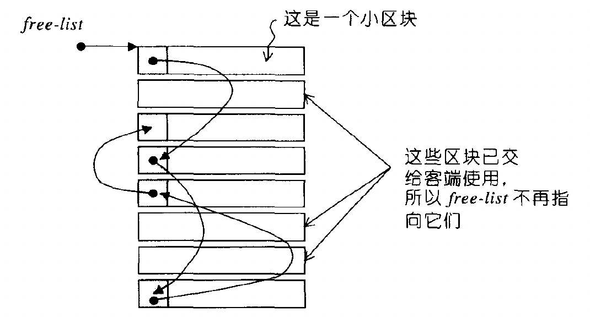

整个 STL 的操作对象都存放在容器之内，而容器一定需要配置空间用来存放数据。所以就要用到空间配置器了。这里的空间一般都指的是内存空间，但是我们也可以写一个基于磁盘空间的空间配置器，只要有这个需求。

SGI STL 的配置器名称为 alloc，不接受任何参数，也就是说，如果要使用需要写成：

```
std::vector<int, std::alloc> iv;
```

一般情况下，SGI STL 的每一个容器都已经指定其缺省的空间配置器为 alloc。例如下的 vector 的声明：

```
template <class T, class Alloc = alloc>
class vector { ... };
```

C++ 中 new 会有两阶段的操作：

- 调用 operator new 配置内存
- 调用对象的构造函数构造对象内容

同理，C++ 中 delete 也有两阶段操作：

- 调用对象的析构函数
- 调用 operator delete 释放内存

那么 STL 的空间配置器会将两阶段操作中的配置内存、释放内存。分别由 `alloc::allocate()` 和 `alloc::deallocate()` 负责。而对象构造和对象析构则使用 `construct()` 和 `destroy()` 负责。

## 一、对象的构造和析构

现在讨论下内存配置后对象的构造行为，以及内存释放前对象的析构行为。

构造使用的是 `construct()`，析构使用的是 `destroy()`。定义在 `<stl_construct.h>` 中

### 1. 对象的构造

```c++
template <class _T1, class _T2>
inline void construct(_T1* __p, const _T2& __value) {
  _Construct(__p, __value);
}

template <class _T1>
inline void construct(_T1* __p) {
  _Construct(__p);
}

template <class _T1, class _T2>
inline void _Construct(_T1* __p, const _T2& __value) {
  new ((void*) __p) _T1(__value);
}

template <class _T1>
inline void _Construct(_T1* __p) {
  new ((void*) __p) _T1();
}
```

可以看到如上，有两个重载函数，接受一个指针 p 和一个初值 value。用途就是将初值设定到指针所指向的空间上。使用的就是 `placement new`  定位 new 来实现的。

### 2. 对象的析构

而对于析构函数，有两种形式，分别为接受一个指针版本、接受两个迭代器。

```c++
template <class _Tp>
inline void destroy(_Tp* __pointer) {
  _Destroy(__pointer);
}

template <class _ForwardIterator>
inline void destroy(_ForwardIterator __first, _ForwardIterator __last) {
  _Destroy(__first, __last);
}
```

接受一个指针的析构，实现比较简单。直接调用所指向对象的析构函数即可，如下：

```c++
template <class _Tp>
inline void _Destroy(_Tp* __pointer) {
  __pointer->~_Tp();
}
```

而接受两个迭代器的析构，希望的是将 `[first, last)` 范围内的所有对象析构掉。如果这个对象是平凡类型，那么这个对象的析构函数调不调用都无伤大雅，只有非平凡对象，才必须调用。因此，如下

```c++
template <class _ForwardIterator>
inline void _Destroy(_ForwardIterator __first, _ForwardIterator __last) {
  __destroy(__first, __last, __VALUE_TYPE(__first));
}

template <class _ForwardIterator, class _Tp>
inline void 
__destroy(_ForwardIterator __first, _ForwardIterator __last, _Tp*)
{
  typedef typename __type_traits<_Tp>::has_trivial_destructor
          _Trivial_destructor;
  __destroy_aux(__first, __last, _Trivial_destructor());
}
```

会使用 `__type_traits<_Tp>::has_trivial_destructor` 来判断此对象是否有平凡的析构函数。而且这一步是在编译期就完成了。

`_Trivial_destructor()` 会返回 ` struct true_type{}` 或者 `struct false_type{}` 。这两个都是一个空的结构体，主要用来标识。

```c++
template <class _ForwardIterator> 
inline void __destroy_aux(_ForwardIterator, _ForwardIterator, __true_type) {}

template <class _ForwardIterator>
void
__destroy_aux(_ForwardIterator __first, _ForwardIterator __last, __false_type)
{
  for ( ; __first != __last; ++__first)
    destroy(&*__first);
}
```

当为 `struct true_type{}` 时，什么也不用做，因为此时此对象是平凡类型，析构函数可以不调用。只有非平凡的对象，才会遍历迭代器，拿到每一个对象的指针，去调用对象的析构函数。

#### (1). 如何在编译期确定对象是否平凡

如果一个对象是平凡类型，那我们在操作这个对象时，就不需要调用对象构造函数和对象析构函数（`constructor、destructor`）这些，而可以采用内存直接处理操作，比如 malloc、memcpy 等函数，以达到最优的效率。

因此，SGI 定义了 `__type_traits` 来提供一种编译器类型识别的机制。类似于：

```
__type_traits<T>::has_trivial_destructor
```

这样，我们就可以通过其来得知是否具有平凡的析构函数。并且对于 T 这种类型识别，我们要做到编译期识别，而编译器只有面对类对象形式的参数时，才会进行参数推导。所以这里我们不能直接返回一个 bool 值，而应该是一个具有真假性质的类对象。于是就定义了两个空的结构体，用于标识真假。

```c++
struct __true_type {};
struct __false_type {};
```

于是，`__type_traits` 定义了一些 typedef，其值要么是 `__true_type`，要么是 `__false_type` 。我们暂时只关注 `has_trivial_destructor`，其他的就不列出了

```c++
template <class _Tp>
struct __type_traits { 
		...
		typedef __false_type    has_trivial_destructor;
		...
};
```

SGI 将 `has_trivial_destructor` 的值默认定义为 `__false_type`。然后再针对每一个基础类型定义了恰当的 `__type_traits` 的特化版本。例如：

```c++
__STL_TEMPLATE_NULL struct __type_traits<char> {
		...
    typedef __true_type    has_trivial_destructor;
    ...
   };
```

像这种定义的类型还包括：`bool、char、signed char、unsigned char、short、unsigned short、int、unsigned int、long、unsigned long、float、double、long double、char*、signed char*、unsigned char*、const char*、const signed char*、const unsigned char*`

因此，有了 `__type_traits` 之后，当我们面对 C++ 标量类型时，都有了 `__type_traits` 特化版本，也就有足够的信息决定采用最有效的赋值操作或者拷贝操作。

## 二、内存的配置与释放

SGI 设计了双层级配置器，第一级配置器直接使用 malloc 和 free。第二级配置器则视情况采用不同的策略：

- 当配置区块超过 128 字节时，便直接调用第一级配置器
- 当配置区块小于 128 字节时，采用内存池的方式

会使用 `__USE_MALLOC` 宏作为区分。一般情况 SGI STL 并未定义 `__USE_MALLOC`，因此，一般采用的是二级配置器的方式。

```C++
typedef __malloc_alloc_template<0> malloc_alloc;

# ifdef __USE_MALLOC
    typedef malloc_alloc alloc;
# else
		...
    typedef __default_alloc_template<__NODE_ALLOCATOR_THREADS, 0> alloc;
#endif /* ! __USE_MALLOC */
```

其中，`__malloc_alloc_template` 是一级配置器，而 `__default_alloc_template` 是二级配置器。

### 1. SGI 封装 simple_alloc

无论 alloc 被定义为一级配置器、还是二级配置器。SGI 还会为他包装一个接口，使配置器的接口能够符合 STL 规格：

```c++
template<class _Tp, class _Alloc>
class simple_alloc {
public:
    static _Tp* allocate(size_t __n)
      { return 0 == __n ? 0 : (_Tp*) _Alloc::allocate(__n * sizeof (_Tp)); }
    static _Tp* allocate(void)
      { return (_Tp*) _Alloc::allocate(sizeof (_Tp)); }
    static void deallocate(_Tp* __p, size_t __n)
      { if (0 != __n) _Alloc::deallocate(__p, __n * sizeof (_Tp)); }
    static void deallocate(_Tp* __p)
      { _Alloc::deallocate(__p, sizeof (_Tp)); }
};
```

这四个成员函数就是单纯的封装，封装第一级或第二级的配置器的成员函数。

我们来看一个使用 simple_alloc 的例子：

```C++
template <class _Tp, class _Alloc> 
class _Vector_base {
public:
  typedef _Alloc allocator_type;
  allocator_type get_allocator() const { return allocator_type(); }

  _Vector_base(const _Alloc&)
    : _M_start(0), _M_finish(0), _M_end_of_storage(0) {}
  _Vector_base(size_t __n, const _Alloc&)
    : _M_start(0), _M_finish(0), _M_end_of_storage(0) 
  {
    _M_start = _M_allocate(__n);
    _M_finish = _M_start;
    _M_end_of_storage = _M_start + __n;
  }

  ~_Vector_base() { _M_deallocate(_M_start, _M_end_of_storage - _M_start); }

protected:
  _Tp* _M_start;
  _Tp* _M_finish;
  _Tp* _M_end_of_storage;

  typedef simple_alloc<_Tp, _Alloc> _M_data_allocator;
  _Tp* _M_allocate(size_t __n) { return _M_data_allocator::allocate(__n); }
  void _M_deallocate(_Tp* __p, size_t __n) { _M_data_allocator::deallocate(__p, __n); }
};

define __STL_DEFAULT_ALLOCATOR(T) alloc
template <class _Tp, class _Alloc = __STL_DEFAULT_ALLOCATOR(_Tp) >
class vector : protected _Vector_base<_Tp, _Alloc> { ... };
```

我们可以看到，vector 容器默认使用的就是 simple_alloc 作为空间配置器。

### 2. 一级配置器

`__malloc_alloc_template` 是一级配置器，我们来展开看下其实现。

```c++
template <int __inst>
class __malloc_alloc_template {
public:
		static void* allocate(size_t __n) {
    		void* __result = malloc(__n);
        if (0 == __result) __result = _S_oom_malloc(__n);
        return __result;
  	}
  
    static void deallocate(void* __p, size_t /* __n */) {
      	free(__p);
    }

    static void (* __set_malloc_handler(void (*__f)()))() {
        void (* __old)() = __malloc_alloc_oom_handler;
        __malloc_alloc_oom_handler = __f;
        return(__old);
    }
};

#ifndef __STL_STATIC_TEMPLATE_MEMBER_BUG
template <int __inst>
void (* __malloc_alloc_template<__inst>::__malloc_alloc_oom_handler)() = 0;
#endif

template <int __inst>
void* __malloc_alloc_template<__inst>::_S_oom_malloc(size_t __n) {
    void (* __my_malloc_handler)();
    void* __result;
    for (;;) {
        __my_malloc_handler = __malloc_alloc_oom_handler;
        if (0 == __my_malloc_handler) { __THROW_BAD_ALLOC; }
        (*__my_malloc_handler)();
        __result = malloc(__n);
        if (__result) return(__result);
    }
}
```

在配置内存的时候，直接使用 malloc 来申请内存，如果 malloc 申请内存失败了，就是使用 `_S_oom_malloc` 来申请内存。而在此函数的实现中，他会循环的使用 `__malloc_alloc_oom_handler` 来进行处理，此函数也被称为 “内存不足处理例程”，每次处理完之后都会继续使用 malloc 申请内存，直到申请成功才会结束。当然了，如果没有定义 `__malloc_alloc_oom_handler`，此函数指针默认为 0，也就是 NULL，那么就不会循环而直接抛出异常。可以通过 `__set_malloc_handler` 来由用户定义“内存不足处理例程”。

这也就满足了 `C++ new handler` 机制，也就是说，可以要求系统在内存配置需要无法被满足时，调用用户所指定的函数。一旦 malloc 无法完成任务，在抛出异常之前，会先调用由用户指定的处理例程。

注意：设计 “内存不足处理例程” 是用户的责任，设定 “内存不足处理例程” 也是用户的责任。

释放内存就比较简单了，直接调用 free 函数即可。还有一个 realloc，他的处理流程和 malloc 基本上差不多，就不展开了。

### 3. 二级配置器

在 ptmalloc（glibc 的默认的内存管理器）中，申请一块内存时，一般 ptmalloc 会多提供 16 字节，放在内存块的头部，此头部会保存一些内存块的相关信息。这种做法带来的一个缺点就是对于小内存块，这个小内存块的报头所占用的空间属于额外负担。这种额外负担没法避免，并且内存块越小，额外负担所占的比例就越大，浪费就越严重。

如果申请的内存块大于 128 字节时，就交给一级配置器处理。当内存块小于 128 字节时，则以内存池管理。此内存池的实现：每次申请一大块内存，并维护对应之自由链表。下次若再有相同大小的内存需求，就直接从自由链表中拿出。如果用户释放小内存块，就由配置器回收到自由链表中。

当然 SGI 二级配置器会将小内存块进行内存对齐（以 8 字节为单位）。也就是说，假如用户申请 30 字节，会自动调整为 32 字节。并且 SGI 会维护 16 个自由链表，各自管理大小分别为 8、16、24、32、40、48、56、64、72、80、88、96、104、112、120、128 这么多小内存块自由链表。

`__default_alloc_template` 是 SGI 实现的二级配置器。自由链表的节点结构如下：

```c++
  union _Obj {
        union _Obj* _M_free_list_link;
        char _M_client_data[1];    /* The client sees this.        */
  };
```

`_Obj` 使用的是 union，由于 union 的缘故，所以从第一字段来看，`_Obj` 可以看作为一个指针，指向相同形式的另一个 `_Obj`。从第二个字段来看，`_Obj` 可以看作为一个指针，指向实际内存块。这样做的话，不会为了维护链表所必需的指针而造成内存的浪费。



可以看到，让内存块被自由链表分配出去后，头部那个原本存放指针的区域，也可以供用户使用。这样就可以节约内存。

#### (1). 空间配置 allocate

我们首先来看代码

```c++
template <bool threads, int inst>
class __default_alloc_template {
  static void* allocate(size_t __n)
  {
    void* __ret = 0;

    if (__n > (size_t) _MAX_BYTES) {
      __ret = malloc_alloc::allocate(__n);
    }
    else {
      _Obj* __STL_VOLATILE* __my_free_list
          = _S_free_list + _S_freelist_index(__n);
      // Acquire the lock here with a constructor call.
      // This ensures that it is released in exit or during stack
      // unwinding.
#     ifndef _NOTHREADS
      /*REFERENCED*/
      _Lock __lock_instance;
#     endif
      _Obj* __RESTRICT __result = *__my_free_list;
      if (__result == 0)
        __ret = _S_refill(_S_round_up(__n));
      else {
        *__my_free_list = __result -> _M_free_list_link;
        __ret = __result;
      }
    }

    return __ret;
  };
	...
};
```

首先会判断内存块大小，是否大于 `_MAX_BYTES`（128 字节），如果大于 128 字节，则直接调用一级配置器。否则，再去检查对应的链表。如下步骤：

- 首先将用户申请的内存块大小


