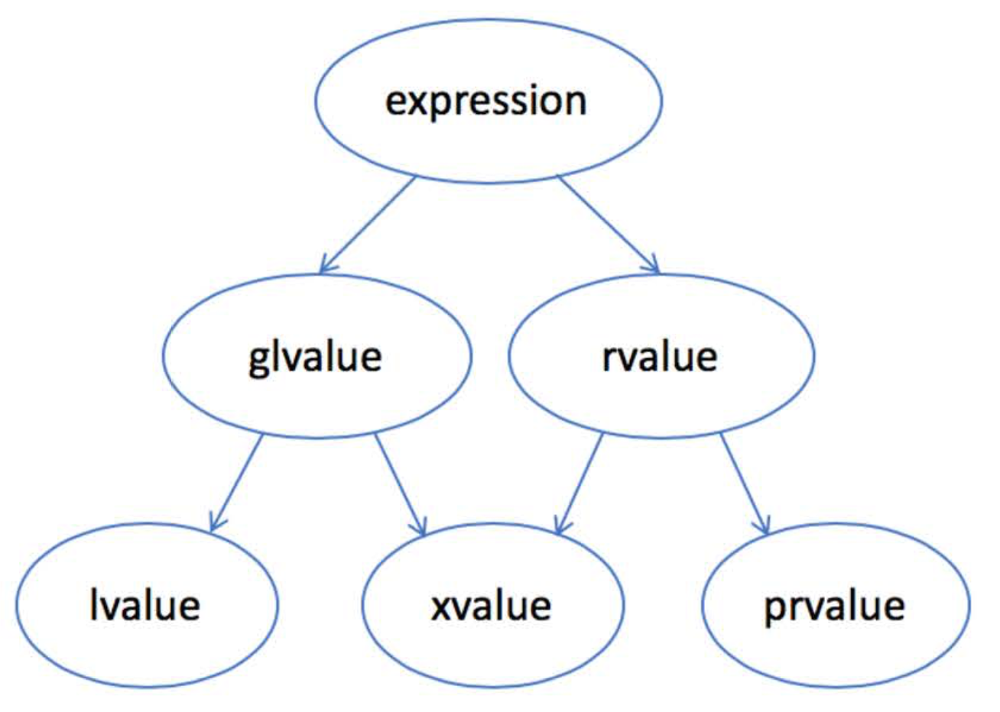

#### 左值和右值



- lvalue：通常是可以放在等号左边的表达式，左值
- rvalue：通常是只能放在等号右边的表达式，右值
- glvalue：是 generalized lvalue，广义左值
- xvalue：是 expiring lvalue，将亡值
- prvalue：是 pure rvalue，纯右值

```
左值 lvalue 是有标识符、可以取地址的表达式，最常见的情况有：
1. 变量、函数或数据成员的名字
2. 返回左值引用的表达式，如 ++x、x = 1、count << ' '
3. 字符串字面量如："hello world"
在函数调用时，左值可以绑定到左值引用的参数，如T&。一个常量只能绑定到常左值引用，如 const T&

纯右值 prvalue 是没有标识符、不可以取地址的表达式，一般也称为“临时对象”，最常见的情况有：
1. 返回非引用类型的表达式，如 x++、x+1、make_shared<int>(42)
2. 除字符串字面量之外的字面量，如 42、true
```

```
template <typename T> 
smart_ptr(smart_ptr<T>&& other) noexcept {
	ptr_ = other.ptr_;
}
如上，函数中变量 other 是一个左值，other 是个变量的名字，变量有标识符、有地址。类型是右值引用的变量是一个左值
```

```
smart_ptr<shape> ptr1{ new circle(); }
new circle() 是一个纯右值，但对于指针，通常使用值传递，并不关心他是左值还是右值

smart_ptr<shape> ptr2 = std::move(ptr1);
std::move(ptr) 的作用就是把一个左值引用强制转换成一个右值引用，而并不改变其内容。因此 std::move(ptr1) 的结果是指向 ptr1 的一个右值引用。std::move(ptr) 是一个有名字的右值，就叫做 xvalue 将亡值，xvalue 是不能取地址的。
```

#### 生命周期和表达式类型

临时对象(prvalue)的生命周期。C++的规则是：一个临时对象会在包含这个临时对象的完整表达式估值完成后、按生成顺序的逆序被销毁，除非有生命周期延长发生。

```
class shape {
public:
	virtual ~shape() {}
};

class circle : public shape {
public:
	circle() { puts("circle()"); }
	~circle() { puts("~circle()"); }
};

class triangle : public shape {
public: 
	triangle() { puts("triangle()"); }
	~triangle() { puts("~triangle()"); }
};

class result {
public: 
	result() { puts("result()"); }
	~result() { puts("~result()"); }
};

result process_shape(const shape& shape1, const shape& shape2) {
	puts("Process_shape()");
	return result();
}

int main() {
	puts("main()");
	process_shape(circle(), triganle());
	puts("something else");
}
// 执行结果
main()
circle()
triangle()
process_shape()
result()
~result()
~triangle()
~circle()
something else

main()
triangle()
circle()
Process_shape()
result()
~result()
~circle()
~triangle()
something else
```

如果一个 prvalue 被绑定到一个引用上，它的生命周期则会延长到跟这个引用变量一样长。需要注意的是，这条生命周期延长规则只对 纯右值 prvalue 有效，而对 xvalue 无效。

#### 如何实现移动

1. 你的对象应该有分开的拷贝构造和移动构造函数，除非你只打算支持移动，不支持拷贝
2. 你的对象应该有 swap 成员函数，支持和另外一个对象快速交换成员
3. 在你的对象命名空间下，应当有一个全局的 swap 函数，调用成员函数 swap 来实现交换。支持这种用法会方便别人(包括你自己在将来)在其他对象里包含你的对象，并快速实现他们的 swap 函数
4. 实现通用的 operator= 
5. 上面的各个函数如果不抛异常的话，应当标为 noexcept。这对移动构造函数尤为重要

#### 不要返回本地变量的引用

在函数中返回一个本地对象的引用，由于函数结束时本地对象即将被销毁，返回一个指向本地对象的引用属于未定义行为

```
在C++11之前，返回一个本地对象意味着这个对象会被拷贝，除非编译器发现可以做返回值优化(named return value optimization, 或 NRVO)，能把对象直接构造到调用者的栈上。从C++11开始，返回值的优化仍可以发生，但在没有返回值优化的情况下，编译器将试图把本地对象移动出去，而不是拷贝出去。这一行为不需要程序猿手工 std::move 进行干预。如果使用 std::move 对于移动行为没有帮助，反而会影响返回值的优化，多调用一次移动构造。
如果返回有分支，编译器没法优化，就不会有NRVO，不会直接构造到调用者的栈上。
```

#### 引用坍缩和完美转发

对于泛型编程：

1. 对于 T& ，一定是个左值引用
2. 对于 T&& ，不一定是右值引用

```
对于 template<typename T> foo(T&&) 这样的代码，如果传递过去的参数是左值，T 的推导结果是左值引用；如果传递过去的参数是右值，T 的推导结果是参数的类型本身
如果 T 是左值引用，那 T&& 的结果仍然是左值引用，即 type&&& 坍缩成 type& 
如果 T 是一个实际类型，那 T&& 的结果自然是一个右值引用

在 T 是模版参数时，T&& 的作用主要是保持值类别进行转发，它有个名字就叫“转发引用”。因为既可以是左值引用，也可以是右值引用，它也曾被叫做“万能引用”。
```

如何解决呢 T&& 的这个问题呢？保证它一定是个右值

```
很多标准库的函数，连目标的参数类型都不知道，但我们仍然需要能够保持参数的值类别：左值仍然是左值，右值的仍然是右值。可以使用 std::forward 来实现

template <typename T>
void bar(T&& s) {
	foo(std::forward<T>(s)); // 加上 std::forward 这个对象 s 一定是一个右值。不加的时候可能会是左值。
}
```

