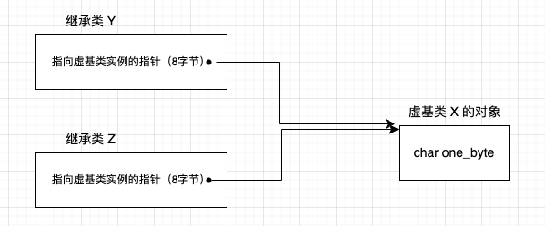

本文测试代码的环境为：x86-64，ubuntu22.04，gcc7.5.0

## 一、缘起

先使用一段代码引入本文所要探讨的主题。

```
class X {};
class Y : public virtual X {};
class Z : public virtual X {};
class A : public Y, public Z {};

int main() {
    std::cout << "sizeof X: " << sizeof(X) << std::endl;
    std::cout << "sizeof Y: " << sizeof(Y) << std::endl;
    std::cout << "sizeof Z: " << sizeof(Z) << std::endl;
    std::cout << "sizeof A: " << sizeof(A) << std::endl;

    X x1, x2;
    std::cout << &x1 << " " << &x2 << std::endl;

    Y y1, y2;
    std::cout << &y1 << " " << &y2 << std::endl;

    Z z1, z2;
    std::cout << &z1 << " " << &z2 << std::endl;

    A a1, a2;
    std::cout << &a1 << " " << &a2 << std::endl;
    return 0;
}

# g++ main.cpp -g -o main
# ./main
sizeof X: 1
sizeof Y: 8
sizeof Z: 8
sizeof A: 16
0x7fffb23046fe 0x7fffb23046ff
0x7fffb2304700 0x7fffb2304708
0x7fffb2304710 0x7fffb2304718
0x7fffb2304720 0x7fffb2304730
```

如上的代码也是虚继承解决菱形继承中命名冲突和冗数据的问题。虚继承的目的是让某个类做出声明，承诺愿意共享他的基类。这个被共享的基类就称为虚基类。

在这种机制下，无论虚基类在继承体系中出现了多少次，在派生类中都只包含一份虚基类的成员。

虚派生只影响从指定了虚基类的派生类中进一步派生出来的类，他不会影响派生类本身。

### 1. 空类占用的空间

首先我们发现一个空的类 X。他占用的空间为 1 字节。

为什么呢？对于空类，编译器会安插一个 char。**让这个类对象能有一个地址，并且可以让这个类的两个对象在内存中有不同的地址**。 

### 2. 继承类占用的空间

我们看到类 Y 和 类 Z 占用的空间大小都为 8 字节。我们来分析为什么是 8 字节。

首先，这个大小是与机器、编译器有关。我们是 64 位机器，并且编译器是 gcc7.5.0 的。也就是指针默认是 8 字节。除此之外，可能还会受到如下三种因素的影响。注意，我说的是可能。

- C++ 语言支持 虚拟继承 时，子类中会有一个指向虚基类实例的指针，64 位机器，指针占用 8 字节
- 编译器会对空类安插一个字节，如上所示。
- 内存对齐的限制，C++ 的类也是一个结构体，需要内存对齐。64 位机器上对齐数默认是 8 字节。

我列了如上三种可能，然后如下图是类 X、Y、Z 的对象布局。



我们可以看到在类 Y 和 类 Z 中，已经有了一个指向虚基类实例的指针了，编译器就不再需要为了区别空类而安插一个字节了。并且指针是 8 字节，内存也是对齐的，不需要额外的内存对齐了。

我们可以通过 gdb 简单看到这些信息

```
(gdb) p y1
$1 = {<X> = {<No data fields>}, _vptr.Y = 0x555555557cd8 <VTT for Y>}
(gdb) p y2
$2 = {<X> = {<No data fields>}, _vptr.Y = 0x555555557cd8 <VTT for Y>}
(gdb) p z1
$3 = {<X> = {<No data fields>}, _vptr.Z = 0x555555557cb8 <VTT for Z>}
(gdb) p z2
$4 = {<X> = {<No data fields>}, _vptr.Z = 0x555555557cb8 <VTT for Z>}
```

可以看到，类 Y 和 类 Z 的对象中有对应的指针。所以类 Y 和类 Z 对象占用的空间大小为 8 字节。

### 3. 多继承的情况

首先无论虚基类在继承体系中出现了多少次，在派生类中都只包含一份虚基类的成员。

再来看看 类 A 的情况，类 A 对象的大小由下列几点决定：

- 被大家共享的唯一一个 类 X 的实例，大小为 1 字节
- 类 Y 和 类 Z 的大小
- 内存对齐所需要的填充大小

同理，因为类 A 继承了类 Y 和类 Z，所以类 A 对象不再需要为了区别空类而安插一个字节了。同时，也不用管被大家共享的唯一一个类 X 实例的大小了。

主要需要考虑的就是继承过来的类 Y 和 类 Z 的指向虚基类实例的指针。通过 gdb 查看如下

```
(gdb) p a1
$5 = {<Y> = {<X> = {<No data fields>}, _vptr.Y = 0x555555557c38 <vtable for A+24>}, <Z> = {_vptr.Z = 0x555555557c50 <VTT for A>}, <No data fields>}
(gdb) p a2
$6 = {<Y> = {<X> = {<No data fields>}, _vptr.Y = 0x555555557c38 <vtable for A+24>}, <Z> = {_vptr.Z = 0x555555557c50 <VTT for A>}, <No data fields>}
```

所以，类 A 对象占用的空间大小为 16 字节。

## 二、类成员数据的布局

假如我们有这样一个类：

```
class A {
public:
    float x;
    static int y;
private:
    double z;
    static char m;
public:
    char* n;
};
```

- C++ 标准只要求，在同一个访问权限区段中（也就是 private、public、protected 等区段），成员的排列只需符合“较晚出现的成员在类对象中有较高的地址” 这一个条件即可。也就是说，各个成员并不一定得连续排列
- 一般由于内存对齐，数据成员之间的边界可能会填补一些字节
- 数据成员的排列和访问权限区段（private、public、protected）没有关系。一般编译器会按照声明的顺序进行排列
- 编译器也有可能合成一些内部使用的数据成员，比如虚表指针等。至于虚表指针放在哪里，C++ 标准并未规定，由编译器决定。传统上他被放在所有显式声明的数据成员的最后。

## 三、继承与数据成员

在 C++ 标准中，对于继承，继承类成员和基类成员的排列顺序并未强制规定，编译器可以自由安排。

```
class A {
private:
    int val{1};
    char c1{2};
};

class B : public A {
private:
    char c2{3};
};

class C : public B {
private:
    char c3{4};
};
```

如上的代码，在没有多态的情况下，也就是没有虚函数的时候，派生类就只是拿到了基类的数据成员。如 gdb 所示：

```
(gdb) p &c
$1 = (C *) 0x7fffffffde70
(gdb) x /8xb 0x7fffffffde70
0x7fffffffde70: 0x01    0x00    0x00    0x00    0x02    0x03    0x04    0x00
```

如上可以看到，类 A、B、C 占用都为 8 字节。编译器对内存布局是比较紧密的。

### 1. 多态下的类数据成员

我们再来看看多态下的类对象的变化。

```
class X {
public:
    virtual float get_a() { return a; }

protected:
    float a{0}, b{0};
};

class Y : public X {
protected:
    float c{0};
};

int main() {
    X x;
    Y y;
    std::cout << sizeof(X) << " " << sizeof(Y) << std::endl;  // 16  24
    return 0;
}
```

当加入虚函数的时候，我们的类会发生如下的几点变化，可能会带来空间和存取时间上的额外负担。

- 类 X 会产生一个虚表（virtual table），用来存放他所声明的每一个虚函数的地址。这个虚表中元素个数一般就是虚函数的个数，再加上一个或两个 slots（用于支持 `runtime type identification`）
- 在每一个类 X 的对象中会导入一个虚表指针（vptr），提供执行期的链接，使每一个对象能够找到相应的虚表
- 会优化构造函数，使其能够为 vptr 设定初值，让他指向类所对应的虚表。这意味着，派生类和每一个基类的构造函数中，都会重新设定 vptr 的值。
- 会优化析构函数，使其能够析构掉 vptr。析构的调用顺序是反向的，从派生类到基类

我们通过 gdb 可以看到对象的结构：

```
(gdb) p x
$1 = {_vptr.X = 0x555555557d50 <vtable for X+16>, a = 0, b = 0}
(gdb) p y
$2 = {<X> = {_vptr.X = 0x555555557d38 <vtable for Y+16>, a = 0, b = 0}, c = 0}
```

如果基类对象中有 vptr，那么派生类中也会有 vptr。用于指向不同的虚表。