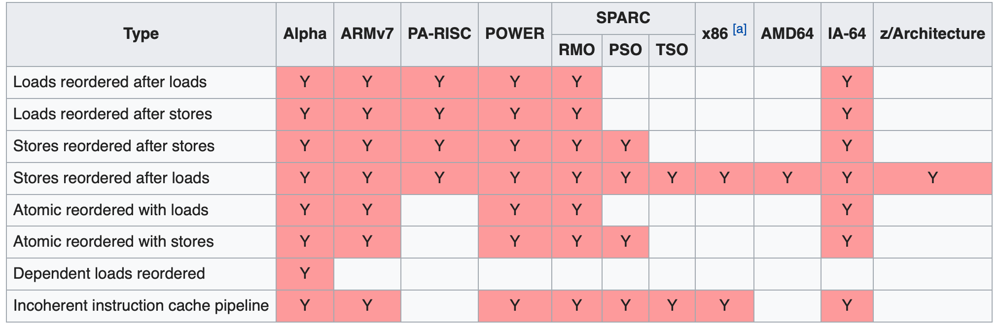
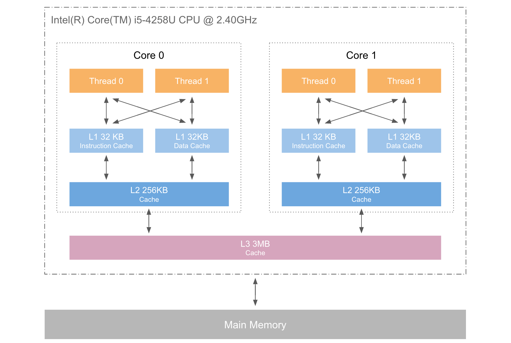
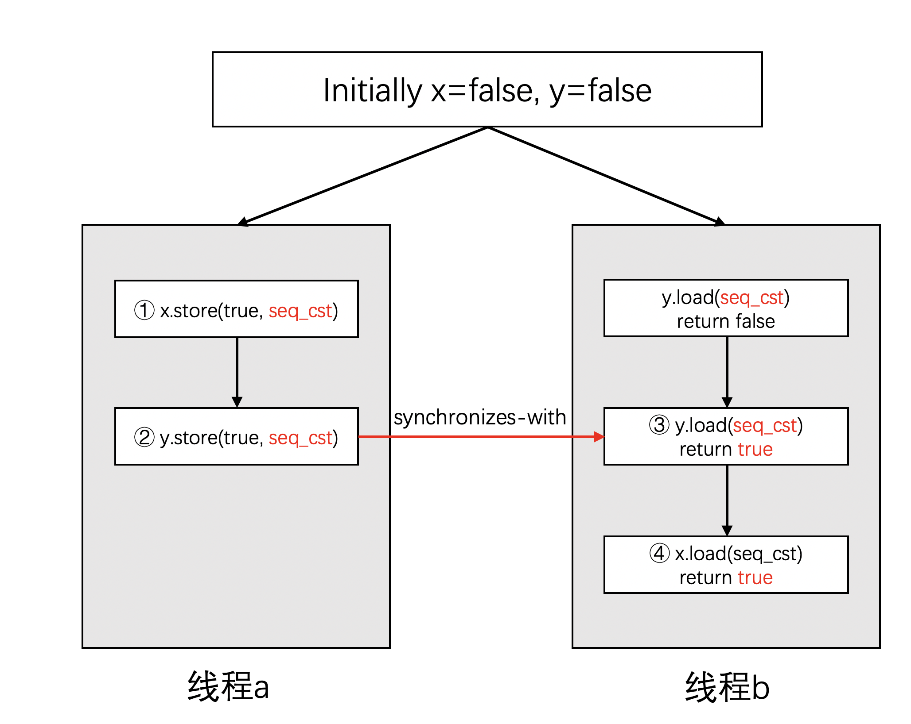

## c++内存模型

多核时代，程序员们为了系统运行效率做了很多事情。并发、多线程是其中绕不开的一个话题，有了多线程，随之而来的就是线程之间的同步，临界区的出现，然后就是锁的使用。程序员随之发现锁的开销较大，于是有了缩短临界区话题，尽可能的让临界区变得更小一点。但是总归临界区的缩小是有限度的，也就是有天花板的。因此我们开始探索原子操作，无锁化编程。于是为了功能正常的情况下，还要保证良好的效率，本文探讨原子操作的背后，内存的组织形式，编译器、cpu 的执行顺序，语言为 c++ 语言。

### 一、内存模型的由来

c++11 标准提出了内存模型，而在 c++11 之前，c++ 本身没有多线程的概念，c++ 使用者使用的是操作系统为我们提供的多线程、原子操作。那时的编译器和处理器认为系统中只有一个执行流。但在多线程之后，编码变难了，开发者编写的代码和最终运行的代码之间往往存在较大的差异，而运行的结果与开发者预期的一致，只是表现而已。

那么产生差异的原因主要来自于如下三个方面：

- 编译器的优化
- CPU out-of-order 执行（无序执行）
- CPU Cache 不一致性（多级缓存带来的不一致） 

首先来说内存重排（Memory Reorder）

#### 1. Memory Reorder

关于内存重排举一个例子

```
X = 0, Y = 0;

Thread 1: 
X = 1; // ①
r1 = Y; // ②

Thread 2: 
Y = 1;
r2 = X;
```

上面的代码中，① 和 ② 这两句代码，是有可能被编译器优化为先 ② 后 ① 的。当前线程 2 也有可能被优化。所以，上述代码我们有机会看到执行完之后，X = 0，Y = 0 这样的结果。

这里多说一点，内存重排的目的是什么呢？或者说为什么要进行内存重排？简单来说，由于 CPU 的流水线机制，重排之后的代码执行更快，效率更高。

不同的编译器和处理器对于内存重排有不同的方式，但是都遵循一个原则，就是：不能修改单线程的行为。（https://preshing.com/20120625/memory-ordering-at-compile-time/）。在这个基础上，他们可以做各种类型的优化

#### 2. 编译器优化

我们常见的 gcc 编译器，使用 `-O` 参数可以让我们选择多个不同的优化选项。

以下面的代码为例：

```
int A, B;

void foo() {
    A = B + 1;
    B = 0;
}

===> 可以被优化为
int A, B;
void foo() {
		int tmp = B;
		B = 0;
		A = tmp + 1;
}
```

编译器只需要保证：在单线程环境下，执行的结果和未优化前的一样即可，所以如此优化是合理的。

于是乎，就产生了问题，编译器并不能得知哪些数据是被线程间共享，而且还有可能被修改。因此编译器的优化可能造成问题，这就需要程序员做好控制。不过编译器也提供 “内存栅栏” 的方法给开发者，保证内存栅栏前后的代码在编译时不能乱序。

```
int A, B;

void foo() {
		A = B + 1;
		asm volatile("" ::: "memory");
		B = 0;
}
```

我们可以通过编译器生成的汇编代码来说明：

```
# 加了内存栅栏
00000000000005fa <_Z3foov>:
 5fa:   55                      push   %rbp
 5fb:   48 89 e5                mov    %rsp,%rbp
 5fe:   8b 05 14 0a 20 00       mov    0x200a14(%rip),%eax        # 201018 <B>
 604:   83 c0 01                add    $0x1,%eax
 607:   89 05 07 0a 20 00       mov    %eax,0x200a07(%rip)        # 201014 <A>
 60d:   c7 05 01 0a 20 00 00    movl   $0x0,0x200a01(%rip)        # 201018 <B>
 614:   00 00 00 
 617:   90                      nop
 618:   5d                      pop    %rbp
 619:   c3                      retq   
 
 # 未加内存栅栏，gcc 编译器优化
 0000000000000620 <_Z3foov>:
 620:   8b 05 ee 09 20 00       mov    0x2009ee(%rip),%eax        # 201014 <B>
 626:   c7 05 e4 09 20 00 00    movl   $0x0,0x2009e4(%rip)        # 201014 <B>
 62d:   00 00 00 
 630:   83 c0 01                add    $0x1,%eax
 633:   89 05 df 09 20 00       mov    %eax,0x2009df(%rip)        # 201018 <A>
 639:   c3                      retq   
 63a:   66 0f 1f 44 00 00       nopw   0x0(%rax,%rax,1)
```

在未加内存栅栏时，gcc 编译器优化的结果就是 `B = 0` 这行代码，在 `A = B + 1` 折行代码之前执行了。因为在编译器看来，重排之后，代码执行的效率更高。

#### 3. CPU out-of-order 执行

再来看看处理的乱序执行，不好演示，从维基百科上拿到一张表格，列出不同类型的 CPU 可能会执行的乱序类别。



一般情况，x86 架构的 cpu 相比 arm 架构，x86 的乱序类型要比 arm 的少很多。移动端手机、平板大部分处理器是 arm 架构，而 PC 端电脑的处理器大部分是 x86 架构。因此，我们可以推算出来，在多线程环境下，假设我们写的代码包含了未定义行为，那么这些问题在手机上将比在电脑上更容易暴露出来。

#### 4. CPU 多级缓存

由于内存和 cpu 之间吞吐速度相差很多，因此现代的 CPU 一般都会在 CPU 上增加寄存器，充当缓存的作用，而且还可能有多级缓存。如下：



在 L1 级别的缓存中，还区分数据缓存和指令缓存。CPU 在运行的时候，会优先使用离自己最近的缓存，一旦命中就直接使用缓存中的数据。因为缓存相对于主存（RAM）来说要快很多。但是很明显的，多级缓存带来了数据同步的问题，每个 cpu 之间的缓存，数据有可能是不一致的，某个 CPU 修改了缓存，需要让其他 CPU 知道。

因此，CPU 所运行的程序和我们编写的代码可能是不一致的。甚至，对于同一次执行，不同线程感知到其他线程的执行顺序有可能也是不一样的。

### 二、内存模型

如上我们说明了由于现代的编译器、处理器等各种优化操作，导致了我们应该重新审视我们的内存模型，以便写出即满足功能、又性能优秀的代码。

如下介绍 c++11 的内存模型，所有 atomic 原子类型中包含的原子操作，以及哪些带有 `_explicit` 后缀的函数，这些操作都支持一个类型为 `std::memory_order` 的可选参数。他是一个枚举类型，可能的取值如下：

```c++
typedef enum memory_order {
    memory_order_relaxed,
    memory_order_consume,
    memory_order_acquire,
    memory_order_release,
    memory_order_acq_rel,
    memory_order_seq_cst
} memory_order;
```

> 注意，其中 memory_order_consume 比较特殊。它的语义在C++17中被修改过，标准现在不推荐使用它，因此目前没有编译器实现了它，在C++20标准发布之前，可以暂时忽略它。

我们根据原子操作是否读写数据将其分为：`Read`、`Write` 以及 `Read-Modify-Write` （读-修改-写）三类，如下：

| Operation               | Read | Write | Read-Modify-Write |
| :---------------------- | :--- | :---- | :---------------- |
| test_and_set            |      |       | Y                 |
| clear                   |      | Y     |                   |
| is_lock_free            | Y    |       |                   |
| load                    | Y    |       |                   |
| store                   |      | Y     |                   |
| exchange                |      |       | Y                 |
| compare_exchange_strong |      |       | Y                 |
| compare_exchange_weak   |      |       | Y                 |
| fetch_add, +=           |      |       | Y                 |
| fetch_sub, -=           |      |       | Y                 |
| fetch_or, \|=           |      |       | Y                 |
| ++,–                    |      |       | Y                 |
| fetch_and, &=           |      |       | Y                 |
| fetch_xor, ^=           |      |       | Y                 |

对于每一种分类，有意义的 `memory_order` 参数如下：

| Operation         | Order                                                        |
| :---------------- | :----------------------------------------------------------- |
| Read              | memory_order_relaxed<br />memory_order_consume <br />memory_order_acquire<br /> memory_order_seq_cst |
| Write             | memory_order_relaxed <br />memory_order_release<br /> memory_order_seq_cst |
| Read-modify-write | memory_order_relaxed <br />memory_order_acq_rel <br />memory_order_seq_cst |

也就是说，当进行 write 操作时，指定 memory_order_acquire 是没有意义的。

如果选择了不同的内存模型，多线程操作原子操作时将导致运行不同的内存模型强度，有三种：

- Sequential Consistency：顺序一致性，简称：seq-cst
- Acquire and Release：获取和释放，简称：acq-rel
- Relaxed：松散模型

#### 1. 关系术语

在正式介绍这几种模型之前，先来了解几个关系术语。

##### (1). sequenced-before

sequenced-before是一种单线程上的关系，这是一个非对称，可传递的成对关系。对于两个操作A和B，如果A sequenced-before B，则A的执行应当在B的前面，并且A执行后的结果B也能看到，它引入了一个局部有序性。

同一个线程中的多个语句之间就是sequenced-before关系，例如：

```
int i = 7; // ①
i++;       // ②
```

这里的 ① sequenced-before ② 。

但是同一个语句中的多个子表达式上没有这个关系，比如：

```
i = i++ + i;
```

由于等号右边的两个子表达式无法确定先后关系，因此这个语句的行为是未定义的。因此，一定不要写这样的代码。

##### (2). happens-before

happens-before关系是sequenced-before关系的扩展，因为它还包含了不同线程之间的关系。如果A happens-before B，则A的内存状态将在B操作执行之前就可见，这就为线程间的数据访问提供了保证。

同样的，这是一个非对称，可传递的关系。如果A happens-before B，B happens-before C。则可推导出A happens-before C。

##### (3). Synchronizes-with

synchronizes-with描述的是一种状态传播（propagate）关系。如果A synchronizes-with B，则就是保证操作A的状态在操作B执行之前是可见的。

下文中我们将看到，原子操作的acquire-release具有synchronized-with关系。除此之外，对于锁和互斥体的释放和获取可以达成synchronized-with关系，还有线程执行完成和join操作也能达成synchronized-with关系。

最后，借助 synchronizes-with 可以达成 happens-before 关系

#### 2. seq-cst 模型

当使用原子操作而不指定 memory_order 时，默认的内存顺序是：`memory_order_seq_cst`。这是最严格的内存模型，seq-cst 有两个保证：

- 程序指令与源码顺序一致
- 所有线程的所有操作存在一个全局的顺序

意味着所有关于原子操作的代码都不会被乱序。假定我们列出线程交错的所有可能性，即便每次执行交错的结果会不一样，但对于任意一次来说，其执行的顺序必属于这些可能性中的一个。也就是说代码的顺序没有变。而且对于某一个单次执行来说，所有线程看到的顺序是一致的。

在这种模型下，每个线程中所有操作的先后关系，其顺序对于所有线程都是可见的。因此他是所有线程的全局同步。

这种模型容易理解，但是性能一般，因为为了实现顺序一致性需要添加很多手段来对抗编译器和处理器的优化

```c++
std::atomic<bool> x,y;
std::atomic<int> z;

void write_x_then_y()
{
    x.store(true); // ①
    y.store(true); // ②
}

void read_y_then_x()
{
    while(!y.load()); // ③
    if(x.load()) // ④
        ++z; // ⑤
}

int main()
{
    x=false;
    y=false;
    z=0;
    std::thread a(write_x_then_y);
    std::thread b(read_y_then_x);
    a.join();
    b.join();
    assert(z.load()!=0); // ⑥
}
```

这段代码中的 `assert` 永远不会触发，因为发生在线程 a 中的时序也将同步到线程 b 中

对于y的store和load操作构成了synchronized-with关系。因此我们可以得到：

- ① happens-before ②
- ② happens-before ③
- ③ happens-before ④
- 因此z肯定会进行自增操作
- 而线程的启动和join也能构成happens-before关系，由此assert肯定不会触发。

我们可以用如下图来说明这个过程：



#### 3. acq-rel 模型

memory_order_release对应了写操作，memory_order_acquire对应了读操作，memory_order_acq_rel对应了既读又写。同一个原子变量上的acquire和release操作将引入synchronizes-with关系。除此之外，将不再有全局的一致顺序。

C++ 标准中是这样描述的：

```
An atomic operation A that performs a release operation on an atomic object M synchronized with an atomic operation B that performs an acquire operation on M and takes its value from any side effect in the release seqeunce headed by A.
```

acq-rel 模型有如下保证：

- 同一个对象上的原子操作不允许被乱序
- release 操作禁止了所有在它之前的读写操作与在他之后的写操作乱序
- acquire 操作禁止了所有在他之前的读操作与在他之后的读写操作乱序

因此，对于上面的代码，如下的写法也能保证 assert 不会触发：

```c++
std::atomic<bool> x,y;
std::atomic<int> z;

void write_x_then_y()
{
    x.store(true, std::memory_order_relaxed); // ①
    y.store(true, std::memory_order_release); // ②
}

void read_y_then_x()
{
    while(!y.load(std::memory_order_acquire)); // ③
    if(x.load(std::memory_order_relaxed))
        ++z;  // ④
}

int main()
{
    x=false;
    y=false;
    z=0;
    std::thread a(write_x_then_y);
    std::thread b(read_y_then_x);
    a.join();
    b.join();
    assert(z.load()!=0); // ⑤
}
```

在这段代码中。虽然对x的读写使用`relaxed`方式。但对于y的读写使用了release-acquire模型。在这种情况下，

- ②与③建立了synchronized-with关系。
- 同时，①happens-before②，③happens-before④
- 于是，可以推导出①②③④的执行顺序

由此保证了`assert`不会触发。注意这里的②和③的桥梁关系。

同样的，可以用下面的图来表达逻辑：


#### 4. relaxed 模型

relaxed 模型是最弱的内存模型，这个模型下唯一可以保证的是：**对于特定原子变量存在全局一致的修改顺序，除此以外不再有其他保**证。这意味着，即便是同样的代码，不同的线程可能会看到不同的执行顺序。

还是以之前的代码做例子：

```c++
std::atomic<bool> x,y;
std::atomic<int> z;

void write_x_then_y()
{
    x.store(true, std::memory_order_relaxed); // ①
    y.store(true, std::memory_order_relaxed); // ②
}

void read_y_then_x()
{
    while(!y.load(std::memory_order_relaxed)); // ③
    if(x.load(std::memory_order_relaxed)) // ④
        ++z;  // ⑤
}

int main()
{
    x=false;
    y=false;
    z=0;
    std::thread a(write_x_then_y);
    std::thread b(read_y_then_x);
    a.join();
    b.join();
    assert(z.load()!=0); // ⑥
}
```

这种情况下，assert 是有可能被触发的。

究其原因，对于上面这段代码：即便线程a认为，x是在y之前已经设置为true，但是对于线程b来说，并不一定能看到同样的结果，它在确认y已经为true之后，可能还会看到x为false，于是第③处的`++z`没有执行，于是导致了`assert`触发。

从原子变量y的角度来看，即便这段代码的逻辑保证了顺序 ② => ③ => ④。但是对于线程a来说的先①后②这个顺序并不会同步到线程b中。所以有可能线程a看到的执行顺序是①②③④ ，而线程b看到的执行顺序是②①③④。这就是我们在前面“修改顺序”中所说的“**并不要求所有的变量存在一个全局的一致顺序**。”。

如下是他的流程图：


a，b两个线程是并行执行的，发生在线程a的事件并不要求同步到线程b。

总结一下，对于`memory_order_relaxed`来说：

- 尽管所有操作都是原子的，但是所有的事件不要求存在一个全局顺序
- 同一个线程内部有happens-before规则，但是线程之间可能会看到不同的顺序

另外需要说明的是：这里问题的发生只是**理论上的可能**。如果你将上面这个代码片段编译和运行，估计你运行100次也碰不到问题的发生。但是，这并不表示问题不存在，**它只是很难发生而已**。而这也恰恰是并发系统难以开发的原因之一：很多问题在绝大部分时候都不会出现，当在极少数时候发生的时候，又很难被理解

### 三、模型选择

再强调一遍，我们写代码的时候，首先要关注程序的功能，再来关注程序的性能。

如下，我们来对比下 seq-cst 模型和 relaxed 模型之间的性能：

```c++
#include <atomic>
#include <chrono>
#include <iostream>
#include <thread>

const int kLoopCount = 100000000;

using namespace std;

void increment(atomic<int>* value, memory_order order) {
    for (int i = 0; i < kLoopCount; i++) {
       value->fetch_add(1, order);
    }
}

void thread_worker(atomic<int>* value, memory_order order) {
    thread t1(increment, value, order);
    thread t2(increment, value, order);
    thread t3(increment, value, order);
    t1.join();
    t2.join();
    t3.join();
}

int main() {

    atomic<int> a(0);
    atomic<int> b(0);

    auto start = chrono::steady_clock::now();
    thread_worker(&a, memory_order_relaxed);
    auto end = chrono::steady_clock::now();
    auto time1 = chrono::duration_cast<chrono::milliseconds>(end - start);

    start = chrono::steady_clock::now();
    thread_worker(&b, memory_order_seq_cst);
    end = chrono::steady_clock::now();
    auto time2 = chrono::duration_cast<chrono::milliseconds>(end - start);

    cout << "Relaxed order cost " << time1.count() << "ms" << endl;
    cout << "Seq_cts order cost " << time2.count() << "ms" << endl;

    return 0;
}
```

我在我的机器（8核心 16G内存）上测试，结果如下：

```
Relaxed order cost 2965ms
Seq_cts order cost 2943ms
```

我们发现其实时间消耗差别很小很小。因此我们在写代码的时候，一定要谨慎，单纯的追求一点点性能而增加非常大的编程复杂度可能是不理智的。

---

参考：

> https://paul.pub/cpp-memory-model/#id-%E5%85%B3%E7%B3%BB%E6%9C%AF%E8%AF%AD