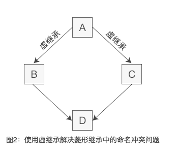

C++ 中多继承很容易产生**命名冲突**，也就是说基类和继承类中如果有同名变量，编译器不知道选用哪一个，就会产生歧义。

而且继承类对象还保留了基类的成员，但大多数情况下，这些成员是多余的，很容易造成**数据冗余**。

而且还会造成菱形继承中问题。

```
class A { int m_a; };
class B : public A { int m_b; }
class C : public A { int m_c; }
class D : public B, public C { int m_d; }
```

类 D 的对象，当访问 `m_a` 时，不知道访问的是类 B 的还是访问的是类 C 的 `m_a`。造成歧义。

为了解决多继承时的命名冲突和冗余数据问题，因此 C++ 提出了虚继承，使得派生类中只保留一份间接基类的成员。

```
class A { int m_a; };
class B : virtual public A { int m_b; }
class C : virtual public A { int m_c; }
class D : public B, public C { }
```

在继承方式前面加上 `virtual` 关键字就是虚继承。

这样对于菱形继承，派生类 D 就只保留了一份成员变量 `m_a`，直接访问就不会再有歧义了。

虚继承的目的就是让某个类做出声明，承诺愿意共享它的基类。其中，这个被共享的基类就称为虚基类（Virtual Base Class）。



虚派生只影响从指定了虚基类的派生类中进一步派生出来的类，他不会影响派生类本身。

由于多继承经常会出现二义性问题，必须十分小心。因此我们不提倡在程序中使用多继承，只有在比较简单和不易出现二义性的情况或实在必要时才使用多继承，能用单一继承解决的问题就不要使用多继承。也正是这个原因，C++ 之后的很多面向对象的编程语言，例如 Java、C#、PHP 等，都不支持多继承。