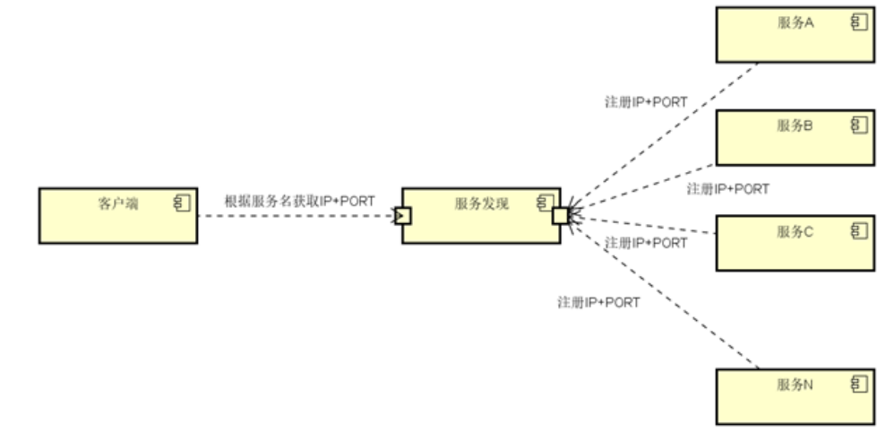

### 微服务

什么是微服务架构：https://www.zhihu.com/question/65502802/answer/802678798

### consul

服务A-N把当前自己的网络位置注册到服务发现模块（这里注册的意思就是告诉），服务发现就以K-V的方式记录下，K一般是服务名，V就是IP:PORT。服务发现模块定时的轮询查看这些服务能不能访问的了（这就是健康检查）。客户端在调用服务A-N的时候，就跑去服务发现模块问下它们的网络位置，然后再调用它们的服务。客户端完全不需要记录这些服务网络位置，客户端和服务端完全解耦！

consul是分布式的、高可用、横向扩展的。consul提供的一些关键特性：

- service discovery：consul通过DNS或者HTTP接口使服务注册和服务发现变的很容易，一些外部服务，例如saas提供的也可以一样注册。
- health checking：健康检测使consul可以快速的告警在集群中的操作。和服务发现的集成，可以防止服务转发到故障的服务上面。
- key/value storage：一个用来存储动态配置的系统。提供简单的HTTP接口，可以在任何地方操作。
- multi-datacenter：无需复杂的配置，即可支持任意数量的区域。

