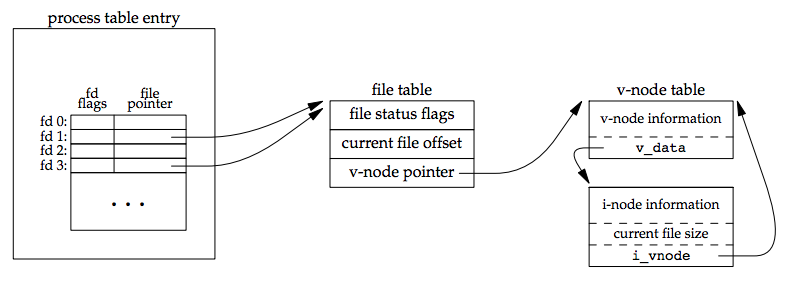

## go语言正确的获取连接的文件描述符

### 一、遇到的场景

工作时写一个 web 服务的时候，底层使用 udp 传输协议，需要对 udp 的 socket recv buffer 进行获取和调整。用 go 语言实现，于是有了类似下面的代码

```go
func serve(addr string)  {
    address, err := net.ResolveUDPAddr("udp", addr)
    if err != nil {
        fmt.Printf("resolve udp service address: %v failed, error: %v", addr, err.Error())
        return 
    }
    udpConn, err := net.ListenUDP("udp", address)
    if err != nil {
        fmt.Printf("listen udp address: %v failed, error: %v", address.String(), err.Error())
        return
    }
	// 获取文件描述符
    fd, err := udpConn.File()
    if err != nil {
       fmt.Printf("get udp conn file err: %v \n", err)
       return
    }
    defer fd.Close()
    oriUdpSocketBufferSize, err := syscall.GetsockoptInt(int(fd.Fd()), syscall.SOL_SOCKET, unix.SO_RCVBUF)
    fmt.Printf("get opt int fd recv buf size: %v \n", oriUdpSocketBufferSize)
    
    fmt.Printf("udp server create success \n")

    go func() {
       buf := make([]byte, 1024)
       for {
           n, caddr, err := udpConn.ReadFrom(buf)
           if err != nil {
               fmt.Println("read failed", err)
               continue
           }
           fmt.Println(addr, caddr, string(buf[:n]))
       }
    }()

    time.Sleep(2*time.Second)

    go func() {
       err := udpConn.Close()
       if err != nil {
           fmt.Printf("udp conn close err: %v \n", err)
           return
       }
       _, err = net.ListenUDP("udp", address)
       if err != nil {
           fmt.Printf("listen udp address: %v failed, error: %v \n", address.String(), err.Error())
       }
       fmt.Printf("repeat listen udp success")
    }()
}

func main() {
    go serve("127.0.0.1:1234")
    select {}
}
```

以上代码是随手写的一个案例，目的想要实现一个 udp server 的重启。但是是有问题的，比如：在调用 udpConn.Close 的时候会阻塞，导致重启失败

这个问题让我花费了一点时间去看源代码才明白，因此记录下来

### 二、剖析过程

如果我们需要拿到一个连接对应的文件描述符 fd，可能会写出如下的代码

```go
func main() {
    addr, _ := net.ResolveTCPAddr("tcp", ":8888")
    conn, _ := net.ListenTCP("tcp", addr)
    defer conn.Close()
    
    file, _ := conn.File()
    defer file.Close()
    fd := file.Fd()
    // ... 
}
```

其中剖析下 conn.File() 这句代码干了什么事，

#### 1. dup 剖析

在 linux 中，表示进程的 task_struct 中，有一个 file 字段：

```c
struct task_struct {
	...
	// 打开的文件信息
	struct files_struct *files;
	...
}
```

当前进程打开的文件，使用 `struct files_struct* ` 结构来表示，其中有一个 files* 类型的数组，保存当前进程打开的所有文件的 file 结构体。我们所说的文件描述符就是这个数组的下标。当需要访问某个文件的时候，通过 fd 与该数组起始地址进行指针运算，就可以得到对应的 file 结构体的地址了。

file 结构体中有一个字段表示引用次数，当调用 Close 时，引用次数减1，只有不再被引用的时候才执行关闭。

在来回顾下 dup 的原理，如下图



而 dup 系统调用，相当于复制了一个现有的文件描述符，新建了新的文件描述符，这两个 fd 指向同一个打开的连接。因此如果想真正关闭该连接，需要分别执行两次 Close 方法。

#### 2. XXXListener.File 方法实现

TCPListener 或者 UDPListener 的 file 方法

```go
// File returns a copy of the underlying os.File.
// It is the caller's responsibility to close f when finished.
// Closing l does not affect f, and closing f does not affect l.
//
// The returned os.File's file descriptor is different from the
// connection's. Attempting to change properties of the original
// using this duplicate may or may not have the desired effect.
func (l *TCPListener) File() (f *os.File, err error) {
	if !l.ok() {
		return nil, syscall.EINVAL
	}
	f, err = l.file()
	if err != nil {
		return nil, &OpError{Op: "file", Net: l.fd.net, Source: nil, Addr: l.fd.laddr, Err: err}
	}
	return
}

func (ln *TCPListener) file() (*os.File, error) {
	f, err := ln.fd.dup()
	if err != nil {
		return nil, err
	}
	return f, nil
}

func (fd *netFD) dup() (f *os.File, err error) {
	ns, call, err := fd.pfd.Dup()
	if err != nil {
		if call != "" {
			err = os.NewSyscallError(call, err)
		}
		return nil, err
	}

	return os.NewFile(uintptr(ns), fd.name()), nil
}

// Dup duplicates the file descriptor.
func (fd *FD) Dup() (int, string, error) {
    // 引用次数加一，防止在执行 dup 的时候被 Close 掉
	if err := fd.incref(); err != nil {
		return -1, "", err
	}
    // 执行完之后，引用次数减一
	defer fd.decref()
	return DupCloseOnExec(fd.Sysfd)
}

// DupCloseOnExec dups fd and marks it close-on-exec.
func DupCloseOnExec(fd int) (int, string, error) {
	if syscall.F_DUPFD_CLOEXEC != 0 && atomic.LoadInt32(&tryDupCloexec) == 1 {
        // 通过 fcntl 系统调用执行 dup，同时设置 FD_CLOEXEC 标志
        // fcntl 系统调用，复制一个已有文件描述符，功能和dup和dup2相同，对应的cmd：F_DUPFD、F_DUPFD_CLOEXEC。
		r0, e1 := fcntl(fd, syscall.F_DUPFD_CLOEXEC, 0)
		if e1 == nil {
			return r0, "", nil
		}
		switch e1.(syscall.Errno) {
		case syscall.EINVAL, syscall.ENOSYS:
			// Old kernel, or js/wasm (which returns
			// ENOSYS). Fall back to the portable way from
			// now on.
			atomic.StoreInt32(&tryDupCloexec, 0)
		default:
			return -1, "fcntl", e1
		}
	}
    // 老版本内核的 fcntl 不支持 F_DUPFD_CLOEXEC 命令，单独处理
	return dupCloseOnExecOld(fd)
}

// dupCloseOnExecOld is the traditional way to dup an fd and
// set its O_CLOEXEC bit, using two system calls.
func dupCloseOnExecOld(fd int) (int, string, error) {
	syscall.ForkLock.RLock()
	defer syscall.ForkLock.RUnlock()
	newfd, err := syscall.Dup(fd)
	if err != nil {
		return -1, "dup", err
	}
	syscall.CloseOnExec(newfd)
	return newfd, "", nil
}
```

上面源码中，会先尝试用 fcntl 系统调用的 cmd 的 F_DUPFD_CLOEXEC 命令来实现，该方法具有原子性，执行 dup 和设置 FD_CLOEXEC 标志位两个操作是原子的。而老版本内核并不支持该 cmd 命令字，因此需要加锁执行 dup 系统调用，然后通过 fcntl 系统调用设置 FD_CLOEXEC 标志位。

标志位 FD_CLOEXEC，打开的文件默认都会设置 FD_CLOEXEC 标志位，因为 `fork`的子进程默认会继承父进程打开的文件列表。而设置了 FD_CLOEXEC 标志位的文件，在子进程执行`exec`族函数时会先`close`掉。这样就可以防止文件被子进程继承，而子进程又没有关闭，导致文件泄露。

标志位 FD_CLOEXEC， 英文解释参看 linux 帮助文档 O_CLOEXEC

```
 O_CLOEXEC (since Linux 2.6.23)
              Enable the close-on-exec flag for the new file descriptor.
              Specifying this flag permits a program to avoid additional
              fcntl(2) F_SETFD operations to set the FD_CLOEXEC flag.
 
              Note that the use of this flag is essential in some
              multithreaded programs, because using a separate fcntl(2)
              F_SETFD operation to set the FD_CLOEXEC flag does not suffice
              to avoid race conditions where one thread opens a file
              descriptor and attempts to set its close-on-exec flag using
              fcntl(2) at the same time as another thread does a fork(2)
              plus execve(2).  Depending on the order of execution, the race
              may lead to the file descriptor returned by open() being
              unintentionally leaked to the program executed by the child
              process created by fork(2).  (This kind of race is in
              principle possible for any system call that creates a file
              descriptor whose close-on-exec flag should be set, and various
              other Linux system calls provide an equivalent of the
              O_CLOEXEC flag to deal with this problem.)
```

可以看到调用 `TCPListener.File()` 实际上是执行了使用 fcntl 系统调用来进行 dup 的操作。相当于复制了一个现有的文件描述符，新建了新的文件描述符，我们应该在使用完毕之后关闭这个文件描述符。由于引用计数的存在，关闭这个文件描述符和关闭原始文件描述符两者之间互不影响。

#### 3.File.Fd 方法实现

```go
// Fd returns the integer Unix file descriptor referencing the open file.
// The file descriptor is valid only until f.Close is called or f is garbage collected.
// On Unix systems this will cause the SetDeadline methods to stop working.
func (f *File) Fd() uintptr {
	if f == nil {
		return ^(uintptr(0))
	}

	// If we put the file descriptor into nonblocking mode,
	// then set it to blocking mode before we return it,
	// because historically we have always returned a descriptor
	// opened in blocking mode. The File will continue to work,
	// but any blocking operation will tie up a thread.
	if f.nonblock {
		f.pfd.SetBlocking()
	}

	return uintptr(f.pfd.Sysfd)
}
```

这里出现了一些端倪，**我们调用 File.Fd 方法，如果这个网络连接是非阻塞的，会设置为阻塞模式。**

在非阻塞模式中，当`accept/write/read`没有新的请求可以接受/没有空闲缓冲区可写/缓冲区没有内容可读，会立即返回`EAGEIN`。这时候，`runtime`会将其加入到`epoll`中监听，然后将对应的协程挂起，直到等待的事件到来才将其唤醒。

而如果是阻塞模式，当`accept/write/read`没有新的请求可以接受/没有空闲缓冲区可写/缓冲区没有内容可读，会一直阻塞，不仅会阻塞当前协程，还会把系统线程阻塞掉。

由于新旧文件描述符都指向同一个文件结构体，因此使这个文件/socket 变成了阻塞模式，而 Close 的时候，如下：

```go
// Close closes the connection.
func (c *conn) Close() error {
	if !c.ok() {
		return syscall.EINVAL
	}
	err := c.fd.Close()
	if err != nil {
		err = &OpError{Op: "close", Net: c.fd.net, Source: c.fd.laddr, Addr: c.fd.raddr, Err: err}
	}
	return err
}

func (fd *netFD) Close() error {
	runtime.SetFinalizer(fd, nil)
	return fd.pfd.Close()
}

// Close closes the FD. The underlying file descriptor is closed by the
// destroy method when there are no remaining references.
func (fd *FD) Close() error {
	if !fd.fdmu.increfAndClose() {
		return errClosing(fd.isFile)
	}

	// Unblock any I/O.  Once it all unblocks and returns,
	// so that it cannot be referring to fd.sysfd anymore,
	// the final decref will close fd.sysfd. This should happen
	// fairly quickly, since all the I/O is non-blocking, and any
	// attempts to block in the pollDesc will return errClosing(fd.isFile).
	fd.pd.evict()

	// The call to decref will call destroy if there are no other
	// references.
	err := fd.decref()

	// Wait until the descriptor is closed. If this was the only
	// reference, it is already closed. Only wait if the file has
	// not been set to blocking mode, as otherwise any current I/O
	// may be blocking, and that would block the Close.
	// No need for an atomic read of isBlocking, increfAndClose means
	// we have exclusive access to fd.
    // 如果是阻塞模式，则会等待直到描述符关闭
	if fd.isBlocking == 0 {
		runtime_Semacquire(&fd.csema)
	}

	return err
}
```

可以看到如果这个连接是阻塞的，Close 的时候也会被阻塞。

### 三、正确获取连接的文件描述符

可以使用如下方法来获取

```go
func main() {
    addr := ":8888"
    address, err := net.ResolveUDPAddr("udp", addr)
    if err != nil {
        fmt.Printf("resolve udp service address: %v failed, error: %v", addr, err.Error())
    }
    udpConn, err := net.ListenUDP("udp", address)
    if err != nil {
        fmt.Printf("listen udp address: %v failed, error: %v", address.String(), err.Error())
        return
    }
    rawConn, err := udpConn.SyscallConn()
    if err != nil {
        fmt.Printf("syscall conn err: %v", err)
        return
    }
    err = rawConn.Control(func(fd uintptr) {
        oriUdpSocketBufferSize, err := syscall.GetsockoptInt(int(fd), syscall.SOL_SOCKET, unix.SO_RCVBUF)
        if err == nil {
           fmt.Printf("socket udp recv buff size: %v \n", oriUdpSocketBufferSize)
        }
    })
}
```

如上，使用 SyscallConn 来获取到原始的网络连接

```go
// SyscallConn returns a raw network connection.
// This implements the syscall.Conn interface.
func (c *UDPConn) SyscallConn() (syscall.RawConn, error) {
	if !c.ok() {
		return nil, syscall.EINVAL
	}
	return newRawConn(c.fd)
}

func newRawConn(fd *netFD) (*rawConn, error) {
	return &rawConn{fd: fd}, nil
}

func (c *rawConn) Control(f func(uintptr)) error {
	if !c.ok() {
		return syscall.EINVAL
	}
	err := c.fd.pfd.RawControl(f)
	runtime.KeepAlive(c.fd)
	if err != nil {
		err = &OpError{Op: "raw-control", Net: c.fd.net, Source: nil, Addr: c.fd.laddr, Err: err}
	}
	return err
}
```

获取到这个原始的网络连接后，go语言提供一个回调方法，参数就是 fd 文件描述符。