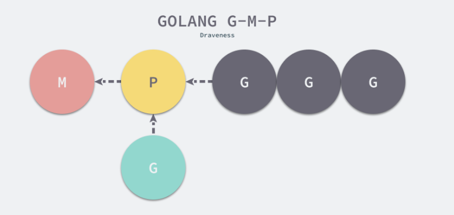

## Go语言调度器

虽然线程比较轻量，但是在调度时也有比较大的额外开销。每个线程会都占用 1M 以上的内存空间，在切换线程时不止会消耗较多的内存，恢复寄存器中的内容还需要向操作系统申请或者销毁资源，每一次线程上下文的切换都需要消耗 ~1us 左右的时间[1](https://draveness.me/golang/docs/part3-runtime/ch06-concurrency/golang-goroutine/#fn:1)，但是 Go 调度器对 Goroutine 的上下文切换约为 ~0.2us，减少了 80% 的额外开销。

### 一、Go语言调度器的演进

#### 1. 单线程调度器 --- Go 0.x 版本

程序中只能存在一个活跃线程，由 G-M 模型组成。执行流程

- 获取调度器的全局锁
- 保存栈寄存器和程序计数器
- 获取下一个需要运行的 Goroutine 并解锁调度器
- 修改全局线程上要执行的 Goroutinue
- 运行最新的 Goroutinue

这个单线程的调度器只能保证Go语言可以运行

#### 2. 多线程调度器 --- Go 1.10 版本

允许运行多线程的程序；但是全局锁导致竞争严重，对调度器做的性能测试发现 14% 的时间都花费在锁上面。

整体的逻辑与单线程调度器没有太多区别，因为程序中可能同时存在多个活跃线程，所以多线程调度器引入了 `GOMAXPROCS` 变量帮助我们灵活控制程序中的最大处理器数，即活跃线程数。

这个调度器由如下问题需要解决：

1. 调度器和锁是全局资源，所有的调度状态都是中心化存储的，锁竞争问题严重；
2. 线程需要经常互相传递可运行的 Goroutine，引入了大量的延迟；
3. 每个线程都需要处理内存缓存，导致大量的内存占用并影响数据局部性；
4. 系统调用频繁阻塞和解除阻塞正在运行的线程，增加了额外开销；

#### 3. 任务窃取调度器 --- Go 1.11 版本

构成了目前基础的 G-M-P模型，实现了基于工作窃取的调度器；在某些情况下，Goroutine 不会让出线程，进而造成饥饿问题；时间过长的垃圾回收（Stop-the-world，STW）会导致程序长时间无法工作。

主要分三个部分：

1. 如果当前运行时在等待垃圾回收，则调用 `runtime.gctopm` 函数，之后继续检测运行时是否等待垃圾回收，直到当前垃圾回收结束
2. 调用 `runtime.runqget` 和 `runtime.find`从本地或者全局的运行队列中获取待执行的 Goroutine。如果当前处理器本地的运行队列中包包括 Goroutine 时，会调用 `runtime.findrunnable`触发工作窃取，从其他的处理器的队列中随机获取一些 Goroutine 
3. 调用 `runtime.execute`在当前线程M 上运行 Goroutine 

运行时 G-M-P 模型中的处理器 P 是线程和 Goroutine 的中间层，他的结构如下：

```go
struct P {
	Lock;

	uint32	status;
	P*	link;
	uint32	tick;
	M*	m;  // 一个线程
	MCache*	mcache;

	G**	runq;   // 由可运行的 Goroutine 组成的环形的运行队列 runq
	int32	runqhead;
	int32	runqtail;
	int32	runqsize;

	G*	gfree;
	int32	gfreecnt;
};
```

处理器持有一个由可运行的 Goroutine 组成的环形的运行队列 `runq`，还反向持有一个线程。调度器在调度时会从处理器的队列中选择队列头的 Goroutine 放到线程 M 上执行。如下是线程 M、处理器 P、Goroutine 之间的关系



基于工作窃取的多线程调度器将每一个线程绑定到了独立的 CPU 上，这些线程会被不同处理器管理，不同的处理器通过工作窃取对任务进行再分配实现任务的平衡，也能提升调度器和 Go 语言程序的整体性能，

#### 4. 基于协作的抢占式调度器  --- Go 1.12  到 Go 1.13

任务窃取调度器仍然不支持抢占式调度，程序只能依靠 Goroutine 主动让出 CPU 资源才能触发调度。因此引入了基于协作的抢占式调度器解决下面的问题：

- 某些 Goroutine 可以长时间占用线程，造成其它 Goroutine 的饥饿
- 垃圾回收需要暂停整个程序（Stop-the-world，STW），最长可能需要几分钟的时间[6](https://draveness.me/golang/docs/part3-runtime/ch06-concurrency/golang-goroutine/#fn:6)，导致整个程序无法工作

通过编译器在函数调用时插入抢占检查指令，在函数调用时检查当前 Goroutine 是否发起了抢占请求，实现基于协作的抢占式调度。但是 还是存在一些无法被抢占的边缘情况，比如 Goroutine 可能会因为垃圾回收和循环长时间占用资源导致程序暂停

基于协作的抢占式调度的工作原理：

1. 编译器会在调用函数前插入 `runtime.morestack`
2. Go 语言运行时会在垃圾回收暂停程序、系统监控发现 Goroutine 运行超过 10ms 时发出抢占请求 `StackPreempt` 
3. 当发生函数调用时，可能会执行编译器插入的 `runtime.morestack`，它调用的 `runtime.newstack`会检查 Goroutine 的 `stackguard0` 字段是否为 `StackPreempt`
4. 如果 `stackguard0` 是 `StackPreempt`，就会触发抢占让出当前线程

因为这里的抢占是通过编译器插入函数实现的，还是需要函数调用作为入口才能触发抢占，所以这是一种协作式的抢占式调度

#### 5. 基于信号的抢占式调度器 --- Go 1.14 到 至今

实现基于信号的真抢占式调度；垃圾回收在扫描栈时会触发抢占调度；但是抢占的时间点不够多，还不能覆盖全部的边缘情况；

这种抢占式调度也只会在垃圾回收扫描任务时触发，他的运行过程：

1. 程序启动时，在 `runtime.sighandler`中注册 `SIGURG` 信号的处理函数 `runtime.doSigPreempt`
2. 在触发垃圾回收的栈扫描时会调用 `runtime.suspendG` 挂起 Goroutine，该函数会执行如下逻辑
    1. 将 _Grunning 状态的 Goroutine 标记成可以被抢占，将 `preemptStop` 设置成 `true`
    2. 调用 `runtime.preemptM` 触发抢占
3. `runtime.preemptM` 会调用 `runtime.signalM` 向线程发送信号 SIGURG 
4. 操作系统会中断正在运行的线程并执行预先注册的信号处理函数 `runtime.doSigPreempt` 
5. `runtime.doSigPreempt` 函数会处理抢占信号，获取当前的 SP 和 PC 寄存器并调用 `runtime.sigctxt.pushCall`
6.  `runtime.sigctxt.pushCall`会修改寄存器并在程序回到用户态时执行 `runtime.asyncPreempt`
7. 汇编指令 `runtime.asyncPreempt`会调用运行时函数 `runtime.asyncPreempt2`
8. `runtime.asyncPreempt2`会调用 `runtime.preemptPark`
9. `runtime.preemptPark`会修改当前 Goroutine 的状态到 `_Gpreempted` 并调用 `runtime.schedule` 让当前函数陷入休眠并让出线程，调度器会选择其它的 Goroutine 继续执行

为什么选择 SIGURG 信号来作为触发异步抢占的信号，有如下理由：

1. 该信号需要被调试器透传
2. 该信号不会被内部的 libc 库使用并拦截
3. 该信号可以随意出现并且不触发任何后果
4. 我们需要处理多个平台上的不同信号

STW 和栈扫描是一个可以抢占的安全点（Safe-points），所以 Go 语言会在这里先加入抢占功能。基于信号的抢占式调度只解决了垃圾回收和栈扫描时存在的问题，它到目前为止没有解决所有问题。

### 二、GMP的数据结构

1. G — 表示 Goroutine，它是一个待执行的任务；
2. M — 表示操作系统的线程，它由操作系统的调度器调度和管理；
3. P — 表示处理器，它可以被看做运行在线程上的本地调度器；

#### 1. G（Goroutine）

Goroutine 占用的内存空间更小，也降低了上下文切换的开销。如下是 G 的结构

```go
type g struct {
	stack       stack   // 栈内存范围 [stack.lo, stack.hi]
	stackguard0 uintptr // 用于调度器抢占式调度
    
    _panic       *_panic // 最内侧的 panic 结构体
	_defer       *_defer // 最内侧的延迟函数结构体
    
    m            *m      // 当前 Goroutine 占用的线程，可能为空
	sched        gobuf  // 存储 Goroutine 的调度相关数据
    atomicstatus uint32  // Goroutine 的状态
    goid         int64  // Goroutine 的 id 
    
    preempt       bool // 抢占信号
    preemptStop   bool // 抢占时将状态修改成 _Gpreempted
    preemptShrink bool // 在同步安全点收缩栈 
}
```

Goroutine 的状态，由如上的 atomicstatus 字段表示。除了几个已经不被使用的以及与 GC 相关的状态之外，Goroutine 可能处于以下 9 种状态：

| 状态          | 描述                                                         |
| ------------- | ------------------------------------------------------------ |
| `_Gidle`      | 刚刚被分配并且还没有被初始化                                 |
| `_Grunnable`  | 没有执行代码，没有栈的所有权，存储在运行队列中               |
| `_Grunning`   | 可以执行代码，拥有栈的所有权，被赋予了内核线程 M 和处理器 P  |
| `_Gsyscall`   | 正在执行系统调用，拥有栈的所有权，没有执行用户代码，被赋予了内核线程 M 但是不在运行队列上 |
| `_Gwaiting`   | 由于运行时而被阻塞，没有执行用户代码并且不在运行队列上，但是可能存在于 Channel 的等待队列上 |
| `_Gdead`      | 没有被使用，没有执行代码，可能有分配的栈                     |
| `_Gcopystack` | 栈正在被拷贝，没有执行代码，不在运行队列上                   |
| `_Gpreempted` | 由于抢占而被阻塞，没有执行用户代码并且不在运行队列上，等待唤醒 |
| `_Gscan`      | GC 正在扫描栈空间，没有执行代码，可以与其他状态同时存在      |

Goroutine 在运行时中定义的状态非常多而且复杂，但是我们可以将这些不同的状态聚合成三种：等待中、可运行、运行中，运行期间会在这三种状态来回切换

- 等待中：Goroutine 正在等待某些条件满足，例如：系统调用结束等，包括 `_Gwaiting`、`_Gsyscall` 和 `_Gpreempted` 几个状态；
- 可运行：Goroutine 已经准备就绪，可以在线程运行，如果当前程序中有非常多的 Goroutine，每个 Goroutine 就可能会等待更多的时间，即 `_Grunnable`；
- 运行中：Goroutine 正在某个线程上运行，即 `_Grunning`；


#### 2. M（操作系统线程）

调度器最多可以创建 10000 个线程，但是其中大多数的线程都不会执行用户代码（可能陷入系统调用），最多只会有 `GOMAXPROCS` 个活跃线程能够正常运行。在默认情况下，运行时会将 `GOMAXPROCS` 设置成当前机器的核数，我们也可以在程序中使用 `runtime.GOMAXPROCS` 来改变最大的活跃线程数。

#### 3. P（处理器）

调度器中的处理器 P 是线程和 Goroutine 的中间层，它能提供线程需要的上下文环境，也会负责调度线程上的等待队列，通过处理器 P 的调度，每一个内核线程都能够执行多个 Goroutine，它能在 Goroutine 进行一些 I/O 操作时及时让出计算资源，提高线程的利用率。

因为调度器在启动时就会创建 `GOMAXPROCS` 个处理器，**所以 Go 语言程序的处理器数量一定会等于 `GOMAXPROCS`**，这些处理器会绑定到不同的内核线程上。

`runtime.p` 是处理器的运行时表示，字段包含性能追踪、垃圾回收和计时器相关的字段。如下我们关注处理器中的线程和运行队列

```go
type p struct {
	m           muintptr

	runqhead uint32
	runqtail uint32
	runq     [256]guintptr
	runnext guintptr
	...
}
```

反向存储的线程维护着线程与处理器之间的关系，而 `runqhead`、`runqtail` 和 `runq` 三个字段表示处理器持有的运行队列，其中存储着待执行的 Goroutine 列表，`runnext` 中是线程下一个需要执行的 Goroutine。

`runtime.p` 结构体中的状态 `status` 字段会是以下五种中的一种：

| 状态        | 描述                                                         |
| ----------- | ------------------------------------------------------------ |
| `_Pidle`    | 处理器没有运行用户代码或者调度器，被空闲队列或者改变其状态的结构持有，运行队列为空 |
| `_Prunning` | 被线程 M 持有，并且正在执行用户代码或者调度器                |
| `_Psyscall` | 没有执行用户代码，当前线程陷入系统调用                       |
| `_Pgcstop`  | 被线程 M 持有，当前处理器由于垃圾回收被停止                  |
| `_Pdead`    | 当前处理器已经不被使用                                       |

通过分析处理器 P 的状态，我们能够对处理器的工作过程有一些简单理解，例如处理器在执行用户代码时会处于 `_Prunning` 状态，在当前线程执行 I/O 操作时会陷入 `_Psyscall` 状态。

### 三、调度过程

1. **调度器启动**，获取到 GOMAXPROCS 变量的值作为当前创建的线程数，创建线程后，再创建相同数量的处理器并启动，然后等待用户创建新的 Goroutine 并为 Goroutine 调度处理器资源。

2. **创建 Goroutine**，使用 go 关键字，底层会转换成 `runtime.newproc`函数调用，newproc 函数的入参是参数大小和表示函数的指针，他会获取 Goroutine 以及调用方的程序计数器，然后通过 `runtime.newproc1` 获取新的 Goroutine 结构体，将其加入处理器的运行队列并在满足条件时调用 `runtime.wakep`唤醒新的处理器执行 Goroutine。

    1. 创建一个 Goroutine 结构体

        `runtime.newproc1` 会根据参数初始化一个 g 结构体，他的实现为：

        1. 获取或者创建新的 Goroutine 结构体。会先从处理器的 gFree 列表中查找空闲的 Goroutine，如果不存在空间的 Goroutine，会通过 `runtime.malg`创建一个栈大小足够的新结构体
        2. 将传入的参数移到 Goroutine 的栈上
        3. 更新 Goroutine 调度相关的属性，包括栈指针、程序计数器并更新其状态到 `_Grunnable` 并返回。

    2. 将其加入到运行队列上

        这里的运行队列，既可能是全局的运行队列，也可能是处理器本地的运行队列。优先加入到处理器本地的运行队列，如果处理器本地的运行队列没有剩余空间时就会把本地队列中的一部分 Goroutine 和待加入的 Goroutine 通过 `runtime.runqputslow` 添加到调度器持有的全局运行队列上

        处理器本地的运行队列是一个使用数组构成的环形链表，他最多存储 256 个待执行任务

    3. 设置调度信息

        设置程序计数器等等

3. **调度循环**，调度器启动后，会初始化线程并调用 `runtime.schedule`进入调度循环，会从这几个地方查找待执行的 Goroutine

    1. 为了保证公平，当全局运行队列中有待执行的 Goroutine 时，通过 `schedtick` 保证有一定几率会从全局的运行队列中查找对应的 Goroutine
    2. 从处理器本地的运行队列中查找待执行的 Goroutine
    3. 如果前两种方法都没有找到 Goroutine，会通过 `runtime.findrunnable`进行阻塞地查找 Goroutine。这个函数一定会返回一个可执行的 Goroutine，如果当前不存在就阻塞等待

    当获取到 Goroutine 后，会通过 `runtime.execute`执行获取的 Goroutine，做好准备工作后，他会通过 `runtime.gogo`将 Goroutine 调度到当前线程上。而 Go 语言正常的函数调用会使用 CALL 指令，该指令会将调用方的返回地址加入栈寄存器 SP 中，然后跳转到目标函数；当目标函数返回后，会从栈中查找调用的地址并跳转回调方继续执行剩下的代码。因此这个 Goroutine 执行完需要切换时，会设置 Goroutine 的状态为 _Gdead 状态、清理其中的字段、移除 Goroutine 和线程的关联并重新加入处理器的 Goroutine 的空闲列表 gFree。然后触发新一轮的 Goroutine 调度。这就是调度循环

4. 触发调度，运行时调度的几个条件。下面的调度时间点是通过调度器 `runtime.schedule`重新调度的

    1. 主动挂起，将当前 Goroutine 暂停，被暂停的任务不会放回运行队列。然后将 Goroutine 的状态从 `_Grunning` 切换至 `_Gwaiting`，移除线程和 Goroutine 之间的关联。当 Goroutine 等待的特定条件满足后，运行时会唤醒陷入休眠的 Goroutine，并将其状态切换到 _Grunnable ，且将其加入处理器的运行队列，等待调度器的调度。
    2. 系统调用
    3. 协作式调度
    4. 系统监控

### 四、线程管理

Go语言运行时会通过调度器改变线程的所有权，它也提供了 `runtime.LockOSThread`和 `runtime.UnlockOSThread`让我们有能力绑定 Goroutine 和线程完成一些比较特殊的操作。 比如调用操作系统服务或者依赖线程状态的非 go 语言库，C 语言图形库等。一般使用 cgo 的时候会用到

什么时候销毁线程？

Go 语言的运行时会通过 `runtime.startm` 启动线程来执行处理器 P，如果我们在该函数中没能从闲置列表中获取到线程 M 就会调用 `runtime.newm`创建新的线程。创建新线程就要使用 `runtime.newproc` 函数，该函数在 linux 上就会调用系统调用 clone 创建系统线程。使用系统调用 `clone` 创建的线程会在线程主动调用 `exit`、或者传入的函数 `runtime.mstart`返回会主动退出，`runtime.mstart` 会执行调用 `runtime.newm` 时传入的匿名函数 `fn`，到这里也就完成了从线程创建到销毁的整个闭环。


