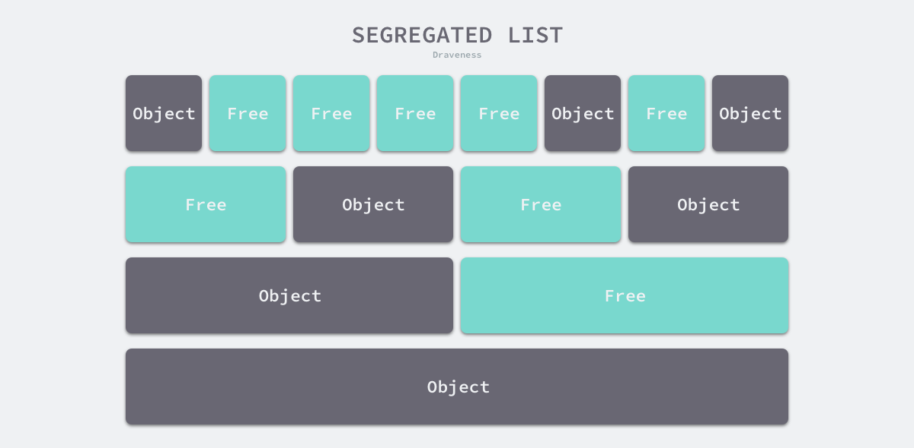

## 内存管理的基础

程序中的数据和变量都会被分配到程序所在的虚拟内存中，内存空间包括两个重要区域：栈区、堆区。

- 函数调用的参数、返回值以及局部变量大都会被分配到栈上，这部分内存会由编译器进行管理
- 堆中的对象由内存分配器分配并由垃圾收集器回收，或者程序员自己管理（c/c++）

内存管理一般包含：用户程序（mutator）、内存分配器（allocator）、垃圾收集器（collector）。当用户程序申请内存时，会通过内存分配器申请新内存，而分配器会负责从堆中初始化相应内存区域。

### 一、内存分配器的分配方法

一般包括两种分配方法：线性分配器、空闲链表分配器

#### 1. 线性分配器

线性分配器只需要在内存中维护一个指向内存特定位置的指针，如果用户程序向分配器申请内存，分配器只需要检查剩余空闲内存、返回分配的内存区域并修改指针在内存中位置即可。


- 优点：较快的执行速度、较低的实现复杂度
- 缺点：无法在内存被释放时复用内存

因此需要与合适的垃圾回收算法配合使用。垃圾回收算法可以通过“复制”的方式整理存活对象的碎片，定期合并空闲内存。这样就能提升效率。但是 c/c++ 这种直接暴露指针的语言无法使用该策略。

#### 2. 空闲链表分配器

内部会维护一个类似于链表的数据结构，当用户程序申请内存时，空闲链表分配器会依次遍历空闲内存块，找到足够大的内存，然后申请新资源并修改链表


- 优点：可以重新利用回收的资源
- 缺点：分配内存时需要遍历链表，事件复杂度为 O(n) 

空闲链表内存分配器可以选择不同的策略在链表的内存块中进行选择：

- 首次适应（First-Fit）：从链表头开始遍历，选择第一个大小大于申请内存的内存块
- 循环首次适应（Next-Fit）：从上次遍历的结束位置开始遍历，选择第一个大小大于申请内存的内存块
- 最优适应（Best-Fit）：从链表头遍历整个链表，选择最合适的内存块
- 隔离适应（Segregated-Fit）：将内存分割成多个链表，每个链表中的内存块大小相同，申请内存时先找到满足条件的链表，再从链表中选择合适的内存块

Go 语言使用的内存分配策略和 “隔离适应” 类似。如下



隔离适应策略会将内存分割成由4、8、16、32 字节的内存块组成的链表，当我们向内存分配器申请 8 个字节的内存时，会在如上第二行找到满足条件的空闲内存块并返回。隔离适应的分配策略减少了需要遍历的内存块数量，提高了内存分配效率。

### 二、Go语言内存分配器的分级分配

Go语言的内存分配器借鉴 TCMalloc（thread-caching malloc）（线程缓存分配）的设计实现高速内存分配，核心理念是使用多级缓存将对象根据大小分类，并按照类别实施不同的分配策略

Go 语言运行时会根据对象的大小将对象分为：微对象 `(0, 16B)` 、小对象 `(16B, 32KB]` 、大对象`(32KB, +∞)` 。对不同的级别的对象分别管理，TCMalloc 和 Go 语言运行时分配器会引入线程缓存（thread cache）、中心缓存（central cache）、页堆（page heap）3 个组件分级管理内存。


- 线程缓存属于每一个独立的线程，它能够满足线程上绝大多数内存分配需求。而且不涉及多线程，不需要加锁
- 当线程缓存不能满足需求时，运行时会使用中心缓存作为补充解决小对象的内存分配
- 再遇到 32KB 以上的对象时，直接选择页堆分配大内存

### 三、Go 语言的虚拟内存布局

Go 1.10 以前的版本堆区的内存空间都是连续的，Go 1.11 后使用稀疏的堆内存空间替代了连续内存。

#### 1. 线性内存

Go 1.10 启动时会初始化整片虚拟内存区域，分为3个区域，spans区（512MB）、bitmap区（16GB） 和 arena区（512GB），这些内存并不是真正存在的物理内存，而是虚拟内存。


- `spans` 区域存储了指向内存管理单元 runtime.mspan 的指针，每个内存单元会管理几页的内存空间，每页大小为 8KB
- `bitmap` 用于标识 `arena` 区域中的那些地址保存了对象，位图中的每个字节都会表示堆区中的 32 字节是否空闲
- `arena` 区域是真正的堆区，运行时会将 8KB 看做一页，这些内存页中存储了所有在堆上初始化的对象

对于任意一个地址，我们都可以根据 `arena` 的基地址计算该地址所在的页数并通过 `spans` 数组获得管理该片内存的管理单元 runtime.mspan，`spans` 数组中多个连续的位置可能对应同一个 runtime.mspan 结构。

Go 语言在垃圾回收时会根据指针的地址判断对象是否在堆中，并通过上一段中介绍的过程找到管理该对象的 runtime.mspan。这些都建立在**堆区的内存是连续的**这一假设上。这种设计虽然简单并且方便，但是在 C 和 Go 混合使用时会导致程序崩溃：

1. 分配的内存地址会发生冲突，导致堆的初始化和扩容失败
2. 没有被预留的大块内存可能会被分配给 C 语言的二进制，导致扩容后的堆不连续

线性的堆内存需要预留大块的内存空间，但是申请大块的内存空间而不使用是不切实际的，不预留内存空间却会在特殊场景下造成程序崩溃。虽然连续内存的实现比较简单，但是这些问题也没有办法忽略。

#### 2. 稀疏内存

运行时使用二维 `runtime.heapArena` 数组管理所有内存，每个单元都会管理 64MB 的内存空间

```
type heapArena struct {
	bitmap       [heapArenaBitmapBytes]byte
	spans        [pagesPerArena]*mspan
	pageInUse    [pagesPerArena / 8]uint8
	pageMarks    [pagesPerArena / 8]uint8
	pageSpecials [pagesPerArena / 8]uint8
	checkmarks   *checkmarksMap
	zeroedBase   uintptr
}
```

不同平台和架构的二维数组大小可能完全不同，Go 语言服务在 Linux 的 x86_64 架构上，二维数组的一维大小会是1，而二维大小是 4194304，因为每一个指针占8 个字节，所以元信息的总大小为 32MB（`4194304 * 8 = 32MB`），由于每个 `runtime.heapArena` 都会管理 64MB 的内存，因此整个堆区最多可以管理 256TB 的内存。


### 四、Go语言的地址空间

因为所有的内存最终都是要从操作系统中申请的，所以 Go 语言的运行时构建了操作系统的内存管理抽象层，该抽象层将运行时管理的地址空间分成以下四种状态：

- None：内存没有被保留或者映射，是地址空间的默认状态
- Reserved：运行时持有该地址空间，但是访问该内存会导致错误
- Prepared：内存被保留，一般没有对应的物理内存访问该片内存的行为是未定义的可以快速转换到 `Ready` 状态
- Ready：可以被安全访问

每个不同的操作系统都会包含一组用于管理内存的特定方法，这些方法可以让内存地址空间在不同的状态之间转换，如下：


Go语言运行时中的状态转换方法

- [`runtime.sysAlloc`](https://draveness.me/golang/tree/runtime.sysAlloc) 会从操作系统中获取一大块可用的内存空间，可能为几百 KB 或者几 MB；
- [`runtime.sysFree`](https://draveness.me/golang/tree/runtime.sysFree) 会在程序发生内存不足（Out-of Memory，OOM）时调用并无条件地返回内存；
- [`runtime.sysReserve`](https://draveness.me/golang/tree/runtime.sysReserve) 会保留操作系统中的一片内存区域，访问这片内存会触发异常；
- [`runtime.sysMap`](https://draveness.me/golang/tree/runtime.sysMap) 保证内存区域可以快速转换至就绪状态；
- [`runtime.sysUsed`](https://draveness.me/golang/tree/runtime.sysUsed) 通知操作系统应用程序需要使用该内存区域，保证内存区域可以安全访问；
- [`runtime.sysUnused`](https://draveness.me/golang/tree/runtime.sysUnused) 通知操作系统虚拟内存对应的物理内存已经不再需要，可以重用物理内存；
- [`runtime.sysFault`](https://draveness.me/golang/tree/runtime.sysFault) 将内存区域转换成保留状态，主要用于运行时的调试；

运行时使用 Linux 提供的 `mmap`、`munmap` 和 `madvise` 等系统调用实现了操作系统的内存管理抽象层，抹平了不同操作系统的差异，为运行时提供了更加方便的接口

## 内存管理的实现

Go 语言内存分配器有几个重要组件：内存管理单元（runtime.mspan）、线程缓存（runtime.mcache）、中心缓存（runtime.mcentral）、页堆（runtime.mheap）。Go语言程序会在启动时初始化内存布局


- 每一个处理器都会分配一个线程缓存 runtime.mcache 用来处理微对象和小对象的分配，他们会持有内存管理单元 runtime.mspan 。每个类型的内存管理单元都会管理特定大小的对象
- 当内存管理单元中不存在空闲对象时，他们会从 runtime.mheap 持有的 134 个中心缓存 runtime.mcentral 中获取新的内存单元。中心缓存属于全局的堆结构体 runtime.mheap，它会从操作系统中申请内存
- 在 amd64 架构的 linux 操作系统上，runtime.mheap 会持有 4194304 个 runtime.heapArena ，每个 runtime.heapArena 会管理 64MB 内存，单个 Go 语言程序的内存上限也就是 256 TB

### 一、内存管理单元

runtime.mspan 是 Go语言内存管理的基本单元，该结构中包含 next 和 prev 两个指针字段，分别指向前一个和后一个 runtime.mspan 。Go 运行时会使用 runtime.mSpanList 存储双向链表的头节点和尾节点并在线程缓存以及中心缓存中使用。

每个 runtime.mspan 都管理 N 个大小为 8KB 的页。当结构体管理的内存不足时，运行时会以页为单位向堆申请内存。

runtime.spanClass 是 runtime.mspan 的跨度类，它决定了内存管理单元中存储的对象大小和个数。Go语言的内存管理模块中一共包含 67 种跨度类，每一种跨度类都会存储特定大小的对象，并且包含特定数量的页数以及对象，所有数据都会被预先计算好并存储在 runtime.class_to_size 和 runtime.class_to_allocnpages 等变量中

### 二、线程缓存

runtime.mcache 是 Go 语言中的线程缓存，它会与线程上的处理器一一绑定，主要用来缓存用户程序申请的微小对象。每一个线程缓存都持有 `68*2` 个 runtime.mspan。

线程缓存在刚刚被初始化时不包含 runtime.mspan，只有在用户程序申请内存时，才会从上一级组件获取新的 runtime.mspan 满足内存分配的需求。

### 三、中心缓存

runtime.mcentral 是内存分配器的中心缓存，访问中心缓存中的内存管理单元需要使用互斥锁。runtime.mcentral 会分别存储包含空闲对象和不包含空闲对象的内存管理单元。

### 四、页堆

runtime.mheap 是内存分配的核心结构体，Go 语言程序会将其作为全局变量存储，而堆中初始化的所有对象都由该结构体统一管理。该结构体中包含两组非常重要的字段，一个是全局的中心缓存列表 central，另一个是管理堆区内存区域的 arenas 

页堆中包含一个长度为 136 的 runtime.mcentral 数组，其中 68 个为跨度类需要 scan 的中心缓存，另外 68 个是 noscan 的中心缓存。另外，Go 语言所有的内存空间都由二维矩阵 runtime.heapArena 管理，这个二维矩阵以稀疏内存形式管理，管理的内存是不连续的。

### 五、分配内存逻辑

运行时会根据对象大小执行不同的分配逻辑，

- 微对象`(0, 16B)`：先使用微型分配器，再依次尝试线程缓存、中心缓存和堆中分配内存
- 小对象 `[16B, 32KB]`：依次尝试线程缓存、中心缓存和堆中分配内存
- 大对象 `(32KB, +∞)`：直接在堆中分配内存

#### 1. 微对象

Go 语言运行时将小于 16 字节的对象划分为微对象，它会使用线程缓存上的微分配器提高微对象分配的性能，我们主要使用它来分配较小的字符串以及逃逸的临时变量。微分配器可以将多个较小的内存分配请求合入同一个内存块中，只有当内存块中的所有对象都需要被回收时，整片内存才可能被回收

#### 2. 小对象

小对象是指大小为 16 字节到 32,768 字节的对象以及所有小于 16 字节的指针类型的对象，小对象的分配可以被分成以下的三个步骤：

1. 确定分配对象的大小以及跨度类 `runtime.spanClass`
2. 从线程缓存、中心缓存或者堆中获取内存管理单元并从内存管理单元找到空闲的内存空间；
3. 清空空闲内存中的所有数据

#### 3. 大对象

运行时对于大于 32KB 的大对象会单独处理，直接调用 `runtime.mcache.allocLarge`分配大片内存，它会计算分配该对象所需要的页数，它按照 8KB 的倍数在堆上申请内存。