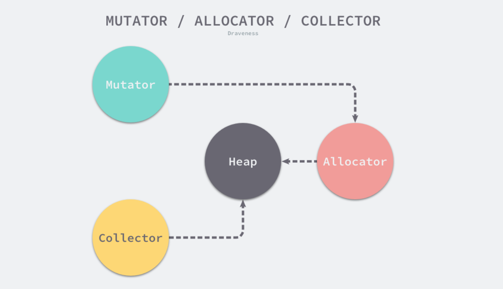
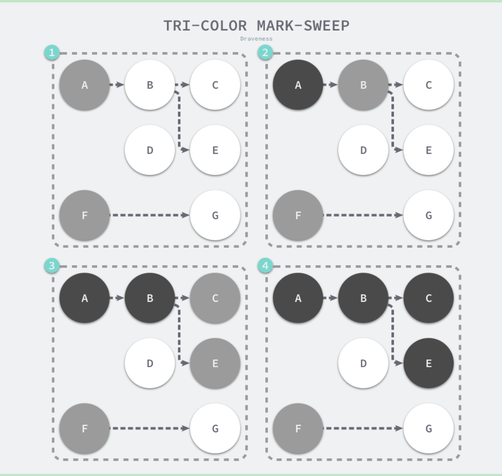
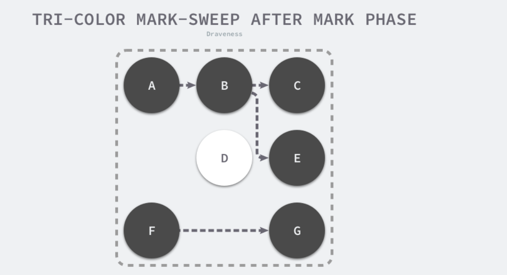
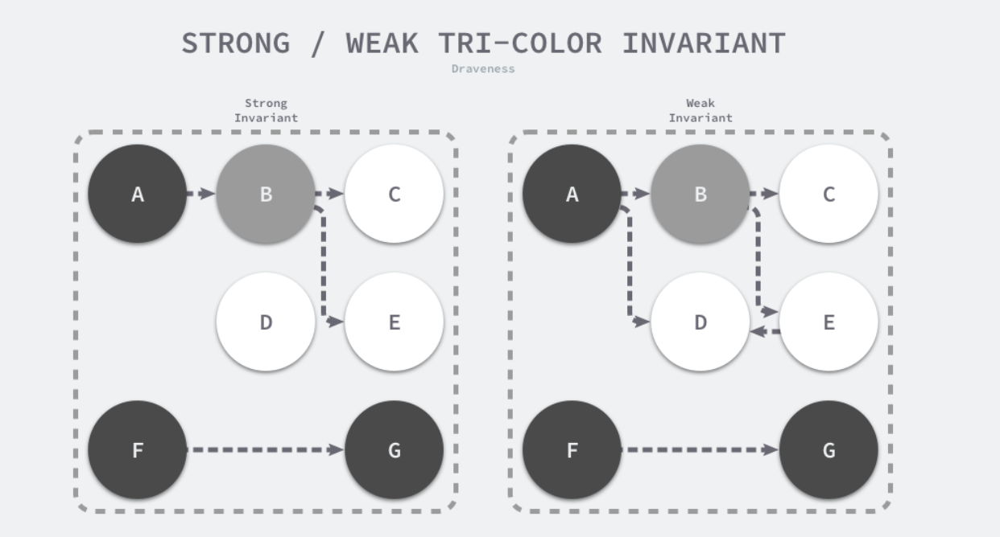
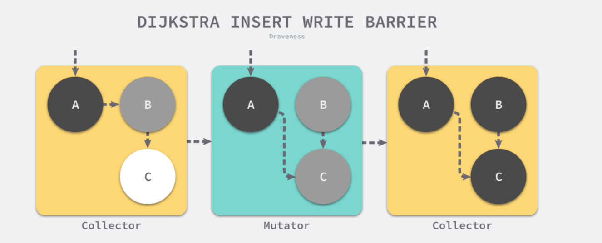
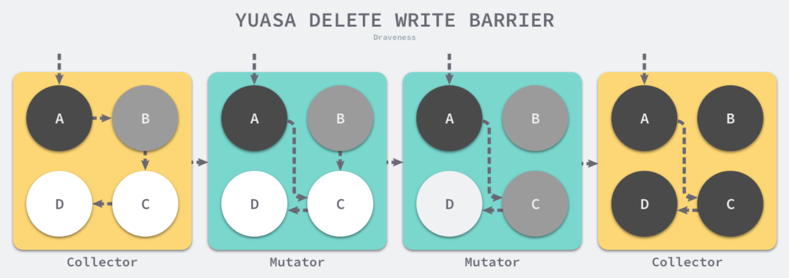

## 垃圾回收

用户程序（Mutator）会通过内存分配器（Allocator）在堆上申请内存，而垃圾收集器（Collector）负责回收堆上的内存空间，内存分配器和垃圾收集器共同管理着程序中的堆内存空间



### 一、设计原理

STW（Stop the world）暂停程序。随着用户程序申请越来越多的内存，系统中的垃圾也逐渐增多；当程序的内存占用达到一定阈值时，整个应用程序就会全部暂停，垃圾收集器会扫描已经分配的所有对象并回收不再使用的内存空间，当这个过程结束后，用户程序才可以继续执行，Go 语言在早期也使用这种策略实现垃圾收集，现在已经优化了很多

#### 1. 标记清除

标记清除收集器是跟踪式垃圾收集器，执行过程分为标记和清除两个阶段

- 标记阶段：从根对象出发查找并标记堆中所有存活的对象
- 清除阶段：遍历堆中的全部对象，回收未被标记的垃圾对象并将回收的内存加入空闲链表，方便内存分配器使用

这是最传统的标记清除算法，垃圾收集器从垃圾收集的根对象出发，递归遍历这些对象指向的子对象并将所有可达的对象标记成存活；标记阶段结束后，垃圾收集器会依次遍历堆中的对象并清除其中的垃圾，整个过程需要标记对象的存活状态，用户程序在垃圾收集的过程中也不能执行，我们需要用到更复杂的机制来解决 STW 的问题。

#### 2. 三色标记

可以缩短 STW 的时间。三色标记算法将程序中的对象分成白色、黑色、灰色三种

- 白色对象 — 潜在的垃圾，其内存可能会被垃圾收集器回收
- 黑色对象 — 活跃的对象，包括不存在任何引用外部指针的对象以及从根对象可达的对象
- 灰色对象 — 活跃的对象，因为存在指向白色对象的外部指针，垃圾收集器会扫描这些对象的子对象

三色标记的工作原理：

1. 从灰色对象的集合中选择一个灰色对象并将其标记成黑色
2. 将黑色对象指向的所有对象都标记成灰色，保证该对象和被该对象引用的对象都不会被回收
3. 重复上述两个步骤直到对象图中不存在灰色对象



当三色的标记清除的标记阶段结束之后，应用程序的堆中就不存在任何的灰色对象，我们只能看到黑色的存活对象以及白色的垃圾对象，垃圾收集器可以回收这些白色的垃圾，下面是使用三色标记垃圾收集器执行标记后的堆内存，堆中只有对象 D 为待回收的垃圾：



因为用户程序可能在标记执行的过程中修改对象的指针，所以三色标记清除算法本身是不可以并发或者增量执行的，它仍然需要 STW。想要并发或者增量地标记对象还是需要使用屏障技术

#### 3. 屏障技术

内存屏障技术是一种屏障指令，它可以让 CPU 或者编译器在执行内存相关操作时遵循特定的约束，目前多数的现代处理器都会乱序执行指令以最大化性能，但是该技术能够保证内存操作的顺序性，在内存屏障前执行的操作一定会先于内存屏障后执行的操作。

想要在并发或者增量的标记算法中保证正确性，我们需要达成以下两种三色不变性中的一种：

- 强三色不变性 — 黑色对象不会指向白色对象，只会指向灰色对象或者黑色对象；
- 弱三色不变性 — 黑色对象指向的白色对象必须包含一条从灰色对象经由多个白色对象的可达路径



屏障技术是在用户程序读取对象、创建新对象以及更新对象指针时执行的一段代码，根据操作类型的不同，我们可以将它们分成读屏障（Read barrier）和写屏障（Write barrier）两种，因为读屏障需要在读操作中加入代码片段，对用户程序的性能影响很大，所以编程语言往往都会采用写屏障保证三色不变性。

##### （1）插入写屏障

Dijkstra 在 1978 年提出了插入写屏障，用户程序和垃圾收集器可以在交替工作的情况下保证程序执行的正确性

```go
writePointer(slot, ptr):
    shade(ptr)
    *slot = ptr
```

每当执行类似 `*slot = ptr` 的表达式时，我们会执行上述写屏障通过 `shade` 函数尝试改变指针的颜色。如果 `ptr` 指针是白色的，那么该函数会将该对象设置成灰色，其他情况则保持不变。



在一个垃圾收集器和用户程序交替运行的场景中会出现如上图所示的标记过程

1. 垃圾收集器将根对象指向 A 对象标记成黑色并将 A 对象指向的对象 B 标记成灰色
2. 用户程序修改 A 对象的指针，将原本指向 B 对象的指针指向 C 对象，这时触发写屏障将 C 对象标记成灰色
3. 垃圾收集器依次遍历程序中的其他灰色对象，将它们分别标记成黑色

Dijkstra 的插入写屏障是一种相对保守的屏障技术，它会将**有存活可能的对象都标记成灰色**以满足强三色不变性。在如上所示的垃圾收集过程中，实际上不再存活的 B 对象最后没有被回收；而如果我们在第二和第三步之间将指向 C 对象的指针改回指向 B，垃圾收集器仍然认为 C 对象是存活的，这些被错误标记的垃圾对象只有在下一个循环才会被回收。

插入式的 Dijkstra 写屏障虽然实现非常简单并且也能保证强三色不变性，但是它也有明显的缺点。因为栈上的对象在垃圾收集中也会被认为是根对象，所以为了保证内存的安全，Dijkstra 必须为栈上的对象增加写屏障或者在标记阶段完成重新对栈上的对象进行扫描，这两种方法各有各的缺点，前者会大幅度增加写入指针的额外开销，后者重新扫描栈对象时需要暂停程序，垃圾收集算法的设计者需要在这两者之间做出权衡。

##### （2）删除写屏障

它会保证开启写屏障时堆上所有对象的可达，所以也被称作快照垃圾收集

```
writePointer(slot, ptr)
    shade(*slot)
    *slot = ptr
```

在老对象的引用被删除时，将白色的老对象涂成灰色，这样删除写屏障就可以保证弱三色不变性，老对象引用的下游对象一定可以被灰色对象引用



在一个垃圾收集器和用户程序交替运行的场景：

1. 垃圾收集器将根对象指向 A 对象标记成黑色并将 A 对象指向的对象 B 标记成灰色；
2. 用户程序将 A 对象原本指向 B 的指针指向 C，触发删除写屏障，但是因为 B 对象已经是灰色的，所以不做改变；
3. **用户程序将 B 对象原本指向 C 的指针删除，触发删除写屏障，白色的 C 对象被涂成灰色**；
4. 垃圾收集器依次遍历程序中的其他灰色对象，将它们分别标记成黑色；

上述过程中的第三步触发了 Yuasa 删除写屏障的着色，因为用户程序删除了 B 指向 C 对象的指针，所以 C 和 D 两个对象会分别违反强三色不变性和弱三色不变性：

- 强三色不变性 — 黑色的 A 对象直接指向白色的 C 对象；
- 弱三色不变性 — 垃圾收集器无法从某个灰色对象出发，经过几个连续的白色对象访问白色的 C 和 D 两个对象；

Yuasa 删除写屏障通过对 C 对象的着色，保证了 C 对象和下游的 D 对象能够在这一次垃圾收集的循环中存活，避免发生悬挂指针以保证用户程序的正确性

#### 4. 增量和并发

传统的垃圾回收算法会有长时间的 STW ，为了减少应用程序暂停的时间，我们使用如下策略优化：

- 增量垃圾收集 — 增量地标记和清除垃圾，降低应用程序暂停的最长时间
- 并发垃圾收集 — 利用多核的计算资源，在用户程序执行时并发标记和清除垃圾

因为增量和并发两种方式都可以与用户程序交替运行，所以我们需要**使用屏障技术**保证垃圾收集的正确性；与此同时，应用程序也不能等到内存溢出时触发垃圾收集，因为当内存不足时，应用程序已经无法分配内存，这与直接暂停程序没有什么区别，增量和并发的垃圾收集需要提前触发并在内存不足前完成整个循环，避免程序的长时间暂停。

**增量收集器**

增量式（Incremental）的垃圾收集是减少程序最长暂停时间的一种方案，它可以将原本时间较长的暂停时间切分成多个更小的 GC 时间片，虽然从垃圾收集开始到结束的时间更长了，但是这也减少了应用程序暂停的最大时间

需要注意的是，增量式的垃圾收集需要与三色标记法一起使用，为了保证垃圾收集的正确性，我们需要在垃圾收集开始前打开写屏障，这样用户程序修改内存都会先经过写屏障的处理，保证了堆内存中对象关系的强三色不变性或者弱三色不变性。虽然增量式的垃圾收集能够减少最大的程序暂停时间，但是增量式收集也会增加一次 GC 循环的总时间，在垃圾收集期间，因为写屏障的影响用户程序也需要承担额外的计算开销，所以增量式的垃圾收集也不是只带来好处的，但是总体来说还是利大于弊。

**并发收集器**

并发（Concurrent）的垃圾收集不仅能够减少程序的最长暂停时间，还能减少整个垃圾收集阶段的时间，通过开启读写屏障、**利用多核优势与用户程序并行执行**，并发垃圾收集器确实能够减少垃圾收集对应用程序的影响

虽然并发收集器能够与用户程序一起运行，但是并不是所有阶段都可以与用户程序一起运行，部分阶段还是需要暂停用户程序的，不过与传统的算法相比，并发的垃圾收集可以将能够并发执行的工作尽量并发执行；当然，因为读写屏障的引入，并发的垃圾收集器也一定会带来额外开销，不仅会增加垃圾收集的总时间，还会影响用户程序，这是我们在设计垃圾收集策略时必须要注意的。

### 二、实现原理

Go语言的垃圾回收可以分为清除、清除终止、标记、标记终止和清除 5 个阶段，其中清除是循环阶段

1. 清理终止阶段：
    1. 将状态切换至 _GCoff 开始清除阶段，初始化清除状态并关闭写屏障
    2. 恢复用户程序，会将所有新创建的对象标记为白色
    3. 后台并发清除所有内存管理单元，当 Goroutine 申请新的内存管理单元时就会触发清除
2. 清除终止阶段
    1. **暂停程序**，这是所有处理器会进入**安全点**
    2. 如果当前垃圾收集循环时强制触发的，我们还需要处理尚未被清除的内存管理单元
3. 标记阶段
    1. 将状态切换至 `_GCmark`、开启写屏障、用户程序协助（Mutator Assists）并将根对象入队；
    2. 恢复执行程序，标记进程和用于协助的用户程序会开始并发标记内存中的对象，写屏障会将被覆盖的指针和新指针都标记成灰色，而所有新创建的对象都会被直接标记成黑色；
    3. 开始扫描根对象，包括所有 Goroutine 的栈、全局对象以及不在堆中的运行时数据结构，扫描 Goroutine 栈期间会暂停当前处理器；
    4. 依次处理灰色队列中的对象，将对象标记成黑色并将它们指向的对象标记成灰色；
    5. 使用分布式的终止算法检查剩余的工作，发现标记阶段完成后进入标记终止阶段；
4. 标记终止阶段；
    1. **暂停程序**、将状态切换至 `_GCmarktermination` 并关闭辅助标记的用户程序；
    2. 清理处理器上的线程缓存；
5. 又开始清理阶段

#### 1. 触发时机

当满足触发垃圾收集的基本条件时：允许垃圾收集、程序没有崩溃并且没有处于垃圾收集循环，会有三种不同方式触发：

1. 堆内存的分配达到控制器计算的触发堆大小，申请内存时根据堆大小触发垃圾收集
    - 当前线程的内存管理单元不存在空闲空间时，创建微对象和小对象需要从中心缓存或者页堆中获取新的管理单元，这时就可能触发垃圾收集
    - 当用户程序申请分配 32 KB 以上的大对象时，一定会触发垃圾收集
2. 后台定时运行检查和垃圾收集
3. 用户程序手动触发垃圾收集

