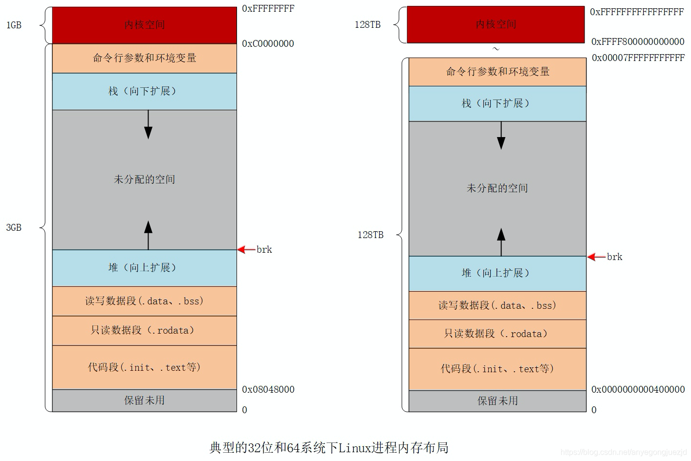

## 栈空间管理

栈区的内存一般由编译器自动分配和释放，其中存储着函数的入参及局部变量，这些参数随函数的创建而创建，随着函数的返回而消亡。这种线性的内存分配策略效率较高。

### 一、基础

#### 1. 寄存器

栈区的操作会用到两个以上的寄存器，栈寄存器的主要作用是跟踪函数的调用栈。Go 语言的汇编代码包含 BP 和 SP 两个栈寄存器，他们分别存储了栈的基址指针和栈顶的地址，BP 和 SP 之间的内存就是当前函数的调用栈。

linux 的内存布局如下：

栈区内存都是从高地址向低地址扩展的，当应用程序申请或者释放栈内存时，只需要修改 SP 寄存器的值，这种线性的内存分配方式比堆内存相比更加快速，仅会带来极少的额外开销。

#### 2. 线程栈

在 Linux 上执行 pthread_create 系统调用，进程会启动一个新线程，如果用户没有通过软资源限制 RLIMIT_STACK 指定线程栈的大小，一般 x86_64 平台默认栈大小是 2MB。

这种固定栈大小在某些场景下不合适，比如：1. 程序需要同时运行几百个甚至上千个线程，这些线程的大部分只会用到很少的栈空间。会占用大量的内存空间但没有使用， 2. 当函数的调用栈非常深时，固定栈大小也无法满足用户程序的需求。

线程和进程都是代码执行的上下文，因此 Go 语言在设计时认为执行上下文是轻量级的，所以在用户态实现 Goroutinue 作为执行上下文

#### 3. 逃逸分析

c/c++ 这种需要手动管理内存的语言，手动分配内存会导致如下问题：

1. 不需要分配到堆上的对象分配到了堆上 — 浪费内存空间
2. 需要分配到堆上的对象分配到了栈上 — 悬挂指针、影响内存安全（返回栈上的指针）

Go 在编译器中，逃逸分析用来决定指针动态作用域的，来确定哪些变量应该在栈上分配，哪些变量应该在堆上分配。并遵循两个不变性：

1. 指向栈对象的指针不能存在于堆中
2. 指向栈对象的指针不能在栈对象回收后存活

为了保证内存的绝对安全，编译器可能会将一些变量错误的分配到堆中，但是因为堆也会被垃圾收集器扫描，所以不会造成内存泄露以及悬挂指针等安全问题

### 二、Go 语言栈内存空间

Go 语言使用用户态协程 Goroutine 作为执行上下文，从“分段栈”演进到“连续栈”

#### 1. 分段栈

分段栈是 Go 1.3 之前的实现，所有 Goroutine 在初始化时会分配一块固定大小的内存，Go 1.1 之前版本是 4 KB，Go 1.2 版本是 8KB。有两种情况

1. 运行时会在全局的栈缓存链表中找到空闲内存块，并将其作为新 Goroutine 的栈空间返回
2. 栈空间会从堆中申请一块合适的内存

当 Goroutine 需要调用的函数层级或者局部变量越来越多时，运行时会创建一个新的栈空间。Goroutine 的多个栈空间会以链表的形式串联起来，运行时会通过指针找到连续的栈片段。一旦 Goroutine 申请的栈空间不再被需要，运行时会释放不再使用的内存空间。

分段栈机制虽然能够按需为当前 Goroutine 分配内存并且及时减少内存的占用，但是它也存在两个比较大的问题：

1. 如果当前 Goroutine 的栈几乎充满，那么任意的函数调用都会触发栈扩容，当函数返回后又会触发栈的收缩，如果在一个循环中调用函数，栈的分配和释放就会造成巨大的额外开销，这被称为热分裂问题（Hot split）；
2. 一旦 Goroutine 使用的内存越过了分段栈的扩缩容阈值，运行时会触发栈的扩容和缩容，带来额外的工作量；

#### 2. 连续栈

每当程序的栈空间不足时，初始化一块更大的栈空间并将原栈中所有的值都迁移到新栈中，新的局部变量或者函数调用就有了充足的内存空间。扩容步骤如下：

1. 在内存空间中分配更大的栈内存空间
2. 将旧栈中的所有内容复制到新栈中
3. 将指向旧栈对应变量的指针重新指向新栈。这一步能够保证指向栈的指针的正确性，因为栈中的所有变量内存都会发生变化，所以原本指向栈中变量的指针也需要调整。
4. 销毁并回收旧栈的内存空间

优缺点：

- 缺点：需要拷贝变量和调整指针，连续栈增加了栈扩容时的额外开销
- 优点：通过合理的栈缩容机制就能避免热分裂带来的性能问题，在 GC 期间如果 Goroutine 使用了栈内存的四分之一，那就将其内存减少一半，这样在栈内存几乎充满时也只会扩容一次，不会因为函数调用频繁扩缩容

### 三、Go语言栈实现

运行时如何使用栈

- Go语言运行时使用全局的栈缓存（runtime.stackpool）和线程缓存中的空闲链表分配 32KB 以下的栈内存
- Go语言运行时使用全局的大栈缓存（runtime.stackLarge）和堆内存分配 32KB 以上的栈内存
- 如果栈空间较大而大栈缓存（runtime.stackLarge）空间不足，会在堆中申请一块大小足够的内存空间

栈扩容

编译器会为函数调用插入 runtime.morestack 运行时检查，它会在几乎所有函数调用之前检查当前 Goroutine 的栈内存是否充足。如果当前栈需要扩容，会保存栈的一些相关信息并调用 runtime.newstack 创建新栈。也就是连续栈的扩容步骤

栈缩容

缩容之后的新栈会是原栈的一半，如果新栈大小低于程序的最低限制 2KB，那么缩容过程就会停止。运行时只会在栈内存使用不足 1/4 时进行缩容。