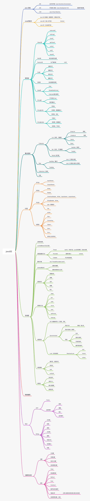

package：一般利用公司域名倒置作为包名。防止域名空间冲突

```shell
jdk: 开发者工具包，包括jre，jvm
jre：运行时环境，包括jvm
jvm：jvm虚拟机
```

```shell
JAVA_HOME: jdk安装的路径
java8 在 PATH 中配置 JAVA_HOME/bin 目录和 JAVA_HOME/jre/bin 目录
```

```shell
编译：javac HelloWorld.java 会生成 HelloWorld.class 
执行 java HelloWorld 即可
```

```shell
javadoc -encoding UTF-8 -charset UTF-8 Doc.java 

以下注释最好写上
@auther 作者
@version 版本
@since jdk版本支持到哪里
@param 参数
@return 返回值
@throws 异常抛出
```

char 占用 2 个字节

常量：final 关键字

```shell
命名规范
1. 驼峰命名（变量，方法）
2. 类，首字母大写，驼峰命名
3. 常量：大写+下划线
```

关系运算符：instanceof

包机制：域名倒写

用户交互：System.in  ` Scanner 类 `

switch 中 case 会穿透，需要 break，还有 default 

```shell
方法：`修饰符 返回值 方法名（参数名） { return 返回值; }`
方法重载：名字相同，参数列表不同
可变长参数：必须放在最后一个参数
```

```shell
继承：Extends、Object、方法重写、this、super
java是单继承，只能继承一个父类
多态：父类的引用指向子类的对象、instanceof关键字，可以进行类型之间的转换
修饰符：public、protected、private、static、final、abstract
```

```shell
接口：interface 约束，只能定义方法名
子类实现接口，必须重写其中的方法
只有一个方法的接口叫做函数式接口，可以用 lambda 表示简化
接口比抽象类更抽象
一个类可以实现多个接口
```

```shell
内部类：局部内部类、静态内部类、匿名内部类（lambda）
```

```shell
异常：Throwable 分为 Exception和Error

Exception 分为运行时异常、检查型异常
运行时异常：除0、ClassNotFound、NullPoint、UnkownType、下标越界等等
一般处理运行时异常

Error：分为AWT错误、JVM错误
JVM错误：StackOverFlow、OutOfMemory

五个关键字：try{} 、 catch（先小后大）、finally、throw、thows
自定义异常：继承 Exception 类即可
```

```shell
常用类：Object类、String类、StringBuffer类、StringBuilder类、Random类、File类、Date类、包装类
```

JavaSE 总结：



