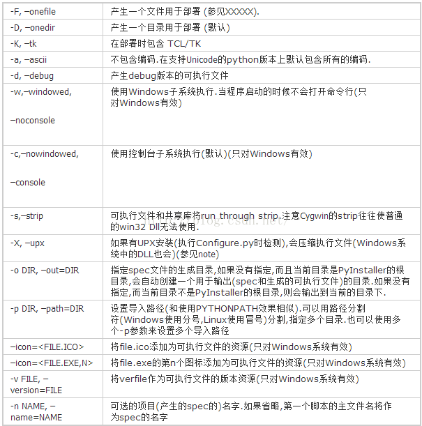

## python代码打包成二进制

本文是通过 pyinstaller 来实现将 python 代码打包成二进制

### 一、使用 pyinstaller

安装：`pip install pyinstaller`

使用：

```
pyinstaller -F -w -i xxx.ico xxx.py
-w: 表示程序启动时不会打开命令行，也就是不会有控制台窗口。GUI 界面用此参数很有效果
-F：代表制作独立的可执行程序
-i：表示设置自己的图标图案
```



将其他格式图片转换成 ico 格式的网站：https://app.xunjiepdf.com/img2icon/

### 二、压缩打包

生成的可执行文件太大，有一种说法是 Anaconda 里内置了很多库，打包的时候打包了很多不必要的模块，因此我们使用纯净的 python 来打包。使用 Anaconda 来创建虚拟环境。

```
# 创建虚拟环境
conda create -n 虚拟环境名字 python==3.6

# 激活虚拟环境
conda activate 虚拟环境名字

# 退出虚拟环境
conda deactivate
```

conda 安装的虚拟环境，就把虚拟环境的目录生成在 anaconda 安装目录下的 env 目录下

也可以通过 `conda info --envs` 来查看 conda 环境下所有的虚拟环境。

然后再使用 pyinstaller 来打包可执行文件，**注意：打包前可以在这个虚拟环境中运行下程序，保证需要的包已经安装了**

### 三、添加资源文件

如果要给这个二进制打包进入一些资源，可以给 pyinstaller 添加选项，也可以修改 spec 文件。

如下修改 spec 文件来添加资源文件。注意 binaries 原本是空的，我们把要添加的资源以 tupple 的形式传入，tuple 的第一个元素是资源文件的路径，第二个元素是打包后存放资源的文件夹。

```
a = Analysis(['..\\src\\pdf_compress.py'],
             pathex=['C:\\Users\\zhangyi\\PycharmProjects\\compressor\\pdf_build'],
             binaries=[('..\\resource\\gswin64.exe', 'bin'), ('..\\resource\\gswin64c.exe', 'bin'),
                    ('..\\resource\\gsdll64.dll', 'bin'), ('..\\resource\\gsdll64.lib', 'bin')],
             datas=[],
             hiddenimports=[],
             hookspath=[],
             runtime_hooks=[],
             excludes=[],
             win_no_prefer_redirects=False,
             win_private_assemblies=False,
             cipher=block_cipher,
             noarchive=False)
```

接下来还要注意，放好了资源文件，在代码中访问这些资源时，要注意路径。

pyinstaller 打包可执行文件的机制简单说下，打包得到的可执行文件是一个可自解压的程序，他会把这个可执行文件中包含的文件打包到一个名为 `_MEIxxxxxx` 的临时目录下，这个目录在系统的临时目录下（linux 中在 `/tmp`下）。当程序退出时，会自动清空删除这个临时目录。

在这个临时目录的 bin 目录下是我们添加的资源文件。最终的exe文件有可能放在任何目录执行，其当前目录下不会有bin目录下面的资源文件，而是被解压到了临时目录下面，所以程序有可能报错找不到相关文件。

因此，我们要在程序中指定资源文件的路径，使得它在非打包模式和打包模式下运行时都能找到相关资源文件。这需要添加一个路径解析函数：

```
def get_resource_path(relative_path):
    base_path = getattr(sys, '_MEIPASS', os.path.dirname(os.path.abspath(__file__)))
    return os.path.join(base_path, relative_path)
gs = get_resource_path('bin/gswin64.exe')
```

这个函数就是把资源的相对路径转换成绝对路径。如果找到 `_MEIPASS` 路径就以此为资源的基准路径，否则就以当前路径为基准路径。

还需要注意：打包是关闭了命命令行窗口，stdin 和 stdout 无处安放，所以把他们用 `subprocess.PIPE` 管道代替即可。

```
subprocess.call(cmd, shell=False, startupinfo=startupinfo,
				creationflags=subprocess.CREATE_NO_WINDOW,
				stdin=subprocess.PIPE, stdout=subprocess.PIPE, stderr=subprocess.PIPE)
```

最后，使用 spec 方式打包，我们可以直接使用：

```
pyinstaller -D xxx.spec
```