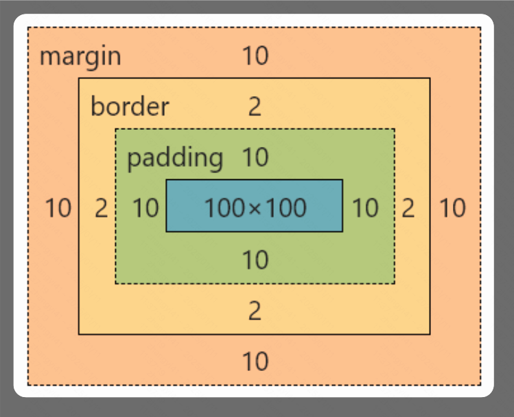

所有的HTML元素都可以看作是盒子，在CSS中，“box model” 这一术语是用来设计和布局时使用。

盒子包括：外边距（margin）、边框（border）、内边距（padding）、实际内容（content）




```
div {
	width: 100px;
	height: 100px;
	padding: 10px;
	border: 2px solid red;
	margin: 10px;
	background: green;
}
```

其中属性的用法

```
margin 的用法：
- 四个值，分别代表上、右、下、左 四个方向的外边距
- 两个值，上下、左右
- 一个值，所有方向

margin-top: 10px;    /* 上外边距 */
margin-right: 15px;  /* 右外边距 */
margin-bottom: 20px; /* 下外边距 */
margin-left: 25px;   /* 左外边距 */
```


