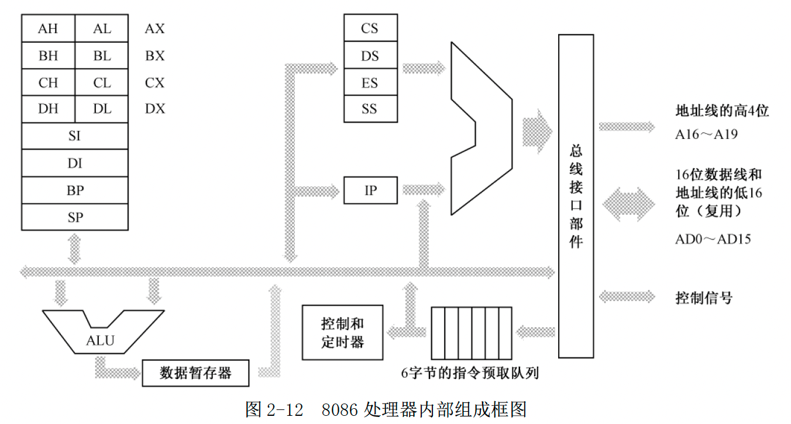
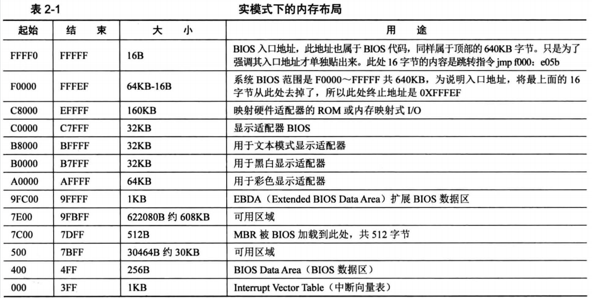

如下是 8086 处理器的内部组成框图



在进行数据传送或者算术逻辑运算的时候，使用算术逻辑部件（ALU）。比如，将AX的内容和CX的内容相加，结果仍在AX中，那么，在相加的结果返回到AX之前，需要通过一个叫数据暂存器的寄存器中转。

处理器能够自动运行，这是控制器的功劳。为了加快指令执行速度，8086内部有一个6字节的指令预取队列，在处理器忙着执行那些不需要访问内存的指令时，指令预取部件可以趁机访问内存预取指令。这时，多达6个字节的指令流可以排队等待解码和执行

CS：代码段寄存器。DS：数据段寄存器。ES：附加段寄存器，用给程序猿使用。SS：栈段寄存器

IP：指令指针寄存器，他只和 CS 一起使用，而且只有处理器才能直接改变他的内容。当一段代码开始执行时，CS指向代码段的起始地址，IP则指向段内偏移。这样，由CS和IP共同形成逻辑地址，并由总线接口部件变换成物理地址来取得指令。然后，处理器会自动根据当前指令的长度来改变IP的值，使它指向下一条指令。

8086 提供了 20 根地址线，也就是 20 位的物理地址。16 位的物理地址只能访问 64KB 的内存。8086 处理器在形成物理地址时，先将段寄存器的内容左移 4 位，形成 20 位的段地址，然后再同 16 位的偏移地址相加，得到 20 位的物理地址。

在不允许段之间重叠的情况下，每个段的最大长度是 64KB，因为偏移地址也是 16 位，因此 1MB 的内存，最多能划分成 16 个段，每个段长 64KB。比如：从 `0000H、1000H、20000H ... F000H`。对于一个内存段来说，段地址可以开始于任何 16 字节对齐的地方，偏移地址则总是从 `0x0000` 开始递增。

#### ROM-BIOS

DRAM（Dynamic Random Access Memory）动态随机访问存储器。

ROM（Read Only Memory）只读存储器

在 Intel 8086 处理器中，ROM 占据着整个内存空间顶端的 64KB，物理地址范围是：`0xF0000 - 0xFFFFF`。里面固化了开机时要执行的指令。DRAM 占据着较低端的 640KB，地址范围：`0x00000 - 0x9FFFF`。中间还有一部分分给了其他外围设备。

8086 加电或者复位时，`CS=0xFFFF, IP=0x0000`，所以他取的第一条指令位于物理地址 `0xFFFF0`，正好位于 ROM 中，那么固化了开机时需要执行的指令。

处理器取指令执行的顺序一般是从内存的低地址往高地址推进。从 `0xFFFF0` 开始执行，这个位置离 1MB 内存的顶端（物理地址 `0xFFFFF`）只有 16 字节的长度，一旦溢出，将回绕到 1MB 内存的最底端。

所以，物理地址 `0xFFFF0` 处一般是一个跳转指令：`jmp 0xF000:0xE05B`。

这块 ROM 芯片中的内容包括很多部分，主要是进行硬件的诊断、检测和初始化。初始化就是让硬件处于一个正常的、默认的工作状态。最后他还负责提供一套软件例程，让人们在不必了解硬件细节的情况下从外围设备（比如键盘）获取输入数据，或者向外围设备（比如显示器）输出数据。设备当然是很多的，所以这块ROM芯片只针对那些最基本的、对于使用计算机而言最重要的设备，而它所提供的软件例程，也只包含最基本、最常规的功能。因此，这片芯片又叫做基本输入输出系统（`Base Input & Output System，BIOS`）ROM。也称为 ROM-BIOS。

ROM-BIOS 的容量有限，他最后要做的，是从辅助存储设备读取指令数据，然后转到哪里执行。

硬盘的第一个扇区是 0 磁头 0 柱面 1 扇区，这个扇区成为主引导扇区（Main Boot Sector，MBR）。如果计算机的设置是从硬盘启动，那么 ROM-BIOS 将读取硬盘主引导扇区的内容，将它加载到内存地址 `0x0000:0x7C00` 处，然后跳到哪里去执行（`jmp 0x0000:0x7C00`）

一个有效的主引导扇区，最后两字节应当是 `0x55` 和 `0xAA`。

### 显卡

显卡都有自己的存储器，简称 显存，要显示的内容写到显存中即可。显卡的工作是周期性地从显存中提取这些比特，并把他们按顺序显示在屏幕上。文本模式和图形模式是显卡的两种基本工作模式，可以用指令访问显卡，设置他的显示模式。

如下是实模式下的内存布局，比如文本模式的显存：`0xB8000 - 0xBFFFF` 



由于历史原因，几乎所有显卡，在加电自检之后都会把自己初始化到 `80*25` 的文本模式，在这种模式下，屏幕上可以显示 25 行，每行 80 个字符，每屏总共 2000 个字符。

显卡上的每个字符对应着显存中两个连续字节，前一个是字符的 ASCII 吗，后一个是字符的显示属性，包括字符颜色（前景色）和底色（背景色）。字符的显示属性（1字节）分别两部分，低 4 位定位的是前景色，高 4 位定义的背景色。可以由红（R）、绿（G）、蓝（B）三原色来配出其他所有颜色。K 是闪烁位，为 0 时不闪烁；为 1 时闪烁。I 是亮度位，为 0 是正常亮度，为 1 是高亮。


```
mov ax, 0xB800
mov ex, ax
mov byte [ex:0x00], 'L'
mov byte [ex:0x01], 0x07
```

如上，关键字：byte 用来修饰目的操作数，指出本次传送是以字节的方式进行的。因为在 16 位的处理器上，单次操作的数据宽度可以是 8 位，也可以是 16 位，可以根据目的操作数或者源操作数来判断。在这里目的操作数是偏移地址 0x00，可以是字节也可以是字；无法判断的情况下，必须使用 “byte” 或者 “word” 进行修饰。


```
nasm -f bin xx.asm -o xx.bin
```


