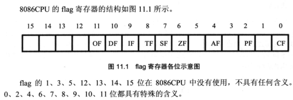

### 一、标志寄存器

8086 CPU 的 flag 寄存器结构如下：



- ZF 标志位：零标志位，他记录相关指令执行后，其结果是否为 0，如果结果为 0，那么 `ZF=1 `，否则 `ZF=0`
- PF 标志位：奇偶标志位，相关指令执行后，其结果的所有 bit 位中 1 的个数是否为偶数。如果是则 `PF=1`
- SF 标志位：符号标志位，相关指令执行后，其结果是否为负。如果是则 `SF=1`。如果我们将数据当作无符号树来运算，SF 的值没有意义。只有将数据当作有符号数来运算的时候，才能通过他来得知结果的正负。
- CF 标志位：进位标志位，在进行**无符号数运算**的时候。他记录了运算结果的最高有效位向更高位的进位值，或从更高位的借位值。比如当两个数据做加法时，溢出了，寄存器本身会将这个进位值丢失，同时会设置 CF 标志位。当两个数据做减法时，有可能向更高位借位，CF 位会记录错位值
- OF 标志位：溢出标志位，记录了**有符号数运算**的结果是否发生了溢出。如果发生溢出，则 `OF=1`

注意：CF 和 OF 所表示的进位和溢出，是分别对无符号数和有符号数运算而言的，他们之间没有任何关系。

### 二、比较

cmp 是比较指令，cmp 的功能相当于减法指令，只是不保存结果。cmp 指令执行后，将对标志寄存器产生影响。其他相关指令通过识别这些被影响的标志寄存器位来得知比较结果。

```
cmp 操作对象1, 操作对象2
计算 “操作对象1 - 操作对象2”, 但并不保存结果，仅仅根据计算结果对标志寄存器进行设置
```

### 三、条件转移

“转移” 指的是它能够修改 IP，而 “条件” 指的是他可以根据某种条件，决定是否修改 IP。

| 指令        | 含义         | 检测的相关标志位 |
| ----------- | ------------ | ---------------- |
| je（equal） | 等于则转移   | ZF=1             |
| jne         | 不等于则转移 | ZF=0             |
| jb（below） | 低于则转移   | CF=1             |
| jnb         | 不低于则转移 | CF=0             |
| ja（above） | 高于则转移   | CF=0 且 ZF=0     |
| jna         | 不高于则转移 | CF=1 或 ZF=1     |

### 四、call 和 ret 指令

#### 1. ret 指令

- ret 指令用栈中的数据，修改 IP 的内容，从而实现近转移。CPU 执行 ret 指令时，会进行如下两步操作：

  ```
  IP = (ss)*16 + sp
  sp = sp + 2
  
  相当于执行汇编指令：
  pop IP
  ```

- retf 指令用栈中的数据，修改 CS 和 IP 的内容，从而实现远转移

  ```
  IP = ss*16 + sp
  sp = sp + 2
  CS = ss*16 + sp
  sp = sp + 2
  
  相当于执行汇编指令：
  pop IP
  pop CS
  ```

#### 2. call 指令

- call 标号。将当前的 IP 压栈后，转到标号处执行指令。相当于进行：

  ```
  push IP
  jmp near ptr 标号
  ```

- `call far ptr 标号`。实现段间转移。相当于进行：

  ```
  push CS
  push IP
  jmp far ptr 标号
  ```

- call 16位reg

  ```
  push IP
  jmp 16位reg
  ```

- call word ptr 内存单元地址

  ```
  push IP
  jmp word ptr 内存单元地址
  ```

#### 3. call 和 ret 配合使用

具有子程序的框架如下：

```
main:
		call sub1
		...
		mov ax, 4c00h
		int 21h
sub1:
		call sub2
		...
		ret
sub2:
		...
		ret
```


