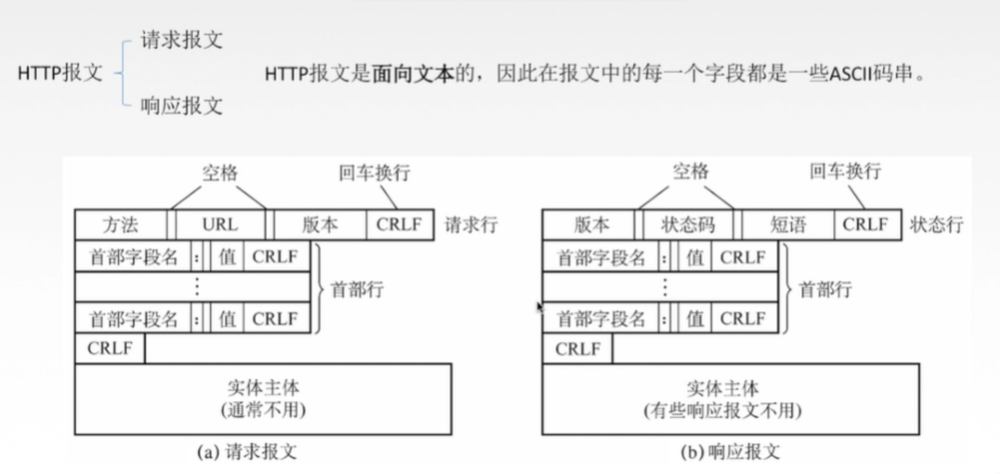

应用层主要提供应用进程间的网络通信服务，完成用户请求的各种服务。

### 一、HTTP 协议

http协议即超文本传输协议，基于TCP协议，用于从Web服务器传输超文本到本地浏览器的传送协议。http协议是无状态协议，自身不对请求和响应直接的通信状态进行保存，但有些场景下我们需要保存用户的登陆信息，所以引入了cookie 和 session 来管理状态。

#### 1. cookie 和 session 的区别：
（1）保存位置与安全性：cookie保存在客户端，session保存在服务端，所以在安全性上面，cookie存在安全隐患，可以通过拦截或本地文件找到cookie后进行攻击，而session相对更加安全。因此，可以将登陆信息等重要信息存放为session中；其他信息如果需要保留，可以放在cookie中。
（2）存储容量：单个cookie最大只允许4KB，一个站点最多保存20个Cookie；session没有大小限制，个数只跟服务器的内存大小有关。
（3）有效期与实现机制：cookie可长期有效存在；session依赖于cookie，过期时间默认为-1，只需关闭窗口该 session 就会失效。每个客户端对应一个session ，客户端之间的 session  相互独立；

 - cookie：cookie是一小段的文本信息，当客户端请求服务器时，如果服务器需要记录该用户状态，就在响应头中向客户端浏览器颁发一个Cookie，而客户端浏览器会把cookie保存起来。当再次请求该网站时，浏览器把请求的网站连同该cookie一起提交给服务器，服务器会检查该cookie，以此来辨认用户状态。
 - session：当客户端请求服务器时，都会带上cookie，cookie里面一般都会有一个JSESSIONID，服务器就按照 JSESSIONID 来找到对应的 session；如果客户端请求不包含 JSESSIONID，则为此客户端创建session并生成相关联的JSESSIONID，并将这个JSESSIONID在本次响应中返回给客户端保存。客户端保存这个 JSESSIONID 的方式可以使用cookie机制。若浏览器禁用Cookie的话，可以通过 URL重写机制 将JSESSIONID传回服务器。

#### 2. 一个完整的http请求是怎么样？即从输入网址到获得页面的过程
（1）解析url，获取 url 中包含的域名；
（2）通过DNS系统查询域名对应的IP；

 - DNS服务器大致分为三种类型：根DNS服务器、顶级域DNS服务器 和 权威DNS服务器，其中： 顶级域DNS服务器主要负责诸如com、org、net、edu、gov 等顶级域名。
 - 根DNS服务器存储了所有 顶级域DNS服务器的 IP 地址，可以通过根服务器找到顶级域服务器（例如：www.baidu.com，根服务器会返回所有维护 com 这个顶级域服务器的 IP 地址）。然后你任选其中一个顶级域服务器发送请求，该顶级域服务器拿到域名后能够给出负责当前域的权威服务器地址（以 baidu为例的话，顶级域服务器将返回所有负责 baidu 这个域的权威服务器地址）。接着任选其中一个权威服务器地址查询 「www.baidu.com」 的具体 IP 地址，最终权威服务器会返回给你具体的 IP 地址。此外，本地 DNS 服务器是具有缓存功能的，通常两天内的记录都会被缓存。
 - 所以，通过DNS系统查询域名对应的 IP 的具体步骤可以总结为：
   ① 操作系统先查本地 hosts文件 中是否有记录，如果有，则直接返回相对应映射的IP地址。
   ② 如果本地hosts文件中没有配置，则主机向自己的本地 DNS 服务器 发送查询报文，如果本地DNS服务器缓存中有，将直接返回结果
   ③ 如果本地服务器缓存中没有，则从内置在内部的根服务器列表（全球13台，固定的IP地址）中选一个发送查询报文
   ④ 根服务器解析域名中的后缀名，告诉本地服务器负责该后缀名的所有顶级服务器列表
   ⑤ 本地服务器选择其中一个顶级域服务器发送查询请求，顶级域服务器拿到域名后继续解析，返回对应域的所有权威服务器列表
   ⑥ 本地服务器再向返回的权威服务器发送查询报文，最终会从某一个权威服务器上得到具体的 IP 地址
   ⑦ 主机返回结果IP
     （3）浏览器得到域名对应的IP地址之后，向服务器发起三次握手请求建立TCP链接；
     （4）TCP链接链接建立起来后，浏览器向服务器发送http请求，如果 html文件在缓存里，浏览器则直接返回， 如果没有，则去后台拿；
    ① 浏览器首次加载资源成功时，服务器返回200，此时浏览器不仅将资源下载下来，而且把response的header(里面的date属性非常重要，用来计算第二次相同资源时当前时间和date的时间差)一并缓存;
    ② 下一次加载资源时，首先要经过强缓存的处理，cache-control的优先级最高，比如cache-control：no-cache,就直接进入到协商缓存的步骤了，如果cache-control：max-age=xxx,就会先比较当前时间和上一次返回200时的时间差，如果没有超过max-age，命中强缓存，不发请求直接从本地缓存读取该文件（这里需要注意，如果没有cache-control，会取expires的值，来对比是否过期），过期的话会进入下一个阶段，协商缓存
    ③ 协商缓存阶段，则向服务器发送header带有If-None-Match和If-Modified-Since的请求，服务器会比较Etag，如果相同，命中协商缓存，返回304；如果不一致则有改动，直接返回新的资源文件带上新的Etag值并返回200;
    ④ 协商缓存第二个重要的字段是，If-Modified-Since，如果客户端发送的If-Modified-Since的值跟服务器端获取的文件最近改动的时间，一致则命中协商缓存，返回304；不一致则返回新的last-modified和文件并返回200;
     （5）服务器接收到请求后，根据路径参数映射到特定的处理器进行处理，并将处理结果以及相应的视图返回给浏览器。
     （6）浏览器解析视图，并根据请求到的资源、数据进行渲染页面，最终向用户呈现一个完整的页面。
    构建DOM树(DOM tree)：从上到下解析HTML文档生成DOM节点树（DOM tree），也叫内容树（content tree）；
    构建CSSOM(CSS Object Model)树：加载解析样式生成CSSOM树；
    执行JavaScript：加载并执行JavaScript代码（包括内联代码或外联JavaScript文件）；
    构建渲染树(render tree)：根据DOM树和CSSOM树,生成渲染树(render tree)；
    渲染树：按顺序展示在屏幕上的一系列矩形，这些矩形带有字体，颜色和尺寸等视觉属性。
    布局（layout）：根据渲染树将节点树的每一个节点布局在屏幕上的正确位置；
    绘制（painting）：遍历渲染树绘制所有节点，为每一个节点适用对应的样式，这一过程是通过UI后端模块完成；

#### 3. http的长连接和短连接
http的长连接和短连接本质上是TCP长连接和短连接。从http1.1开始就默认使用长连接。

短链接是指客户端与服务端每进行一次请求操作，就建立一次TCP连接，收到服务器响应后，就断开连接。

长连接是指客户端和服务建立TCP连接后，它们之间的连接会持续存在，不会因为一次HTTP请求后关闭，后续的请求也是用这个连接进行通信，使用长连接的HTTP协议，会在响应头有加入：Connection:keep-alive。长连接可以省去每次TCP建立和关闭的握手和挥手操作，节约时间提高效率。但在长连接下，客户端一般不会主动关闭连接，如果客户端和服务端之间的连接一直不关闭的话，随着连接数越来越多，会对服务端造成压力。

所以长连接多用于频繁请求资源，而且连接数不能太多的情况，例如数据库的连接用长连接。而像Web网站这种并发量大，但是每个用户无需频繁操作的场景，一般都使用短连接，因为长连接对服务端来说会耗费一定的资源。

#### 4. http的断点续传是如何实现的？
HTTP请求头有个Range字段；我们下载文件的时候如果遇到网络中断，如果重头开始下载会浪费时间，所以我们可以从上一次中断处继续开始下载；具体的操作：
Range: bytes=5001-10000
或者指定5001以后的所有数据
Range: bytes=5001-

#### 5. http存在的问题

- 通信使用明文不加密，通信内容可能被窃听；
- 无法验证报文的完整性，数据内容可能被篡改
- 不验证通信方身份、可能遭到伪装，无法保证数据发送到正确的机器上；

### 二、HTTPS 协议

- https 是基于tcp协议，在http的基础上加入了SSL/TLS，可看成是添加了加密和认证机制的http，使用对称加密、非对称加密、证书等技术进行进行客户端与服务端的数据加密传输，最终达到保证整个通信的安全性。
- 对称加密指加密和解密都使用同一个密钥的方式，这种方式存在如何安全地将密钥发送对方的问题；非对称加密使用两个密钥，公钥加密则需要私钥解密，私钥加密则需要公钥解密。不能私钥加密，私钥解密。非对称加密不需要发送用来解密的私钥，所以可以保证安全性，但是和对称加密比起来，速度非常的慢，所以我们还是要用对称加密来传送消息，但对称加密所使用的密钥我们可以通过非对称加密的方式发送出去。

1. https的认证加密过程？如何保证内容不会被篡改的？
   （1）https是基于tcp协议的，首先客户端会和服务端发起链接建立
   （2）服务端返回它的证书给客户端，证书中包含了服务端公钥S.pub、颁发机构和有效期等信息
   （3）客户端通过浏览器内置的根证书（内部包含CA机构的公钥C.pub）验证证书的合法性
   （4）客户端生成随机的对称加密密钥Z，然后通过服务端的公钥S.pub加密发送给服务端
   （5）客户端和服务端之后就通过对称加密密钥Z加密数据来进行http通信

2. 根证书如何保证签发的证书是安全有效的？
   （1）服务器会预先生成非对称加密密钥，私钥S.pri自己保留，而公钥S.pub则发送给CA进行签名认证
   （2）CA机构也会预先生成非对称加密密钥，其私钥C.pri用来对服务器的公钥S.pub进行签名，生成CA证书
   （3）CA机构将签名生成的CA证书返回给服务器，也就是前面服务端给客户端那个证书
   （4）因为CA机构比较权威，所以很多浏览器会内置包含它公钥C.pub的证书，称之为根证书，然后可以使用根证书来验证其颁发证书的合法性了

在整个过程中，一共涉及2对公私密钥对，一对由服务器产生，主要用于加密，一对由CA产生，主要用于签名。

3. 为什么需要CA证书认证机构呢？
   CA证书是为了确保服务端的公钥是准确无误、没有被修改过的。虽然https是加密的，但是请求还是可以被拦截的，假设没有CA证书，如果服务器返回的包含公钥的包被攻击者截取，然后攻击者也生成一对公私钥，他将自己的公钥发给客户端。攻击者得到客户端数据后进行解密，然后再通过服务器的公钥加密发给服务器，这样数据就被攻击者获取到了。

有了CA证书后，客户端根据内置的CA根证书，很容易识别出攻击者的公钥不合法，或者说攻击者的证书不合法。

证书通常包含这些内容：(1) 服务端的公钥；(2) 证书发行者(CA)对证书的数字签名；(3) 证书所用的签名算法；(4) 证书发布机构、有效期、所有者的信息等其他信息

### 三、HTTP 的请求与响应：

1. http的常见请求方式：
   （1）get：向服务端获取资源，所以查询操作一般用get
   （2）post：向服务端提交请求字段，创建操作使用 post，该操作不是幂等的，多次执行会导致多条数据被创建
   （3）put：修改指定URL的资源，如果资源不存在，则进行创建，修改操作一般使用 put，在http中，put 被定义成幂等的，多次操作会导致前面的数据被覆盖
   （4）patch：局部修改URL所在资源的数据，是对put的补充
   （5）delete：删除指定URL的资源。
   （6）head：获取响应报文的首部，即获得URL资源的头部
   （7）options：询问服务器支持哪些方法，响应头中返回 Allow: GET、POST、HEAD
   （8）trace：追踪路径，主要用于测试或诊断；在请求头中在Max-Forwards字段设置数字，每经过一个服务器该数字就减一，当到0的时候就直接返回，一般通过该方法检查请求发送出去是否被篡改
2. get和 post 请求的区别：
   （1）功能：get一般用来从服务器上面获取资源，post一般用来更新服务器上面的资源。
   （2）幂等性：get 是幂等的，post 为非幂等的
   （3）安全性：get 请求的参数会明文附加在URL之后，而 post 请求提交的数据则被封装到请求体中，相对更安全。
   （4）传输数据量的大小：get请求允许发送的数据量比较小，大多数浏览器都会限制请求的url长度在2048个字节，而大多数服务器最多处理64K大小的url；而post请求提交的数据量则是没有大小限制的。
   （5）参数的数据类型：GET只接受ASCII字符，而POST没有限制。
   （6）GET在浏览器回退时是无害的，而POST会再次提交请求。
   （7）get请求可以被缓存，可以被保留在浏览器的历史记录中；post请求不会被缓存，不会被保留在浏览器的历史记录中。
3. http报文头分析：
   （1）报文类型：报文类型分为请求报文和响应报文
    ① 请求报文包含三部分：
    请求行：包含请求方法、URI、HTTP版本信息
    请求首部字段
    请求内容实体
    ② 响应报文包含三部分：
    状态行：包含HTTP版本、状态码、状态码的原因短语
    响应首部字段
    响应内容实体

（2）报文中各部分的简要描述：
    方法(method)：客户端希望服务器对资源执行的动作，是一个单独的词，比如：get 或者 post
    请求URL(request-URL)：请求URL是资源的绝对路径，服务器可以假定自己是URL的主机/端口
    版本(version)：报文所使用的Http版本，其格式：HTTP/<主要版本号>.<次要版本号>
    状态码(status-code)：标识请求过程中所发生的情况
    原因短语(reason-phrase)：数字状态码的可读版本，包含行终止序列之前的所有文本。
    请求头部(header)：可以有零个或多个头部，每个首部都包含一个名字，后面跟着一个冒号(:)，然后是一个可选的空格，接着是一个值，最后是一个CRLF首部是由一个空行(CRLF)结束的，表示了头部列表的结束和实体主体部分的开始
    实体的主体部分(entity-body)：实体的主体部分包含一个由任意数据组成的数据块，并不是所有的报文都包含实体的主体部分，有时，报文只是以一个CRLF结束。

（3）通用头部：既可以出现在请求报文中，也可以出现在响应报文中，它提供了与报文相关的最基本的信息：
    Connection：允许客户端和服务器指定与请求/响应连接有关的选项，http1.1之后默认是 keep-alive
    Date：日期和时间标志，说明报文是什么时间创建的
    Transfer-Encoding：告知接收端为了保证报文的可靠传输，对报文采用了什么编码方式
    Cache-Control：用于随报文传送缓存指示

（4）请求头部：请求头部是只在请求报文中有意义的头部。用于说明是谁或什么在发送请求、请求源自何处，或者客户端的喜好及能力
    Host：给出了接收请求的服务器的主机名和端口号
    Referer：提供了包含当前请求URI的文档的URL
    User-Agent：将发起请求的应用程序名称告知服务器
    Accept：告诉服务器能够发送哪些媒体类型
    Accept-Encoding：告诉服务器能够发送哪些编码方式
    Accept-Language：告诉服务器能够发送哪些语言
    Range：如果服务器支持范围请求，就请求资源的指定范围
    If-Range：允许对文档的某个范围进行条件请求
    Authorization：包含了客户端提供给服务器，以便对其自身进行认证的数据
    Cookie：客户端用它向服务器传送数据

（5）响应头部：响应头部为客户端提供了一些额外信息，比如谁在发送响应、响应者的功能，甚至与响应相关的一些特殊指令
    Age：(从最初创建开始)响应持续时间
    Server：服务器应用程序软件的名称和版本
    Accept-Ranges：对此资源来说，服务器可接受的范围类型
    Set-Cookie：在客户端设置数据，以便服务器对客户端进行标识

（6）实体首部：描述主体的长度和内容，或者资源自身
    Allow：列出了可以对此实体执行的请求方法
    Location：告知客户端实体实际上位于何处，用于将接收端定向到资源的位置(URL)上去
    Content-Base：解析主体中的相对URL时使用的基础URL
    Content-Encoding：对主体执行的任意编码方式
    Content-Language：理解主体时最适宜使用的自然语言
    Content-Length：主体的长度
    Content-Type：这个主体的对象类型
    ETag：与此实体相关的实体标记
    Last-Modified：这个实体最后一次被修改的日期和时间

（7）实体的主体部分：该部分其实就是HTTP要传输的内容，是可选的。HTTP报文可以承载很多类型的数字数据，比如，图片、视频、HTML文档电子邮件、软件应用程序等等。

4. Http 常见的状态码：
   （1）1xx：请求处理中，请求已被接受，正在处理。
   （2）2xx：请求成功，请求被成功处理。
    200 ：OK，客户端请求成功；
    204（请求处理成功，但是没有资源返回）
   （3）3xx：重定向，要完成请求必须进一步处理。
    301：永久性转移，请求的资源已经被分配到了新的地址
    302：暂时重定向
    304：已缓存。
   （4）4xx：客户端错误，请求不合法。
    400：客户端请求报文出现错误，通常是参数错误
    401：客户端未认证授权
    403：没有权限访问该资源
    404：未找到请求的资源
    405：不支持该请求方法，如果服务器支持GET，客户端用POST请求就会出现这个错误码
   （5）5xx：服务端错误，服务端不能处理合法请求。
    500：服务器内部错误。
    503：服务不可用，一段时间后可能恢复正常。

5. http/1.1和http/2.0的区别：
   （1）多路复用，做到同一个连接并发处理多个请求：HTTP2.0 使用了多路复用的技术，做到同一个连接并发处理多个请求，并发请求的数量比HTTP1.1大了好几个数量级。
   （2）支持首部压缩：HTTP2.0使用HPACK算法对header的数据进行压缩，这样数据体积小了，在网络上传输就会更快。
   （3）服务器推送：当向支持HTTP2.0的web服务器请求时，服务器会顺便把客户端需要的资源一起推送到客户端，避免客户端再次创建连接发送请求到服务器端获取，这种方式非常合适加载静态资源。
   （4）http2.0采用二进制而不是文本格式

6. http 和 https 的区别：
   （1）http 和 https 都是基于 TCP 协议，但是 http 是使用明文传输，通讯内容可能被窃听和篡改，客户端也无法验证通讯方的身份，无法保证数据发送到正确的机器上；https 是在 http 的基础上加入了 SSL/TLS，可看成是添加了加密和认证机制的http，使用对称加密、非对称加密、证书等技术进行进行客户端与服务端的数据加密传输，最终达到保证整个通信的安全性。
   （2）端口不同：http 使用的是80端口，https 使用的443端口
   （3）资源消耗：和 http 通信相比，https通信会由于加解密处理消耗更多的CPU和内存资源

### 四、应用层其他相关的协议： 

（1）DNS域名系统：用于域名解析服务，将域名地址转换为IP地址，基于UDP服务，使用53端口。
    DNS底层既使用TCP又使用UDP协议：
    ① 域名解析时使用UDP协议：客户端向DNS服务器查询域名，一般返回的内容都不超过512字节，用UDP传输即可，不用经过TCP三次握手，这样DNS服务器负载更低，响应更快。
    ② 区域传送时使用TCP，主要有一下两点考虑：
    - 辅域名服务器会定时（一般时3小时）向主域名服务器进行查询以便了解数据是否有变动。如有变动，则会执行一次区域传送，进行数据同步。区域传送将使用TCP而不是UDP，因为数据同步传送的数据量比一个请求和应答的数据量要多得多。
        - TCP是一种可靠的连接，保证了数据的准确性。
        （2）FTP：定义了文件传输协议，使用21端口。上传下载文件，都要用到FTP服务。
        （3）Telnet：远程终端协议，它是一种用于远程登陆的端口，用户可以以自己的身份远程连接到计算机上，提供一种基于DOS模式下的通信服务。
        （4）SMTP：定义了简单邮件传送协议，用于发送邮件，使用25号端口。
        （5）POP3：与SMTP对应，POP3用于接收邮件。使用110端口。
        （6）SNMP：简单网络管理协议，使用161号端口，是用来管理网络设备的。
        （7）TFTP(Trival File Transfer Protocal)：简单文件传输协议，该协议在69端口上使用UDP服务。