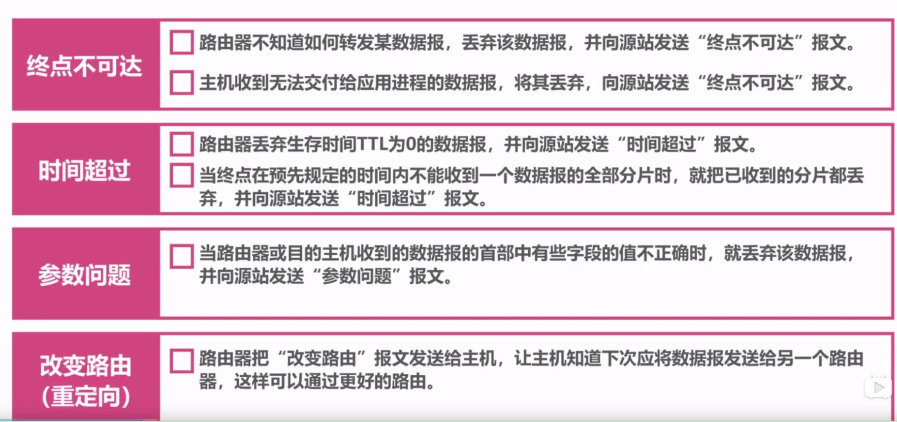

## 计算机网络模型：
TCP/IP 与 OSI 都是为了使网络中的两台计算机能够互相连接并实现通信与回应，但他们最大的不同在于，OSI 是一个理论上的网络通信模型，而 TCP/IP 则是实际上的网络通信标准。

### 一、OSI七层模型：

1. 物理层：实现计算机节点之间比特流的透明传输，规定传输媒体接口的标准，屏蔽掉具体传输介质和物理设备的差异，使数据链路层不必关心网络的具体传输介质，按照物理层规定的标准传输数据就行

2. 数据链路层：通过差错控制、流量控制等方法，使有差错的物理线路变为无差错的数据链路。
    - 数据链路层的几个基本方法：数据封装成桢、透明传输、差错控制、流量控制。
    封装成桢：把网络层数据报加头和尾，封装成帧，帧头中包括源MAC地址和目的MAC地址。
    透明传输：零比特填充、转义字符。
    差错控制：接收者检测错误,如果发现差错，丢弃该帧，差错控制方法有 CRC 循环冗余码
    流量控制：控制发送的传输速度，使得接收方来得及接收。传输层TCP也有流量控制功能，但TCP是端到端的流量控制，链路层是点到点（比如一个路由器到下一个路由器）

3. 网络层：实现网络地址与物理地址的转换，并通过路由选择算法为分组通过通信子网选择最适当的路径
    - 网络层最重要的一个功能就是：路由选择。路由一般包括路由表和路由算法两个方面。每个路由器都必须建立和维护自身的路由表，一种是静态维护，也就是人工设置，适用于小型网络；另一种就是动态维护，是在运行过程中根据网络情况自动地动态维护路由表。

4. 传输层：提供源端与目的端之间提供可靠的透明数据传输，传输层协议为不同主机上运行的进程提供逻辑通信。
    - 网络层协议负责的是提供主机间的逻辑通信；
    - 传输层协议负责的是提供进程间的逻辑通信。

5. 会话层：是用户应用程序和网络之间的接口，负责在网络中的两节点之间建立、维持、终止通信。
6. 表示层：处理用户数据的表示问题，如数据的编码、格式转换、加密和解密、压缩和解压缩。
7. 应用层：为用户的应用进程提供网络通信服务，完成和实现用户请求的各种服务。

### 二、TCP/IP模型
TCP/IP协议模型（Transmission Control Protocol/Internet Protocol），包含了一系列构成互联网基础的网络协议，是Internet的核心协议。TCP/IP协议族按照层次由上到下，层层包装。

上图表示了TCP/IP协议中每个层的作用，而TCP/IP协议通信的过程其实就对应着数据入栈与出栈的过程。入栈的过程，数据发送方每层不断地封装首部与尾部，添加一些传输的信息，确保能传输到目的地。出栈的过程，数据接收方每层不断地拆除首部与尾部，得到最终传输的数据。

## 网络层
实现网络地址与物理地址的转换，并通过路由选择算法为分组通过通信子网选择最适当的路径

1. IP地址与物理地址：
物理地址是数据链路层和物理层使用的地址，IP地址是网络层和以上各层使用的地址，是一种逻辑地址，其中ARP协议将IP地址转换成物理地址。

2. ARP地址解析协议的工作原理：
   ARP 是根据 IP 地址获取 MAC 地址的一种协议，核心原理就是广播发送ARP请求，单播发送ARP响应
    （1）每个主机都在自己的ARP缓冲区中建立一个ARP列表，以表示 IP 地址和 MAC 地址之间的对应关系。
    （2）当源主机要发送数据时，先检查ARP列表中是否有该 IP 地址对应的 MAC 地址，如果有，则直接发送数据；如果没有，就向本网段的所有主机发送ARP数据包，用于查询目的主机的MAC地址，该数据包包括的内容有：源主机IP地址，源主机MAC地址，目的主机的IP。
    （3）当本网络的所有主机收到该ARP数据包时，首先检查数据包中的IP地址是否是自己的IP地址，如果不是，则忽略该数据包，如果是，则首先从数据包中取出源主机的IP和MAC地址写入到ARP列表中，如果已经存在，则覆盖，然后将自己的MAC地址写入ARP响应包中，告诉源主机自己是它想要找的MAC地址。
    （4）源主机收到 ARP 响应包后，将目的主机的 IP 和 MAC 地址写入ARP列表，并利用此信息发送数据。如果源主机一直没有收到ARP响应数据包，表示ARP查询失败
3. RARP逆地址解析协议：
RARP是逆地址解析协议，作用是完成硬件地址到IP地址的映射，主要用于无盘工作站，因为给无盘工作站配置的IP地址不能保存。工作流程：在网络中配置一台RARP服务器，里面保存着 MAC 地址和 IP 地址的映射关系，当无盘工作站启动后，就封装一个RARP数据包，里面有其MAC地址，然后广播到网络上去，当服务器收到请求包后，就查找对应的MAC地址的IP地址装入响应报文中发回给请求者。因为需要广播请求报文，因此RARP只能用于具有广播能力的网络。

4. DHCP协议：
动态主机配置协议，对 IP地址进行集中管理和分配，提升地址的使用率，通过DHCP协议，可以使客户机自动获得服务器分配的lP地址和子网掩码

5. ICMP协议：
因特网控制报文协议，用于在IP主机、路由器之间传递控制消息（控制消息是指网络通不通、主机是否可达、路由器是否可用等网络本身的消息），确认 IP 包是否成功到达目标地址。因为 IP 协议并不是一个可靠的协议，它不保证数据被送达，当传送IP数据包发生错误，比如主机不可达、路由不可达等等，ICMP协议将会把错误信息封包，然后传送回给主机，给主机一个处理错误的机会。

ICMP报文有两种：差错报告报文和询问报文。以下是4种常见的ICMP差错报告报文

6. 交换机与路由器的区别：
（1）工作所处的OSI层次不一样，交换机工作在OSI第二层数据链路层，路由器工作在OSI第三层网络层；
（2）寻址方式不同：交换机根据MAC地址寻址，路由器根据IP地址寻址；
（3）转发速不同：交换机的转发速度快，路由器转发速度相对较慢。

7. 路由选择协议：
   （1）内部网关协议IGP：
    - RIP(Routing Information Protocol）：是一种动态路由选择协议，基于距离矢量算法，使用“跳数”来衡量到达目标地址的路由距离，并且只与自己相邻的路由器交换信息，范围限制在15跳之内。
    - OSPF：开放最短路径优先协议，使用Dijskra算法计算出到达每一网络的最短路径，并在检测到 链路的情况发生变化时（如链路失效），就执行该算法快速收敛到新的无环路拓扑。
   （2）外部网关协议：
    - BGP：边界网关协议，BGP 是力求寻找一条能够到达目的网络 且 较好的路由，而并非要寻找一条最佳路由。BGP采用路径向量路由选择协议。

