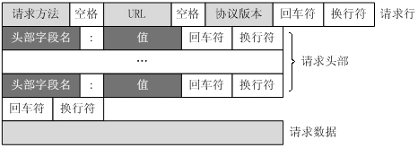
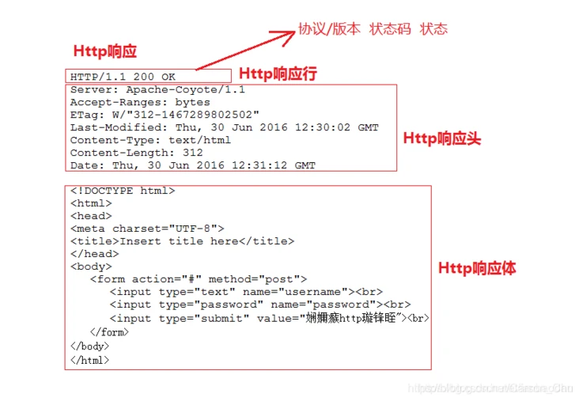

### 一、http协议

HTTP协议客户端请求request消息包括以下格式：`请求行（request line）、请求头部（header）、空行、请求数据`；

服务端响应response也由四个部分组成，分别是：`响应行、响应头、空行、响应体`。

#### 请求方法

HTTP协议定义了多种请求方式，具体如下：
`GET`：**获取资源**，用来请求访问已被URI（统一资源标志符，和URL是包含和被包含的关系）识别的资源。
`POST`：用来**传输实体的主体**，虽然GET也可以实现，但是一般不用。
`PUT`：**传输文件**。但是鉴于PUT方法自身不带验证机制，任何人都可以上传文件，存在安全性问题，因此一般网站都不采用该方法。
`HEAD`:**获得报文首部**。和GET请求一样，只是不返回报文主体部分。
`DELETE`：**删除文件**。同样不带验证机制，存在安全性问题。
`OPTIONS`:**询问指定的请求URI支持哪些方法**。
`TRACE`:**追踪路径**，让Web服务器将之前的请求通信环回给客户端的方法。
`CONNECT`：要求在**与代理服务器通信时建立隧道**，实现隧道协议进行TCP通信。