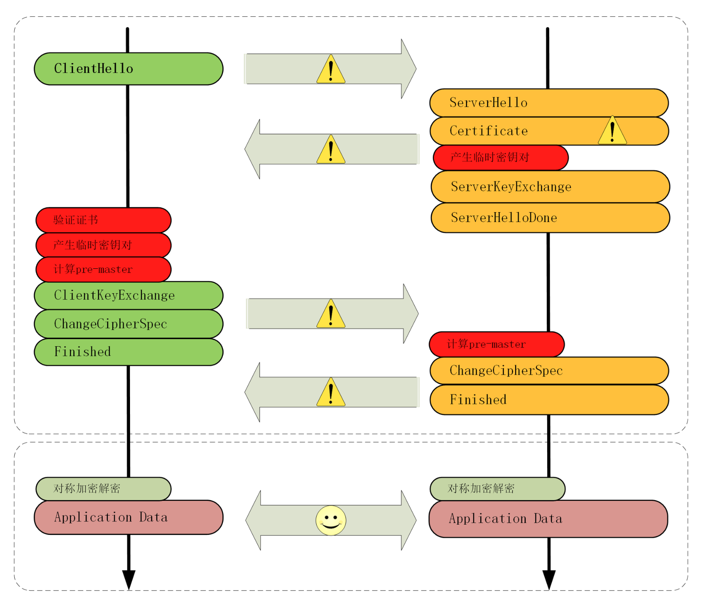
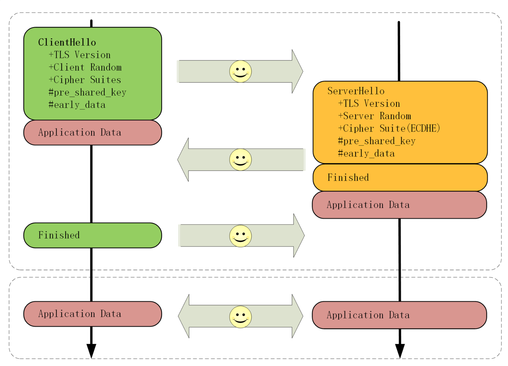

## HTTPS 优化

HTTPS 连接大致上可以划分为两个部分，第一个是建立连接时的非对称加密握手，第二个是握手后的对称加密报文传输。由于目前流行的 AES、ChaCha20 性能都很好，还有硬件优化，报文传输的性能损耗可以说是非常地小，小到几乎可以忽略不计了。

所以，通常所说的“HTTPS 连接慢”指的就是刚开始建立连接的那段时间。这个步骤最长可以花费两个消息往返。而且在握手消息的网络耗时之外，还会有其他的一些“隐形”消耗，比如：

- 产生用于密钥交换的临时公私钥对（ECDHE）；
- 验证证书时访问 CA 获取 CRL 或者 OCSP；
- 非对称加密解密处理“Pre-Master”。

### 一、硬件优化

HTTPS 连接是计算密集型，不是 I/O密集型。

- 可以选择更快的 CPU，最好还内建 AES 优化，这样即可以加速握手，也可以加速传输
- 可以选择 SSL 加速卡，加解密调用它的API，让专门的硬件来做非对称加解密，分担CPU的计算压力。但是 SSL 加速卡也有缺点，比如升级慢、支持算法有限、不能灵活的定制解决方案等
- SSL 加速服务器，用专门的服务器集群来彻底“卸载”TLS 握手时的加密解密计算，性能自然要比单纯的“加速卡”要强大的多

### 二、软件优化

软件升级：把现在正在使用的软件尽量升级到最新版本，比如把 Linux 内核由 2.x 升级到 4.x，把 Nginx 由 1.6 升级到 1.16，把 OpenSSL 由 1.0.1 升级到 1.1.0/1.1.1。由于这些软件在更新版本的时候都会做性能优化、修复错误，只要运维能够主动配合，这种软件优化是最容易做的，也是最容易达成优化效果的。

### 三、协议优化

如果有可能，应当尽量采用 TLS1.3，它大幅度简化了握手的过程，完全握手只要 1-RTT，而且更加安全。

如果暂时不能升级到 1.3，只能用 1.2，那么握手时使用的密钥交换协议应当尽量选用椭圆曲线的 ECDHE 算法。它不仅运算速度快，安全性高，还支持“False Start”（连接未建立完就传输数据），能够把握手的消息往返由 2-RTT 减少到 1-RTT，达到与 TLS1.3 类似的效果

另外，椭圆曲线也要选择高性能的曲线，最好是 x25519，次优选择是 P-256。对称加密算法方面，也可以选用“AES_128_GCM”，它能比“AES_256_GCM”略快一点点。

### 四、证书优化

握手过程中的证书验证也是一个比较耗时的操作，服务器需要把自己的证书链全发给客户端，然后客户端接收后再逐一验证。两个优化点：证书传输、证书验证。

服务器的证书可以选择椭圆曲线（ECDSA）证书而不是 RSA 证书，因为 224 位的 ECC 相当于 2048 位的 RSA，所以椭圆曲线证书的“个头”要比 RSA 小很多，即能够节约带宽也能减少客户端的运算量。

客户端的证书验证其实是个很复杂的操作，除了要公钥解密验证多个证书签名外，因为证书还有可能会被撤销失效，客户端有时还会再去访问 CA，下载 CRL 或者 OCSP 数据，这又会产生 DNS 查询、建立连接、收发数据等一系列网络通信，增加好几个 RTT

CRL（Certificate revocation list，证书吊销列表）由 CA 定期发布，里面是所有被撤销信任的证书序号，查询这个列表就可以知道证书是否有效。但 CRL 因为是“定期”发布，就有“时间窗口”的安全隐患，而且随着吊销证书的增多，列表会越来越大，一个 CRL 经常会上 MB。每次预先下载几M的无用数据才能连接网络不可行。
因此取而代之的是 OCSP（在线证书状态协议，Online Certificate Status Protocol），向 CA 发送查询请求，让 CA 返回证书的有效状态。但 OCSP 也要多出一次网络请求的消耗，而且还依赖于 CA 服务器，如果 CA 服务器很忙，那响应延迟也是等不起的
于是又出来了一个“补丁”，叫“OCSP Stapling”（OCSP 装订），它可以让服务器预先访问 CA 获取 OCSP 响应，然后在握手时随着证书一起发给客户端，免去了客户端连接 CA 服务器查询的时间

因为 OCSP 回增加额外的网络连接成本，所以 Chrome 等浏览器的策略是只对 EV 证书使用 OSCP 检查有效性，普通网站使用 DV、OV 证书省略了这个操作，就会快一点

### 五、会话复用

将算出来的主密钥缓存一下重用，可以免去握手和计算的成本。

1. Session ID 

会话复用分两种，第一种叫“Session ID”，就是客户端和服务器首次连接后各自保存一个会话的 ID 号，内存里存储主密钥和其他相关的信息。当客户端再次连接时发一个 ID 过来，服务器就在内存里找，找到就直接用主密钥恢复会话状态，跳过证书验证和密钥交换，只用一个消息往返就可以建立安全通信。

缺点：服务器必须保存每一个客户端会话数据。对于拥有百万、千万级别用户的网站来说存储量就成了大问题，加重了服务器的负担

2. Session Ticket 方案

类似于 HTTP 的 Cookie，存储的责任由服务器转移到了客户端，服务器加密会话信息，用“New Session Ticket”消息发给客户端，让客户端保存。重连的时候，客户端使用扩展“session_ticket”发送“Ticket”而不是“Session ID”，服务器解密后验证有效期，就可以恢复会话，开始加密通信。

不过“Session Ticket”方案需要使用一个固定的密钥文件（ticket_key）来加密 Ticket，为了防止密钥被破解，保证“前向安全”，密钥文件需要定期轮换，比如设置为一小时或者一天

注意：Session ID 和 Session Ticket 这两种会话复用技术在 TLS 1.3 中均已经被废除，只能使用 PSK 实现会话复用

3. 预共享密钥 “Pre-shared Key” PSK

“False Start”“Session ID”“Session Ticket”等方式只能实现 1-RTT，而 TLS1.3 更进一步实现了“0-RTT”，原理和“Session Ticket”差不多，但在发送 Ticket 的同时会带上应用数据（Early Data），免去了 1.2 里的服务器确认步骤，这种方式叫“Pre-shared Key”，简称为“PSK”

但 PSK 不是完美的，为了追求效率而牺牲了一点安全性，容易收到“重放攻击”（Replay attack）的威胁。黑客可以截取 PSK 的数据，像复读机那样反复向服务器发送。解决办法：只允许安全的 GET/HEAD 方法，在消息里加入时间戳、“nonce”验证，或者“一次性票证”限制重放

常见的对信息安全系统的攻击手段有：重放攻击（Replay attack）和中间人攻击（Man-in-the-middle attack），还有一种叫社会工程学（Social engineering attack），不属于计算机科学或密码学，而是利用人性的弱点

