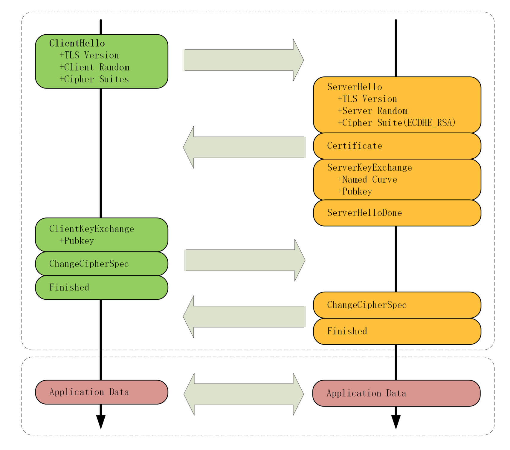
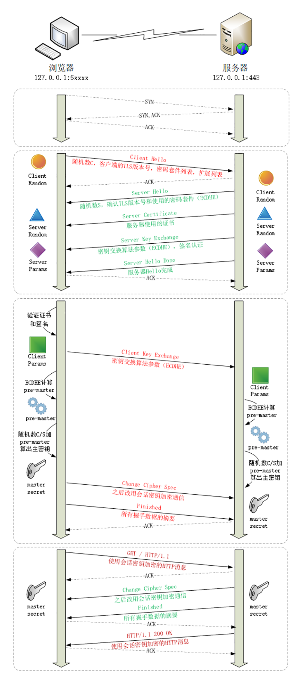
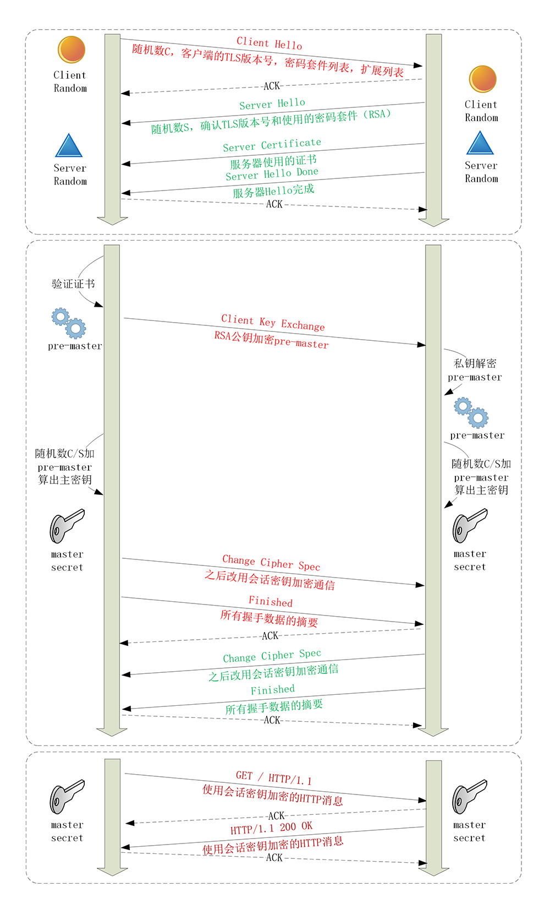

## TLS 1.2 协议

TLS 包含几个子协议，由几个不同职责的模块组成，比较常见的有记录协议、警报协议、握手协议、变更密码规范协议等

- 记录协议：规定了 TLS 收发数据的基本单位：记录（record）。它有点像是 TCP 里的 segment，所有的其他子协议都需要通过记录协议发出。但多个记录数据可以在一个 TCP 包里一次性发出，也并不需要像 TCP 那样返回 ACK。
- 警报协议：职责是向对方发出警报信息，有点像是 HTTP 协议里的状态码。比如，protocol_version 就是不支持旧版本，bad_certificate 就是证书有问题，收到警报后另一方可以选择继续，也可以立即终止连接。
- 握手协议：TLS 里最复杂的子协议，要比 TCP 的 SYN/ACK 复杂的多，浏览器和服务器会在握手过程中协商 TLS 版本号、随机数、密码套件等信息，然后交换证书和密钥参数，最终双方协商得到会话密钥，用于后续的混合加密系统。
- 变更密码规范协议：非常简单，就是一个“通知”（Change Cipher Spec），告诉对方，后续的数据都将使用加密保护。那么反过来，在它之前，数据都是明文的。如下图的 ChangeCipherSpec 出现后，后面的数据就是密文了。



如图，其中每个框都是一个记录，多个记录组合成一个 TCP 包发送。所以，最多经过两次消息往返（4个消息）就可以完成握手，然后就可以在安全的通信环境里发送 HTTP 报文，实现 HTTPS 协议。

### 二、非对称加密 ECDHE 握手过程

ECDHE（ephemeral Elliptic Curve Diffie-Hellman）即短暂-椭圆曲线-迪菲-赫尔曼算法，使用椭圆曲线增强了 DH 算法的安全性和性能，公钥和私钥都是临时生成的。



1. 在 TCP 建立连接之后，浏览器会首先发一个“Client Hello”消息，里面有客户端的 TLS 版本号、支持的密码套件、随机数（Client Random），用于后续生成会话密钥。

    ```
    Handshake Protocol: Client Hello
        Version: TLS 1.2 (0x0303)
        Random: 1cbf803321fd2623408dfe…
        Cipher Suites (17 suites)
            Cipher Suite: TLS_ECDHE_RSA_WITH_AES_128_GCM_SHA256 (0xc02f)
            Cipher Suite: TLS_ECDHE_RSA_WITH_AES_256_GCM_SHA384 (0xc030)
    ```

2. 服务器收到“Client hello”后，会返回一个“Server Hello”消息。把版本号对一下，也给出一个随机数（Server Random），然后从客户端的列表里选一个作为本次通信使用的密码套件，如下，本次选择“TLS_ECDHE_RSA_WITH_AES_256_GCM_SHA384”

    ```
    Handshake Protocol: Server Hello
        Version: TLS 1.2 (0x0303)
        Random: 0e6320f21bae50842e96…
        Cipher Suite: TLS_ECDHE_RSA_WITH_AES_256_GCM_SHA384 (0xc030)
    ```

    选择的 TLS 密码套件 Cipher Suite 意思为：握手时使用非对称加密 ECDHE 算法进行密钥交换，用 RSA 签名和身份认证，握手后的通信使用 AES 对称算法，密钥长度 256 位，分组模式是 GCM，摘要算法 SHA384 用于消息认证和产生随机数

3. 服务端为了证明自己的身份，把证书发给了客户端

4. 因为服务器选择了 ECDHE 算法，所以服务端会在发送证书后发送“Server Key Exchange”消息，里面是椭圆曲线的公钥（Server Params），用来实现密钥交换算法，再加上自己的私钥签名认证（原文内容的摘要，用私钥非对成加密，生成签名。方便对端用公钥解密签名内容，验证内容是否被篡改、是否是目标服务器）。

    ```
    Handshake Protocol: Server Key Exchange
        EC Diffie-Hellman Server Params
            Curve Type: named_curve (0x03)
            Named Curve: x25519 (0x001d)
            Pubkey: 3b39deaf00217894e...
            Signature Algorithm: rsa_pkcs1_sha512 (0x0601)
            Signature: 37141adac38ea4...
    ```

5. 发送“Server Hello Done”消息，意味着服务端的信息发送完了。这样第一个消息往返就结束了（两个TCP包），结果是客户端和服务端通过明文共享了三个信息：Client Random、Server Random 和 Server Params

6. 客户端拿到服务器的证书，需要验证这个证书是否真实有效。开始走证书链逐级验证，确认证书的真实性，在用证书公钥验证签名，就确认了服务器的身份。

7. 客户端按照密码套件的要求，也生成了一个椭圆曲线的公钥（Client Params），用“Client Key Exchange”消息发给服务器。

    ```
    Handshake Protocol: Client Key Exchange
        EC Diffie-Hellman Client Params
            Pubkey: 8c674d0e08dc27b5eaa…
    ```

    现在客户端和服务器手里都拿到了密钥交换算法的两个参数（Client Params、Server Params），然后使用 ECDHE 算法算出随机数 “Pre-Master”，然后用 Client Random、Server Random 和 Pre-Master 三个值作为原材料，用 PRF 伪随机数函数计算出主密钥 Master Secret。

    ```
    master_secret = PRF(pre_master_secret, ClientHello.random,  ServerHello.random)
    ```

    为什么黑客及时劫持了Client Params、Server Params，也不能算出 Pre-Master ？看看 ECDHE的握手过程

    - 客户端在内存中再生成一个随机值 Ra，计算 ` Pa(x, y) = Ra * Q(x,y)  `其中 Q(x, y) 是全世界公认的某个椭圆曲线算法的基点。将 Pa(x, y) 发送至服务器。其实 Pa(x, y) 就是 Client Params 里的 Pubkey。
    - 服务端在内存中再生成一个随机值 Rb，计算 ` Pb(x, y) = Rb * Q(x,y) ` 。将 Pb(x, y) 发送给客户端。其实 Pb(x, y) 就是 Server Params 的 Pubkey。
    - 客户端计算 ` Sa(x, y) = Ra * Pb(x, y) ` ；服务端计算 ` Sb(x, y) = Rb * Pa(x, y) ` 
    - 算法保证了 Sa = Sb = S，数学上可以证明二者相等，有点类似乘法交换律。提取其中的 S 的 x 向量作为密钥（预主密钥）。

    - 所以会话结束后，相关内存被释放，Pre-Master 被释放，Ra 和 Rb 也被释放，就再也不能重复算出 Master-Secret。这也是 ECDHE 中 E 的由来，E 的意思是 ephemeral 短暂的。同时黑客也拿不到 Pre-Master，所以也就得不到主密钥。
    - 需要注意的是，Server Params 中的 pubkey 和证书中的公钥没有什么关系。在 ECDHE 里，证书里的公钥的功能退化为身份验证，只是用来证明这些请求确实来自服务器。这也是 ECDHE 比 RSA 更安全的原因，因为服务器的公钥不参与 Master-Secret 的过程，哪怕服务器的私钥在未来那一天被泄露了，也无法得知 Master-Secret，这就满足了前向安全。

    Master-Secret 有 48 字节，还会使用 PRF 扩展出更多的密钥，比如客户端发送用的会话密钥（client_write_key）、服务器发送用的会话密钥（server_write_key）等等，避免只用一个密钥带来的安全隐患。这个 Master-Secret 做为对称加密算法的密钥了。

8. 有了主密钥和派生的会话密钥。客户端发送一个 “Change Cipher Spec”，然后再发一个“Finished”消息，把之前所有发送的数据做个摘要，在加密一下，让服务器做个验证。意为告诉服务器，后面该用对称加密算法通信了，用的是打招呼时说的 AES。

9. 服务器也是同样操作，发送 "Change Cipher Spec" 和 “Finished” 消息，双方都验证加密解密 OK，握手正式结束，后面的收发被加密的 HTTP 请求和响应

### 三、非对称加密 RSA 握手过程



大体流程没有变化，只是 Pre-Master 不再需要用算法生成，而是客户端直接生成随机数，然后用服务器的公钥加密，通过“Client key Exchange”消息发送给服务器。服务器再用私钥解密，这样双方也实现了共享三个随机数，就可以生成主密钥。

### 四、双向认证

上面是“单向认证”握手过程，只认证了服务器的身份，而没有认证客户端的身份。这是因为通常单向认证通过后已经建立了安全通信，用账号、密码等简单的手段就能够确认用户的真实身份。

但为了防止账号、密码被盗，有的时候（比如网上银行）还会使用 U 盾给用户颁发客户端证书，实现“双向认证”，这样会更安全。双向认证的流程也只是在“Server Hello Done”之后，“Client Key Exchange”之前，客户端要发送“Client Certificate”消息，服务器收到后也把证书链走一遍，验证客户端的身份。