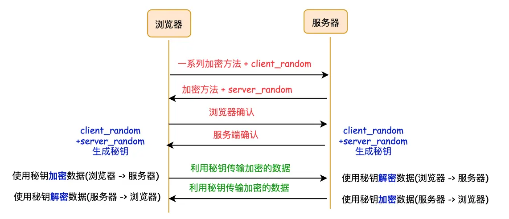
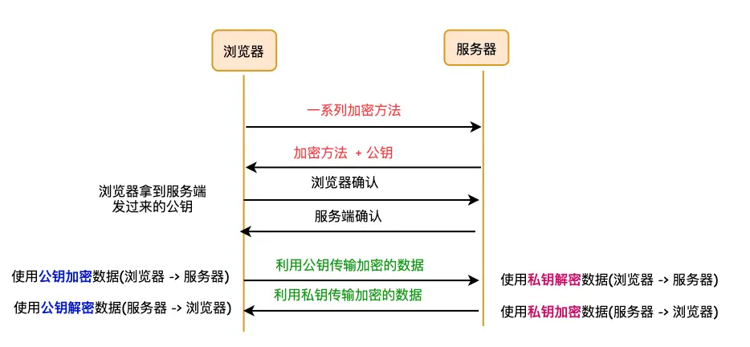
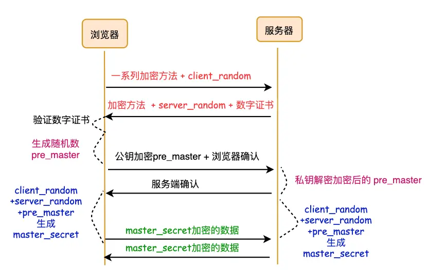
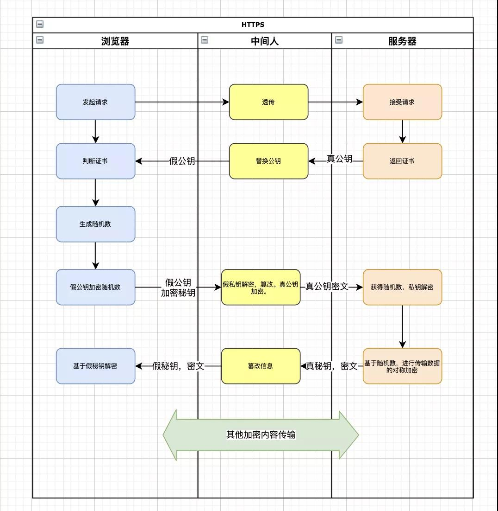

### 一、HTTP 的不足

- 通信使用明文传输，内容可能会被窃听
- 不验证通信方的身份，有可能遭到伪装。服务端和客户端都有可能伪装。
- 无法证明报文的完整性，所以有可能已经遭到篡改。像这样，请求或响应在传输途中遭到攻击者拦截并篡改内容，称为“中间人攻击”

通常认为，如果通信过程具备了四个特性，就可以认为是安全的，四个特性是：机密性、完整性、身份认证和不可否认

- 机密性：对数据的保密，只能由可信的人访问，对其他人是不可见的秘密
- 完整性：也称为一致性，数据在传输过程中没有被篡改，保持原状
- 身份认证：确认对方的真实身份，保证消息只能发送给可信的人。如果通信的另一方是假冒的网站，那么数据再保密也没用，黑客完全可以使用冒充的身体套出各种信息，加密和没有加密一样
- 不可否认：也叫不可抵赖，不能否认已经发生过的行为。保证通信事务的真实性。比如小明借小红一千块，没写借条，第二天否认，小红没有证据只能认倒霉。另一种情况，小明借钱后还给了小红，但没写收条，小红不承认小明还钱的事，还要小明掏一千块。

同时满足机密性、完整性、身份认证、不可否认这四个特性，通信双方的利益才能有保障，才安全。

### 二、HTTPS 的原理

通常 HTTP 通过 TCP 通信，那么 HTTPS 则先与 TLS/SSL 通信，然后 TLS/SSL 再和 TCP 层通信。

### 1. 对称加密

加密和解密使用同一个 “密钥”，称为对称密钥加密。

- 浏览器发送给服务器 “自身支持的加密方法和 client_random”
- 服务器一种加密方法，发送给浏览器，同时发送 server_random
- 现在浏览器和服务器有了三个相同的凭证：client_random、server_random 和加密方法。于是使用这两个随机数 client_random、server_random，通过加密方法，生成密钥。
- 那么接下来的数据报文就通过这个密钥进行加密、解密了

存在问题：第三方可以截获 client_random、server_random 和加密方法。因此数据有报文可能不安全

### 2. 非对称加密

- 浏览器发送给服务器 “自身支持的加密方法”
- 服务器选择一种加密方法，发送给浏览器，同时发送自身的 “公钥”
- 之后浏览器通过公钥将数据加密传输给服务器，服务器收到数据后使用 “私钥” 进行解密。服务器给浏览器发送数据，则使用 “私钥” 进行加密，浏览器收到服务器发送过来的数据，使用公钥进行解密

存在问题：

- **非对称加密效率太低**，这会严重影响加密、解密的效率，进而影响到数据的传输效率
- **无法保证服务器发送给浏览器的数据安全**，服务器的数据只能用私钥进行加密（因为如果他用公钥，那么浏览器没法解密），中间人一旦拿到公钥，那么就可以对服务器传来的数据进行解密了。

### 3. CA（数字证书）

使用对称和非对称加密混合的方式，可以实现了数据的加密传输，但是服务器可能是黑客的服务器。黑客可以在自己的服务器上实现公钥和私钥，而对浏览器来说，他并不知道自己访问的是黑客的站点。

服务器需要证明自己的身份，需要使用权威机构颁发的证书，这个权威机构就是 CA（Certificate Authority），颁发的证书就称为数字证书（Digital Certificate）。

对于浏览器来说，数字证书有两个作用：

- 通过数字证书向浏览器证明服务器的身份
- 数字证书里面包含了服务器公钥

### 4. https 使用 “对称加密+非对称加密+CA证书” 组合

传输数据阶段依然使用对称加密，但是对称加密的密钥采用非对称加密传输。

- 浏览器向服务器发送 client_random 和支持的加密方式列表
- 服务器收到后，返回 server_random 和选择的加密方式，以及数字证书（包含了公钥）
- 浏览器会去验证这个数字证书，证书验证没有问题之后才进行接下来的步骤
- 浏览器会生成另一个随机数 pre_master，并且用公钥加密，传给服务器
- 服务器用私钥解密，得到 pre_master
- 到此为止，服务器和浏览器就有了相同的 client_random、server_random 和 pre_master，然后服务器和浏览器会使用这三组随机数生成对称密钥。有了对称密钥之后，双方就可以使用对称加密的方式来传输数据了

### 三、HTTPS 就绝对安全了吗？

#### 1. 中间人攻击

基于 HTTPS 交互的过程中，在通信的过程中公钥被掉包。也就是说，中间人通过网络劫持，将通信过程中的公钥替换成自己的，然后假装自己是服务器，与客户端进行通信。从而对信息进行窃取或篡改。

我们知道，公钥和证书都是可以自己进行生成，虽然发起了 HTTPS 的请求，但是如果证书和公钥无法保证是否被替换，传输的安全性就无法保证。因此 CA 证书可以检测证书是否可信，证书是否合法。

当浏览器获取到假公钥时，通过对比验证会发现不合法，然后浏览器会提醒用户，访问有风险。但用户仍然授权信任证书继续操作的话，数据就无法保证安全了。

### 2. 本地随机数的安全

在 https 内容传输时，采用的是对称加密，因此密钥在客户端和服务端都有存储。针对本地存储是随机数，https 并不能保证他的安全。https 重点关注的是数据传输过程中的安全。

本地的安全，可以通过安装杀毒软件、浏览器升级修复漏洞的方式来规避。

### 四、HTTPS 的抓包

https 的数据是加密的，常规抓包工具，无法查看加密内容。

通常 https 的抓包工具的原理是：生成一个证书，用户手动将证书安装到客户端，然后客户端发起的所有请求通过该证书完成与抓包工具的交互，然后抓包工具再转发请求到服务器，最后把服务器返回的结果进行输出，从而完成整个请求的闭环。

https 可以防止用户在不知情的情况下通信链路被监听。但是对于主动授权的抓包操作是不提供防护的。因为这个场景用户是已经对风险知情。