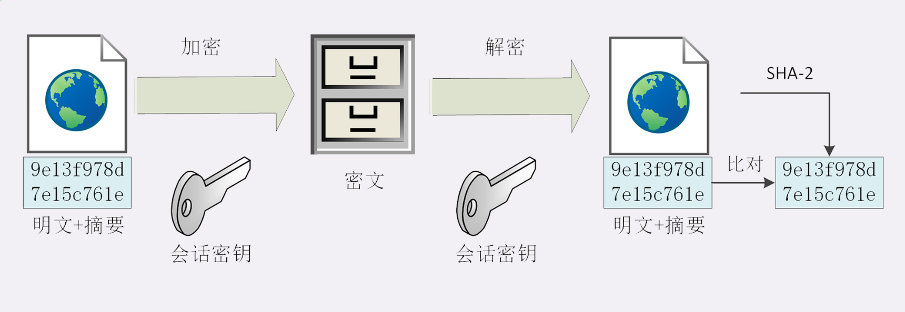
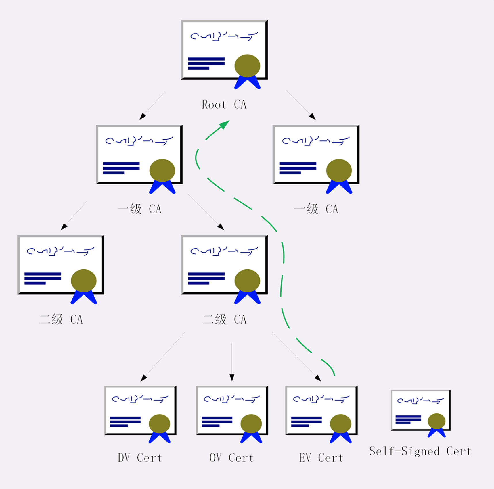

### 通信安全性

http 传输数据是明文的，且是不安全的。整个传输过程完全透明，任何人都能够在链路中截获、修改或者伪造请求/响应报文，数据不具有可信性。对于网络购物、证券交易需要高度信任的应用场景是致命的

通常认为，如果通信过程具备了四个特性，就可以认为是安全的，四个特性是：机密性、完整性、身份认证和不可否认

- 机密性：对数据的保密，只能由可信的人访问，对其他人是不可见的秘密
- 完整性：也称为一致性，数据在传输过程中没有被篡改，保持原状
- 身份认证：确认对方的真实身份，保证消息只能发送给可信的人。如果通信的另一方是假冒的网站，那么数据再保密也没用，黑客完全可以使用冒充的身体套出各种信息，加密和没有加密一样
- 不可否认：也叫不可抵赖，不能否认已经发生过的行为。保证通信事务的真实性。比如小明借小红一千块，没写借条，第二天否认，小红没有证据只能认倒霉。另一种情况，小明借钱后还给了小红，但没写收条，小红不承认小明还钱的事，还要小明掏一千块。

同时满足机密性、完整性、身份认证、不可否认这四个特性，通信双方的利益才能有保障，才安全

### 一、SSL/TLS

HTTPS 加了一层 SSL/TLS 协议层（安全套接层 Secure Sockets Layer），在 OSI 模型中处于第 5 层（会话层）

SSL 有 V2 和 V3 版本，V1 版本有缺陷未公开。互联网工程组 IETF 在 1999年把它改名为 TLS （传输层安全，Transport Layer Security），正式标准化，版本号从 1.0 重新算起，所以 TLS 1.0 就是 SSL 3.1 

TLS 由记录协议、握手协议、警告协议、变更密码规范协议、扩展协议等几个子协议组成，综合使用了对称加密、非对称加密、身份认证等许多密码学前沿技术。浏览器和服务器在使用 TLS 建立连接时需要选择一组恰当的加密算法来实现安全通信，这些算法的组成称为“密码套件”，也叫加密套件。

TLS 的密码套件命名很规范，格式很固定。基本的形式是：密钥交换算法+签名算法+对称加密算法+摘要算法。比如“ECDHE-RSA-AES256-GCM-SHA384”，表示握手时使用 ECDHE 算法进行密钥交换，用 RSA 签名和身份认证，握手后的通信使用 AES 对称算法，密钥长度 256 位，分组模式是 GCM，摘要算法 SHA384 用于消息认证和产生随机数。

### 二、对称加密

对称加密：加密和解密时使用的密钥是同一个。TLS 对称加密算法有很多，比如RC4、DES、3DES、AES、ChaCha20 等，但前三种算法都不安全，禁止使用，目前常用的只有 AES 和 ChaCha20 。
AES 是高级加密标准（Advanced Encryption Standard），密钥长度可以是 128、192 或 256。

ChaCha20 是 google 设计的一种加密算法，密钥长度固定为 256 位。

对称加密有 “分组模式”的概念，可以让算法用固定长度的密钥加密任意长度的明文。最早有 ECB、CBC、CFB、OFB 等几种分组模式，但都存在安全漏洞，最新的分组模式被称为 AEAD（Authenticated Encryption with Associated Data），在加密的同时增加了认证的功能，常用的是 GCM、CCM和 Poly1315。

比如：AES128-GCM 意思为密钥长度为 128 位的 AES 算法，使用分组模式 GCM。

### 三、非对称加密

非对成加密也叫公钥加密算法。他有两个密钥，一个公钥，一个是私钥，他们有单向性，虽然可以用来加密解密。但公钥加密后只能用私钥解密，反过来，私钥加密后也只能用公钥解密。

- RSA 基于“整数分解”的数学难题，使用两个超大素数的乘积作为生成密钥的材料，想要从公钥推算出私钥很困难。现在普遍认为 RSA 密钥的推荐长度至少 2048 位。
- ECC（Elliptic Curve Cryptography）基于“椭圆曲线离散对数”的数学难题，使用特定的曲线方程和基点生成公钥和私钥，子算法 ECDHE 用于密钥交换，ECDSA 用于数字签名。

ECC 相比 RSA，在安全强度和性能上都有明显的优势，160 位的ECC 相当于 1024位的 RSA，224位的 ECC 相当于 2048 位的 RSA，因为密钥短，所以相对的计算量、消耗的内存和宽带也就少，加密解密的性能就高。

#### 四、混合加密

非对成加密速度非常慢，ECC 要比 AES 差上好几个数量级。

TLS 首先使用非对称加密，比如 RSA、ECDHE，解决密钥交换的问题。

混合加密实现了机密性，还需要保证完整性和身份认证等特性，比如黑客伪造身份发布公钥，如果拿到了假的公钥，混合加密就完全失效了。客户以为自己是在和“某宝”通信，实际上另一端可以窃取银行卡号、密码等敏感信息。

### 五、摘要算法

为了实现**完整性**的手段主要是摘要算法，也就是常说的散列函数、哈希函数。可以输入任意长度的数据，得到固定长度、且独一无二的摘要字段串。

像 MD5（Message-Digest 5）、SHA-1（Secure Hash Algorithm 1）就是最常用的摘要算法，能够生成 16 字节和 20 字节长度的数字摘要。但这两个算法的安全强度比较低，不够安全，在 TLS 中已经禁用。目前 TLS 推荐使用 SHA-2。

摘要算法保证了数字摘要和原文是完全等价的，我们只要在原文后附上它的摘要，对端收到后也计算一下原文的摘要，然后进行对比。如果一致，就说明数据没有被修改，这样就保证数据的完整性。不过摘要算法不具有机密性，如果明文传输，那么黑客可以修改消息后把摘要也一起改了，还是无法鉴别完整性，因此真正的完整性必须要建立在机密性之上，在混合加密系统里用会话密钥加密消息和摘要，这样黑客无法得知明文，也无法改动了。这里叫做 哈希消息认证码（HMAC）。

#### 六、数字签名

解决身份认证问题。黑客可以伪装成用户，向网站发送支付、转账等消息，网站没有办法确认用户的身份，钱可能被偷走。可以使用非对成加密中的私钥加上摘要算法，就能够实现数字签名，同时实现身份认证和不可否认。

数字签名是私钥加密，公钥解密。但因为非对称加密效率太低，所以私钥只加密原文的摘要，这样运算量就小很多，而且得到的数字签名很小，方便保管和传输。签名和公钥一样完全公开，任何人都可以获取。但这个签名只有用私钥对应的公钥才能解开，拿到摘要后，再比对原文验证完整性，就可以解决身份认证问题。这里的专业术语叫 签名 和 验签。

因为私钥保密，黑客不能伪造签名，就能够保证通信双方的身份。比如，你用自己的私钥签名一个消息“我是小明”，网站收到后用你的公钥验签，确认身份没有问题，于是也用它的私钥签名消息“我是某宝”。你收到后再用它的公钥验一下，也没问题，这样你和网站都知道对方不是假冒的，后面就可以用混合加密进行安全通信了。

#### 七、数字证书和CA

现在还存在公钥信任的问题，因为大家都可以发布公钥，还缺少防止黑客伪造公钥的手段，无法判断这个公钥就是某宝的公钥。我们需要找一个公认的可信第三方，也就是 CA（Certificate Authority，证书认证机构），由它来给各个公钥签名，用自身的荣誉来保证公钥无法伪造，是可信的。

CA 对公钥的签名认证有一定格式，包含公钥、序列号、用途、颁发者、有效时间等，把这些打成一个包再签名，完整的证明公钥关联的各种信息，形成“数字证书”。

知名的 CA 全世界就那么几家，比如 DigiCert、VeriSign、Entrust、Let’s Encrypt 等，它们签发的证书分 DV、OV、EV 三种，区别在于可信程度。DV 是最低的，只是域名级别的可信，背后是谁不知道。EV 是最高的，经过了法律和审计的严格核查，可以证明网站拥有者的身份（在浏览器地址栏会显示出公司的名字，例如 Apple、GitHub 的网站）

CA 如何证明自己呢？小一点的 CA 可以让大 CA 签名认证，但链条的最后，也就是 Root CA，就只能自己证明自己了，也叫做“自签名证书”或者“根证书”。

有了这个证书体系，操作系统和浏览器都内置了各大 CA 的根证书，上网的时候只要服务器发过来它的证书，就可以验证证书中的签名，顺着证书链一层层的验证，直到找到根证书，就能够确认证书是可信的，从而里面的公钥也是可信的。

证书体系的弱点：

1. 如果 CA 失误或者被欺骗，签发了错误的证书，虽然证书是真的，可它代表的网站是假的。

    解决： CRL（证书吊销列表，Certificate revocation list）和 OCSP（在线证书状态协议，Online Certificate Status Protocol），及时废止有问题的证书

2. 如果 CA 被黑客攻陷，或者 CA 有恶意，因为根证书是信任的源头，整个信任链里的所有证书也就都不可信了。
    解决：因为涉及的证书太多，就只能操作系统或者浏览器从根上撤销对 CA 的信任，列入黑名单，这样它颁发的所有证书都会被认为是不安全的