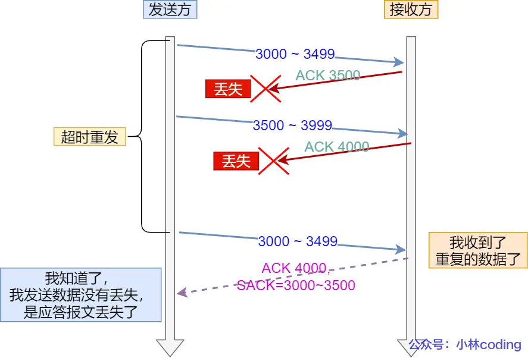

在网络上，TCP 针对数据包丢失的情况，会用重传机制解决。常见的重传机制包括：超时重传、快速重传、SACK、D-SACK。

### 1. 超时重传

在发送数据时，设定一个定时器，当超过指定的时间后，没有收到对方的 ACK 确认应答报文，就会重发该数据。这就是超时重传。一般有两种情况：数据包丢失、确认应答丢失。

**那么超时时间应该设置为多少呢**？

- RTT（`Round-Trip Time`）往返时延。指的是数据发送时刻到接收到确认的时刻的差值。也就是报文的往返时间。
- RTO（`Retransmission Timeout`）超时重传时间。

RTO 的值非常重要，当 RTO 较大时，重传就会很慢，也就是丢了很久之后才重传，效率低，性能差。当 RTO 较小时，有可能数据包并没有丢就重传了，重传变快了，但会增加网络拥塞，导致更多的超时，更多的超时可能会导致更多的重传。

因此，我们可以知道，RTO 的值应该略大于 RTT 的值。实际上，由于我们的网络是时常变化的，于是 RTT 值是经常变化的，那么 RTO 的值应该是一个动态变化的值。

Linux 中计算 RTO 的方式，需要进行采样。

- TCP 通过采样 RTT 的时间，然后进行加权平均，算出一个相对稳定的 RTT 值。而且这个值由于网路状况的变化，会是不断变化的。
- 除了采样 RTT 之外，还要采样 RTT 的波动范围，这样就避免了如果 RTT 有一个大的波动的话，很难被发现的情况。

最后通过一组公式，结合采样的 RTT 时间，计算出 RTO 的值。

我们超时重传的数据，再次超时，又需要重传的时候，TCP 的策略是：将超时时间间隔加倍。也就是每当遇到一次超时重传的时候，都会将下一次超时时间间隔设为先前值的两倍。因为超时重传的数据包都超时了，就说明网络环境比较差，不宜频繁反复发送数据包。

超时重传存在的问题是，超时周期可能相对较长。于是可以使用 “快速重传” 机制来解决超时重传的时间等待。

### 2. 快速重传

TCP 的快速重传机制，他不以时间为驱动，而是以数据为驱动进行重传。

如上图，举个例子。

- 发送方发送了 `seq1` 到 `seq5`，这 5 个数据报文。假如 seq1 发送到了，于是接收端回复一个 ACK2。
- 接下来发送 seq2 的时候，由于某些原因，接收端没有收到。
- 但是 seq3 到达了，接收端还是返回 ACK2。同样的，seq4 和 seq5 都到了，接收端还是返回 ACK2，因为 seq2 还没有收到。
- 发送端收到了三个 `ACK=2` 的确认，由此得知接收端没有收到 seq2，就会在定时器过期之前，重传丢失的 seq2。
- 最后，收到了 seq2，此时因为接收端 seq3、seq4、seq5 都收到了，于是 ACK 返回 6。

因此，快速重传的工作方式是当收到三个相同的 ACK 报文时，会在定时器过期之前，重传丢失的报文段。

**新问题出现：**快速重传其实只解决了超时时间的问题，还有另外一种问题，就是重传的时候，是重传一个报文，还是重传所有的报文。

比如：假设发送方发送了 6 个数据包，编号分别为 `seq1 - seq6`。但是 seq2、seq3 丢失了，那么接收方在收到 `seq4、seq5、seq6` 时，都是回复 `ACK=2` 给发送方，但是发送方并不清楚这连续的 `ACK=2` 是接收方收到那个报文而回复的。因此发送方是选择重传 seq2 一个报文？还是重传 seq2 之后已发送的所有报文呢？

- 如果只选择重传 seq2 这一个报文，那么重传的效率很低。因为对于丢失的 seq3 报文，还得在后续收到三个重复的 `ACK=3` 才能触发重传。
- 如果选择重传 seq2 之后已发送的所有报文，虽然能同时重传已丢失的 seq2 和 seq3 报文。但是 seq4、seq5、seq6 的报文是已经接收过的，重传他们相当于资源浪费。

因此，为了解决不知道该重传那些 TCP 报文，于是就有了 SACK 方法。

### 3. SACK 方法

SACK 也用来实现重传，SACK（`Selective Acknowledgment`）称为 “选择性确认”。

这种方式需要在 TCP 头部选项字段里加一个 SACK 的字段，他可以将已收到的数据的信息发送给“发送方”，这样发送方就可以知道那些数据收到了，那些数据没有收到。知道了此信息之后，发送方只需要重传丢失的数据即可。

如果要使用 SACK，必须双方都支持 SACK 功能。在 Linux 下，可以通过 `net.ipv4.tcp_sack` 参数打开这个功能。

### 4. Duplicate SACK

`Duplicate SACK` 又称为 `D-SACK`，其主要使用了 SACK 来告诉 发送方 有哪些数据被重复接收了。

举一个例子：ACK 丢包

- 发送方发送 `3000 - 3499` 这个区间的数据。发送方再发送 `3500 - 3900` 这个区间的数据。但是这两个 ACK 都丢失了。所以发送方等待超时后，会重传第一个数据包 `3000 - 3499` 这个区间的数据。
- 此时，接收方收到了，并且发现数据是重复收到的，于是回了一个 `(ACK=4000, SACK=3000-3500)` 这样的一个包，告诉发送方，`3000-3500` 的数据早已被接收了，因为 ACK 都到了 4000 了，已经意味着 4000 之前的所有数据都已经收到，所以这个 SACK 就代表着 `D-SACK`。
- 这样，发送方就知道是数据没有丢，而是接收方的 ACK 确认报文丢了。

再举一个例子：网络延时

- 发送方发送了 `500-999` 这个报文，接收端回复 `ACK=1000`。然后发送方发送 `1000-1499` 这个报文，因为网络延时，接收端没有收到。
- 发送方继续发送 `1500-1999` 这个报文，接收端回复 `ACK=1000, SACK=1500-2000`。发送方继续发送 `2000-2499`，接收端回复 `ACK=1000, SACK=1500-2500`。继续发送方发送 `2500-2999` 这个报文，接收端回复 `ACK=1000, SACK=1500-3000`。
- 此时收到三个相同的 ACK 确认报文，就触发了快速重传机制，但是在重传后，被延迟的数据包 `1000 - 1499` 又回到了接收端。
- 此时，接收方回了一个 `ACK=3000, SACK=1000-1500`，这个 SACK 包是 `D-SACK` 包，表示收到了重复的包
- 这样发送方就知道快速重传触发的原因不是发出去的包丢了，也不是因为回应的 ACK 包丢了，而是因为网络延时了。

因此，`D-SACK` 有如下好处：

- 可以让 发送方 知道，是发出去的包丢了，还是接收方回应的 ACK 包丢了
- 可以知道是不是 发送方 的数据包 网络时延比较大
- 可以知道网络中是不是把发送方 的数据包给复制了

在 Linux 下可以通过 `net.ipv4/tcp_dsack` 参数开启或关闭这个功能。