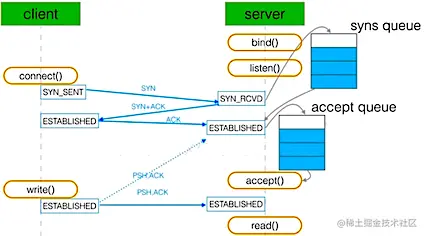

本文我们结合 TCP 的三次握手、四次挥手，来谈一谈 socket 相关的系统调用。

### 一、socket 系统调用

`socket()` ：负责产生一个套接字的描述符

`bind()`：将创建好的 socket 与地址（IP 以及端口）绑定

`listen()`：为接收用户请求做好就绪准备，比如初始化好半连接队列、全连接队列。listen 的第二个参数 backlog 与全连接队列的最大长度有关。

`accept()`：一般情况下，如果没有请求到来，那么服务器会阻塞在 accept 函数上。当有请求时，也就是全连接队列中有已经就绪的连接时，他会返回一个新的描述符。这个新的描述符代表可以与客户端通信的 TCP 连接。

`connect()`：客户端在创建 socket 成功后，使用 connect 发起连接。如果客户端程序没有调用 bind 函数，那么 connect 函数会确定源 IP 地址，并按照一定的算法选择一个临时端口作为源端口。如果是 TCP 连接，那么 connect 函数需要进行 TCP 三次握手，也就是客户端和服务端双方需要建立一些数据结构来维护连接状态。

### 二、三次握手过程




- client 端向 server 端发送 SYN 发起握手，client 端进入 SYN_SENT 状态
- server 端收到 client 端的 SYN 请求后，server 端进入 SYN_RECV 状态，此时内核会将连接存储到半连接队列（`SYN Queue`），并向 client 端回复 `SYN+ACK`
- client 端收到 server 端的 `SYN+ACK` 后，client 端回复 ACK 并进入 ESTABLISHED 状态。
- server 端收到 client 端的 ACK 后，内核将此连接从半连接队列（`SYN Queue`）中取出，添加到全连接队列（`Accept Queue`），server 端进入 ESTABLISHED 状态
- server 端引用程序调用 accept 函数时，将连接从全连接队列（`Accept Queue`）中取出

其中 “全连接队列” 和 “半连接队列” 都有长度大小限制，超过限制时内核会将连接丢弃或者返回 RST 包。

- 半连接队列：只进行了两次握手，还未收到客户端确定 ACK 的连接，会放到半连接队列中
- 全连接队列：三次握手成功的连接，会放到全连接队列中

### 三、全连接队列

#### 1. 查看全连接队列的长度

通过 ss 命令可以查看当前 TCP 全连接队列的信息

```
# -n 不解析服务名称 
# -t 只显示 tcp sockets 
# -l 显示正在监听(LISTEN)的 sockets 

# ss -nlt
State  Recv-Q  Send-Q      Local Address:Port        Peer Address:Port
LISTEN  0      128         127.0.0.1:16308            0.0.0.0:*
LISTEN  0      511         127.0.0.1:33077            0.0.0.0:*
LISTEN  0      128         127.0.0.53%lo:53           0.0.0.0:*
LISTEN  0      128         0.0.0.0:22                 0.0.0.0:*

 # ss -nt
State   Recv-Q       Send-Q       Local Address:Port           Peer Address:Port
ESTAB   0            0            172.18.184.201:55306         10.14.34.213:443
ESTAB   0            0            127.0.0.1:56898              127.0.0.1:33077
ESTAB   0            0            127.0.0.1:33077              127.0.0.1:56898
ESTAB   0            0            127.0.0.1:56948              127.0.0.1:33077
```

对于 LISTEN 状态的 socket：

- Recv-Q：已完成三次握手等待应用程序 accept 的 TCP 连接数量。

  该值最大为：`Send-Q + 1`，即 `min(backlog, somaxconn)+1`

  之所以加 1，是因为操作系统内核的实现中，在判断队列是否已满时，用的是 `>` 号，这导致当已创建成功的连接数量正好等于 `min(backlog, somaxconn)` 时，还会再多创建一个 TCP 连接，最终结果就是 `min(backlog, somaxconn)+1` 

- Send-Q：listen 时，backlog 的大小，其值为 `min(backlog, somaxconn)` 

对于非 LISTEN 状态的 socket：

- Recv-Q：操作系统已收到，但未被应用程序读取的字节数
- Send-Q：已发送给对端应用，但未收到确认的字节数。此时，这些数据依然由操作系统持有

>backlog：是 listen 的第二个参数，即 `int listen(int sockfd, int backlog)`
>
>somaxconn：是一个 OS 级别的参数，由 `/proc/sys/net/core/somaxconn` 指定

### 四、半连接队列

#### 1. 查看半连接队列长度

TCP 半连接时，服务端处于 SYN_RECV 状态的 TCP 连接，就是 TCP 半连接队列。

```
netstat -anpt | grep SYN_RECV | wc -l
```

#### 2. 设置半连接队列大小

半连接队列的大小取决于 `max(64, /proc/sys/net/ipv4/tcp_max_syn_backlog)`

### 五、队列溢出

#### 1. 查看队列溢出

```
# netstat -s | egrep -i "listen|LISTEN"
		189088 times the listen queue of a socket overflowed 
    30140232 SYNs to LISTEN sockets dropped 
```

- overflowed：表示全连接队列溢出的次数
- sockets dropped：表示半连接队列溢出的次数

#### 2. 全连接队列溢出

全连接队列满了之后丢弃请求是默认行为，可以通过设置服务端在全连接队列满的时候，向客户端发送 RST 报文。参数 `tcpabort_on_overflow` 有两种可选值：

- 0：如果全连接队列满了，服务端丢弃客户端的请求
- 1：如果全连接队列满了，服务端向客户端发送 RST 报文，终止 TCP socket 连接

全连接队列溢出时，客户端连接不上服务端：

- 当 `tcpabort_on_overflow=0` 时，服务端会丢掉客户端发送的 ACK（三次握手中第三次客户端向服务端回复的 ACK），而处于 ESTABLISHED 状态的客户端会重发 ACK 请求，如果服务端只是短暂繁忙造成的 accept 队列满。那么当有空位时，服务端收到 ACK 请求后可以成功建立连接
- 当 `tcpabort_on_overflow=1` 时，那么客户端会看到很多 `connection reset by perr` 的错误，这样可以将溢出尽快通知客户端

通常情况下，应当把 `tcpabort_on_overflow` 设置为 0，因为这样更有利于应对突发流量，提高连接建立的成功率。而将 `tcpabort_on_overflow` 设置为 1，可以尽快通知客户端。

#### 3. 半连接队列溢出

半连接队列满了，一般默认情况下会丢弃

### 六、防御 SYN 攻击

- **增大半连接队列**：可以增大 `tcp_max_syn_backlog` 的值，同时也要增大全连接队列，也就是需要增大 `somaxconn` 和 `backlog`
- **开启 tcp_syncookies 功能**：可以在不使用 SYN 半连接队列的情况下成功建立连接。`tcp_syncookies` 参数主要有三个值：
  - 0 值：表示关闭该功能
  - 1 值：表示仅当 SYN 半连接队列放不下时，再启用他
  - 2 值：表示无条件开启此功能
- **减少 SYN+ACK 重传次数**：服务端受到 SYN 攻击时，会有大量处于 `SYN_RECV` 状态的 TCP 连接，处于这个状态的 TCP 会重传 `SYN+ACK`。如果减少 `SYN+ACK` 的重传次数，可以加快处于 `SYN_RECV` 状态的 TCP 连接断开。 

