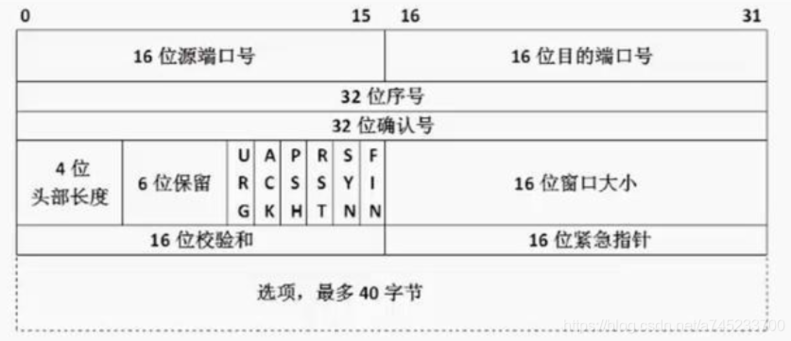
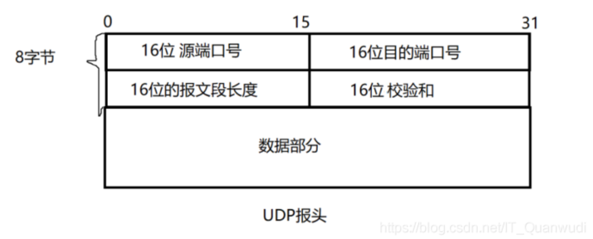
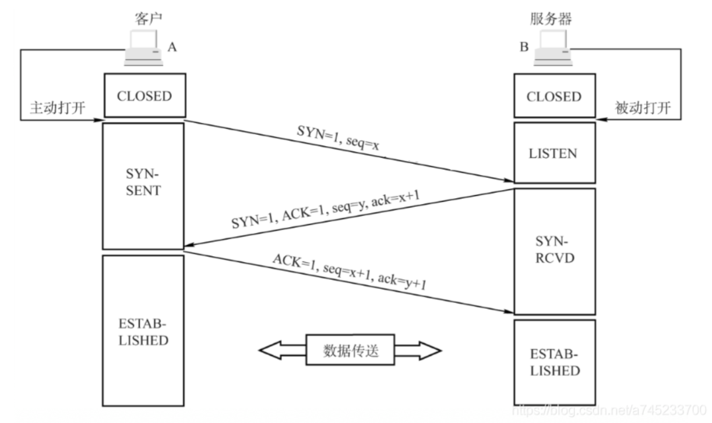
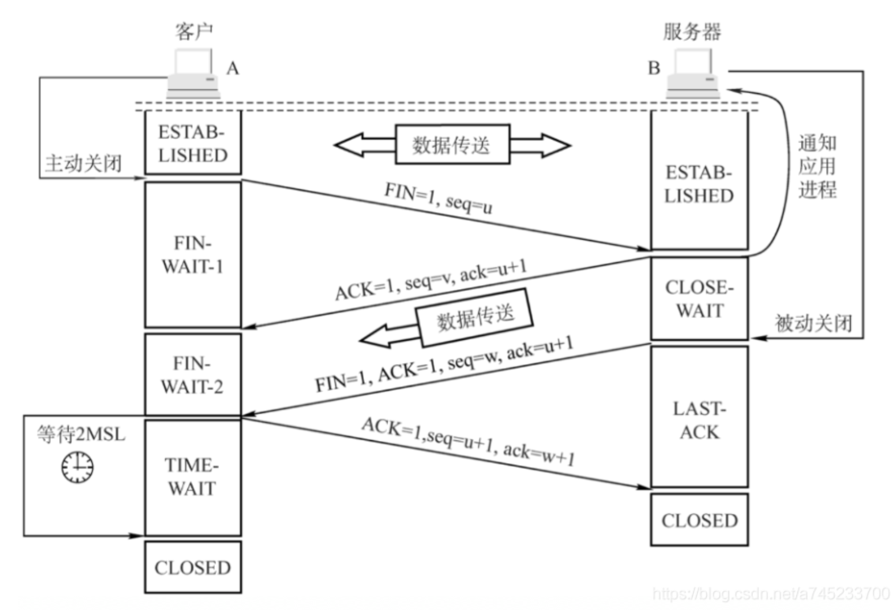
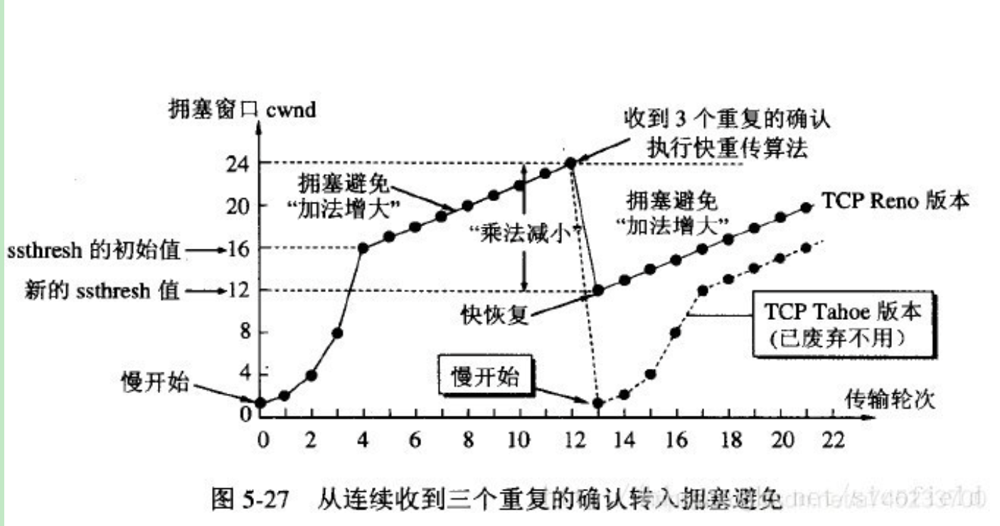

传输层主要提供不同主机上进程间 逻辑通信 + 可靠传输 或者 不可靠传输的功能。

### 一、TCP 和 UDP：

1. 传输控制协议TCP 和 用户数据报协议UDP的区别？
   （1）TCP是面向字节流的，基本传输单位是TCP报文段；UDP是面向报文的，基本传输单位是是用户数据报；
    - 面向字节流：应用程序和TCP的交互是一次一个数据块（大小不等），但TCP把应用程序看成是一连串的无结构的字节流。TCP有一个缓冲，当应用程序传送的数据块太长，TCP就可以把它划分短一些再传送。
    - 面向报文：面向报文的传输方式是应用层交给UDP多长的报文，UDP就照样发送。因此，应用程序必须选择合适大小的报文。
      （2）TCP 注重安全可靠性，连接双方在进行通信前，需进行三次握手建立连接。UDP 是无连接的，使用最大努力交付，即不保证可靠交付。
      （3）UDP 不需要连接等待，所以数据传输快，而 TCP 传输效率相对较低
      （4）TCP首部开销是20个字节；UDP的首部开销是8个字节，这也是减少网络传输开销的一方面
      （5）TCP有拥塞控制和流量控制，而UDP没有拥塞控制和流量控制
      （6）TCP支持点对点通信，提供全双工通信，不提供广播或多播服务；UDP支持一对一、一对多、多对一、多对多的通信模式。

2. TCP 和 UDP 的适用场景：
   （1）当对网络通讯质量要求不高时，并且要求网络通讯速度能尽量的快，这时就可以使用UDP。比如即使通信： 语音、 视频 、直播等
   （2）当对网络通讯质量有要求时，要求整个数据准确无误可靠的传递给对方，这时就适用使用 TCP 协议，一般用于文件传输、发送和接收邮件等场景。比如HTTP、HTTPS、FTP等传输文件的协议，POP、SMTP等邮件传输的协议都是使用 TCP 协议

3. TCP对应的协议：
   FTP：文件传输协议，使用21端口
   Telnet：远程终端接入，使用23端口，用户可以以自己的身份远程连接到计算机上，可提供基于DOS模式下的通信服务。
   SMTP：邮件传送协议，用于发送邮件，使用25端口
   POP3：邮件传送协议，P用于接收邮件。使用110端口
   HTTP：万维网超文本传输协议，是从Web服务器传输超文本到本地浏览器的传送协议
4. UDP对应的协议：
   DNS：域名解析服务，将域名地址转换为IP地址，使用53号端口；
   SNMP：网络管理协议，用来管理网络设备，使用161号端口；
   TFTP：简单文件传输协议，提供不复杂、开销不大的文件传输服务，使用 69 端口；
   NFS：远程文件服务器
   RIP：路由信息协议
   DHCP：动态主机配置协议
   IGMP：网际组管理协议

5. TCP的首部字段

（1）源端口和目的端口：分别占16位，指发送方应用程序的端口和目的方应用程序的端口号，通过 IP 地址 + 端口号就可以确定一个进程地址
（2）序号（Sequense Number，SN）：在一个TCP连接中传送的字节流中的每一个字节都按顺序编号，该字段表示本报文段所发送数据的第一个字节的序号。（初始序号称为 Init Sequense Number, ISN）
    例如，一报文段的序号是 101，共有 100 字节的数据。这就表明：本报文段的数据的第一个字节的序号是 101，最后一个字节的序号是 200。显然，下一个报文段的数据序号应当从 201 开始，即下一个报文段的序号字段值应为 201。
（3）确认号 ack：期望收到对方下一个报文段的第一个数据字节的序号。若确认号为 N，则表明：到序号 N-1 为止的所有数据都已正确收到。
（4）头部长度：指出 TCP报文段的数据起始处 距离 TCP报文段的起始处有多远。这个字段实际上是指出TCP报文段的首部长度。
（5）保留位：占6位，应置为 0，保留为今后使用。
（6）6个控制位：用于说明该报文段的性质：
    - 紧急位URG：当 URG = 1 时，表明此报文段中有紧急数据，是高优先级的数据，应尽快发送，不用在缓存中排队。
        确认ACK：仅当 ACK = 1 时确认号字段才有效，当 ACK = 0 时确认号无效。TCP 规定，在连接建立后所有传送的报文段都必须把 ACK 置为 1。
        推送PSH：接收方收到 PSH = 1 的报文段时，就直接发送给应用进程，而不用等到整个缓冲区都填满了后再向上传送。
        复位RST：当 RST = 1 时，表明 TCP 连接中出现了严重错误（如由于主机崩溃或其他原因），必须释放连接，然后再重新建立传输连接。
        同步SYN：SYN = 1 表示这是一个连接请求或连接接受报文。当 SYN = 1 而 ACK = 0 时，表明这是一个连接请求报文段。对方若同意建立连接，则应在响应的报文段中使 SYN = 1 且 ACK = 1。
        终止FIN：用来释放一个连接。当 FIN = 1时，表明此报文段的发送发的数据已发送完毕，并要求释放运输连接。
        （7）窗口大小：16位，用于控制发送端的滑动窗口大小
        （8）校检和：16位，校验数据段是否未被修改
        （9）紧急指针：16位。

6. UDP报头

### 二、TCP连接的建立与断开：

1. 建立连接的三次握手

（1）第一次握手：客户端向服务端发送一个 SYN 报文（SYN = 1），并指明客户端初始化序列号 ISN，即seq = x，表示本报文所发送的第一个字节的序号。此时客户端处于 SYN_Sent 状态，等待服务端确认。
    三次握手的一个重要功能是客户端和服务端交换 ISN，以便让对方知道接下来接收数据时如何按序列号组装数据。
    ISN 是动态生成的，并非固定，因此每个连接都将具有不同的 ISN。如果 ISN 是固定的，攻击者很容易猜出后续的确认号。

（2）第二次握手：服务端收到数据包后，由 SYN = 1 知道客户端请求建立连接，那么就会对这个TCP 连接分配缓存和变量（缓存指的是一个字节流队列），接着返回一个确认报文：设置 SYN = 1，ACK = 1，同时指定自己的初始化序列号 ISN，即图中的 seq = y，并把客户端的 ISN + 1 作为确认号 ack 的值，表示已经收到了客户端发来的的 SYN 报文，希望收到的下一个数据的第一个字节的序号是 x + 1，此时服务端进入SYN_REVD状态。

（3）第三次握手：客户端收到确认后，检查ACK是否为1，ack是否为 x +1，如果正确，则给服务端发送一个 ACK 报文：设置 ACK = 1，把服务端的 ISN + 1 作为 ack 的值，表示已经收到了服务端发来的 SYN 报文，希望收到的下一个数据的第一个字节的序号是 y + 1，并指明此时客户端的序列号 seq = x + 1，此时客户端和服务器端都进入 ESTABLISHED 状态。完成三次握手，随后Client与Server之间可以开始传输数据了。
此时 SYN 控制位变为 0，表示这不是建立连接的请求了，要正式发数据了。

2. 为什么不能用两次握手进行建立连接？ 
   （1）三次握手目的是确认双方的接收与发送能力是否正常，同步连接双方的初始化序列号 ISN，为后面的可靠性传输做准备。而两次握手只有服务端对客户端的起始序列号做了确认，但客户端却没有对服务端的初始序列号做确认，不能保证传输的可靠性。
   （2）三次握手可以防止已失效的连接请求报文段突然又传送到了服务端，导致服务器错误地建立连接，浪费服务端的连接资源。
    客户端发出的第一个连接请求报文段并没有丢失，而是在某个网络结点长时间的滞留了，以致延误到连接释放以后的某个时间才到达Server。本来这是一个早已失效的报文段，但Server收到此失效的连接请求报文段后：
    - 假设不采用“三次握手”，那么只要Sever发出确认，新的连接就建立了。但由于现在Client并没有发出建立连接的请求，因此不会理睬Server的确认，也不会向Server发送数据。而Server却以为新的连接已经建立，并一直等待Client发来数据，这样，Server的很多资源就白白浪费掉了
    - 而采用“三次握手”协议，只要Server收不到来自Client的确认，就知道Client并没有要求建立请求，就不会建立连接了。

3. 断开连接的四次挥手：

（1）第一次挥手：客户端发送一个 FIN 报文，设置 FIN  = 1 并指定序列号 seq = u（u 是之前传送过来的最后一个字节的序号 + 1），主动关闭 TCP 连接，此时客户端进入FIN_WAIT_1状态；

（2）第二次挥手：服务端收到 FIN 报文后，由FIN=1 知道客户端请求关闭连接，则返回确认报文：设置ACK = 1，ack = u + 1，seq = v（v 的值取决于服务器发送给客户端之前的一个包确认号是多少）
    - 服务端进入CLOSE_WAIT状态，此时TCP连接处于半关闭状态，即客户端不能向服务端发送报文，只能接收，但服务端仍然可以向客户端发送数据。
    - 客户端收到服务端的确认后，进入 FIN_WAIT2 状态，等待服务端发出的连接释放报文段。
（3）第三次挥手：当服务端没有要向客户端发送的数据时，就向客户端发送一个 FIN 报文，设置 FIN = 1 并指定序列号 seq = w（w 的值取决于服务器发送给客户端之前的一个包确认号是多少），用于关闭服务端到客户端的数据传送。此时服务器处于 LAST_ACK 状态

（4）第四次挥手：客户端收到 FIN 报文后，发送给服务端一个 ACK 报文作为应答：设置 ACK=1 和 ack = w +1。发送之后，客户端处于 TIME_WAIT状态，如果服务端接收到这个数据包，则进入CLOSED状态，完成四次挥手。

4. 为什么需要 TIME_WAIT 状态： 
   TIME_WAIT 状态持续 2MSL（最大报文存活时间），约4分钟才转换成CLOSE状态。由于TIME_WAIT 的时间会非常长，因此服务端应尽量减少主动关闭连接，TIME_WAIT 的主要作用有：

（1）重发丢失的 ACK 报文，保证连接可靠的关闭：
    由于网络等原因，无法保证最后一次挥手的 ACK 报文一定能传送给对方，如果 ACK 丢失，对方会超时重传 FIN，主动关闭端会再次响应ACK过去；如果没有 TIME_WAIT 状态，直接关闭，对方重传的FIN报文则被响应一个RST报文，此RST会被动关闭端被解析成错误。同时，服务器就因为接收不到客户端的信息而无法正常关闭。

（2）保证本次连接的重复数据段从网络中消失：
    如果存在两个连接，第一个连接正常关闭，第二个相同的连接紧接着建立；如果第一个连接的某些数据仍然滞留在网络中，这些延迟数据在建立新连接之后才到达，则会干扰第二连接，等待 2MSL 可以让上次连接的报文数据消逝在网络中。

5. 为什么需要四次挥手：
   TCP 是全双工模式，并且支持半关闭特性，提供了连接的一端在结束发送后还能接收来自另一端数据的能力。任何一方都可以在数据传送结束后发出连接释放的通知，待对方确认后进入半关闭状态。当另一方也没有数据再发送的时候，则发出连接释放通知，对方确认后就完全关闭了 TCP 连接。
   通俗的来说，两次握手就可以释放一端到另一端的 TCP 连接，完全释放连接一共需要四次握手。

6. 什么是SYN洪泛：
   SYN 洪泛是指利用 TCP 需要三次握手的特性，攻击者伪造 SYN 报文向服务器发起连接，服务器在收到报文后用 ACK 应答，但之后攻击者不再对该响应进行应答，造成一个半连接。假设攻击者发送大量这样的报文，那么被攻击主机就会造成大量的半连接，耗尽其资源，导致正常的 SYN 请求因为队列满而被丢弃，使得正常用户无法访问。

   半连接队列：服务器第一次收到客户端的 SYN 之后，就会处于 SYN_RCVD 状态，此时双方还没有完全建立其连接，服务器会把这种状态下的请求连接放在一个队列里，我们把这种队列称之为半连接队列。当然还有一个全连接队列，完成三次握手后建立起的连接就会放在全连接队列中。

7. 三次握手过程中是否可以携带数据：
   第三次握手时是可以携带数据的，但第一二次握手时不可以携带数据。
   （1）假如第一次握手可以携带数据的话，那么会放大 SYN 洪泛。如果有人要恶意攻击服务器，每次都在第一次握手中的 SYN 报文中放入大量的数据，然后疯狂重复发送 SYN 报文的话，就会让服务器开辟大量的缓存来接收这些报文，内存会很容易耗尽，从而拒绝服务。
   （2） 第三次握手时客户端已经处于 ESTABLISHED 状态，对于客户端来说，他已经建立起连接了，并且已经知道服务器的接收和发送能力是正常的，所以也就可以携带数据了。

8. TCP的粘包和拆包：
   8.1、什么是拆包粘包：
    拆包粘包在数据链路层、网络层以及传输层都可能存在。而在传输层中，由于UDP有消息保护边界，不会发生粘包拆包问题，因此粘包拆包问题只发生在TCP协议中。TCP是个“流”协议，所谓流，就是没有界限的一串数据。TCP底层并不了解上层业务数据的具体含义，它会根据TCP缓冲区的实际情况进行包的划分，所以在业务上认为，一个完整的包可能会被TCP拆分成多个包进行发送，也有可能把多个小的包封装成一个大的数据包发送，这就是所谓的TCP粘包和拆包问题。

8.2、什么情况先会发生拆包粘包：
（1）应用程序 write 写入的数据字节大于套接口发送缓冲区大小，将会发生拆包现象；
（2）应用程序 write 写入的数据字节小于套接字缓冲区大小，网卡将应用多次写入的数据发送到网络上，这将会发生粘包。
（3）进行MSS大小的TCP分段：程序需要发送的数据大小和TCP报文段能发送MSS（Maximum Segment Size，最大报文长度）是不一样的。大于MSS时，就需要把程序数据拆分为多个TCP报文段，称之为拆包；小于时，则要考虑合并多个程序数据为一个TCP报文段，则是粘包；其中 MSS = TCP报文段长度-TCP首部长度。
（4）接收方法不及时读取套接字缓冲区数据，这将发生粘包。

8.3、拆包粘包问题的解决策略：
（1）在数据尾部增加一个特殊字符进行分割，例如 FTP 协议；
（2）将数据大小设置为固定的，如果数据长度不够，则使用空位补全；
（3）将数据分为两部分，消息头和消息体；其中消息头大小固定，且包含一个字段声明内容体的大小

8.4、网络层 - IP数据报分片：
    MTU 是数据链路层中的网络对数据帧的一个限制（以太网中 MTU 为1500个字节），一个 IP 数据报在以太网中传输，如果它的长度大于 MTU 值，就要进行分片传输，使得每片数据报的长度小于 MTU。而分片传输的 IP 数据报不一定按序到达，但 IP 首部中的信息能让这些数据报片按序组装，IP数据报的分片与重组是在网络层进完成的。

    前面提到，MSS 是 TCP 数据包每次能够传输的最大数据分段，TCP 报文段的长度大于 MSS 时，要进行分段传输。TCP 在建立连接时通常会协商双方的 MSS 值（MSS 选项只出现在 SYN 报文段中，即 TCP 三次握手的前两次）。MSS 的值一般为 MTU 值减去两个首部大小（IP 数据包包头的大小 20 Bytes 和 TCP 数据段的包头 20 Bytes），TCP报文段的分段与重组是在传输层完成的。
    
    如果用链路层以太网，MSS的值往往为1460。而 Internet 上标准的 MTU（最小的 MTU，链路层网络为x2.5时）为576，那么如果不设置，则MSS的默认值就为536个字节。很多时候，MSS的值最好取512的倍数。
    到这里我们就能看出，TCP 分段的原因是 MSS，IP 分片的原因是 MTU，由于一直有 MSS <= MTU，分段后的每一段TCP报文段再加上IP首部后的长度不可能超过MTU，因此也就不需要在网络层进行IP分片了，因此TCP报文段很少会发生IP分片的情况。
    而由于 UDP 数据报不会自己进行分段，因此当长度超过了 MTU 时，会在网络层进行 IP 分片。同样，ICMP（在网络层中）同样会出现IP分片情况。
    所以，总的来说，UDP 不会分段，就由 IP 来分，TCP会分段，当然就不用 IP 来分了！

### 三、TCP可靠性传输：

1. TCP 如何保证可靠性传输：
   （1）三次握手
   （2）应答机制与超时重传：TCP接收端收到发送端的数据时，它将发送一个确认。当TCP发送端发出一个报文段后，它会启动一个定时器，等待接收端的确认报文段，如果不能及时收到一个确认，将重发这个报文段。
   （3）数据包校验与丢弃重复数据：TCP会检测数据在传输过程中的任何变化，若校验出包有错，则丢弃报文段并且不给出响应，这时TCP会超时重发数据；对于重复数据，则进行丢弃；
   （4）对失序数据包进行重排序：既然TCP报文段作为IP数据报来传输，而IP数据报的到达可能会失序，因此TCP报文段的到达也可能会失序。TCP将对失序数据进行重新排序，然后才交给应用层；
   （5）流量控制：TCP 连接的每一方都有固定大小的缓冲空间。TCP 的接收端只允许另一端发送接收端缓冲区所能接纳的数据，防止较快主机致使较慢主机的缓冲区溢出。TCP使用的流量控制协议是可变大小的滑动窗口协议。
   （6）拥塞控制：网络拥塞时，减少数据的发送。

2. TCP的流量控制：
   所谓流量控制就是让发送方的发送速率不要太快，让接收方来得及接收。因为如果发送方把数据发送得过快，接收方可能会来不及接收，这就会造成数据的丢失。TCP的流量控制是通过大小可变的滑动窗口来实现的。接收端将自己可以接收的缓冲区大小放入TCP首部中的“窗口大小”字段，通过ACK报文来通知发送端，滑动窗口是接收端用来控制发送端发送数据的大小，从而达到流量控制

其实发送方的窗口上限，是取值拥塞窗口和滑动窗口两者的最小值。当滑动窗口为 0 时，发送方一般不能再发送数据包，但有两种情况除外，一种情况是可以发送紧急数据，例如，允许用户终止在远端机上的运行进程。另一种情况是发送方可以发送一个 1 字节的数据报来通知接收方重新声明它希望接收的下一字节及发送方的滑动窗口大小。

3. TCP的拥塞控制：
   拥塞控制就是防止过多的数据注入网络中，使网络中的路由器或链路不致过载。发送方维持一个拥塞窗口cwnd 的状态变量。拥塞窗口的大小动态变化，取决于网络的拥塞程度，发送方让自己的发送窗口等于拥塞窗口。只要网络没有出现拥塞，拥塞窗口就再增大一些，以便把更多的分组发送出去。但只要网络出现拥塞，拥塞窗口就减小一些，以减少注入到网络中的分组数。 拥塞控制的方法主要有以下几种：慢启动、拥塞避免、快重传和快恢复。

（1）慢开始算法：当发送主机开始发送数据时，不要一开始就发送大量的数据，因为不清楚网络的拥塞情况，而是试探一下网络的拥塞情况，由小到大逐渐增大发送窗口。在开始发送报文段时先设置cwnd=1，使得发送方在开始时只发送一个报文段，然后每经过一个传输轮次RTT，拥塞窗口 cwnd 就加倍。另外，为了防止拥塞窗口cwnd增长过大引起网络拥塞，还需要设置一个慢开始门限 ssthresh 状态变量。
    当 cwnd < ssthresh 时，使用上述的慢开始算法。
    当 cwnd = ssthresh 时，既可使用慢开始算法，也可使用拥塞控制避免算法。
    当 cwnd > ssthresh 时，停止使用慢开始算法而改用拥塞避免算法。

（2）拥塞避免算法：让拥塞窗口cwnd缓慢地增大，即每经过一个往返时间RTT就把发送方的拥塞窗口cwnd加1。这样拥塞窗口cwnd按线性规律缓慢增长，比慢开始算法的拥塞窗口增长速率缓慢得多。
    无论在慢开始阶段还是在拥塞避免阶段，只要网络出现拥塞（其根据就是没有收到确认），就要把慢开始门限ssthresh设置为出现拥塞时的拥塞窗口值的一半（但不能小于2）。然后把拥塞窗口cwnd 设置为1，执行慢开始算法。这样做的目的就是要迅速减少主机发送到网络中的数据量，使得发生拥塞的路由器有足够时间把队列中积压的数据处理完毕。过程图如下：

（3）快重传：快重传要求接收方在收到一个失序的报文段后就立即发出重复确认（使发送方及早知道有报文段没有到达对方）而不必等到自己发送数据时捎带确认。发送方只要一连收到三个重复确认就应当立即重传对方尚未收到的报文段，而不必继续等待设置的重传计时器时间到期。

接收方收到了M1和M2后都分别发出了确认。现在假定接收方没有收到M3但接着收到了M4。显然，接收方不能确认M4，因为M4是收到的失序报文段。根据可靠传输原理，接收方可以什么都不做，也可以在适当时机发送一次对M2的确认。但按照快重传算法的规定，接收方应及时发送对M2的重复确认，这样做可以让 发送方及早知道报文段M3没有到达接收方。发送方接着发送了M5和M6。接收方收到这两个报文后，也还要再次发出对M2的重复确认。这样，发送方共收到了 接收方的四个对M2的确认，其中后三个都是重复确认。

（4）快恢复：与快重传配合使用的还有快恢复算法，当发送方连续收到三个重复确认时，就执行“乘法减少”算法，把ssthresh门限设置为拥塞窗口cwnd的一半，但是接下去并不执行慢开始算法，而是将cwnd设置为ssthresh的大小，然后执行拥塞避免算法：因为如果网络出现拥塞的话，就不会收到好几个重复的确认，所以发送方现在认为网络可能没有出现拥塞，所以此时并不执行慢开始算法，而是执行拥塞避免算法。

4. 拥塞控制和流量控制的差别：
   （1）相同点：拥塞控制和流量控制的相同点都是控制丢包现象，实现机制都是让发送方发得慢一点。
   （2）不同点：
    - 拥塞控制是一个全局性的过程，防止过多的数据注入到网络中，造成网络拥塞
    - 流量控制指点对点通信量的控制，要做的就是控制发送端发送数据的速率，以便使接收端来得及接受。