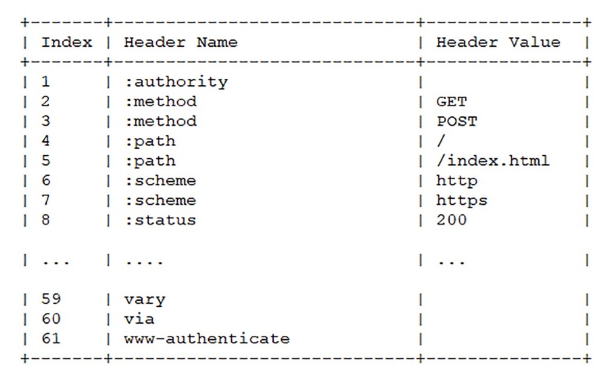
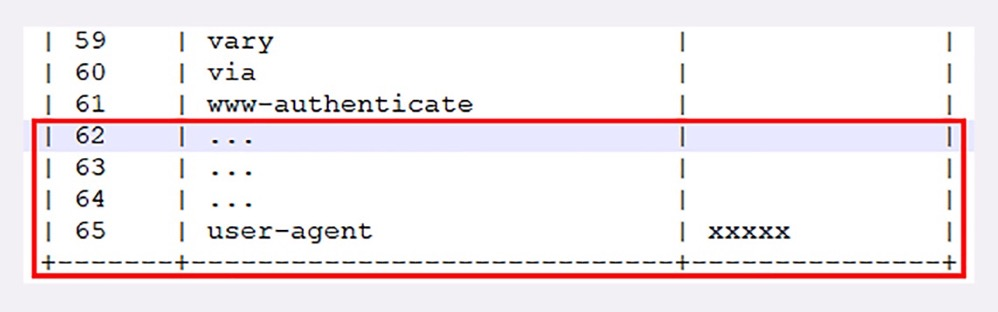
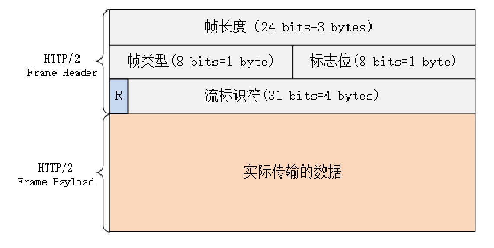
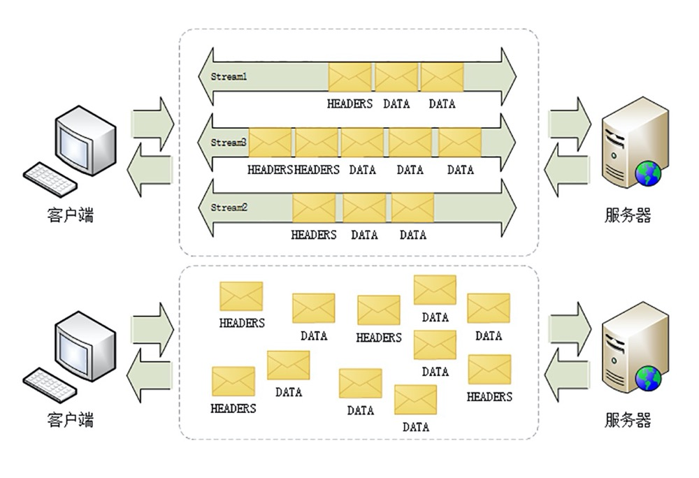
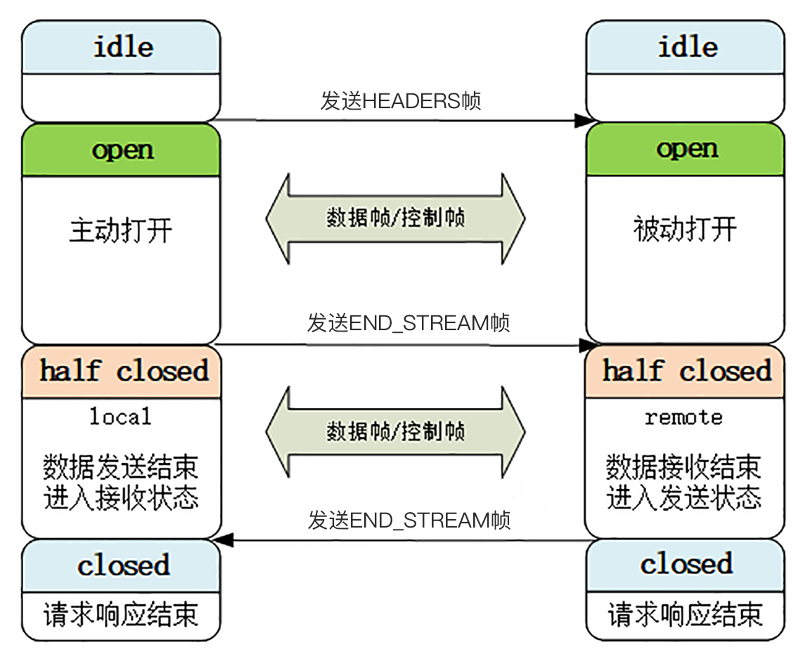
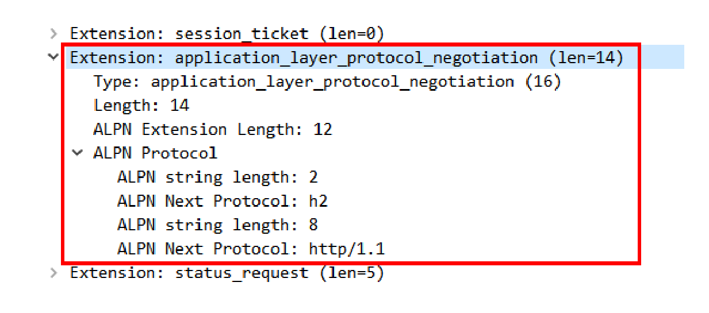
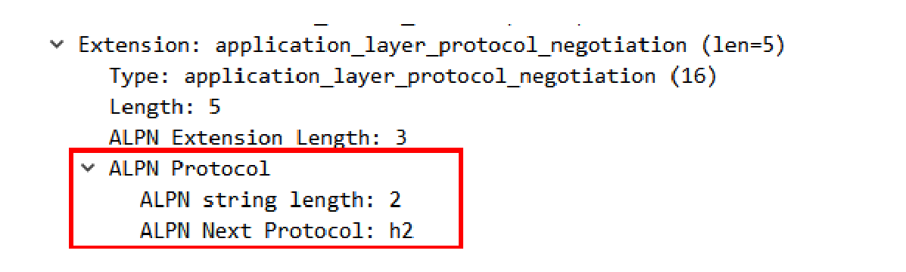

## HTTP2 的特性

### 一、头部压缩

由于报文 Header 一般会携带”User Agent“、”Cookie“、”Accept“、”Server“ 等许多固定的头字段，多达几百字节甚至上千字节，但 Body 却经常只有几十字节（比如 Get 请求、204/301/304响应），而且很多的请求响应报文中有很多字段值都是重复的，非常浪费。因此压缩头部报文是应该的

HTTP2 开发了专门的“HPACK” 算法，专门为压缩 HTTP 头部定制的算法，与 gzip、zlib 等压缩算法不同，它是一个“有状态”的算法，需要客户端和服务器各自维护一份“索引表”，也可以说是“字典”（这有点类似 brotli），压缩和解压缩就是查表和更新表的操作。在客户端和服务器两端建立“字典”，用索引号表示重复的字符串，还采用哈夫曼编码来压缩整数和字符串，可以达到 50%-90% 的压缩率。

为了方便管理和压缩，HTTP/2 废除了原有的起始行概念，把起始行里面的请求方法、URI、状态码等统一转换成了头字段的形式，并且给这些“不是头字段的头字段”起了个特别的名字——“伪头字段”（pseudo-header fields）。而起始行里的版本号和错误原因短语因为没什么大用，顺便也给废除了。为了与“真头字段”区分开来，这些“伪头字段”会在名字前加一个“:”，比如“:authority” “:method” “:status”，分别表示的是域名、请求方法和状态码。那么 HTTP2 报文就简单了，全都是 K-V 形式的字段，于是 HTTP/2 就为一些最常用的头字段定义了一个只读的“静态表”。

如果表中只有 key 没有 value，或者是自定义字段根本找不到该怎么办呢？就要使用到动态表，它添加在静态表后面，结构相同，但会在编码解码的时候随时更新

比如：第一次发送请求时“user-agent”字段长是一百多个字节，用哈夫曼压缩编码发送之后，客户端和服务器都更新自己的动态表，添加一个新的索引号“65”。那么再一次发送的时候就不用再重复发那么多字节啦，只要用一个字节发送编号就好

随着 http2 连接上发送的报文数越来越多，两边的字典也会越来越丰富，最终每次的头部字段都会变成一两个字节的代码，原来上千字节的头用几十个字节就可以表示了，压缩效果比 gzip 要好得多。

### 二、二进制格式

使用二进制，虽然对人不友好，但却大大方便了计算机的解析。原来使用纯文本的时候容易出现多义性，比如大小写、空白字符、回车换行、多字少字等等，程序在处理时必须用复杂的状态机，效率低，还麻烦。二进制中只有 0 或 1，可以严格规定字段大小、顺序、标志位等格式，解析起来没有歧义、实现简单，而且体积小、速度快。

HTTP2 把原来的“Header+Body”的消息“打散”为数个小片的二进制“帧”（Frame），用“HEADERS”帧存放头数据、“DATA”帧存放实体数据。

- 帧开头是 3 个字节的长度（数据的长度，不包含头的 9 个字节），默认上限是 2^14，最大是 2^24，也就是说 http2 的帧通常不超过 16K，最大是 16M
- 帧类型占 1 个字节，大致分为数据帧和控制帧两类，HEADERS 帧和 DATA 帧属于数据帧，存放的是 HTTP 报文，而 SETTINGS、PING、PRIORITY 等则是用来管理流的控制帧。HTTP/2 总共定义了 10 种类型的帧，但一个字节可以表示最多 256 种，所以也允许在标准之外定义其他类型实现功能扩展
- 帧标志占 1 个字节，可以保存 8 个标志位，携带简单的控制信息。常用的标志位有 END_HEADERS 表示头数据结束，相当于 HTTP/1 里头后的空行（“\r\n”），END_STREAM 表示单方向数据发送结束（即 EOS，End of Stream），相当于 HTTP/1 里 Chunked 分块结束标志（“0\r\n\r\n”）
- 流标识符占 4 个字节，也就是帧所属的“流”，接收方使用它就可以从乱序的帧里识别出具有相同流 ID 的帧序列，按顺序组装起来就实现了虚拟的“流”。流标识符虽然有 4 个字节，但最高位被保留不用，所以只有 31 位可以使用，也就是说，流标识符的上限是 2^31，大约是 21 亿

### 三、虚拟的“流”

HTTP/2 为此定义了一个“流”（Stream）的概念，它是二进制帧的双向传输序列，同一个消息往返的帧会分配一个唯一的流 ID。是一个虚拟的“数据流”，在里面流动的是一串有先后顺序的数据帧，在 HTTP/2 连接上，虽然帧是乱序收发的，但只要他们都拥有相同的流 ID，就都属于一个流，同一个流的帧是按照顺序发送的，TCP 保证有序接收，这些数据帧按照次序组装起来就是请求报文和响应报文。

因为“流”是虚拟的，实际上并不存在，所以 HTTP/2 就可以在一个 TCP 连接上用“流”同时发送多个“碎片化”的消息，这就是常说的“多路复用”（ Multiplexing）——多个往返通信都复用一个连接来处理。

在“流”的层面上看，消息是一些有序的“帧”序列，而在“连接”的层面上看，消息却是乱序收发的“帧”。多个请求 / 响应之间没有了顺序关系，不需要排队等待，也就不会再出现“队头阻塞”问题，降低了延迟，大幅度提高了连接的利用率。

为了更好地利用连接，加大吞吐量，HTTP/2 还添加了一些控制帧来管理虚拟的“流”，实现了优先级和流量控制，这些特性也和 TCP 协议非常相似。

HTTP/2 还在一定程度上改变了传统的“请求 - 应答”工作模式，服务器不再是完全被动地响应请求，也可以新建“流”主动向客户端发送消息。比如，在浏览器刚请求 HTML 的时候就提前把可能会用到的 JS、CSS 文件发给客户端，减少等待的延迟，这被称为“服务器推送”（Server Push，也叫 Cache Push）。

HTTP/2 的流的一些特点：

- 流是可并发的，一个 HTTP/2 连接上可以同时发出多个流传输数据，也就是并发多请求，实现“多路复用”
- 客户端和服务器都可以创建流，双方互不干扰
- 流是双向的，一个流里面客户端和服务器都可以发送或接收数据帧，也就是一个“请求-应答”来回
- 流之间没有固定关系，彼此独立，但流内部的帧是有严格顺序的
- 流可以设置优先级，让服务器优先处理，比如先传 HTML/CSS，后传图片，优化用户体验
- 流 ID 不能重用，只能顺序递增，客户端发起的 ID 是奇数，服务端发起的 ID 是偶数
- 在流上发送“RST_STREAM”帧可以随时终止流，取消接收或发送
- 第 0 号流比较特殊，不能关闭，也不能发送数据帧，只能发送控制帧，用于流量控制

还有一些场景：

- HTTP/2 在一个连接上使用多个流收发数据，那么它本身默认就会是长连接，所以永远不需要“Connection”头字段（keepalive 或 close）
- 下载大文件的时候想取消接收，在 HTTP/1 里只能断开 TCP 连接重新“三次握手”，成本很高，而在 HTTP/2 里就可以简单地发送一个“RST_STREAM”中断流，而长连接会继续保持
- ID 用完了该怎么办呢？这个时候可以再发一个控制帧“GOAWAY”，真正关闭 TCP 连接

##### 流状态转换

最开始的时候，流是”空闲“状态。当客户端发送 HEADERS 帧后，有了流ID，流就进入了“打开“状态，两端都可以收发数据，然后客户端发送一个带”END_STREAM“标志位的帧，流就进入了”半关闭“状态。也意味着客户端的请求数据已经发完了，需要接收响应数据，而服务端收到后，进行内部处理，然后发送响应数据。响应数据发送完后，也要带上”END_STREAM“标志位，表示数据发送完毕，这样流两端都进入了”关闭“状态，流就结束了。

流 ID 不能重用，所以流的生命周期就是HTTP/1 里的一次完整的“请求 - 应答”，流关闭就是一次通信结束。下一次再发请求就要开一个新流（而不是新连接），流 ID 不断增加，直到到达上限，发送“GOAWAY”帧开一个新的TCP 连接，流 ID 就又可以重头计数。

### 四、强化安全

为了区分“加密”和“明文”这两个不同的版本，HTTP/2 协议定义了两个字符串标识符：“h2”表示加密的 HTTP/2，“h2c”表示明文的 HTTP/2，多出的那个字母“c”的意思是“clear text”。

在 HTTP/2 标准制定的时候（2015 年）已经发现了很多 SSL/TLS 的弱点，而新的 TLS1.3 还未发布，所以加密版本的 HTTP/2 在安全方面做了强化，要求下层的通信协议必须是 TLS1.2 以上，还要支持前向安全和 SNI，并且把几百个弱密码套件列入了“黑名单”，比如 DES、RC4、CBC、SHA-1 都不能在 HTTP/2 里使用，相当于底层用的是“TLS1.25”。

### 五、应用层协议协商（ALPN）

浏览器如何知道服务器支持 HTTP/2 呢？在 TLS 的扩展中，有一个“ALPN”（Application Layer Protocol Negotiation），用来与服务器就 TLS 上跑的应用协议进行“协商”。客户端在发起“Client Hello”握手的时候，后面会带上一个“ALPN”扩展，里面按照优先顺序列出客户端支持的应用协议。

如下图，最优先的是“h2”，其次是“http/1.1”

服务器看到 ALPN 扩展以后就可以从列表里选择一种应用协议，在“Server Hello”里也带上“ALPN”扩展，告诉客户端服务器决定使用的是哪一种

这样，TLS 握手结束后，客户端和服务端就通过“ALPN”完成了应用层的协议协商，后面就可以使用 HTTP/2 通信了

### 六、HTTP/2 优缺点

优点：

- 完全保持了与 HTTP/1 的兼容，在语义上没有任何变化，也就具有了HTTP/1 的所有优点，基本解决了 HTTP/1 的所有缺点，安全和性能兼顾，可以认为是“更安全的HTTP、更快的 HTTPS”
- 性能方面的改进，影响网络速度的两个关键因素“带宽”和“延迟”，HTTP/2 的头部压缩、多路复用、流优先级、服务器推送等手段其实都是针对这两个要点。在 HTTP/1 里的长连接，虽然是双向通信，但任意一个时间点实际上还是单向的：上行请求时下行空闲，下行响应时上行空闲，再加上“队头阻塞”，实际的带宽还是很浪费的。而 HTTP/2 中的多路复用，多个请求响应并发，每时每刻上下行方向上都有流在传输数据，没有空闲的时候，带宽的利用率能够接近 100%。所以，HTTP/2 只使用一个连接，就能抵得过 HTTP/1 里的五六个连接。
- 如果流之间有依赖，可能会存在等待导致的阻塞，这就是“延迟”。“优先级”可以让客户端告诉服务器，哪个文件更重要，更需要优先传输，服务器就可以调高流的优先级，合理地分配有限的带宽资源，让高优先级的 HTML、图片更快地到达客户端，尽早加载显示。“服务器推送”也是降低延迟的有效手段，它不需要客户端预先请求，服务器直接就发给客户端，这就省去了客户端解析 HTML 再请求的时间。

缺点：

- HTTP/2 在 TCP 级别还是存在“队头阻塞”的问题。所以，如果网络连接质量差，发生丢包，那么 TCP 会等待重传，传输速度就会降低。
- 在移动网络中发生 IP 地址切换的时候，下层的 TCP 必须重新建连，要再次“握手”，经历“慢启动”，而且之前连接里积累的 HPACK 字典也都消失了，必须重头开始计算，导致带宽浪费和时延
- HTTP/2 对一个域名只开一个连接，所以一旦这个连接出问题，那么整个网站的体验也就变差了。这些情况下 HTTP/1 反而不会受到影响，因为它“本来就慢”，而且还会对一个域名开 6~8 个连接，顶多其中的一两个连接会“更慢”，其他的连接不会受到影响。

