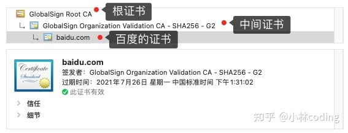
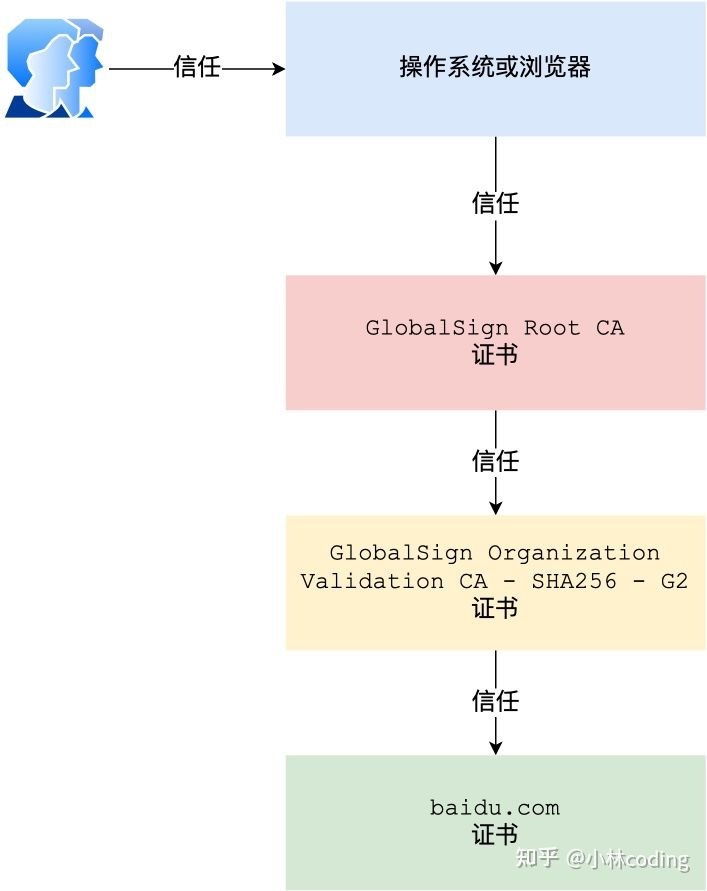

## 浏览器如何验证 HTTPS 证书的合法性

浏览器拿到服务端的数字证书后，如何校验该数字证书是否真实有效呢？

### 一、数字证书和 CA 机构

一个数字证书包含：

- 公钥；
- 持有者信息；
- 证书认证机构（CA）的信息；
- CA 对这份文件的数字签名及使用的算法；
- 证书有效期；
- 还有一些其他额外信息；

那数字证书的作用，是用来认证公钥持有者的身份，以防止第三方进行冒充。说简单些，证书就是用来告诉客户端，该[服务端](https://www.zhihu.com/search?q=服务端&search_source=Entity&hybrid_search_source=Entity&hybrid_search_extra={"sourceType"%3A"answer"%2C"sourceId"%3A1914075935})是否是合法的，因为只有证书合法，才代表服务端身份是可信的。

我们用证书来认证公钥持有者的身份（服务端的身份），那证书又是怎么来的？又该怎么认证证书呢？

为了让服务端的公钥被大家信任，服务端的证书都是由 CA （*Certificate Authority*，证书认证机构）签名的，CA 机构具有极高的可信度，所以由它来给各个公钥签名，信任的一方签发的证书，那必然证书也是被信任的。之所以要签名，是因为签名的作用可以避免中间人在获取证书时对证书内容的篡改。

### 二、数字证书签发和验证流程

CA 签发证书的过程：

- 首先 CA 会把持有者的公钥、用途、颁发者、有效时间等信息打成一个包，然后对这些信息进行 Hash 计算，得到一个 Hash 值
- 然后 CA 会使用自己的私钥将该 Hash 值加密，生成 Certificate Signature，也就是 CA 对证书做了签名
- 最后将 Certificate Signature 添加在文件证书上，形成数字证书

客户端校验服务端的数字证书的过程：

- 首先客户端会使用同样的 Hash 算法获取该证书的 Hash 值 H1
- 通常浏览器和操作系统中集成了 CA 的公钥信息，浏览器收到证书后可以使用 CA 的公钥解密 Certificate Signature 内容，得到一个 Hash 值 H2 
- 最后比较 H1 和 H2，如果值相同，则为可信赖的证书，否则则认为证书不可信

### 三、证书链

但事实上，证书的验证过程中还存在一个证书信任链的问题，因为我们向 CA 申请的证书一般不是根证书签发的，而是由中间证书签发的。比如百度的证书，从下图你可以看到，证书的层级有三级：

对于这种三级层级关系的证书的验证过程如下：

- 客户端收到 [http://baidu.com](https://link.zhihu.com/?target=http%3A//baidu.com) 的证书后，发现这个证书的签发者不是根证书，就无法根据本地已有的根证书中的公钥去验证 [http://baidu.com](https://link.zhihu.com/?target=http%3A//baidu.com) 证书是否可信。于是，客户端根据 [http://baidu.com](https://link.zhihu.com/?target=http%3A//baidu.com) 证书中的签发者，找到该证书的颁发机构是 “GlobalSign Organization Validation CA - SHA256 - G2”，然后向 CA 请求该中间证书
- 请求到证书后发现 “GlobalSign Organization Validation CA - SHA256 - G2” 证书是由 “GlobalSign Root CA” 签发的，由于 “GlobalSign Root CA” 没有再上级签发机构，说明它是根证书，也就是自签证书。应用软件会检查此证书有否已预载于[根证书](https://www.zhihu.com/search?q=根证书&search_source=Entity&hybrid_search_source=Entity&hybrid_search_extra={"sourceType"%3A"answer"%2C"sourceId"%3A1914075935})清单上，如果有，则可以利用根证书中的公钥去验证 “GlobalSign Organization Validation CA - SHA256 - G2” 证书，如果发现验证通过，就认为该中间证书是可信的
- “GlobalSign Organization Validation CA - SHA256 - G2” 证书被信任后，可以使用 “GlobalSign Organization Validation CA - SHA256 - G2” 证书中的公钥去验证 [http://baidu.com](https://link.zhihu.com/?target=http%3A//baidu.com) 证书的可信性，如果验证通过，就可以信任 [http://baidu.com](https://link.zhihu.com/?target=http%3A//baidu.com) 证书

在这三个步骤中，最开始客户端只信任根证书 GlobalSign Root CA 证书的，然后 “GlobalSign Root CA” 证书信任 “GlobalSign Organization Validation CA - SHA256 - G2” 证书，而 “GlobalSign Organization Validation CA - SHA256 - G2” 证书又信任 [http://baidu.com](https://link.zhihu.com/?target=http%3A//baidu.com) 证书，于是客户端也信任 [http://baidu.com](https://link.zhihu.com/?target=http%3A//baidu.com) 证书

总括来说，由于用户信任 GlobalSign，所以由 GlobalSign 所担保的 [http://baidu.com](https://link.zhihu.com/?target=http%3A//baidu.com) 可以被信任，另外由于用户信任操作系统或浏览器的软件商，所以由软件商预载了根证书的 GlobalSign 都可被信任。

为什么 Root CA 不直接颁发证书，而是要那么多中间层呢？这是为了确保根证书的绝对安全性，将根证书隔离的越严格越好，不然根证书如果失守了，那么整个信任链都会有问题。

