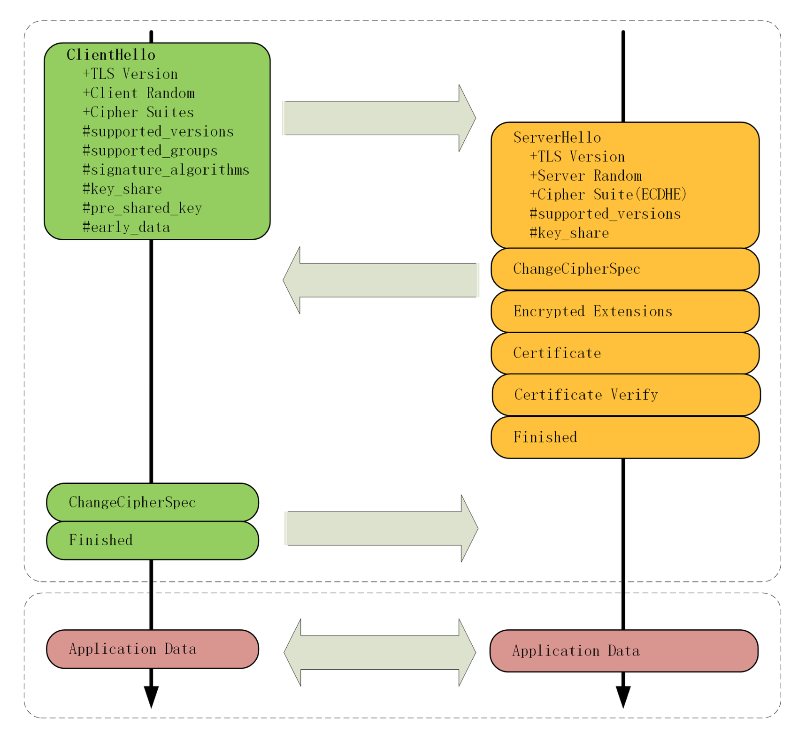
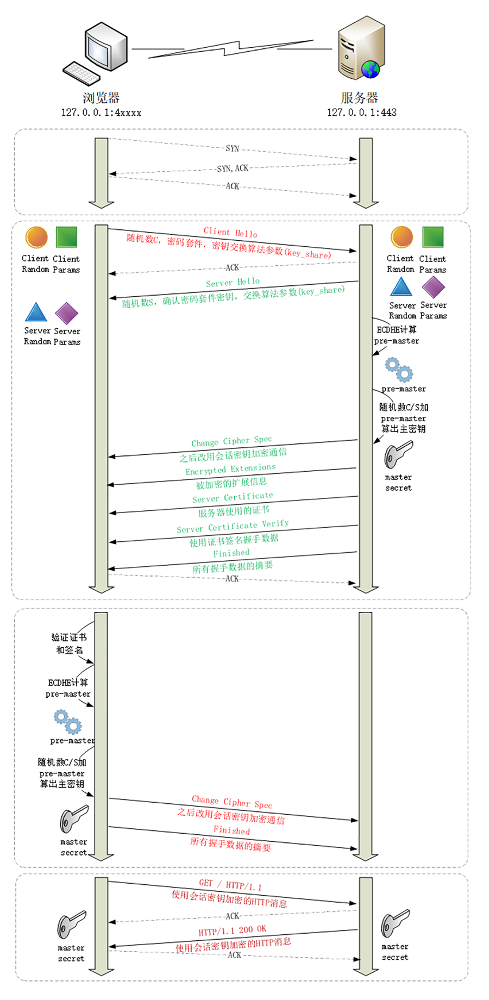

## TLS 1.3 协议

TLS 1.3 主要改进目标：兼容、安全和性能

### 一、最大化兼容

TLS 1.3 为了向前兼容，新增了一个扩展协议，通过在记录末尾添加一系列的“扩展字段”来增加新的功能，老版本的 TLS 不认识它可以直接忽略。

在记录头的Version 字段被兼容性固定的情况下，只要是 TLS 1.3 协议，握手的“Hello”消息后面就必须有“supported_version”扩展，它标记了 TLS 的版本号，使用它就可以区分新旧协议。

### 二、强化安全

TLS 1.2 在十年的应用中发现了很多漏洞和加密算法的弱点。所以在 TLS 1.3 中进行了修补，比如

- 伪随机数函数由 PRF 升级为 HKDF（HMAC-based Extract-and-Expand Key Derivation Function）；
- 明确禁止在记录协议里使用压缩；
- 废除了 RC4、DES 对称加密算法；
- 废除了 ECB、CBC 等传统分组模式；
- 废除了 MD5、SHA1、SHA-224 摘要算法；
- 废除了 RSA、DH 密钥交换算法和许多命名曲线。

TLS1.3 里只保留了 AES、ChaCha20 对称加密算法，分组模式只能用 AEAD 的 GCM、CCM 和 Poly1305，摘要算法只能用 SHA256、SHA384，密钥交换算法只有 ECDHE 和 DHE，椭圆曲线也被“砍”到只剩 P-256 和 x25519 等 5 种

##### 为什么废除 RSA 做密钥交换？

黑客长期收集了混合加密系统收发的所有报文，如果使用 RSA 做密钥交换，一旦私钥泄漏或者被破解，那么黑客就能够使用私钥解密出之前所有报文的“Pre-Master”，在算出会话密钥，破解所有密文。不具备“前向安全”。

而 ECDHE 算法在每次握手时都会生成一对临时的公钥和私钥，每次通信的密钥对都是不同的。保证某一会话被攻击，其他会话也安全。

前向安全的著名案列：2013年斯诺登暴露的“棱镜计划”

### 三、提升性能

在 TLS 1.2 中会多花两个消息往返（2-RTT），可能导致几十毫秒甚至上百毫秒的延迟。TLS 1.3 中因为密码套件大幅度简化，也就没有必要走以前复杂的协商流程，TLS 1.3 压缩了以前的“Hello”协商过程，删除了“Key Exchange”消息，把握手时间减少到了“1-RTT”，效率提升了一倍。

具体的做法利用了扩展。客户端在“Client Hello”消息里直接用“supported_groups” 带上支持的曲线，比如：P-256、x25519 ，用“key_share” 带上曲线对应的客户端公钥参数，用“signature_algorithm” 带上签名算法。服务器收到后在这些扩展里选定一个曲线和参数，在用“key_share”扩展返回服务器这边的公钥参数，就实现了双方的密钥交换。





1. TCP 连接建立后，浏览器首先发一个“Client Hello”。

    因为 TLS 1.3 的消息兼容 1.2 ，所以开头的版本号、支持的密码套件和随机数（Client Random）结构都是一样的（不过此时的随机数是 32 字节）

    ```
    Handshake Protocol: Client Hello
        Version: TLS 1.2 (0x0303)
        Random: cebeb6c05403654d66c2329…
        Cipher Suites (18 suites)
            Cipher Suite: TLS_AES_128_GCM_SHA256 (0x1301)
            Cipher Suite: TLS_CHACHA20_POLY1305_SHA256 (0x1303)
            Cipher Suite: TLS_AES_256_GCM_SHA384 (0x1302)
        Extension: supported_versions (len=9)
            Supported Version: TLS 1.3 (0x0304)
            Supported Version: TLS 1.2 (0x0303)
        Extension: supported_groups (len=14)
            Supported Groups (6 groups)
                Supported Group: x25519 (0x001d)
                Supported Group: secp256r1 (0x0017)
        Extension: key_share (len=107)
            Key Share extension
                Client Key Share Length: 105
                Key Share Entry: Group: x25519
                Key Share Entry: Group: secp256r1
    ```

    注意“Client Hello”里的扩展，“support_versions” 表示 TLS1.3，“support_groups”是支持的曲线，“key_share”是曲线对应的参数。

2. 服务器收到“Client Hello”同样返回“Server Hello”消息，还是要给出一个随机数（Server Random）和选定密码套件

    ```
    Handshake Protocol: Server Hello
        Version: TLS 1.2 (0x0303)
        Random: 12d2bce6568b063d3dee2…
        Cipher Suite: TLS_AES_128_GCM_SHA256 (0x1301)
        Extension: supported_versions (len=2)
            Supported Version: TLS 1.3 (0x0304)
        Extension: key_share (len=36)
            Key Share extension
                Key Share Entry: Group: x25519, Key Exchange length: 32
    ```

    注意扩展，“supoorted_versions” 里确认使用的是用 TLS 1.3，然后在“key_share”扩展带上曲线和对应的公钥参数。

3. 这时交换了两条消息，客户端和服务器就拿到了四个共享消息：Client Random、Server Random、Client Params、Server Params，两边就可以个字用 ECDHE 算出“Pre-Master”，在用 HKDF 生成主密钥“Master-Secret”，效率比 TLS 1.2 提高了一大截。在算出主密钥后，服务器立刻发出“Change Cipher Spec”消息，比 TLS1.2 提早进入加密通信，后面的证书等就都是加密的了，减少了握手时的明文信息泄露

4. TLS 1.3 还有一个安全强化措施，多了一个“Certificate Verify”消息，用服务器的私钥把前面的曲线、套件、参数等握手数据加了签名，作用和“Finished”消息差不多。但由于是私钥签名，所以强化了身份认证和防篡改。

5. 客户端验证服务器证书，再发“Finished”消息，就正式完成了握手，开始收发HTTP 报文。

TLS 1.3 还提供了“降级保护机制”，如果中间人恶意降级到 1.2，服务器的随机数最后 8 个字节会被设置为 “44 4F 57 4E 47 52 44 01”,即“DOWNGRD01”，支持 TLS 1.3 的客户端就就可以检查发现被降级，然后发出警报终止连接。

