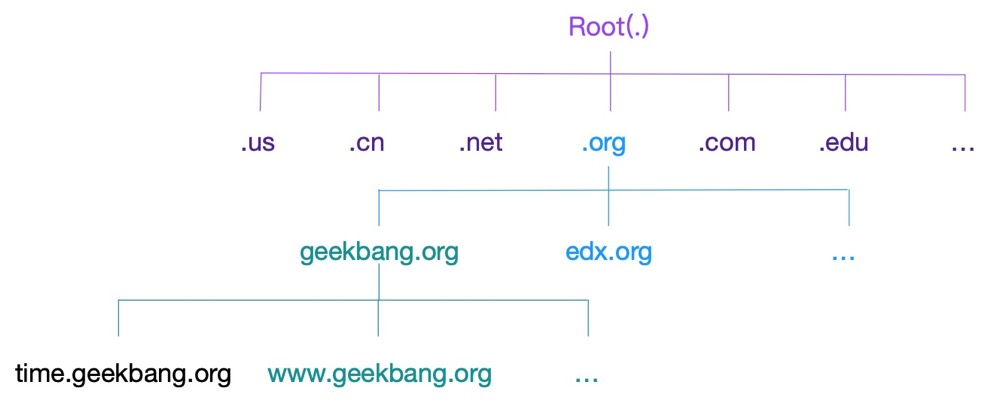
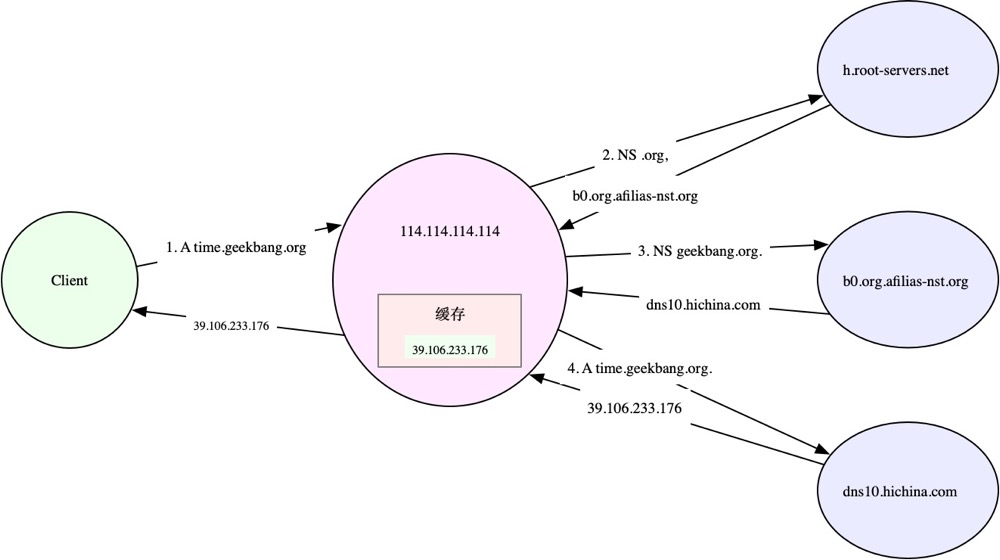

## 一、域名和 DNS 解析

域名的规则：`time.geekbang.org` 在这个域名中，最后面的 `org` 是顶级域名，中间的 `geekbang` 是二级域名，最左边的 `time` 则是三级域名。



- 点（`.`） 是所有域名的根，也就是所有域名都以点作为后缀。在域名解析过程中，所有域名都以点结束

域名解析服务（DNS），对应的服务器就是域名服务器，网络协议则是 DNS 协议。DNS 协议在 TCP/IP 栈中属于应用层，传输基于 UDP 和 TCP（UDP居多），并且域名服务器一般监听在端口 53 上

域名解析其实也是用递归的方式（从顶级开始，依次类推），发送给每个层级的域名服务器，直到得到解析结果。递归查询的过程 DNS 服务器会完成，我们需要配置一个可以的 DNS 服务器。通常，每级 DNS 服务器，都会有最近解析记录的缓存。当缓存命中时，直接用缓存中的记录即可。如果缓存过期或者不存在，才会递归查询。

系统配置 DNS 服务器：`cat /etc/resolv.conf `

DNS 服务通过资源记录的方式，来管理所有数据，它支持 A、CNAME、MX、NS、PTR 等多种类型的记录。比如：

- A 记录，用来把域名转换成 IP 地址；当访问某个网址时，就需要通过 DNS 的 A 记录，查询该域名对应的 IP 地址，然后通过该 IP 来访问 Web 服务
- CNAME 记录，用来创建别名；
- 而 NS 记录，则表示该域名对应的域名服务器地址。

### 1. DNS 访问过程

通过 nslookup 命令就可以查询到这个域名的 A 记录。他的 IP 地址为：39.106.233.17 

```shell
$ nslookup time.geekbang.org
# 域名服务器及端口信息
Server:    114.114.114.114
Address:  114.114.114.114#53

# 非权威查询结果
Non-authoritative answer:
Name:  time.geekbang.org
Address: 39.106.233.17

# 开启 nslookup 的调试
$ nslookup -debug time.geekbang.org

# 使用 time 查看命令执行时间
$ time nslookup time.geekbang.org 
```

由于 `114.114.114.114` 并不是直接管理 `time.geekbang.org` 的域名服务器，所以查询结果是非权威的。

如果没有命中缓存，DNS 查询是一个递归过程，可以使用常见的 DNS 解析工具 dig 展示递归查询的整个过程。

```shell
# +trace表示开启跟踪查询
# +nodnssec表示禁止DNS安全扩展
$ dig +trace +nodnssec time.geekbang.org

; <<>> DiG 9.11.3-1ubuntu1.3-Ubuntu <<>> +trace +nodnssec time.geekbang.org
;; global options: +cmd
.      322086  IN  NS  m.root-servers.net.
.      322086  IN  NS  a.root-servers.net.
.      322086  IN  NS  i.root-servers.net.
.      322086  IN  NS  d.root-servers.net.
.      322086  IN  NS  g.root-servers.net.
.      322086  IN  NS  l.root-servers.net.
.      322086  IN  NS  c.root-servers.net.
.      322086  IN  NS  b.root-servers.net.
.      322086  IN  NS  h.root-servers.net.
.      322086  IN  NS  e.root-servers.net.
.      322086  IN  NS  k.root-servers.net.
.      322086  IN  NS  j.root-servers.net.
.      322086  IN  NS  f.root-servers.net.
;; Received 239 bytes from 114.114.114.114#53(114.114.114.114) in 1340 ms

org.      172800  IN  NS  a0.org.afilias-nst.info.
org.      172800  IN  NS  a2.org.afilias-nst.info.
org.      172800  IN  NS  b0.org.afilias-nst.org.
org.      172800  IN  NS  b2.org.afilias-nst.org.
org.      172800  IN  NS  c0.org.afilias-nst.info.
org.      172800  IN  NS  d0.org.afilias-nst.org.
;; Received 448 bytes from 198.97.190.53#53(h.root-servers.net) in 708 ms

geekbang.org.    86400  IN  NS  dns9.hichina.com.
geekbang.org.    86400  IN  NS  dns10.hichina.com.
;; Received 96 bytes from 199.19.54.1#53(b0.org.afilias-nst.org) in 1833 ms

time.geekbang.org.  600  IN  A  39.106.233.176
;; Received 62 bytes from 140.205.41.16#53(dns10.hichina.com) in 4 ms
```

如上的输出，包括四部分：

- 第一部分，是从 114.114.114.114 查到的一些根域名服务器（.）的 NS 记录
- 第二部分，是从 NS 记录结果中选一个（h.root-servers.net），并查询顶级域名 org. 的 NS 记录
- 第三部分，是从 org. 的 NS 记录中选择一个（b0.org.afilias-nst.org），并查询二级域名 geekbang.org. 的 NS 服务器
- 最后一部分，就是从 geekbang.org. 的 NS 服务器（dns10.hichina.com）查询最终主机 time.geekbang.org. 的 A 记录



### 2. 局域网内部的主机进行域名解析

局域网内部的主机名和 IP 地址的映射关系，可以写入本机的 `/etc/hosts` 文件中。这样指定的主机名就可以在本地直接找到目标 IP

```shell
$ cat /etc/hosts
127.0.0.1   localhost localhost.localdomain
::1         localhost6 localhost6.localdomain6
192.168.0.100 domain.com
```

或者还可以在内网中，搭建自定义的 DNS 服务器，专门解析内网中的域名。而内网 DNS 服务器，一般还会设置一个或多个上游 DNS 服务器，用来解析外网的域名。

### 3. DNS 缓存

如果不使用 DNS 缓存，每次查询都要请求 DNS 服务器。`dnsmasq`  是最常用的 DNS 缓存服务之一，还经常作为 DHCP 服务来使用。

### 4. DNS 优化方法

- 对 DNS 解析的结果进行缓存。缓存是最有效的方法，但要注意，一旦缓存过期，还是要去 DNS 服务器重新获取新记录。不过，这对大部分应用程序来说都是可接受的。
- 对 DNS 解析的结果进行预取。这是浏览器等 Web 应用中最常用的方法，也就是说，不等用户点击页面上的超链接，浏览器就会在后台自动解析域名，并把结果缓存起来。
- 使用 HTTPDNS 取代常规的 DNS 解析。这是很多移动应用会选择的方法，特别是如今域名劫持普遍存在，使用 HTTP 协议绕过链路中的 DNS 服务器，就可以避免域名劫持的问题。
- 基于 DNS 的全局负载均衡（GSLB）。这不仅为服务提供了负载均衡和高可用的功能，还可以根据用户的位置，返回距离最近的 IP 地址。


