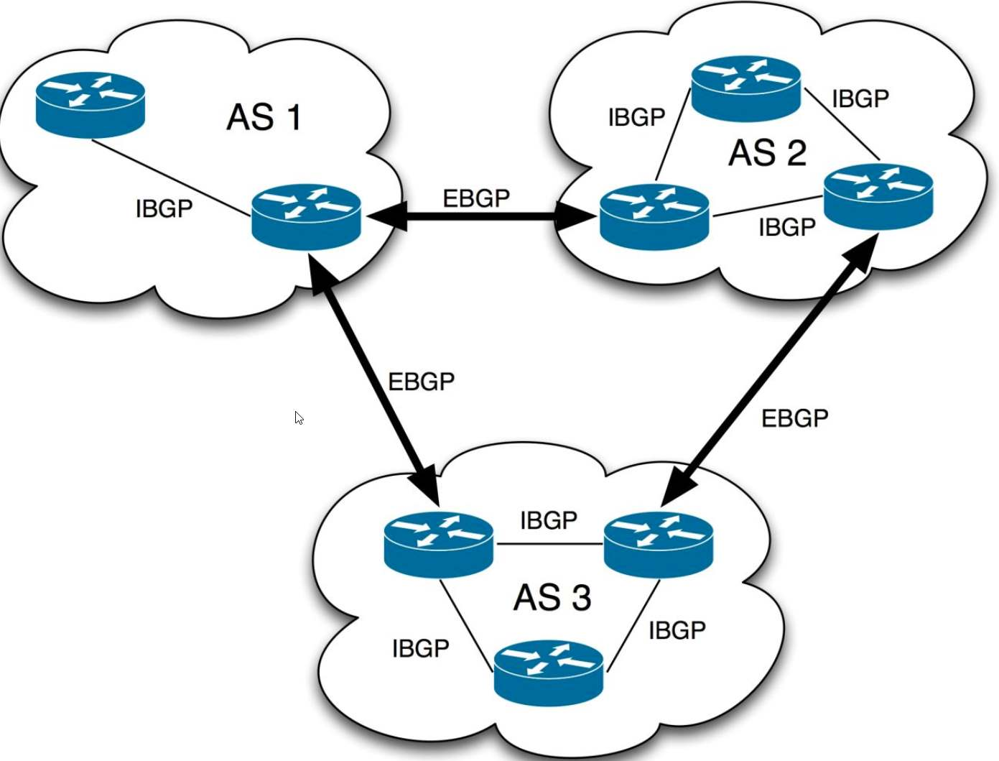

### 一、定义

AS 全称是 Autonomous System，自治系统。指在一个（有时是多个）组织管辖下的所有IP网络和路由器的全体，它们对互联网执行共同的路由策略。也就是说，对于互联网来说，一个AS是一个独立的整体网络。而BGP实现的网络自治也是指各个AS自治。每个AS有自己唯一的编号。

BGP 全称是 Border Gateway Protocol，边界网关协议。是互联网上一个核心的去中心化自治路由协议。是一种实现自治系统AS之间的路由可达，并选择最佳路由的距离矢量路由协议。

BGP 又可以分为 IBGP（Interior BGP，同一个AS之间的连接）和EBGP（Exterior，不同AS之间的BGP连接）

### 二、意义

BGP出现的目的：

- 为方便管理规模不断扩大的网络，网络被分成了不同的自治系统。1982年，外部网关协议EGP（Exterior Gateway Protocol）被用于实现在AS之间动态交换路由信息。
- 但是EGP设计得比较简单，只发布网络可达的路由信息，而不对路由信息进行优选，同时也没有考虑环路避免等问题，很快就无法满足网络管理的要求。
- BGP是为取代最初的EGP而设计的另一种外部网关协议。不同于最初的EGP，BGP能够进行路由优选、避免路由环路、更高效率的传递路由和维护大量的路由信息。
- 虽然BGP用在AS之间传递路由信息，但并非所有AS之间传递路由信息都要运行BGP。如数据中心上行到Internet的出口上，为了避免Internet海量路由对数据中心内部网络影响，设备采用静态路由代替BGP与外部网络通信。

BGP的收益：

- BGP从多方面保证了网络的安全性、灵活性、稳定性、可靠性和高效性：
- BGP采用认证和GTSM的方式，保证了网络的安全性。
- BGP提供了丰富的路由策略，能够灵活的进行路由选路，并且能指导邻居按策略发布路由。
- BGP提供了路由聚合和路由衰减功能用于防止路由振荡，有效提高了网络的稳定性。
- BGP使用TCP作为其传输层协议（端口号为179），并支持BGP与BFD联动、BGP Tracking和BGP GR和NSR，提高了网络的可靠性。
- 在邻居数目多、路由量大且大多邻居有相同出口策略场景下，BGP用按组打包技术极大提高了BGP打包发包性能

