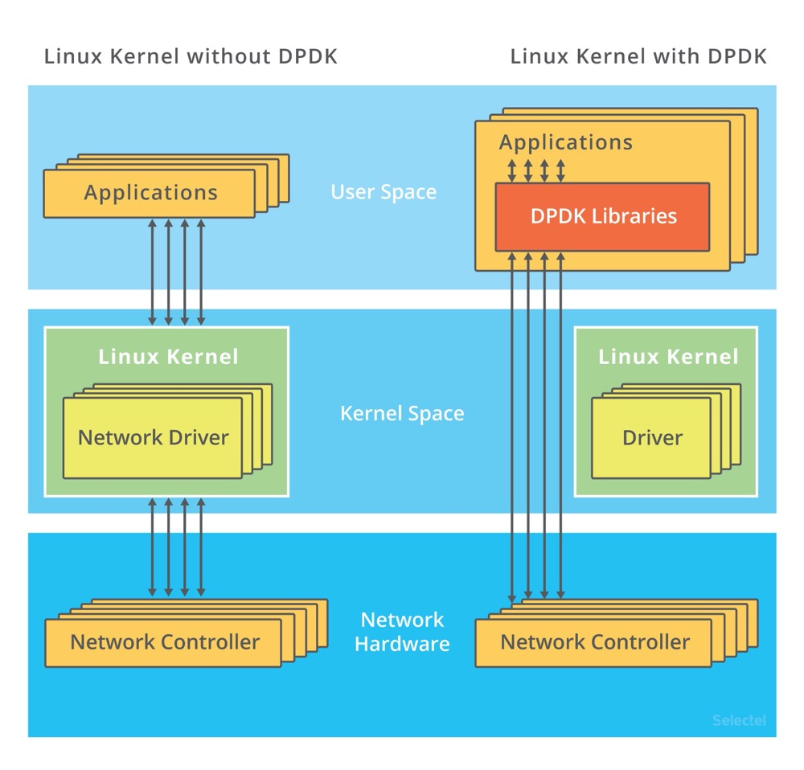
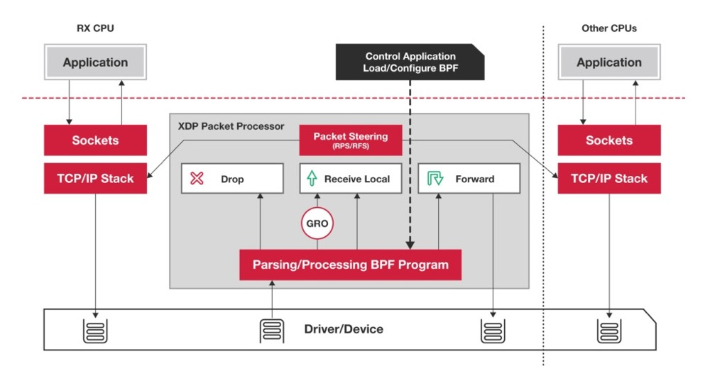

## 一、C10K问题

C10K 和 C1000K 的首字母 C 是 Client 的缩写。C10K 就是单机同时处理 1 万个请求（并发连接 1 万）的问题，而 C1000K 就是单机支持处理 100 万个请求（并发连接 100 万）的问题

对于 C10K 问题，从资源上来说，对 2GB 内存和千兆网卡的服务器来说，同时处理 1w 个请求，只要每个请求处理占用不到 200KB（2GB/1w）的内存和 100Kbit（1000Mbit/1w）的网络带宽就可以。因此物理资源是足够的，接下来就是软件问题，特别是网络的 IO 模型

如何解决： 

IO 模型优化

1. 多路复用，使用非阻塞 IO 和水平触发通知，比如使用 select 和 poll
1. 多路复用，使用非阻塞 IO 和边缘触发通知，比如使用 epoll
1. 使用异步 IO（Asynchronous IO，简称为 AIO），异步 I/O 允许应用程序同时发起很多 I/O 操作，而不用等待这些操作完成。而在 I/O 完成后，系统会用事件通知（比如信号或者回调函数）的方式，告诉应用程序。这时，应用程序才会去查询 I/O 操作的结果。异步 IO 不完善，用的不多

工作模型优化

1. 主进程+多个 worker 子进程。主进程执行 bind() + listen() 后，创建多个子进程；然后在每个子进程中，都通过 accept() 或 epoll_wait()，来处理相同的套接字。比如著名的 Nginx ，会出现惊群问题
2. 监听相同端口的多进程模型。所有进程都监听相同的端口，并且开启 SO_REUSEPORT 选项，由内核负责将请求负载均衡到这些监听进程中。内核确保了只有一个进程被唤醒，就不会出现惊群问题了，需要 Linux 3.9 以上的版本

## 二、C1000K 问题

首先从物理资源使用上来说，100 万个请求需要大量的系统资源：

- 假设每个请求需要 16KB 内存的话，那么总共就需要大约 15 GB 内存。
- 而从带宽上来说，假设只有 20% 活跃连接，即使每个连接只需要 1KB/s 的吞吐量，总共也需要 1.6 Gb/s 的吞吐量。千兆网卡显然满足不了这么大的吞吐量，所以还需要配置万兆网卡，或者基于多网卡 Bonding 承载更大的吞吐量。

其次，从软件资源上来说，大量的连接也会占用大量的软件资源，比如文件描述符的数量、连接状态的跟踪（CONNTRACK）、网络协议栈的缓存大小（比如套接字读写缓存、TCP 读写缓存）等等

最后，大量请求带来的中断处理，也会带来非常高的处理成本。这样，就需要多队列网卡、中断负载均衡、CPU 绑定、RPS/RFS（软中断负载均衡到多个 CPU 核上），以及将网络包的处理卸载（Offload）到网络设备（如 TSO/GSO、LRO/GRO、VXLAN OFFLOAD）等各种硬件和软件的优化

C1000K 的解决方法，本质上还是构建在 epoll 的非阻塞 I/O 模型上。只不过，除了 I/O 模型之外，还需要从应用程序到 Linux 内核、再到 CPU、内存和网络等各个层次的深度优化，特别是需要借助硬件，来卸载那些原来通过软件处理的大量功能

## 三、C10M 问题

无论如何优化应用程序和内核中的各种网络参数，想实现 1000w 请求的并发，都是极其困难的。究其根本，还是 Linux 内核协议栈做了太多太繁重的工作。从网卡中断带来的硬中断处理程序开始，到软中断中的各层网络协议处理，最后再到应用程序，这个路径实在是太长了，就会导致网络包的处理优化，到了一定程度后，就无法更进一步了。

要解决这个问题，最重要就是跳过内核协议栈的冗长路径，把网络包直接送到要处理的应用程序那里去。这里有两种常见的机制，DPDK 和 XDP。

第一种机制，DPDK，是用户态网络的标准。它跳过内核协议栈，直接由用户态进程通过轮询的方式，来处理网络接收。

由于采用轮询的方式，查询时间明显多于实际工作时间的情况会比较低效。如果每时每刻都有新的网络包需要处理，轮询的优势就很明显了。比如：

- 在 PPS 非常高的场景中，查询时间比实际工作时间少了很多，绝大部分时间都在处理网络包；
- 而跳过内核协议栈后，就省去了繁杂的硬中断、软中断再到 Linux 网络协议栈逐层处理的过程，应用程序可以针对应用的实际场景，有针对性地优化网络包的处理逻辑，而不需要关注所有的细节。

此外，DPDK 还通过大页、CPU 绑定、内存对齐、流水线并发等多种机制，优化网络包的处理效率。

第二种机制，XDP（eXpress Data Path），则是 Linux 内核提供的一种高性能网络数据路径。它允许网络包，在进入内核协议栈之前，就进行处理，也可以带来更高的性能。XDP 底层跟我们之前用到的 bcc-tools 一样，都是基于 Linux 内核的 eBPF 机制实现的

XDP 对内核的要求比较高，需要的是 Linux 4.8 以上版本，并且它也不提供缓存队列。基于 XDP 的应用程序通常是专用的网络应用，常见的有 IDS（入侵检测系统）、DDoS 防御、 cilium 容器网络插件等

实际上，在大多数场景中，我们并不需要单机并发 1000w 的请求，通过调整系统架构，把这些请求分发到多台服务器中来处理，利用分布式即可。

