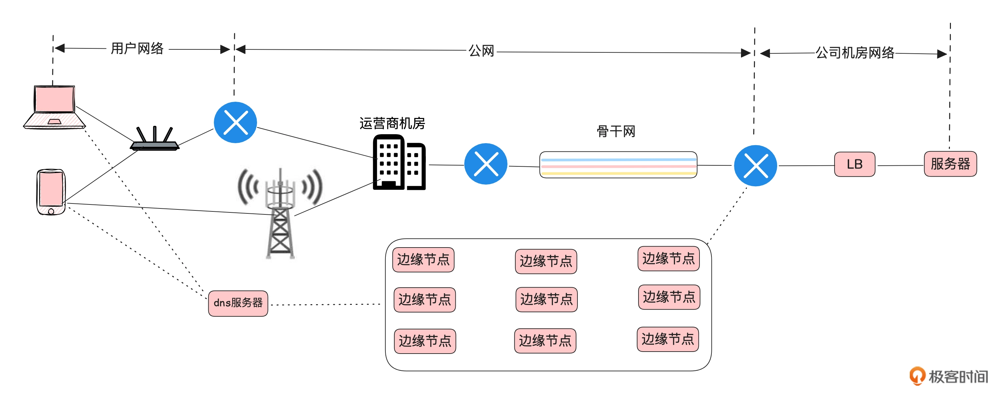

数据包如何在网络中传输呢？

#### 第一步，进行**域名解析**，将域名转换为 IP 地址。

#### 第二步，建立连接，包括 SSL/TLS 连接、TCP连接。

在发送方，用户程序需要传输的数据会经过逐层封装。首先添加应用层的 HTTP Header，然后是传输层的 TCP Header，接着是网络层的 IP Header，最后在链路层添加以太网帧的帧头和帧尾，包括源MAC地址、目的MAC地址等链路层信息。最终形成网络中传输的完整数据包。

在接收方，数据包会按照相反的顺序逐层解封装。接收设备从链路层开始解析数据，依次解读网络层、传输和应用层的信息，最后将数据传输给接收方的应用程序。

#### 第三步，穿过客户端局域网

网络设备通常通过交换机组成局域网，再借助路由器等转发设备与其他局域网通信。在局域网内，可以通过ARP广播实现从IP地址到MAC地址的查找。

- 如果目标IP地址和发起方的IP地址属于同一子网，就可以通过 ARP 查询到对方的MAC地址，并将网络包发送给对方。
- 如果目标IP地址不在同一子网，就需要根据路由表查询，找到发往目标IP的下一跳设备的MAC地址，将网络包发送给下一跳设备，由它继续转发至最终目的地。

ARP广播：查询同一个子网里面IP地址对应的MAC地址。设备会广播一条ARP请求，询问某个IP的MAC地址是谁？这条广播信息会在同一个子网传播，当对应IP设备收到后，就告知对方的MAC地址。

通过 `traceroute 93.184.215.14` 可以查看，数据包从设备发出后，到最终目的地一共经过了那些IP？

#### 第四步，穿越公网

数据包在传输过程中，每个路由器会根据自己的路由表决定数据包的下一跳转发路径？但是路由表无法容纳全球所有路由器的路径信息。

于是互联网采用“分而治之”的方式：将网络划分为多个自治系统（Autonomous Systems，AS）。每个AS负责管理自己的网络范围，并对外发布路由信息。一个AS可以告诉其他AS，某些IP地址段可以通过它到达。因此，路由表不需要存储所有详细路径，而只需记录到其他AS的下一跳路由信息，大大减少了复杂性。

- 在每个 AS 内部，路由器会通过内部网关协议（IGP），比如OSPF、RIP等，来互相传递路由信息。
- AS之间则使用边界网关协议（BGP）进行路由信息的交换与发布。一个AS会通过BGP告诉临近AS它可以通往那些IP段，其他AS则根据这些信息选择最佳的传输路径。

#### 第五步，穿越服务端局域网

网络包到达目标服务器所在的机房。数据包需要通过企业内部的网络设备，包括路由器、防火墙和负载均衡等，最终被送达目标服务器。在服务端，数据包会逐层解封装，提取出其中的数据，并根据端口号将其交给对应的应用程序处理。

当应用程序生成响应数据时，会讲其交给操作系统内核。内核随后会进行网络包的封装处理，将源IP和源端口修改为响应包的目标IP和目的端口。最终将响应包发回。实现完整的请求-响应过程。

#### 小结

