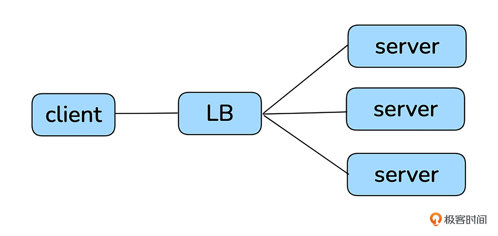
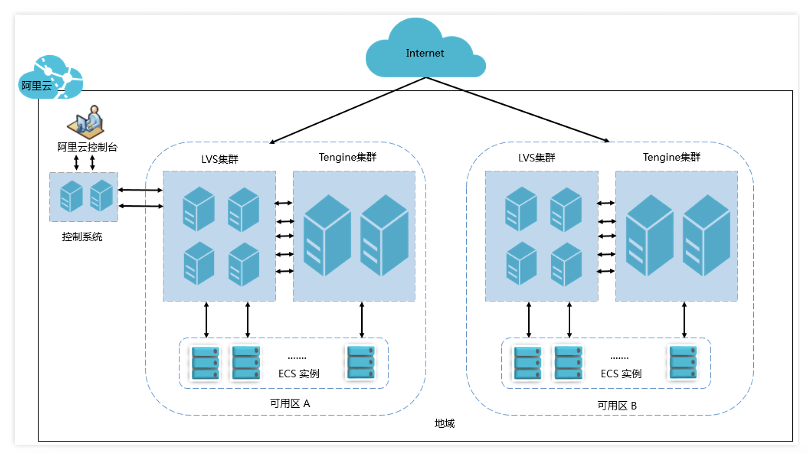
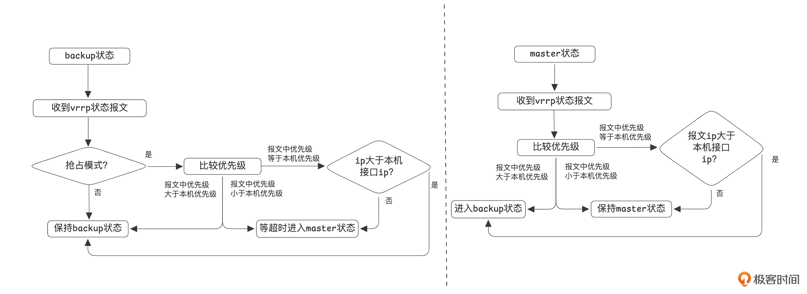
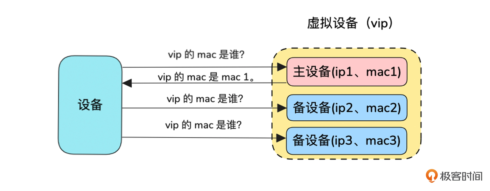
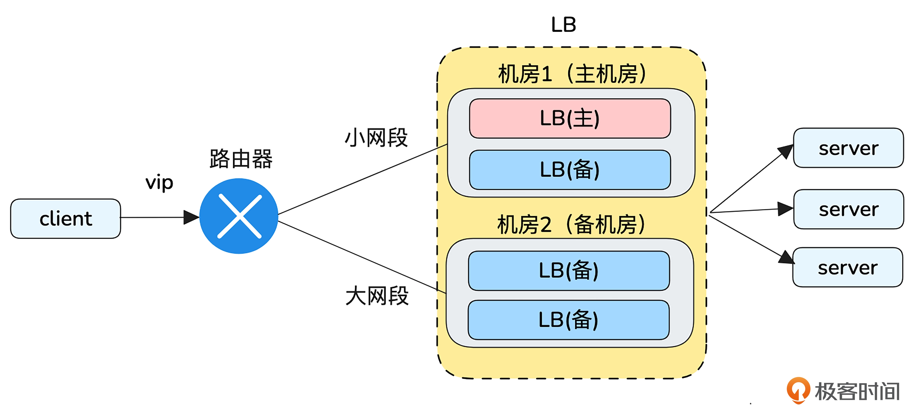
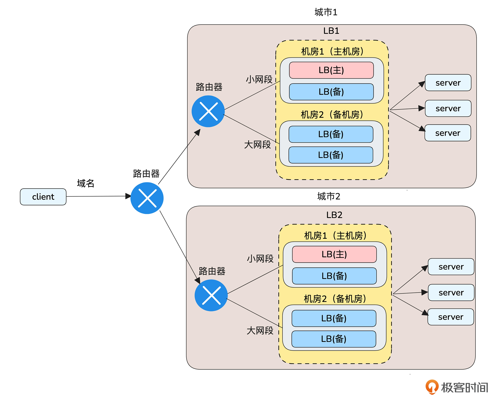

### 一、主备架构

一主一备或者一主多备组成的架构。主负责处理所有请求，而备保持待命状态。当主发生故障时，备可以迅速接管。

#### 1. LB（Load Balancer）

比如 LB（Load Balancer）就提供了这个能力。

- 管理 server 的 IP 和端口
- 对外提供一个 vip（virtual ip）和监听端口，请求通过 vip 和监听端口进入 LB
- 支持一定的调度算法将请求转发到 server 的配置端口
- 支持健康检查，能自动剔除不健康的 server

LB 的是一个集群，一般来说

- 四层 LB 采用 LVS（Linux Virtual Server）+ Keepalived 的方式实现负载均衡
- 七层 LB 基于 Tengine（Nginx 的定制版本）来实现

> Keepalived开源项目: https://github.com/acassen/keepalived/tree/master/keepalived

基于 keepalived 实现了 LB 的高可靠性，同时，keepalived 是通过 VRRP（Virtual Router Redundancy Protocol，虚拟路由冗余协议）来实现高可靠性的。

#### 2. 客户端访问LB的流程

客户端访问VIP时，如何选中某台LB。

情况A：客户端和VIP在同一个二层网段（同一广播域）

- 客户端要给VIP发包，需要先知道“VIP对应的MAC地址是谁”。于是发送ARP请求。
- 只有当前 VRRP 的 Master LB 会应答 ARP，告诉客户端“VIP在我这里，这是我的MAC（或VRRP虚拟MAC）”
- 客户端把 "VIP->MAC" 写进 ARP缓存，然后把数据包发到该 MAC，于是包就到了这台LB。
- 当 LB 发生主备切换时，新Master会发送“gratuitous ARP”（无请求ARP），主动通知网络里其他机器把 “VIP->MAC” 更新到新Master，从而加速切换生效。

情况B：客户端和VIP不在同一网段

- 客户端把包先发给默认网关的MAC（这是正常的三层转发）
- 网关查路由表，发现VIP所在网段在本地（或下一跳）需要二层投递，于是网关对VIP做ARP。
- 同样，只有当前 Master LB 回答ARP，网关将包转发到该LB的MAC。切换时，新Master发“gratuitous ARP”促使网关/同层设备更新缓存

因此，客户端或网关只在二层寻址时解析“VIP->MAC”，而 VRRP/Keepalived 保证同一时刻只有一个Master对外宣称VIP。

#### 3. VRRP 协议

VRRP（Virtual Router Redundancy Protocol，虚拟路由冗余协议）

- 虚拟：将多个真实设备组成一个虚拟设备。外部看到的是一个虚拟设备，通过 vip（virtual ip）访问，
- 冗余：通过冗余来实现高可用。备机是一种冗余
- 路由：作用在三层（网络层）的协议

##### (1). 如何确认主机和备机？

每个 VRRP 接口会配置一个优先级，在接口启动时判断优先级是否为255，如果优先级是255，则进入主状态，否则进入备状态。

主备抉择的首要因素是优先级，如果优先级相同，则比较IP地址。

##### (2). 如何让网络数据包只发送到主设备，而不发送到备设备？

虚拟设备组中的设备，只有主设备才会响应 vip 的 arp 请求，所有 vip 对应的 MAC 地址始终是主设备的 MAC 地址。

#### 4. LB的意义

1. 分发流量（Load Distribution）
   - 把来自客户端的请求按某种算法分配到多台后端实例，避免某台机器成为瓶颈。
   - 常见算法：轮询（round-robin）、最少连接（least connections）、加权、IP Hash、会话粘滞（sticky/session affinity）。

2. 高可用与故障转移
   - 当某台后端实例不可用时，LB 会自动把流量切到健康的实例，减少或消除服务中断。
   - 通过健康检查（health checks）检测后端状态并剔除挂掉的节点。

3. 横向扩展
   - 方便按需增加/减少后端实例，LB 作为流量入口无需改客户端配置。
   - 支持流量增长的平滑扩展。

4. 性能优化
   - 可以做 SSL/TLS 卸载（SSL offload），把加密/解密负担从后端减掉。
   - 支持连接复用、HTTP/2、压缩等，提高吞吐和并发能力。

5. 路由与内容分发（Layer-7 功能）
   - 应用层路由：基于 URL、Host、Header、Cookie 做转发（比如把 /api 转到后端组 A，把 /static 转到 CDN）。
   - 支持 A/B 测试、蓝绿部署、灰度发布等部署策略。

6. 安全与保护
   - 作为反向代理隐藏真实后端地址；可与 WAF、DDoS 防护、速率限制结合，减轻恶意流量影响。
   - 可以统一做认证、访问控制和请求过滤。

7. 会话管理
   - 对需要“会话粘滞”的应用（比如有本地会话状态的旧系统）可保证同一用户请求落到同一台后端。

8. 可观测性与运维
   - 集中收集访问指标（QPS、延迟、错误率），便于监控、报警与容量规划。
   - 便于日志、追踪（trace）集成，定位问题更方便。

9. 成本与资源优化
   - 通过均衡利用资源减少单点过载，降低需要准备的峰值容量，节省成本。

### 二、多机房主备架构

多个机房的主备架构可以利用“路由最长掩码匹配规则”来实现。指的是当有多个路由可以匹配同一个目标 IP 地址时，路由器会选择“前缀最长”的那个路由，即子网掩码最具体、匹配位数最多的路由。

- 主备机房分别通过动态路由协议发布大小两个掩码匹配长度的路由
- 无故障时，vip 同时匹配到主备机房的路由，按照路由最长匹配原则，会使用掩码更长的主机房。当主机房故障时，路由将会自动失效，vip 只能匹配到备机房。

### 三、多城市主备

多城市主备的难点主要有两个原因：

- 网络延迟与性能：跨城市远距离的数据传输会增加延迟，同时，跨城市连接增加了探测时间，可能导致不准确的健康检查结果，影响整体负载均衡的稳定性和效率
- 成本考虑：跨城市的传输需要占用更多的带宽资源和更复杂的网络结构。一般云厂商提供这类服务的成本会显著上升。

一般可以为每个城市提供一个 LB，然后在客户端做主备选择。如果客户没有要求尽量用主城市提供服务的话，可以将多个 vip 绑定到一个域名，客户端通过域名轮询访问两个城市的服务。

- 像存储、数据库等应用，为了提高可靠性至少是两地三中心部署。四层及四层以上的跨城市容灾能力是比较容易满足的。
- 但 LB 这种在三层容灾的产品 因为“网络延迟与性能、成本”不太适合跨城市容灾。

### 四、主备架构的问题

主备架构中，备链路长期不用，出现故障的时候也无法判定是否可用。一般我们可以：

- 故障演练：日常主动故障演练。有准备的切换总比没准备的故障更容易对付。
- 业务分级+小流量试跑：将业务按照重要程度分级，挑一些重要程度低的业务，日常在备链路上运行小部分流量。

