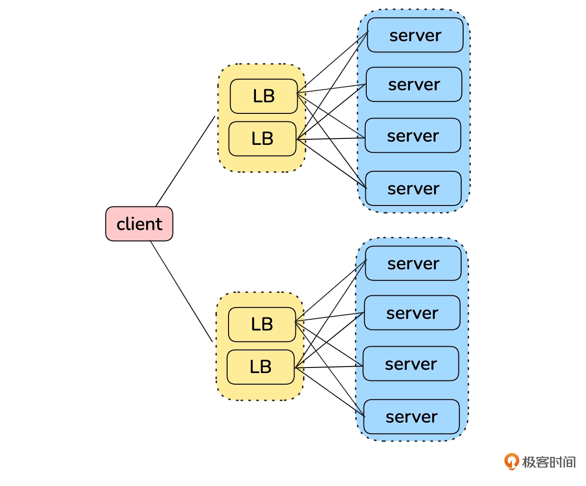
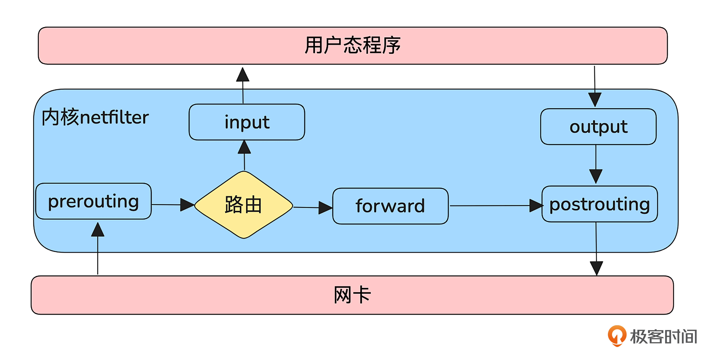
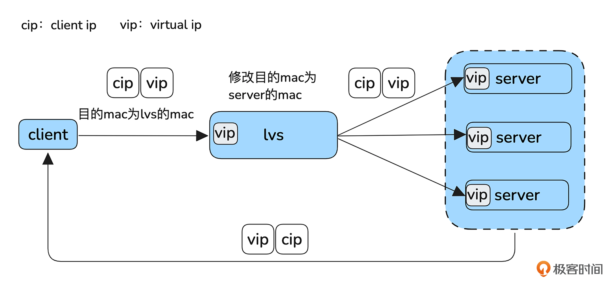
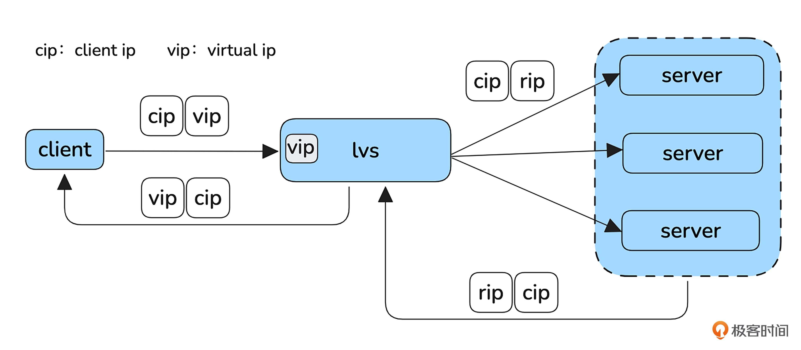
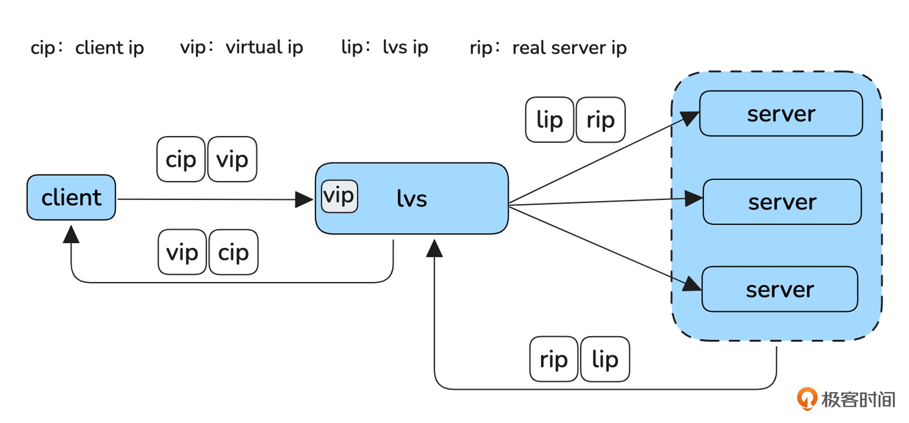
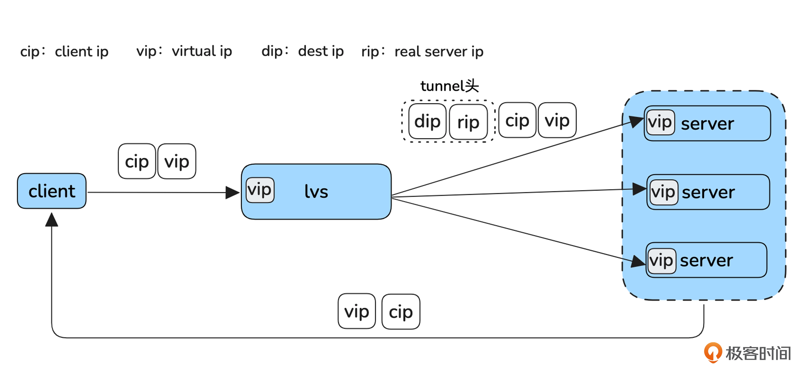
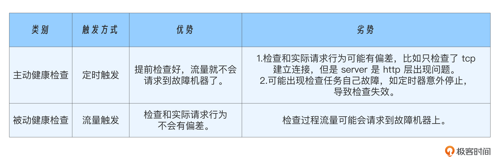

## 横向扩展

横向扩展就是将多个具有相同功能的机器组成一个集群，整体对外提供服务。集群的性能是通过增加机器解决的。

客户端发出的请求经过LB达到服务器的过程中。至少有三个关键节点可以进行横向扩展。

- 客户端可以在多个 LB 集群之间进行选择
- 可以组建LB集群来提升分发能力
- 可以扩展服务器集群以应对更大流量

### 1. 客户端与LB集群之间的扩展

客户端到LB集群的横向扩展能力，可以通过 DNS 实现，将一个域名绑定多个 IP 来实现。

例如，客户端策略是优先使用第一个IP，调度系统也可以为不同地区的客户端返回不同顺序的IP地址，从而分散客户端到 LB 集群的请求负载。

注意，DNS 无法感知机器故障，依赖客户端健康检查摘除流量。

### 2. LB集群

单台 LB 无法满足处理需求时，就需要多个 LB 组建集群来进一步提升分发能力。

在主备机房架构中，路由器会根据最长掩码匹配的原则选择路由。如果存在多个等长掩码的路由，会通过 ECMP（等价多路径路由）在多个路由之间分担流量，从而实现负载均衡器的横向扩展，提升系统的吞吐量和容错能力。

- ECMP：允许路由器对多条具有相同最短代价的路径同时使用。路由器会对一个流做哈希（hashKey包括：源IP、目的IP、源端口、目的端口、协议号），并把这个流固定到某条路径。

我们使用 LVS 作为 LB，分析其原理。LVS是集成到 Linux 内核的功能，他依赖 Netfilter 框架，框架如下：

Linux 内核处理进出网络协议栈的数据包分为 5个阶段，Netfilter 通过这 5 个阶段注入钩子函数来实现对数据包的过滤和修改。

- prerouting：路由前阶段，发生在内核对数据包进行路由判决前
- input：本地上送阶段，发生在内核通过路由判决后。如果数据包是发送给本机的，那么就把数据包上送到上层协议栈
- forward：转发阶段，发生在内核通过路由判决后。如果数据包不是发送给本机的，那么就把数据包转发出去
- output：本地发送阶段，发生在对发送数据包进行路由判决之前
- posting：路由后阶段，发生在对发送数据包进行路由判决之后

一个数据包到达本机后有两种路径。

- 数据包是发送给本机的。prerouting->intput-> 用户态处理 ->output->postrouting
- 数据包是不是发送给本机的。prerouting->forwarding->postrouting

#### 2.1 LVS工作模式

LVS 是在 Netfilter 的 input、forward、posting 阶段进行 hook 来实现自己的逻辑的。LVS 有 4 种工作模式。

##### (a). DR模式

- 客户端发送的报文。目标IP是 LVS 的 vip。LVS 会将报文中的目标 MAC 地址替换为一个后端服务器的 MAC 地址，并将报文转发给后端服务器。
- 后端服务器会将响应直接返回客户端，无需经过 LVS。
- 注意，虽然服务器接收到的报文目的地址是 VIP，但根据 Netfilter 的处理流程，服务器必须路由到 INPUT 链，才能进入本机处理流程。因此，服务器的网络接口上也需要配置 VIP，但不能通过 ARP 广播将 VIP 公开，以避免请求直接到达服务器而绕过 LVS。

这种转发方式的优势是，只修改 MAC 地址，不涉及 IP 层的改动，且响应不经过 LVS，直接返回客户端，这样就提高了效率。但是因为 LVS 必须知道 server 的 MAC 地址，所以他们必须部署在同一个局域网。

##### (b). DNAT模式

- LVS 会将收到的报文目标 IP 修改为服务器的 IP 地址，服务器的响应报文会再经过 LVS 返回客户端。
- 一般会将 LVS 设置为服务器发送到客户端的默认网关。这样，经过 LVS 的报文会触发 LVS 内核中 Netfilter forward 钩子进行处理，LVS 会在此过程中将报文的源 IP 替换回 VIP。

为什么服务器不直接回包给客户端呢？因为由于客户端发送报文时目标 IP 是 VIP，如果应答报文的源 IP 是服务器的 IP，则 TCP 四元组将会不匹配，导致客户端无法正确识别应答报文，最终丢弃这个包。因此从三层的角度，应答报文必须经过 LVS。

##### (c). FULLNAT模式

 

可以看到 FULLNAT 与 DNAT 的区别在于，LVS 不仅把请求的目的 ip 换成 Server，同时还把源 IP 换成自己的 IP 了。这样 Server 的应答报文就顺理成章地到达 LVS，LVS 再做一次转化将目的 IP 换成客户端 IP，源 IP 换成 vip 就可以了。

##### (d). Tunnel模式

Tunnel（隧道）模式是指 LVS 将发往 Server 的报文外面又封装了一层报文，原来的报文变成了新报文的数据部分，这就要求 Server 上必须有对应 tunnel 的解封装软件将 tunnel 头剥离，然后剩下的包就和 DR 模式一样了，应答也和 DR 模式一样。这样加一层 tunnel 的好处是 LVS 机器和 Server 机器不必非要部署在同一个局域网里面了。

### 3. 后端服务器集群

使用LB扩展后端 server，主要需要处理两个问题：负载均衡、故障剔除。

#### 3.1 负载均衡

如何将请求按照预期算法调度到各个机器上？常见的负载均衡算法：

- 轮询（RR）：最常用的负载均衡方法，每次请求都换一个后端 server。
- 加权轮询（WRR）：轮询基础上支持配置权重，适合后端服务器性能不均的情况。 
- 最少连接（LC）：一般针对四层负载均衡，选择连接最少的后端服务器，期望通过这种方式，让后端服务器的资源消耗尽量平衡。 
- 加权最少连接（WLC）：最少连接基础上配置权重，注意考虑后端服务器性能本身的差异。 
- 一致性哈希（CONNASH）： 适合按请求资源分配机器的场景，如通过这种方式提升 cdn 命中率。

#### 3.2 故障剔除

如何避免将请求调度到故障的机器上？一般通过“健康检查”来解决，即按照一定规则对下游系统做探测。

- 如果发现下游某个server不可用，则自动摘除这个server的流量。
- 如果某个故障server恢复了，则自动添加回这个server的流量。

按照触发时机，可以分为主动健康检查和被动健康检查。

- 主动健康检查，一般是定时触发
- 被动健康检查，把请求当作检查，如果请求失败，做个记录。规定时间内达到一定失败次数就认定机器故障，然后摘流。

同时，避免不了流量进入故障机器，我们应该进行重试来兜底。

