## 纵向扩展

如果单台服务器的处理性能不足，那么无论怎么扩展也难以满足需求。

- 比如“大象流”（在网络中占用大量带宽的长时间持续传输的大数据流量）场景
- AI模型训练，虽然可以通过分而治之的算法来并行处理，但大量矩阵运算要求极高的计算关联性

单机性能优化的三个层次。

- 代码逻辑。低效的代码逻辑无法发挥机器的最大潜力。因此代码逻辑决定了系统性能的下限。
- 网络模型的选择和网络协议的优化。根据对应的场景使用适合的模型
- 单机架构的优化。可以通过 DPDK、XDP等技术，减少用户态和内核态切换的开销。也可以通过软硬件结合、RDMA、P4等技术为CPU分担压力。这部分优化决定了单机性能的上限。

### 一、低性能代码逻辑

#### 1.1 常见的雷点

如下是常见的雷点。

##### (1). 不合适的数据处理尺寸

特别是 I/O 操作的尺寸。每次 I/O 操作都会涉及初始化缓冲区、系统调用、上下文切换和地址映射等开销。如果单次处理的数据量过小，处理次数必然增多，从而导致这些额外开销的累计增加。

同样，在非 I/O 操作场景中，如果数据处理的粒度与实际需求不匹配，也会造成流程执行次数过多，进而影响整体效率。

##### (2). 频繁执行的长遍历

耗时高无非两种情况，

- 一种是单次执行耗时高；要多关注系统调用
- 另一种是单次执行耗时不高，但是执行次数非常多。注意长遍历，比如链表到跳表的优化，就是减少遍历次数。

##### (3). 耗时且可并发的操作并未并发运行

加载磁盘内容、获取网络数据，这种耗时操作一般应该并发去完成。

同时注意不能无限并发，因为并发单元的调度也是需要消耗资源的。我们应该使用“池”去限制并发大小。

##### (4). 不合适的锁阻碍并发

并发一般需要用锁对共享资源做互斥保护。常见的性能误区：

- 加锁粒度大。一些常见中临界资源可以划分成多个小资源块，然后分别加锁，降低锁粒度。
- 可以用读锁的地方使用了写锁
- 锁住资源后存在耗时操作

##### (5). 大数据未进行流式处理

例如，当一个 CDN 缓存节点处理未命中的大文件时，如果选择将整个文件从源站下载完后再返回给客户端，不仅会延长客户端的等待时间，还会占用大量缓存资源，降低其他请求的命中率。 

更高效的方式是采用流式处理。从源站读取一部分数据后立即缓存并同步回复给客户端。这样可以一边加载缓存，一边满足客户端的请求。流式处理不仅减少了客户端的等待时间，还能提高缓存命中率，因为其他请求在下载尚未完成的时候，即可开始命中部分已缓存的数据。

##### (6). 轮询

轮询本质上是重复性地查询某个状态，而大多数查询可能都是无效的，这不仅浪费资源，还可能因为查询间隔错过事件发生的时机，导致额外的等待时间。

 更高效的替代方案是采用事件驱动的监听或推送机制。例如，在网络编程中，常用的异步 I/O 多路复用技术（如 epoll）就是这一思路的具体实现。通过监听事件并在触发时立即响应，系统能够显著降低资源消耗，同时提升对事件处理的及时性和整体性能。

##### (7). 其他

低效的逻辑写法还有很多。比如：

- 不必要的内存深拷贝
- 频繁申请和释放内存
- 主流程调度时出现阻塞

还有一些常见的性能提升方法。比如：

- 使用跳表优化遍历
- 使用缓存优化查询
- 使用缓冲区适应前后端网络性能不匹配
- 处理器绑定（CPU绑核）以及使用非阻塞IO函数

#### 1.2 如何定位性能问题

面对系统性能底下的时候，快速定位问题的基本逻辑是：

- 收集信息
- 做出假设
- 验证假设
- 如果做出错误的假设，则重新判断或重复以上步骤

关于性能定位的方法论，使用性能大神 Brendan Gregg 的 USE 方法。

- Utilzation（利用率）：反映资源的繁忙程度。比如大量计算密集型任务会导致CPU利用率高。
- Saturation（饱和度）：反映资源的排队情况。除了资源不足以满足需求，导致其他任务无法获得资源外，还可能是任务被锁阻塞，或者系统调度过于频繁等原因。
- Errors（错误）：反映系统中出现的错误情况。

如下是常见的性能定位命令：

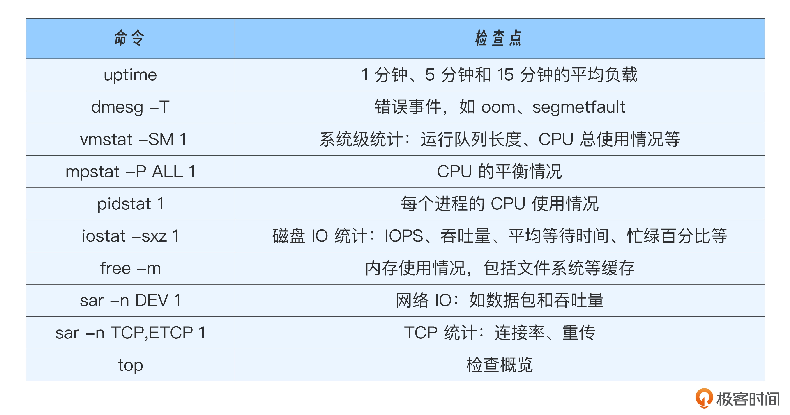

性能分析的工具：

- 采样工具：perf 配合 FlameGraph 可以生成火焰图，直观展示 CPU 使用情况。
- 快速观察系统调用情况：strace 。 
- 快速观察堆栈情况：pstack。
- 内核级观测工具，如基于 eBPF 的工具，如 bcc 和 bpftrace。 
- 网络状况快速查看工具，如 ss、netstat、ifconfig、httpstat 等。 
- 网络分析最不可缺少的工具：Wireshark、tcpdump

还有一些高级语言特定的分析工具，比如 golang 的 pprof。

注意：要多进行信息收集，防止误导性的数据导致定位方向跑偏。尤其是使用采样类工具的时候，注意多采集几次再做出假设。

### 二、网络模型和协议优化

网络作为数据传输通道，扮演着类似运输货物的角色。发送方和接收方各自有一个“仓库”。网络模型的作用在于如何最大化利用这些仓库空间：发送方能及时发现“发送仓库”有空间，并用数据将其填满，同时在接收方准备好处理数据时，及时从“接收仓库”取出数据，以腾出空间接收更多的数据。

网络协议优化则着眼于让仓库空间和运输速度尽可能匹配，并在数据丢失时，尽快恢复丢失的数据，确保数据传输的高效与稳定。

#### 2.1 IO模型

阻塞和非阻塞是描述系统调用时“等待数据准备好”的方式。在阻塞模式下，应用进程会一直等待直到数据准备好；而在非阻塞模式下，应用进程不会等待，而是立即返回，做其他事情。

同步和异步则涉及“数据从内核到用户空间的复制”。同步模式，内核将数据准备好后，通知应用进程，应用进程随后调用系统函数来读取数据；而异步模式，内核在将数据拷贝到用户空间后，直接通知应用进程，应用进程可以直接使用数据。

##### (1). 阻塞式IO模型

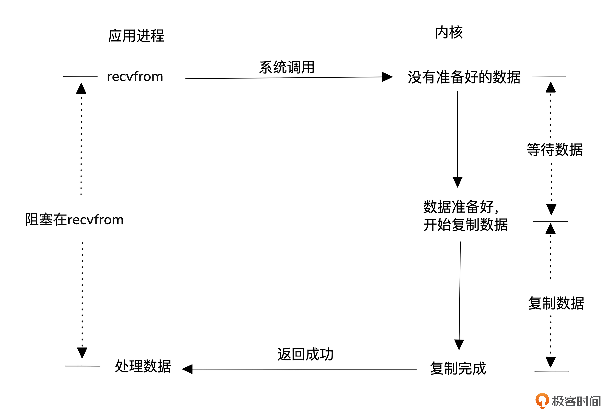

这种模型使用最简单，用户进程发起数据读取后会一直等待，直到内核准备好数据并拷贝到用户空间。但缺点是效率低下，每个请求都需要一个进程或线程，高并发时，系统会面临大量进程调度和上下文切换的开销。

##### (2). 非阻塞式IO模型

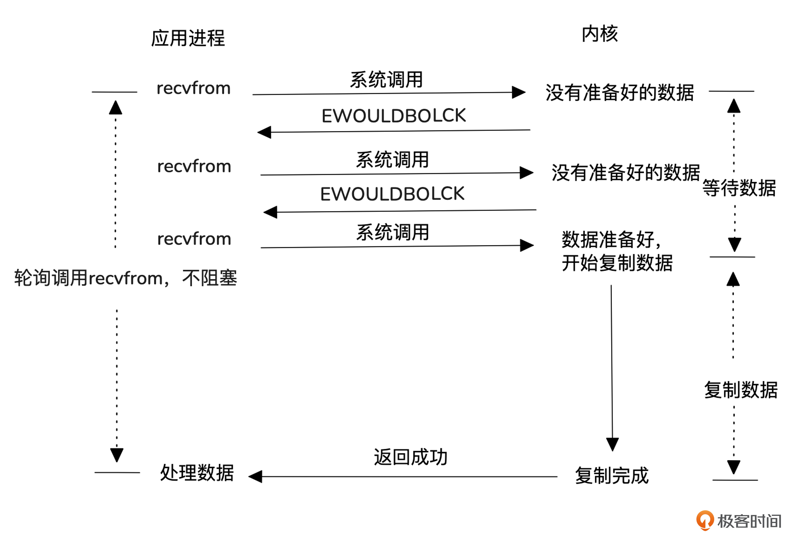

这种模型采用非阻塞方式与内核交互，数据未准备好时立即返回，允许用户进程去做其他事，稍后再尝试读取数据。与阻塞模型相比，它避免了进程空等数据，提高了效率。但每次轮询都涉及系统调用，导致上下文切换增多，性能提升有限。

##### (3). IO复用型

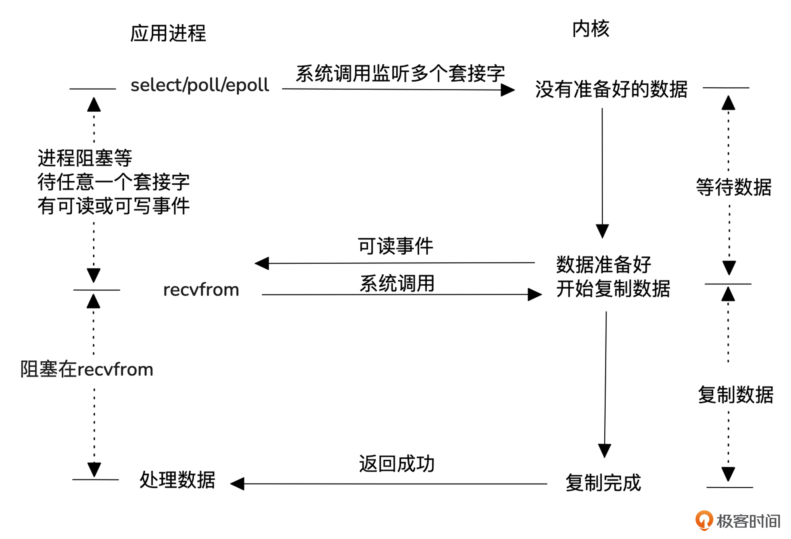

为了避免频繁查询内核而影响性能，I/O 复用模型通过注册和通知机制来优化。用户进程将所有 I/O 事件（如使用 select、poll 或 epoll）注册到内核，内核会在数据准备好时主动通知进程。这样，单个进程或线程就能同时处理多个 I/O 请求，提高了效率，避免了阻塞和过多的系统调用。需要注意的是，数据准备好后，仍需通过系统调用读取数据。

##### (4). 信号驱动式IO模型

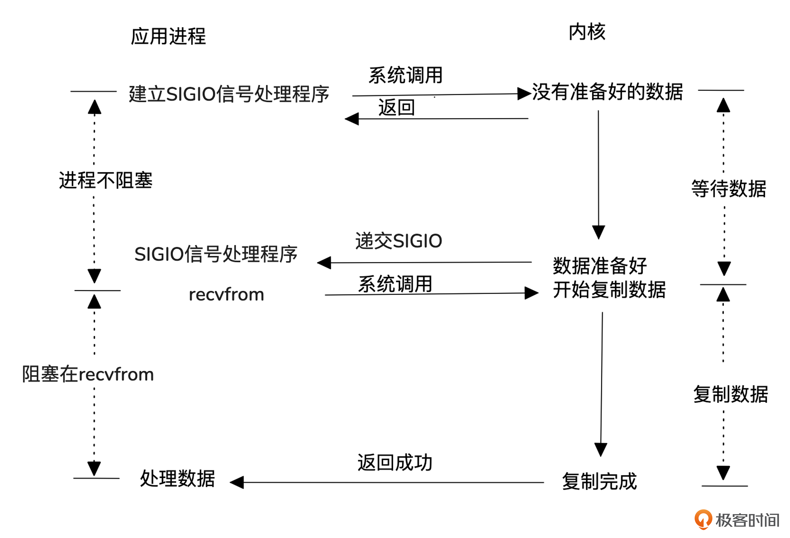

信号驱动式 I/O 模型不像 I/O 复用模型那样，用一个进程去内核注册，获取并分发事件，而是每个请求进程自己向内核注册，当数据准备好时，内核通过信号通知进程处理。 

这个模型常用于 UDP 的 NTP 服务，但在 TCP 中应用较少，因为 TCP 会频繁产生信号，且无法明确告知应用程序发生了什么事件。例如，在连接请求完成、断链请求发起或完成、半连接关闭、数据到达或发送、发生异步错误等多种情况下，TCP 会都会产生 SIGIO 信号。

##### (5). 异步IO模型

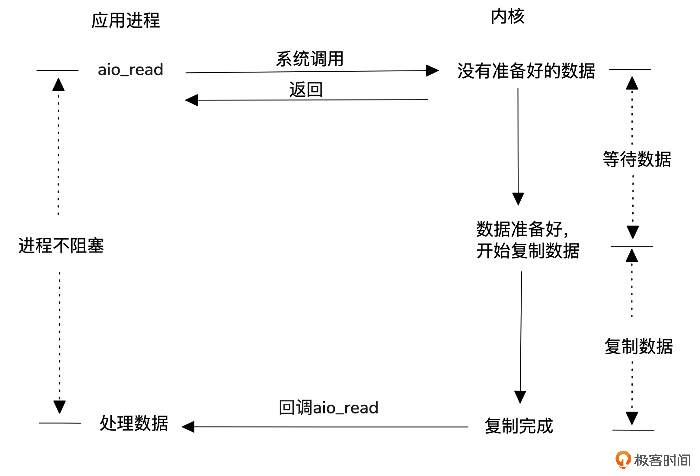

前面几种模型都是同步系统调用，异步 I/O 模型使用的是异步系统调用，所以省去了用户进程去内核拷贝数据的消耗。

##### (6). 小结

早期 Linux 内核对异步IO支持较差，因此很多服务器都采用IO复用（epoll）。从 Linux5.0 版本开始，io_uring 技术逐渐成熟，越来越多的服务器（如 nginx）开始支持异步IO。

这五种网络IO模型中，最常用的是基于IO多路复用的 Reactor模型，而Proactor 模型则通过异步IO提供更高的效率。这两种高效的 I/O 模型能够减少用户态与内核态之间的交互开销，并及时响应内核态的读写事件。

#### 2.2 网络协议

##### (1). MTU性能影响

在网络中，MTU（Maximum Transmission Unit）指的是网络层能够传输的单个数据包的最大字节数。如果 MTU 值设置得过小，数据就需要被拆分成更多的小包来传输。因此，合理的 MTU 设置对于优化网络性能至关重要。可以通过 ifconfig 命令查看。

在以太网中，常见的 MTU 值是 1500 字节。高带宽环境，可以使用“Jumbo Frame”，其 MTU 值可以达到 9000 字节左右。

##### (2). TCP窗口性能影响

TCP 的窗口对性能的影响主要体现在流量控制的滑动窗口和拥塞控制的拥塞窗口。

**流量控制性能分析：**

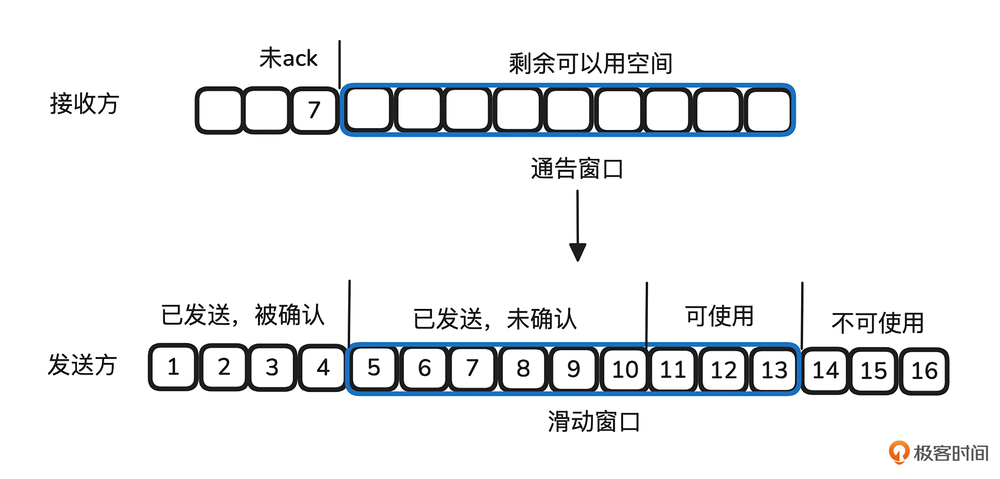

- TCP 为了实现可靠传输，每个传输的字节都会进行序列号（SEQ）编号。当发送方发送的数据到达接收方时，接收方会在确认消息（ACK）中返回自己已接收的最后一个字节的序列号。这样，发送方就知道接收方已经成功接收的数据位置。
- 为了避免发送方发送数据时接收方没有足够空间存放，TCP 实现了流量控制机制。发送方和接收方各自维护一个缓冲区，作为数据传输的“仓库”。接收方在每次返回 ACK 时，会告诉发送方它的缓冲区剩余空间大小。发送方根据接收到的 ACK 信息，了解对方可用的窗口大小，这个大小等于接收方的总缓冲区空间减去尚未确认的数据量。随着接收方确认新的数据，窗口会随之滑动，腾出空间。
- 接收方缓冲区存储的数据可以被应用层读取，一旦应用层读取数据，缓冲区空出的空间就会增大，允许接收更多数据。

于是，报文的 ACK 速度和接收方窗口的大小决定了发送方能够发送多少数据。ACK 速度可以通过网络中的带宽延迟机（BDP）来衡量。

BDP 是指网络带宽与往返时延（RTT）的乘积，反映了网络中一个连接在给定时延下，能够传输的最大数据量。RTT 越长，BDP 值越大，接收方的窗口也应该相应增大，以保持高速的数据传输。

因此，根据调整缓冲区大小有一定的收益。

**拥塞控制分析：**

TCP 的拥塞控制是一个典型的负反馈机制，发送方判断出网络出现拥塞的时候，就会减少发送报文的量，以免加剧网络拥塞。有几个关键参数：

- MSS（Maximum Segment Size）：每个 TCP 段的最大有效负载大小，不包括 TCP 头部。MSS 通常由链路的 MTU 决定，避免分片。 
- 拥塞窗口（cwnd）：控制发送数据的量，表示发送方在没有收到 ACK 确认之前可以发送的最大数据量，单位是多少个 MSS。 
- ssthresh（Slow Start Threshold）：慢启动阈值，决定了从慢启动阶段到拥塞避免阶段的切换点。

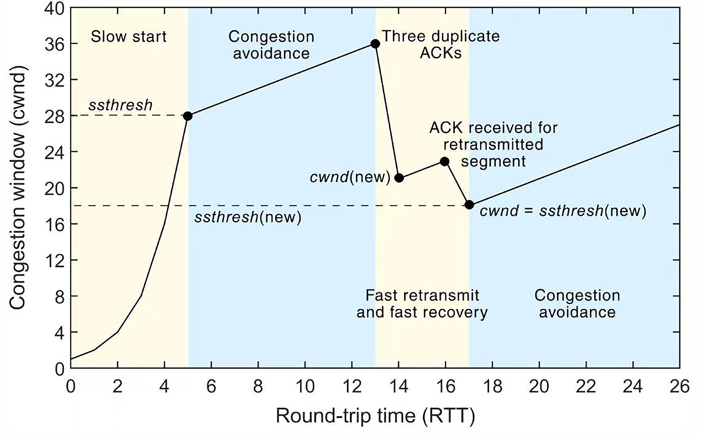

拥塞控制机制会经历以下几个阶段。

-  慢启动（Slow Start）：在连接开始时，TCP 的拥塞窗口（cwnd）从一个较小的值（通常为 1 个 MSS）开始增长，逐步增加数据的发送量。每当收到一个 ACK 时，cwnd 就会增加 1 个 MSS。这个过程是指数增长，即每收到一个 ACK，cwnd 就翻倍。慢启动会持续进行，直到 cwnd 达到 ssthresh（慢启动阈值）为止。 
- 拥塞避免阶段（Congestion Avoidance）：当 cwnd 达到 ssthresh 时，TCP 进入拥塞避免阶段。在这个阶段，cwnd 不再指数增长，而是以线性方式增加：每收到一个 ACK，cwnd 增加 1 个 MSS/cwnd 大小。这使得拥塞窗口的增长速度变得更加平缓，从而避免因为发送过多数据而造成网络拥塞。 
- 快重传（Fast Retransmit）：当 TCP 接收到三个重复的 ACK 时，会立刻进行快重传，不再等待超时。这个阶段不直接影响 cwnd 的大小，但会触发 cwnd 的缩小。TCP 会根据重复的 ACK 确认丢失的数据包，并重新传输。 
- 快恢复（Fast Recovery）：在快重传之后，TCP 会进入快恢复阶段。在这个阶段，cwnd 不会回到慢启动的初始值，而是被减半，然后线性增加。具体来说，cwnd 会设置为 ssthresh 的值，再加上丢失的数据段数。快恢复使得 TCP 在丢包后不会完全放弃之前的传输速率，而是较为平稳地恢复到正常状态。

可以看出当发送丢包或者乱序的时候，就会减少拥塞窗口的值。然而，基于丢包来判断拥塞的方式存在两个主要问题：

- 丢包并不等于拥塞：在无线网络或“长肥”网络中，丢包可能是由于其他因素（如链路质量差）造成的，而非拥塞。将丢包误判为拥塞会导致不必要的窗口缩减，进而影响性能。
- 不丢包并不等于没有拥塞：在许多现代网络中，当路由器处理不过来时，它可能将数据包缓存到缓冲区中，而不会丢包。这种做法虽然避免了丢包，但却可能导致网络的严重抖动，影响整体的传输效率。

Google 在 2016 年提出了 BBR（Bottleneck Bandwidth and RTT）拥塞控制算法。BBR 并不依赖丢包来判断拥塞，而是通过交替测量网络的带宽和时延，并计算带宽 - 时延积（BDP）来控制数据包的发送速率。这种算法特别适用于带宽大且延迟高的网络环境，可以显著提高性能。

##### (3). TCP性能影响其他机制

除了窗口外，TCP 性能还受其他多种机制的影响。例如：

- 开启 SACK（Selective Acknowledgment）可以减少丢包导致的重传量，适合丢包率高的网络。
- 启用 MTU 探测可以自动调整传输路径中的最大传输单元，避免因路径 MTU 不匹配而导致的分段。
- 开启 TCP_NODELAY 选项，可以关闭 Nagle 算法，避免小包延迟，提升实时应用性能。

##### (4). HTTP性能

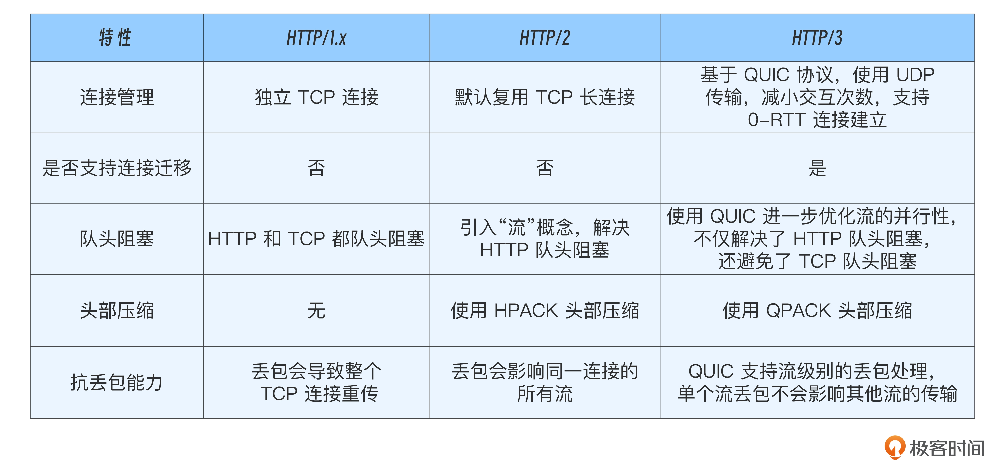

### 三、单机架构优化

讨论如何简化处理路径或用硬件为CPU分担压力，来进一步提升性能。

##### (1). 瓶颈来源

如下是 Linux 内核发送和接受一个网络包的主要流程。

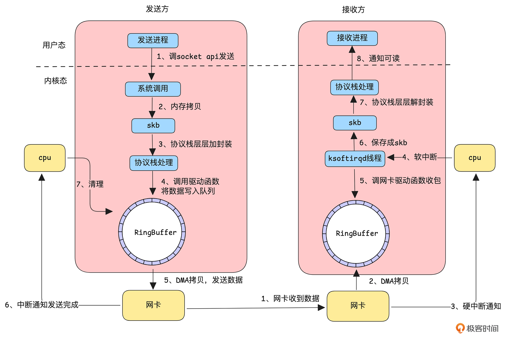

发送一个数据包要经过如下流程：

- 发送方的应用程序通过调用 socket API 告知内核有数据要发送，随后进入系统调用，完成从用户态到内核态的切换。 
- 内核态接收到数据后，将其拷贝到 skb（socket buffer）结构中，供协议栈处理。 
- 协议栈对数据进行分片、封装等处理。 
- 经过协议栈处理的数据通过驱动程序将数据到 RingBuffer。 
- 调用网卡发送函数，此时网卡利用 DMA 将数据从 RingBuffer 拷贝到网卡缓存并开始发送。 
- 发送成功后（TCP 需等待接收到 ACK），网卡通过中断通知 CPU， 
- CPU 再清理 RingBuffer 中的数据。

接受一个数据包、到通知应用程序数据可读，要经过如下流程：

- 网卡接收到数据。 
- 网卡通过 DMA 将数据直接拷贝到 RingBuffer。
-  网卡通过硬中断通知 CPU 有新数据到达。 
- 简单处理后，触发软中断通知专用线程进行处理。 
- 软中断处理线程调用网卡驱动从 RingBuffer 中读取数据包 
- 数据被保存成 skb 结构。 
- 数据进入协议栈，经过解封装等处理。 
- 处理完成后，内核通知应用程序有数据可读。

容易形成性能瓶颈的地方：

- 用户态和内核态切换引起的开销，因为每次切换都需要保存当前的上下文（比如寄存器的值、调用栈等），并在切换完成后恢复
- 内存拷贝，系统调用收发数据时会进行内存拷贝
- 协议栈层层处理，流程较多

##### (2). 纯用户态流量转发

DPDK（Data Plane Development Kit，数据平面开发套件）通过绕过内核协议栈，直接在用户态高效处理网络数据，大幅提升了数据处理性能。

DPDK提供了一组高效的库和驱动，允许应用程序直接访问网卡硬件，在用户态完成数据包的接收与发送，绕过了传统的 Linux 内核协议栈，从而显著降低上下文切换和数据拷贝的开销。通过硬件支持的功能，例如 SR-IOV（单根 I/O 虚拟化） 和 数据包分类过滤（Packet Classification Filtering），DPDK 可以高效地实现数据流的分流和处理。

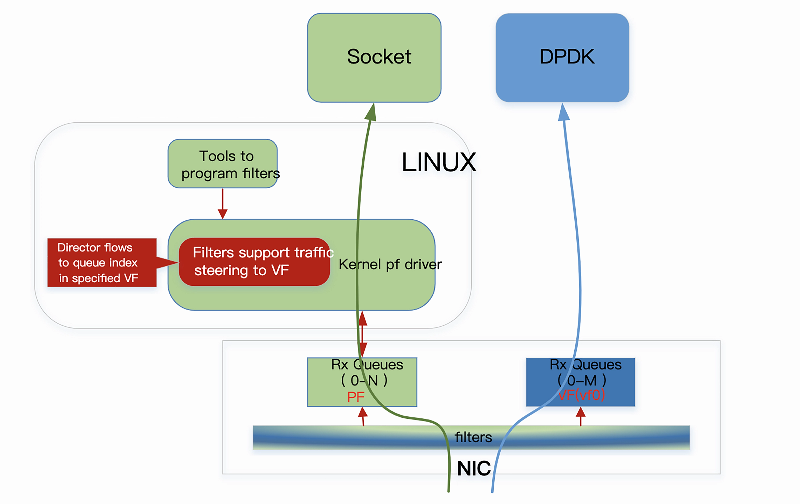

数据包分类过滤技术使网络适配器能够根据特定规则将流量分配到不同的接收队列。这些队列可以属于内核态（由传统的 Linux 驱动处理）或用户态（由 DPDK 应用直接处理）。例如，控制平面流量可以定向到 Linux 网络协议栈，而性能敏感的数据平面流量则可以直接交给 DPDK 应用处理，从而实现更高效的网络流量管理。

此外，利用 SR-IOV 技术，网卡能够将物理适配器划分为多个虚拟功能（Virtual Functions, VF），并通过目标 MAC 地址将流量精确地定向到相应的虚拟功能。这种硬件加速的流量分流机制不仅简化了数据包的处理路径，还能大幅减少 CPU 的负担。

##### (3). 纯内核态转发

虽然 DPDK 这种纯用户态的网络处理方式在一定程度上提高了网络处理的性能，但它需要应用程序直接接管数据包的收发，增加了对硬件资源的依赖。

eBPF（Extended Berkeley Packet Filter）可以安全、高效的在内核运行一段自定义的沙箱程序，从而在不修改内核源码或加载内核模块的情况下，安全、高效的扩展内核功能。

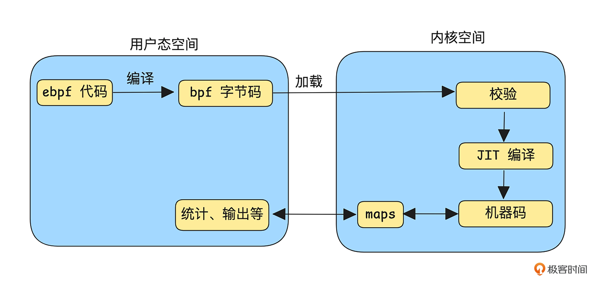

如上图，开发者可以在自己的项目定义用户态的控制逻辑，比如过滤规则或转发表，并将这些代码编译成 bpf 字节码，之后通过 sdk 将 bpf 字节码加载到内核中。在内核层面，这些程序 eBPF 验证器的检查，以确保程序不会造成安全隐患，比如死循环或非法的内存访问。一旦检查通过，便会将 bpf 字节码编译成机器码，挂载到内核的关键钩子点（hook）上，实现用户态下定义规则、内核态高效执行的工作模式。用户态和内核态还能直接通过 maps 进行数据传递，实现运行结果查看、统计等功能。

基于 eBPF 的能力，在网络、安全、内核观测和追踪方向发展出了一系列典型项目。

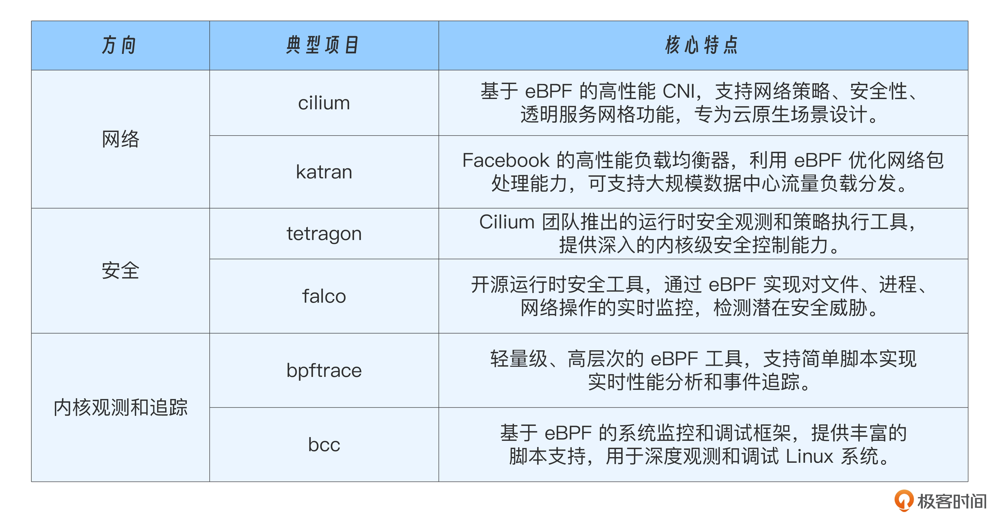

##### (4). 软硬件结合

和以往需要穿越用户态和内核态的转发方式相比，纯用户态或纯内核态的网络转发方式，性能得到了一定提升。然而，所有的处理依然依赖于 CPU，随着流量规模的增加，CPU 处理能力就会逐渐成为瓶颈。为了解决这一问题，可以将一部分网络处理工作（比如分包、组包、校验和、tunnel 加解封装等）卸载到其它硬件。

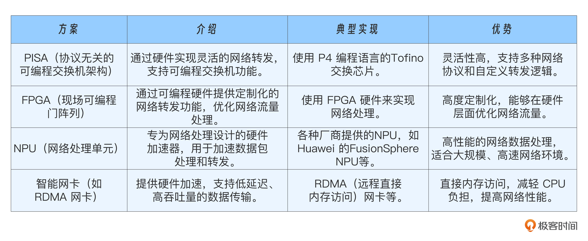

##### (5). 单机架构演进：性能与灵活性的平衡

单机架构中简化处理路径或用硬件为 CPU 分担压力来提升性能。如下是演进的过程。

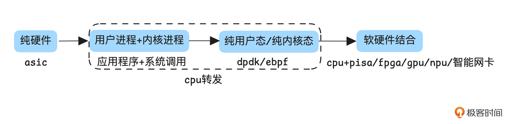

单机网络架构经历了从硬件实现到软件实现，再回归硬件的趋势。这一过程是技术不断权衡与演进的结果，其核心目标是在**性能与灵活性**之间找到最佳平衡。

###### a. 第一阶段：早期，以硬件为主导的高性能网络

在最初的阶段，网络功能主要依赖专用硬件（如 ASIC，Application Specific Integrated Circuit）实现。这类设备包括传统的交换机、路由器、防火墙以及硬件负载均衡设备（如 F5）。 这种架构的显著优势是高性能，但代价是低灵活性。设备的功能基本固化，更新和迭代周期较长，往往以月甚至年为单位。尽管各厂商通过遵循统一的网络协议实现了互联互通，但产品的实现细节差异较大，导致配置复杂、操作繁琐。

###### b. 第二阶段：软件化：灵活性的崛起

随着互联网的快速发展，网络功能逐渐转向纯软件实现，依赖于通用硬件平台。以 SDN（软件定义网络）和 NFV（网络功能虚拟化）架构为代表，这一阶段推动了网络功能在通用硬件上的实现，使得网络软件化成为可能。 纯软件实现的主要优势是高灵活性：功能可以快速迭代，成本和开发周期大幅缩短。借助虚拟化技术和开源生态（如 Linux 的 Netfilter 框架），很多网络功能得以快速部署。然而，这种架构的缺点是性能瓶颈，尤其是用户态与内核态的频繁切换，带来了巨大的性能开销。为解决这一问题，出现了 DPDK（纯用户态转发）和 eBPF（纯内核态转发）等优化技术，通过简化转发路径，显著提升了性能。

###### c. 第三阶段：软硬结合，性能与灵活性的再平衡

随着流量规模的持续增长，尤其是大带宽场景的出现，纯软件实现逐渐无法满足需求。为此，软硬件结合的解决方案应运而生，将部分处理卸载到专用硬件，为 CPU 减负。

###### d. 第四阶段：寻找平衡，变化与不变的分界

单机性能架构的发展本质上是在转发效率与灵活性之间不断寻找平衡。 具体而言，对于变化较大的部分，我们倾向于灵活性，适合采用软件 +CPU 的方式实现；变化较小的部分则倾向于效率，适合卸载到硬件实现。尽管有些硬件具备一定的编程能力（如 FPGA 的 Verilog HDL、Tofino 的 P4），但其灵活性相较软件实现仍然较低，不适合处理复杂逻辑，所以常常被设计成 match-action 这种较为固定的转发逻辑。

通过架构分层设计，将“变化”的部分赋予灵活性，“不变”的部分赋予高效率，不仅满足了性能需求，同时也保留了网络功能的快速迭代能力，从而实现了性能与灵活性的最佳平衡。

