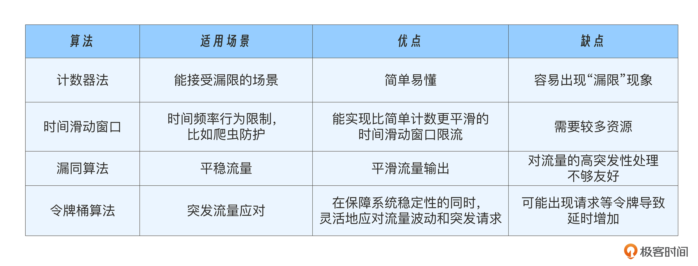

## 限流算法

当今互联网应用中，流量的激增往往不可预见，包括促销、突发事件等；还有网络攻击、恶意流量。限流是一种有效的流量控制手段。它不仅能有效防止单个请求过载系统，还能够保障不同流量来源的公平性，保护系统免受攻击或异常流量的影响，确保用户体验不受破坏。

### 一、计数器

每隔一段时间统计一次请求数量，超过设定的阈值就拒绝请求。

问题点：统计限流的周期粒度过大，容易漏掉跨越多个统计周期的流量峰值，导致“漏限”现象。

举例：条件是10分钟只能处理8个请求。00:05-00:10 有8个请求；00:10-00:15 有8个请求。其中 00:00-00:10总共有8个请求没问题，00:10-00:20 有8个请求没问题。但是 00:05-00:15 有 16 个请求限流失败。

### 二、时间滑动窗口

核心思想：将时间窗口切割的更细，并实时更新请求统计数据，从而平滑流量波动。

具体方法是将一个大的时间窗口分割成多个小的时间段，每个时间段都有独立的计数，随着时间推移，窗口会不断“滑动”，从而避免跨周期的洪峰流量。

时间滑动窗口限流需要动态地管理请求的时间戳，随着时间的推移不断移除过期的请求，并计算当前窗口内的请求数。这就要求系统能够高效地存储和管理这些请求数据，处理大量的动态更新和过期操作。

没有从本质上解决漏限问题，只是通过更小的时间窗口缓解了此问题。但同时更小的时间窗口又带来了系统的性能问题。

### 三、漏桶

核心思想：通过一个固定容量的“漏桶”来容纳请求流量，当请求超出桶容量时将被丢弃。不论请求流入漏桶的速度如何，漏桶都会均匀的将请求漏出。

优势：能够平滑流量输出，保证请求以恒定的速率被处理，从而避免了短时间内大量请求的积压。

缺点：对流量的高突发性处理不够友好。如果请求的流量超过了桶的处理能力，多余能力将被丢弃。

适用场景：需要流量平稳输出，并且可以容忍在高峰时段部分请求被限流的场景。比如场景：

- 稳定的流量输出要求：漏桶算法非常适合那些要求以固定速率稳定处理请求的场景。特别是在带宽和资源有限的情况下，比如音视频流媒体服务，需要保证流量的平稳性，避免因瞬时流量过大而导致服务器资源的过载。 
- 网络带宽控制：在带宽有限的情况下，漏桶算法能够有效地平稳输出流量，避免短时间内的流量高峰对网络带宽造成冲击，防止网络出现过载情况。 
- 防止突发流量压垮系统：对于一些对瞬时流量不敏感，但要求长期保持流量平稳的应用（例如日志采集系统或批量数据处理），漏桶算法能够避免短期内流量过大，影响系统稳定性，确保系统能够平稳运行。

### 四、令牌桶

核心思想：通过向桶中均匀发放令牌来限制流量。当请求到达时，系统会尝试从桶中取令牌，如果有令牌则允许请求通过，否则拒绝请求。令牌桶允许一定的流量突发，因为令牌桶中可以存储一定数量的令牌，从而允许短时间内较大的流量涌入。

优势：虽然允许短期内流量突发，但他通过令牌的积累机制，确保了在流量过高时能够及时限制请求，从而避免系统过载。

适用场景：能够容忍短时间流量突增的场景，同时又希望在长期内保持流量的总体稳定性。比如场景：

- API 网关服务中的流量控制。如果某些 API 的调用频率过高，可以通过令牌桶来限制流量的峰值。令牌的生成速率控制了请求的平均处理速率，而令牌的积累则使得系统能够在流量突增时，继续接受一定数量的请求。 
- 秒杀活动：秒杀活动短时间会涌入很多请求，属于流量突增场景，一旦请求量超过了系统的承载能力，就会根据令牌的消耗情况逐渐限制流量进入系统，避免服务过载。这样既能让合适的、秒杀成功的请求放行到后端得到处理，又能避免系统过载。 
- 实时流量控制：例如即时通讯、金融交易等，令牌桶算法能够平衡实时流量和突发流量之间的需求。在这些场景中，令牌桶可以有效地控制流量波动，同时防止因请求过多导致系统崩溃。

总体来说，令牌桶算法适合那些需要动态调节流量并能够容忍短期突发流量的场景，它能够在保障系统稳定性的同时，灵活地应对流量波动和突发请求。

令牌桶限制的是“你最多能用多少”，漏桶限制的是“你多久才能用一次”。

令牌桶积累的是“发送许可”，可以在空闲期间积累并用于未来突发；漏桶积累的是“实际请求”，它只在请求到来时才增长，且输出被匀速耗尽。因此令牌桶允许瞬时突发且可能立即被下游消化，漏桶则把突发平滑为恒定输出（以延迟换取平滑）。

### 五、如何设置限流阈值

常见是通过压测来确定阈值，压测到系统的极限后，分析瓶颈所在，看看是否需要进行优化。

还可以采用自适应限流方式。这种方式可以通过实时收集下游服务的指标数据（如 CPU 利用率、负载值、网络重传率、内存使用率和错误情况等），结合限流系统的请求耗时和成功率等指标，负反馈式地动态调整限流阈值。

当然自适应限流也有缺点，他需要采集下游服务的各类指标，并将数据反馈给限流系统，这样系统的复杂度和依赖关系会增加。其次，限流的精度很大程度上取决于指标设定的合理性和负反馈周期的时效性，因此需要仔细调整和优化，避免反馈周期过长或反馈数据不准确导致限流效果不理想。

无论使用哪种方式限流，都要做好监控和告警，及时发现指标劣化趋势，然后做出分析和调整。

### 小结

