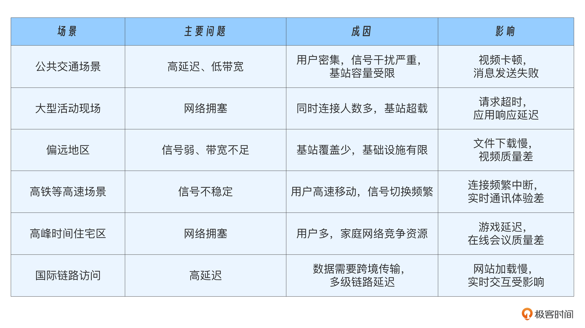

在面对大规模用户时，弱网问题几乎是不可避免的。弱网环境会导致高延迟、网络抖动甚至请求处理失败，严重影响应用的稳定性和用户体验。

### 一、弱网原因

在用户的角度来看，弱网主要体现在“高延迟”和“低带宽”两个方面。

- 高延迟：通常因为信号强度不足或数据包在多级链路中传递导致时间放大
- 低带宽：因为无线干扰、网络负载或远距离传输效率受限而减小。此外，大型活动场所或高用户密度区域也会加剧此问题。

常见的弱网场景及其特点：

### 二、识别弱网

弱网最终会体现在请求的不同阶段的数据上。因此，我们可以通过分析请求在各阶段的网络数据特征，量化弱网的判断标准。

以HTTPS下载为例，我们对每个阶段的关键耗时进行量化。

- DNS 解析时间：从请求发起到完成域名解析所需时间。
- TCP 握手时间：三次握手完成的耗时。 
- SSL 握手时间：完成安全连接建立的时间。 
- HTTP 首包时间：接收到第一个 HTTP 响应字节的时间。 
- 吞吐量：已接收的字节数与统计时间的比值。

采集到这些指标后，我们就可以特征分析。除了关注平均值，还要关注分位值。

还可以通过“主动探测”的方式识别弱网。例如，定期对各 IP 地址进行探测，评估其延时、丢包率等参数，并提前将不达标的 IP 剔除服务链路。

此外，还可以借助手机厂商提供的指标（如无线信号强度）作为补充信息，进一步提升弱网识别的准确性。

### 三、优化手段

优化弱网的两大手段：

- 减法：减少网络交互的次数和传输数据的大小
- 重试：失败情况下通过合理的策略弥补网络的不可靠性

#### 1. 减法

网络上的弱网问题主要表现为高丢包率和低带宽。

- 高丢包率意味着交互失败的概率较高，因此减少交互次数能够显著提升请求的成功率。
- 而低带宽则限制了单位时间内的数据传输量，这让减少交互数据的大小成为必要的优化方向。

**减少交互次数**：可以从“网络协议”和“应用逻辑”两个维度入手

- 网络协议，例如，TCP 长连接可以让多个请求复用同一个连接，而不是每次重新建立连接。如果使用 HTTP/2，那么这种复用已经内置支持了。此外，在加密通信中，SSL 会话复用技术可以避免重复握手过程，而采用 TLS 1.3 协议更是可以进一步减少握手交互次数，大幅降低延迟。
- 应用逻辑，我们可以通过缓存、批量请求和合并发送等方式来减少交互。缓存是一个简单却有效的手段，通过将用户高频访问的数据提前存储在客户端或边缘节点上，弱网中的加载速度会显著提升。比如一些小程序，可以基于用户的行为预测，将可能访问的内容预先下载到客户端上。再比如，批量请求可以将多个小任务打包为一个大请求，合并发送，减少交互频率。

**优化数据大小**：

- 可以利用压缩算法对传输数据进行无损压缩，或者在必要时降低图片和视频的分辨率，甚至允许一定程度的有损压缩。这样可以让用户在弱网环境中更快看到内容，而不会卡在加载界面。

#### 2. 重试

重试的一个前提是服务端要支持“幂等”。

**通过网络协议**：降低重试的成本

- 启用 TCP SACK，允许接收端选择性确认收到的数据段，从而减少因丢包导致的重传范围。
- 启用快速重传，可以在检测到丢包时更快地触发重传，避免因超时等待而延误。此外，这样还能有效防止 TCP 窗口因丢包大幅收缩，从而维持较高的传输效率。

**设置超时时间**：对请求的各个阶段限制针对弱网的超时时间，如 TCP 握手、SSL 握手、首包超时 (请求发出到收到响应的第一个字节的超时时间)，任意一个阶段超时立即开始重试。

**换协议**：使用对移动互联网支持更友好的协议，也可以提升重试成功的概率，比如使用 QUIC，因为其使用 ID 标识一个连接，而不是像 tcp 那样使用四元组，所以在用户网络切换（如移动流量切 wifi）的时候，可以连接迁移。

#### 3. 流式和异常处理

**流式处理**。通过边接收边处理的方式减少用户的等待时间，提升弱网环境下的体验。再如，使用 FEC （Forward Error Correction, 前向纠错） 算法，在牺牲一定的带宽和增加少量冗余数据的前提下，提高数据的抗丢包能力，从而在高丢包率的网络中保证传输的稳定性和数据的完整性。这种技术在 WebRTC 中被广泛应用，用于实时音视频传输，确保在弱网条件下音视频的流畅性和可用性。

**异常处理**。在处理网络异常时，要尽可能保留已经成功传输的数据。以文件上传为例，在低带宽和高丢包的弱网环境中，大文件传输往往容易中断。如果服务能够支持流式追加存储，那么即使每次只传输几百 KB 的数据，遇到网络异常时，已上传的部分也能被完整保留。下一次传输可以从断点继续，逐步积累，直至整个文件上传完成。

