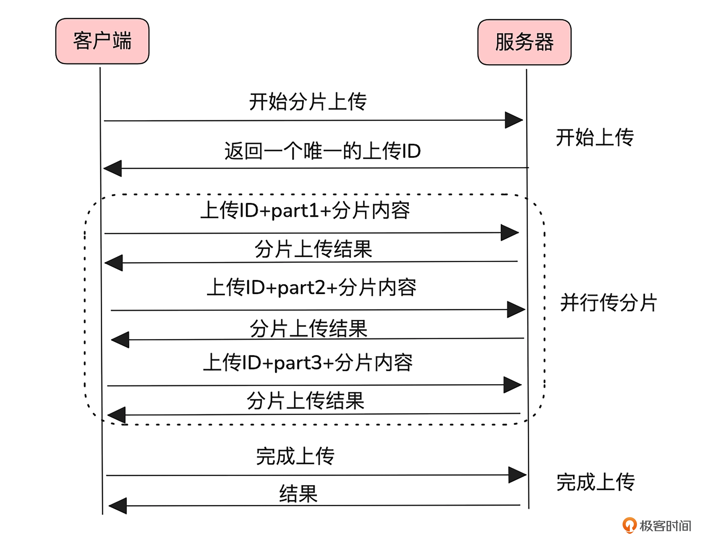

### 一、脏数据问题

脏数据是指由于传输中断、文件损坏或并发操作等原因，导致存储或缓存中的数据与用户实际上传的数据不一致。这种问题往往比传输失败更让用户反感。

一种常见的防范方法是对上传数据进行唯一性校验。通常使用的校验算法包括 MD5 和 CRC。尽管 MD5 能提供更高的准确性，但其计算对 CPU 的性能损耗较大，而 CRC 校验则相对高效，常常被用于网络传输中做数据校验。

### 二、上传方式

上传一个文件由多种方式。

#### 1. 普通上传

只需要客户端文件读取到内存，然后通过HTTP的put请求，就可以上传到服务器了。为了防止脏数据，还可以在http header 中带上文件的 crc 校验值，服务器收完文件校验一下这个值。在对比一下文件前后若干个字节内容即可。

这种方式优点是简单，适合文件较小，网络质量较好的场景。

但面对大文件就会出现问题。大文件可能超出机器内存的负载能力。其次，一旦传输失败，就需要重新上传整个文件，导致资源浪费。特别是在网络状态不佳的情况下，失败的可能性和重试成本都会显著增加。

#### 2. 追加上传

追加上传通过分块读取文件进行逐步传输。每次传输都会携带当前分块的偏移量（offset），即该块内容在整个文件中的起始位置。这种方式有效减少了内存占用，并增强了上传的可靠性。

为了确保上传数据的一致性，服务端会在每次接收到上传请求时，校验客户端携带的偏移量是否与当前已存储文件的偏移量一致。如果不一致，服务端将返回一个错误，提示客户端应该从正确的偏移量开始继续上传。这一机制可以有效避免数据覆盖或丢失。

追加上传还天然支持断点续传功能。上传失败时，客户端只需向服务端查询已成功存储文件的偏移量，从该位置继续上传即可，无需从头开始。这不仅节省了带宽，还显著提高了传输效率。 

这种上传方式特别适用于动态文件和边传边消费的场景，比如直播视频流、视频监控、日志采集等。此类数据在上传时往往无法预先确定文件大小，并需要随着生成过程即时传输。

#### 3. 分片上传

客户端将大文件切分成多个分片，并行上传可以提高效率。如何将多个分片关联到同一文件呢？

- 首先，在开始上传阶段，客户端向服务端请求上传，获取一个唯一的上传 ID。这个 ID 将用来标识该文件及其所有分片。 
- 然后是并行上传分片阶段，每次上传一个分片时，客户端都需要附带该分片的编号和唯一的上传 ID。 
- 最后，在完成上传阶段，服务端根据分片编号和上传 ID，将这些分片按序合并为完整文件。

分片上传比较适合提前下载好的大文件上传场景，比如上传安装包、本地视频等。

### 三、其他优化

**重复文件上传**：提升重复性文件上传的效率。让用户无需浪费时间和带宽去重复上传服务端已有的文件。核心在于文件的唯一标识。客户端会为每个文件生成一个唯一的标识符，这通常是通过特定的校验算法计算得出的。客户端带着唯一标识符上传，服务端在接收上传请求的过程中判断出该文件已经存在，就直接返回上传完成，无需客户端继续上传数据。

**进度条**：上传过程中提供清晰的进度反馈也是提升用户体验的重要因素，尤其是在处理大文件上传时更为关键。

