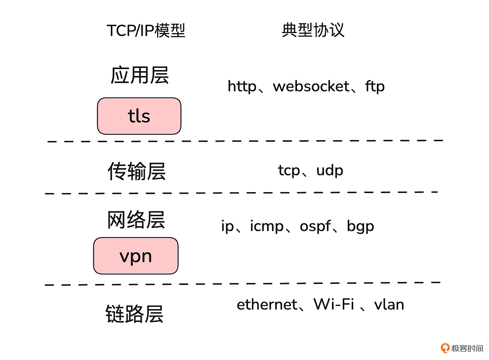
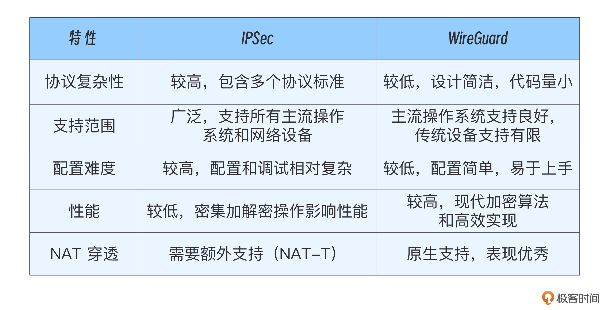
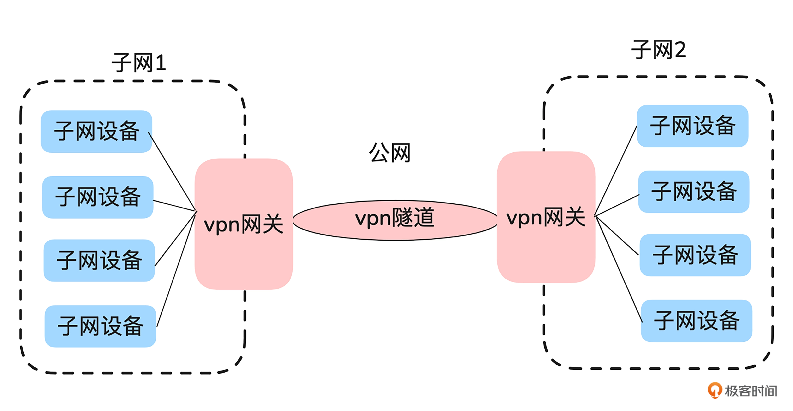
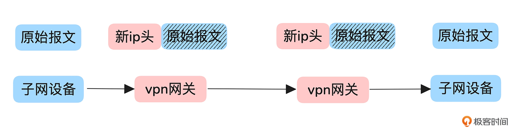

TLS 协议通过在传输层和应用层之间添加一层安全协议，实现了加密、认证和完整性校验。然而，TLS 更适用于点对点的安全通信场景，对于某些需要更通用解决方案的情况，TLS 并不是最优选择。

一个公司的多个办公地点希望通过公网连接，形成一个逻辑上的统一网络，不仅需要确保通信的安全性，还希望异地操作能像局域网内一样方便，比如访问远程办公的共享文件夹，而不需要额外的加密配置。此时，VPN（虚拟专用网络）就成为一种理想的解决方案，它通过在网络层建立安全的隧道，既满足了数据加密的需求，又让跨网络的操作更加流畅和便捷。

## 一、VPN原理

如下讨论的是工作在IP层，具有安全功能的VPN。不包括基于SSL的VPN（如OpenVPN）

VPN（Virtual Private Network，虚拟专用网）是一种通过公共网络来安全地扩展专用网络的技术。VPN 通过在公共网络中创建一个虚拟的、加密的隧道，使用户可以安全地在公共网络上传输数据，仿佛他们的设备直接连接到了专用网络上一样。这种技术不仅提升了专用网络的功能和安全性，还可以让用户在公共网络上访问原本无法直接访问的资源，因此 VPN 常被应用于远程办公、跨分支机构组网等场景。

VPN的核心理念就是“公网私用”。用于企业组网的VPN通常是在网络层（IP层）实现了加密、认证、完整性校验与防重放。

由于VPN工作在网络层，所有数据都会通过IP层传输。因此VPN可以对任意基于IP的通信进行加密和保护。

### 1. IPSec 和 WireGuard

工作在 IP 层的 VPN 协议中，IPSec协议是目前网络设备中支持最广泛的协议。同时被 Linux之父誉为“艺术品”的 WireGuard 协议也值得关注。

IPSec 的优势在于存量网络设备支持较为完善，缺点在于复杂度高。而 WireGuard 优势在于简洁，已经被集成到了 Linux 内核，但是传统的网络设备支持有限。

### 2. 组网

不同子网的用户能够像直连到专用网络上一样，跨越公网发送和接收数据，主要归功于 VPN 的加解密功能不在客户端进行，而是通过 VPN 网关来完成。因此，对于用户来说，只需要将流量通过路由引导到 VPN 网关，剩下的隧道建立和加解密等功能都由 VPN 网关处理即可。

虽然部分 VPN 协议支持传输模式（保留原始 IP，只对 IP 的有效载荷进行加密），但在实际应用中，子网之间的互通一般使用隧道模式，因为隧道模式可以封装完整的 IP 数据包，适用于更广泛的场景。

子网 1 和子网 2 通过两个 VPN 网关建立了一个安全的隧道。子网内的设备如果需要与对端子网通信，只需要将目标子网的路由指向本地的 VPN 网关。这样，数据包就会被发送到 VPN 网关，而 VPN 网关会完成数据包的隧道封装和加密。

如下是隧道模式下数据包的封装变化。

当子网1的设备需要访问子网2的设备时，数据包的流转过程如下：

- 子网 1 的设备通过路由，将报文发送到本地 VPN 网关。 
- VPN 网关接收到数据包后，会对其进行封装。首先，在原始数据包的外层添加一个新的公网 IP 头，指向对端 VPN 网关。然后对原始数据包进行加密，生成隧道报文。 
- 封装好的数据包通过公网发送到对端 VPN 网关（通常使用 UDP 协议监听固定端口，比如 Wireguard vpn 默认使用 51820 端口，IPSec vpn 默认使用 500 和 4500 端口）。 
- 对端 VPN 网关收到报文后，首先进行解封装，移除隧道头。然后解密报文并完成认证检查。 
- 解密后的原始数据包会被转发到子网 2 内的目标设备，像普通路由报文一样处理。

整个过程对于子网中的设备来说是完全透明的。它们既不需要额外配置，也无法感知到跨越公网的过程，仿佛只是在一个局域网内通信。

对于远程办公的用户，没有固定的VPN网关。此时通常会在自己的终端设备（笔记本、手机）上安装VPN软件，使自己的设备充当临时的VPN客户端网关。通过这种方式，也可以在外部网络中安全的访问公司内部资源。

### 3. 关键概念

无论是通过固定网关的子网连接，还是外部用户的临时接入，本质上都是通过路由将流量引导至 VPN，然后通过 VPN 将流量封装进隧道，穿越公网后发送到目的网络所在的 VPN。

有几个关键问题：

- VPN 网关是怎样知道需要其他 VPN 保护哪些子网流量的？
- VPN 网关又是怎样知道将哪些流量的请求发往哪些 VPN 的？ 
- VPN 网关之间是怎样使用相同的加密、认证等材料的？

这些信息通过VPN隧道建立时的协商来完成。协商过程主要是为了确定使用的加密算法、认证算法、交换双方要保护的子网范围等信息。

