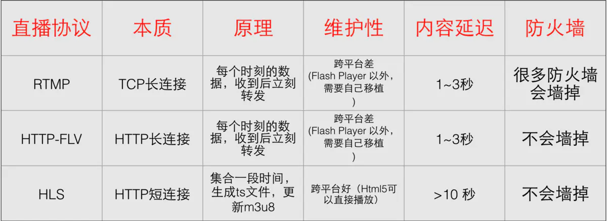

## 基础概念

流媒体开发，

- 编码层，H264 压缩视频帧、ACC压缩音频帧
- 封装层，FLV 或 TS 把压缩后的数据打包
- 协议层，RTMP 或 HLS 规定如何在网络上传这些包
- 网络层，socket 或 st（协程库）负责实际的 TCP/UDP收发

GOP（Group Of Pictures）画面组，一个GOP就是一组连续的画面，每个画面就是一帧，一个GOP就是多帧的集合。

-  直播的数据，其实是一组图片，包括I帧、P帧、B帧，当用户第一次观看的时候，会寻找I帧，而播放器会到服务器寻找到最近的I帧反馈给用户
- 因此，GOP Cache增加了端到端延迟，因为它必须要拿到最近的I帧。GOP Cache的长度越长，画面质量越好

码率：图片进行压缩后每秒显示的数据量。

帧率：每秒显示的图片数。影响画面流畅度，与画面流畅度成正比：帧率越大，画面越流畅；帧率越小，画面越有跳动感。 

- 由于人类眼睛的特殊生理结构，如果所看画面之帧率高于16的时候，就会认为是连贯的，此现象称之为视觉暂留。并且当帧速达到一定数值后，再增长的话，人眼也不容易察觉到有明显的流畅度提升了。
- 

分辨率：(矩形)图片的长度和宽度，即图片的尺寸

视频封装格式：一种储存视频信息的容器，流式封装可以有TS、FLV等（不需要全局索引），索引式的封装有MP4,MOV,AVI等，

-  主要作用：一个视频文件往往会包含图像和音频，还有一些配置信息(如图像和音频的关联，如何解码它们等)：这些内容需要按照一定的规则组织、封装起来.
- 注意：会发现封装格式跟文件格式一样，因为一般视频文件格式的后缀名即采用相应的视频封装格式的名称,所以视频文件格式就是视频封装格式。
- TS 是一种封装格式，不需要加载索引再播放，减少了首次载入的延迟。如果内容比较长，mp4 文件的索引相当大，影响用户体验。两个TS片段可以无缝拼接，播放器可以连续播放。
- FLV 形成的文件极小，加载速度极快。

## 一、直播传输协议

#### 1. RTMP协议

RTMP，全称 Real Time Messaging Protocol ，即实时消息协议。一般情况最少都会有几秒到几十秒的延迟，底层是基于 TCP 协议的。默认端口是1935。是一个协议族，包括RTMP基本协议及RTMPT、RTMPS、REMPE等多种变种。

优势：

- RTMP 协议底层依赖于 TCP 协议，不会出现丢包、乱序等问题，因此音视频业务质量有很好的保障。
- 使用简单，技术成熟。有现成的 RTMP 协议库实现，如 FFmpeg 项目中的 librtmp 库，用户使用起来非常方便。而且 RTMP 协议在直播领域应用多年，技术已经相当成熟。
- 市场占有率高。在日常的工作或生活中，我们或多或少都会用到 RTMP 协议。如常用的 FLV 文件，实际上就是在 RTMP 消息数据的最前面加了 FLV 文件头。
- 相较于 HLS 协议，它的实时性要高很多。

劣势：

- 苹果公司的 iOS 不支持 RTMP 协议，按苹果官方的说法， RTMP 协议在安全方面有重要缺陷。
- 在苹果的公司的压力下，Adobe 已经停止对 RTMP 协议的更新了。
- 不支持 H265

#### 2. HLS协议

HLS，全称 HTTP Live Streaming，是苹果公司实现的基于 HTTP 的流媒体传输协议。它可以支持流媒体的直播和点播，主要应用在 iOS 系统和 HTML5 网页播放器中。

原理：它是将多媒体文件或直接流进行切片，形成一堆的 ts 文件和 m3u8 索引文件并保存到磁盘。当播放器获取 HLS 流时，它首先根据时间戳，通过 HTTP 服务，从 m3u8 索引文件获取最新的 ts 视频文件切片地址，然后再通过 HTTP 协议将它们下载并缓存起来。当播放器播放 HLS 流时，播放线程会从缓冲区中读出数据并进行播放。

HLS 协议的本质就是通过 HTTP 下载文件，然后将下载的切片缓存起来。由于切片文件都非常小，所以可以实现边下载边播的效果。HLS 规范规定，播放器至少下载一个 ts 切片才能播放，所以 HLS 理论上至少会有一个切片的延迟。

传输内容包括两部分，一是 M3U8 描述文件，二是 TS 媒体文件。实现流媒体的直播和点播。HLS是以点播的技术来实现直播。

优势：

- RTMP 协议没有使用标准的 HTTP 接口传输数据，在一些有访问限制的网络环境下，比如企业网防火墙，是没法访问外网的，因为企业内部一般只允许 80/443 端口可以访问外网。而 HLS 使用的是 HTTP 协议传输数据，所以 HLS 协议天然就解决了这个问题。
- HLS 协议本身实现了码率自适应，不同带宽的设备可以自动切换到最适合自己码率的视频进行播放。实现方法是服务器端提供多码率视频流，并且在列表文件中注明，播放器根据播放进度和下载速度自动调整。
- 浏览器天然支持 HLS 协议，而 RTMP 协议需要安装 Flash 插件才能播放 RTMP 流。

劣势：

- 实时性差，由于 HLS 往往采用 10s 的切片，所以最小也要有 10s 的延迟，一般是 20～30s 的延迟，有时甚至更差。
- HLS 使用的是 HTTP 短连接，且 HTTP 是基于 TCP 的，所以这就意味着 HLS 需要不断地与服务器建立连接。TCP 每次建立连接时都要进行三次握手，而断开连接时，也要进行四次挥手，基于以上这些复杂的原因，就造成了 HLS 延迟比较久的局面。
- HLS协议的小切片会生成大量文件，存储或处理这些文件会造成大量资源浪费。但是一旦切分完成，之后的分发过程就不需要额外使用任何专门软件，普通的网络服务器即可，这就降低了CDN边缘服务器的配置要求。

#### 如何选择 RTMP 和 HLS

RTMP协议适用：

- 流媒体接入，也就是推流
- 流媒体系统内部分发。因为内网系统网络状态好，使用 RTMP 更能发挥它的高效本领。

HLS协议适用：

- 移动端的网页播放器
- IOS要使用HLS，因为不支持RTMP协议
- 点播系统最好使用 HLS 协议。因为点播没有实时互动需求，延迟大一些是可以接受的，并且可以在浏览器上直接观看。

从延迟角度来看，HTTP-FLV 要优于 RTMP

- RTSP：实时流传输协议,定义了一对多应用程序如何有效地通过IP网络传送多媒体数据.
- RTP：实时传输协议,RTP是建立在UDP协议上的，常与RTCP一起使用，其本身并没有提供按时发送机制或其它服务质量（QoS）保证，它依赖于低层服务去实现这一过程。
- RTCP：RTP的配套协议,主要功能是为RTP所提供的服务质量（QoS）提供反馈，收集相关媒体连接的统计信息，例如传输字节数，传输分组数，丢失分组数，单向和双向网络延迟等等。

## 二、封装格式

封装格式（MP4、FLV），表示：是什么内容？

#### FLV封装格式

FLV 文件是一个流式的文件格式。该文件中的数据部分是由多个 “PreviousTagSize + Tag”组成的。这样的文件格式，我们可以将 音视频数据随时添加到 FLV 文件的末尾，而不会破坏文件的整体结构。

在众多的媒体文件格式中，只有 FLV 具有这样的特点。像 MP4、MOV 等媒体文件格式都是结构化的，也就是说音频数据与视频数据是单独存放的。当服务端接收到音视频数据后，如果不通过 MP4 的文件头，你根本就找不到音频或视频数据存放的位置。

因此，FLV适合音视频录制。比如在线教育场景中，老师可以随时开播、关播。最终只需要把多个 FLV 文件拼接在一起即可。

FLV 相较 MP4 等多媒体文件，它的文件头是固定的，音视频数据可以随着时间的推移随时写入到文件的末尾；而 MP4 之类的文件，文件头是随着数据的增长而增长的，并且体积大，处理时间长。因此， FLV 文件相较于其他多媒体文件特别适合于在录制中使用。

