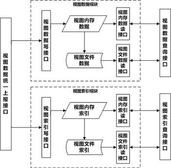
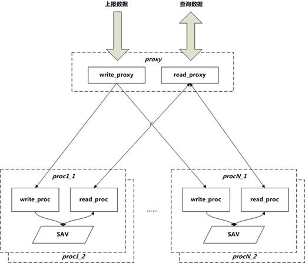
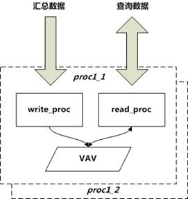
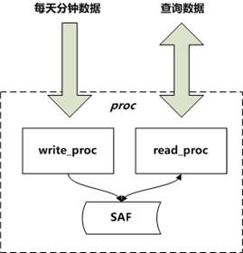
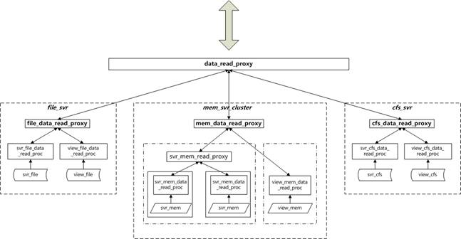

## 一、总体架构设计

量级：承载了 100w 左右的服务器和 2w多个视图的监控

#### 1. 基础概念

- 服务器：被监控的业务服务器，部署 agent，将采集到的信息发送到监控系统；在 monitor 中用 server_id 来唯一标识
- 视图：自定义的服务器集合，通常是以一个或多个业务下的服务器为集合创建，视图反映的是一个或多个业务汇总之后的整体情况；在 monitor 监控系统用 view_id 来唯一标识
- 属性：每个监控点称为一个属性。用 attr_id 来唯一标识。（server_id，attr_id）用于标识服务器上的某个监控点，（view_id，attr_id）用于标识视图的某个属性点

上报数据模型 `{(server_id, attr_id, timestamp) -> value}` 或者 ` {(server_id, attr_id) -> value[n]} ` 通常将 timestamp 离散化为 1440 分钟，系统的采集数据的最小粒度为 1 分钟，此时数据模型如后者，其中 n 为 timestamp 离散化后对应的分钟下标。

基础数据构成

- 服务器的监控数据： ` (server_id, attr_id) -> value[0-1439] `
- 视图的监控数据： `(view_id, attr_id) -> value[0-1439]`

基础索引构成

1. 服务器的相关索引
    - server_id->attr_id[1~N]：指明服务器中有上报哪些监控点
    - attr_id->server_id[1~N]：指明某个监控点都有哪些服务器有上报
2. 视图的相关索引
    - view_id->attr_id[1~N]：指明视图中有关注哪些监控点
    - attr_id->view_id[1~N]：指明某个监控点都在哪些视图中有关注

#### 2. 总体架构

- 单机数据存储模块（提供单机数据和索引的存储和读取）
    

- 视图数据存储模块（提供视图数据和索引的存储和读取）
    

## 二、数据存储模块设计

### 1. 内存数据部分

##### (1). 服务器监控数据

占用资源分析：

- 内存分析：保存两天的内存数据，因为用户访问最近两天的数据频率是最高的。另外，存放两天内存数据，可以保证只需要简单的遍历内存就可以将前一天的数据保存成文件，而不需要逐个小时的收集数据。
    2 天数据，每天 1440 个数据点（每个点 4 字节），10 个字节左右的辅助信息，每个节点占用内存大约 12 KB（`3000 * 4 = 12 KB`）
    服务器总数 100w，平均每台服务器有 200 个属性上报，因此总节点数据占用内存大约为 `100w * 200 * 12KB = 2400GB = 2.4 TB` 

    后端单台内存存储机器大约存储 4w 多台机器的上报，单台内存存储机器分配内存空间约为 `4w * 200 * 12KB = 96GB`，再预留一定的 buffer，所以分配 150GB 的内存空间

- 网络流量分析：网络流量大约为 `25.6 MBit/sec`，其中：假设每台机器每分钟上报 3 次，每次上报 200 个属性，属性 id 和值各占 4 字节，总共有 4w 台服务器，那么接口机流量为 `3 * 4w * 200 * 8 * 8 / 60 = 25.6 Mbit/sec` 

- CPU 占用率：CPU 的占用率主要是在汇总视图的时候会频繁使用，后续再讨论

- 磁盘IO：磁盘 IO 低，一般只是定时把内存数据 dump 一份到文件，可以保证死机之后重建共享内存

如上，瓶颈主要是在内存占用方面。且为了考虑容灾，使用相等数量的机器作为冗余，即主机 N 台，备机 N 台。

- 数据采用一致性哈希的算法按照 server_id 进行打散。该算法基本保证每台服务器的数据量的均匀性，并且扩容时迁移的数据比较少
- 数据被平均划分到不同的proc(proc1….procN)中，其中每个proc都是2台服务器互备的。采用热备的方式，上报数据会双写到主备服务器，由于数据一致性要求不太高，所以主备数据没有强校验。读的时候主备服务器都可以同时提供服务，当某台服务器出现问题或者被手动禁用掉的时候，此时负载会集中到另外一台服务器上
- proxy也是主备同时提供服务（图中为了方便理解，没有展示出来）。读请求也是会分担到主备两台proxy上，防止出现单点问题。至于write_proxy如何将多路数据合并为一路数据写到后端proc，会在《monitor3.0模块设计之容灾与扩容》中详细介绍。
- proxy与proc之间长连接，有心跳，如果发现心跳不正常，并产生告警出来，收到告警之后可以人工到数据库中将标志位设置为禁用状态。
- proc中的数据存储在共享内存中。共享内存的好处是进程重启数据还在，对于上报类业务特别适用。共享内存中的结构是多阶hash
- 工具方面。有工具负责将共享内存中的数据定时dump到文件中，防止主备同时down掉的时候，可以快速重建共享内存。还有工具负责监控共享内存的使用率，当超过设定值会产生告警，及时扩容。

##### (2). 视图监控数据

占用资源分析

- 内存分析：保存两天的内存数据。与服务器监控数据类似，节点占用内存大小约为 12 KB，视图总数 2w 个，平均每台服务器有 200 个属性，总节点占用内存大小为 ` 2w * 200 * 12KB = 48GB ` ，再预留一定 buffer，所以分配 60+ GB
- 网络流量：大约为 `3.84 Mbit/sec`。其中假设每台机器每分钟上报一次，每次上报 60 个属性，每次平均汇总 30 分钟数据，每个数据 4 字节，总共有 4K 个视图，那么流量为 `1 * 4k * 60 * 30 * 4 * 8 / 60 = 3.84 Mbit/sec` 
- CPU 占用率：CPU 占用率很低，视图服务器不需要进行汇总
- 硬盘 IO：不高，一般只是定时把内存数据dump一份到文件，可能保证死机之后可以快速重建共享内存

瓶颈在内存方面，同样使用主备

- 单台机器可以保存全量的视图数据，所以不需要分布式部署
- 主备容灾与前面的类似
- 视图数据存在共享内存中，与之前的类似

### 2. 磁盘文件数据部分

##### (1). 服务器监控数据

占用资源分析：

- 日监控数据占用磁盘空间大约为48GB。文件的存储结构与内存不同，分为偏移索引和数据两部分，但是节点占用空间与内存节点差不多，简单估算为6kB(内存的12kB是两天数据)。`100w * 200 * 6kB = 1.2TB` 左右（100w台上报机器，200个属性，一天数据6KB）。缓存近3个月的数据。磁盘至少要 108 T左右的大小。
- 保存文件大约需要半个小时左右。保存文件是从内存中读取一天的数据，顺序写入到硬盘，io效率高，本地磁盘顺序写可以达到百M/s，所以主要考虑网卡的速度。为了节省带宽资源，保守按照 200Mbit/s 的网卡传输速度估算（控制发送频率），也就是 25MB/s 的写文件速度进行存储，一台机器负责 4w 台上报机器大约需要 `48GB / 25(MB/s) = 1920s = 0.53(hour)` 

- 每天保存一次文件数据。通过write_proc写入到文件中，大约用时半小时。
- 后面介绍的挂载CFS盘的机器，负责在该机器出现故障的时候，提供冷备份功能
- SAF是存储的文件数据。其中文件按照server_id或者view_id划分，每个id对应一个文件。每个文件由分为索引块和数据块：索引块负责快速查找到某个属性的数据存储对应的文件偏移，数据块负责存储具体某个属性对应的数据

##### (2). 视图监控数据

占用资源分析：

- 日监控数据占用磁盘空间大约为 `24GB` ，`2w * 200 * 6kB = 24GB` 左右（2w 个视图，200个属性，一天数据6KB）。缓存三个月数据，磁盘需要大约 2.1T 

保存文件、容灾和单机类似

### 3. CFS 文件数据部分

CFS(cloud file storage)云文件存储，是由架构平台部提供的海量数据存储解决方案。其优势在于，使用起来与本地磁盘一样，但是对使用方而言，这个硬盘容量是非常大的（简单可以理解为无限大），其内部的扩容和容灾对用户是透明的。

CFS为我们存放3个月以前的全量历史监控数据。这里可能会想，为什么有了CFS，我们还需要提供本地磁盘的方式存储近3个月的数据呢？原因是，经我们测试发现，CFS的读取效率较本地磁盘的性能还是差一些的，大约慢了10~15倍左右(同样的文件，单进程单线程执行循环读取10次，普通磁盘用时5s，cfs读取用了1min27s)。所以我们把冷热数据分离，把相对更冷的数据放在CFS，从而避免我们自己搭建集群的麻烦。

另外值得一提的是，CFS的能力也是在不断提升的，从CFS1.0到CFS2.0，效率提升就非常明显。所以更高性能的CFS是值得期待，如果CFS能够提供接近本地磁盘的性能，那么前面介绍的本地磁盘模块就可以退出历史舞台了。

### 4. 分钟数据存储的整体架构

- **协议统一**。为了提供更加一致的数据拉取接口，我们对视图和服务器的监控数据做了一次统一，由 (id_type, id, attr_id) 三元组唯一确定拉取的数据对象。其中id_type为1表示是单机数据，2表示是视图数据。
- **分层设计**。分为3层：最底层是与具体数据(内存、文件、cfs数据)打交道，并且提供自身集群的路由功能(单机内存数据采用一致性hash方式进行路由)；上面一层提供视图和服务器统一的拉取数据的接口，从而对外就隐藏了服务器和视图数据分离的信息；再往上一层是统一接口层，负责将请求数据按照时间进行分割，2天内的数据路由到内存模块拉取数据，3个月内的数据路由到本地磁盘数据模块拉取数据，3个月以上的数据路由到CFS模块拉去数据。这样对外提供的接口非常简单，请求数据方不需要关系数据到底是在哪个模块存储，到底以什么样的介质存储等信息。
- **最小化数据传输**。协议中可以指定beg_time和end_time，从而只拉取 `[beg_time, end_time)` 这个时间段内的数据。至于拉取的数据是什么，还可以通过传入一个bit_flag，用于指定需要返回的是时间段内的详细分钟数据，还是只返回这个时间段的总量、最大值、最小值等。这样可以最小化数据的传输，提升传输效率。

## 三、索引存储模块设计

数据的基本格式：

- 服务器数据：`(server_id, attr_id) -> value[0 - 1439]`
- 视图数据： `(view_id, attr_id) -> value[0 - 1439]`

其中 `(server_id, attr_id)` 、 `(view_id, attr_id)` 就是索引，是一个复合索引。拿服务器索引举例：

- `server_id -> attr_id[0 - N]` 这种关系反映了某台服务器当前（以天为单位）有实时上报哪些属性
- `attr_id -> server_id[0 - N]` 这种关系反映了某个属性当前（以天为单位）有哪些服务器正在上报

当然除了直接按照某个 server_id 和 view_id 来查询 attr[0 - N] 之外，还需要提供一些计算交集和并集等汇总能力。例如：多个 server 上报有哪些相同的属性？多个 server 上报的属性的并集 等等

