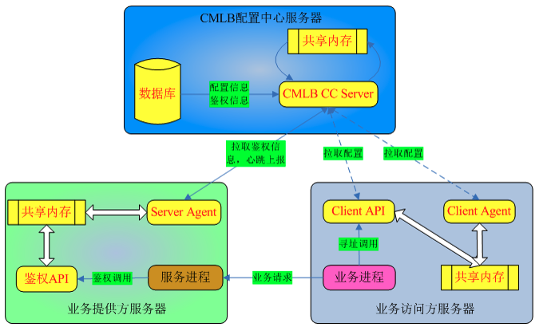

## CMLB

comm load balance system，通用负载均衡系统。是一个具有路由寻址、负载均衡的名字服务系统。CMLB 实现了同IDC、同城、同国、同洲级别的就近寻址功能；支持 IP 静态权重寻址，并支持寻址调用方根据回报统计结果动态调整目标 IP 的权重或禁用不可用 IP 。通过 agent 检测服务器的心跳达到剔除问题机器。

### 一、主要特性

1. 就近寻址
2. 寻址性能高，1000 个服务器寻址能达到 200w 次/秒
3. 支持静态权重，并能根据回包成功率动态调节权重
4. Weighted Round-Robin负载调度
5. 配置中心自动禁用无心跳的 server 
6. CMLB API 全异步化，支持多线程

### 二、CMLB架构/组成

cmlb_client 多久拉取配置中心一次

1. 如果有新的 appid
2. 如果上次拉取成功，则需要等待间隔时间大于 30 秒 ，如果上次拉取失败，则等待 1 秒
3. 使用 tcp 拉取配置，短连接

在提供的 SDK 做回包统计、权重变更、禁用解禁IP的逻辑。agent 只是做简单的拉取数据、写共享内存。假如 agent 挂了，只会说配置无法更新，但也不会影响业务逻辑。如果大量逻辑在 agent 做，就会导致强依赖 agent，而回包统计、权重变更等逻辑是一个不变的逻辑，也就是说即使 agent 挂了，cmlb 服务依旧可用，只不过无法更新。

### 三、功能

#### 1. 寻址策略

寻址策略的原则是：首先按照就近原则查找可用的 Server，找不到可用 Server 时，从不可用 Server 中按照就近原则查找一台。选择 server 的优先级如下：

1. 依次查找同 IDC 的可用 server、同城、同国、同洲的可用 server 
2. 查找任意 IDC 的可用 server
3. 依次查找同 IDC 的不可用 server、同城、同国、同洲的不可用 server 
4. 返回兜底 server，调用成功情况下，会存储三个兜底 IP（使用前三次寻址结果）

当上述过程中选择出多个 IDC 或者多个 server 时，按照 Weighted Round -Robin算法选择一个 IDC 或者 server 出来。

#### 2. 权重与寻址范围动态调整

同 IDC 会出现这样的问题，比如业务调用方的业务部署变化、请求量突变等各种原因，可能会导致业务提供方的某个 IDC 负载过高，导致过载。当然业务提供方可以给该 IDC 扩容，但这样效率低下，难以满足动态环境要求，理想情况是能做到出现过载时把请求迁移到其他低负载的 IDC 或城市。

CMLB API 提供了回报统计的功能，可以在寻址客户端本地动态调整本地配置的权重以及寻址范围。当 IDC 过载时通过降低该 IDC 的权重以及提升寻址范围，把部分请求迁移到其他 IDC。回报统计首先会按每分钟统计当前寻址客户端机器寻址到的各个 IP 的访问成功率，当 IP 访问成功率不足 100%时，就将降低这些 IP 的权重或禁用 IP。当前寻址范围的可用权重降低到 70%以下时，就提升一级寻址范围，直到该寻址范围内的可用权重超过 70% 或提升到最高寻址范围。

比如：深圳南山区的业务调用发现业务提供方的南山区的可用权重降低到了南山区原始权重的 70% 以下，则提升寻址范围到同城，即在深圳范围内寻址，这样就把请求量分出一部分到其他 IDC。这样的调整时本地进行的，只会影响本机，不影响其他业务调用方机器的寻址，当然其他调用方的机器也会根据负载情况自动调整。当一个 IP 的成功率达到了 100% 时，则会逐渐恢复该 IP 的权重。当低一级寻址范围内的可用权重恢复到了 80% 以上时，则会降低寻址范围。

同时部署在业务机器上的 Agent 会定时上报心跳到 CMLB 后端，如果 Agent 上报心跳出现问题，则 CMLB 后端会下发配置禁用掉这台机器。

#### 3. 回包统计逻辑

基本逻辑：

- 统计信息以业务 AppId + 寻址到的 IP 为最小粒度
- 业务每调用寻址 API 一次，把发送包计数加1；业务成功收到回包时，把成功收包计数加 1，并把连续失败计数置0；业务超时时，把连续失败计数加1
- 以 1 分钟为 1 个统计周期，在周期结束时计算成功率（成功率 = 成功收包计数 / 发送包计数）
- IP 被禁用时，其连续禁用计数加 1，当该 IP 的权重恢复到 100% 时，将该连续禁用计数清 0 

IP 禁用逻辑：

- 当连续失败的计数超过特定值（初始值为20），且连续失败的时间超过 5 秒，则立即禁用
- 这个 IP 当前周期的成功率小于 80% 
- 当前周期结束时，该 IP 的可用权重已下降到 50% 以下，则禁用

IP 权重下降逻辑：

- 当前统计周期的访问成功率低于99%，且大于80%时，新权重等于当前权重乘以当前周期成功率的N次方(N当前是4，是为了加快权重下降的速度，让出现异常访问失败的IP尽快被禁用掉)

IP 禁用恢复逻辑：

- 对于有禁用IP的某个AppId，每发出10000个包后，发3个包探测第一个禁用IP，若该IP的连续禁用计数大于1，则除了满足发送10000个包的条件，还要满足10分钟的等待间隔才发探测包
- 3次探测后发送2秒后查看是否都成功收到了回包
- 若都收到了回包，则把IP的权重恢复到60%
- 若没有全部收到回包，则把该IP移到禁用队列尾部，再发送10000个包后，探测下一个IP
- 在要探测一个IP时，先检查该IP是否还在寻址配置信息中(可能配置更新，该IP已被删除了)，若已不存在，则不用再探测

IP 权重上升逻辑：

- 当该IP的的当前可用权重小于100%，且当前周期的成功率大于等于99%，则该IP的权重提升为：当前可用权重+不可用权重*10%
- 当可用权重提升到99%时，设为100%

寻址范围级别提升逻辑：

- 寻址级别分为：同IDC、同城、同国、同洲、所有IP
- 一旦发现当前寻址范围内的IP的总可用权重下降到70%以下时，则向上提升寻址级别，一直提升到最大或可用权重大于70%

寻址范围级别恢复逻辑：

- 当有IP的权重增加时尝试恢复寻址级别
- 当下一级寻址范围的可用权重大于80%时，则调整寻址范围到下一级，一直调整到最低级别或可用权重小于80%

### 四、工作内容和问题

刚毕业来公司的前三个月主要是熟悉项目，做一些简单的优化工作

CMLB 系统后台注册机器数量在 80w（服务端）

#### 1. 协议数据加上了版本号，保证了数据一致性，之前可能会拉取到旧的配置信息 

数据传输过程逻辑存在缺陷，有几率返回旧的、错误的数据，为了保证客户获取到的数据的准确性，更新了传输数据协议，通过增加版本号的方式解决了服务端数据不一致的问题。

之前的逻辑是一台客户端启动时选择一个配置中心服务器后，如果这个服务器不挂掉或者不出现异常，就会一直与它连接获取配置，从而保证获取的配置信息不会出错。但是有一个问题，会导致一致性问题的出现， 比如：配置中心某个机器挂掉了或出现了异常，和它连接的客户端就会去获取配置中心其他机器，而此时获取到的机器的配置还未更新缓存信息；将导致返回给客户端错误的信息（比较老的配置信息）。不满足数据一致性。

解决：分业务（appId），给不同的业务（appid）的信息加上一个 64 位的版本号；如果发现客户端的版本已经大于服务端，则从客户端更换服务器的同时，也发送命令字让服务器更新缓存信息。保证数据不发生错误。

对于配置信息无法实时同步给客户端的问题，从技术上，因为客户端是采用轮询的方式去获取服务端的数据的，因此数据延迟是轮询的间隔时间；因此理论上无法很好的解决实时的问题。可以采用 WebSocket 的方法，建立长连接，由服务器发送消息到客户端。但是这种方式会使服务端变成有状态的，需要保存客户端的状态。

#### 2. 配置中心服务器单点负载过高问题，线上观测发现在三个cc server中，按照配置文件中顺序，第1台的CPU利用率长期远高于另外2台。发现客户端在发送配置请求时对于配置中心的 server 的选择算法存在缺陷

为了解决配置中心服务器单点负载过高以及流量穿越等问题，优化客户端请求配置中心的服务器的选择算法，并且根据客户端 IP 的地域选择就近

之前客户端与服务端连接采用的逻辑：

1. 思想很简单，循环遍历配置中心 server 队列
2. 触发重新选择 cc server 的情况有：
    - 当轮询 IO 事件超时（1000毫秒）发现没有 IO 事件
    - 收到的字节数为空说明当前 cc server 不可用，即重新选择
3. 问题出在当前 cc server 是可用的，就不会重新选择，直接导致第一个可用的 cc server 负载过高

解决：

在第一次发送拉取请求时，从 cc server 列表中随机选择一个，此后如果不可用则按照原有逻辑依此查找可用 cc server，从而避免单点负载过高

并且我们希望能够根据客户端的 IP 就近选择一个后端 server，减少流量穿越。我们会在拉取到的所有后端 server 中挑选和客户端处于同一地域的，在随机选择一个作为要连接的对象。

#### 3. cmlb server 的进程监控功能 

为了补齐功能，满足业务需求，增加进程监控功能，实时设置客户机器地域信息服务，实时同步数据到其他负载均衡系统服务。

**进程监控功能**：CMLB目前依赖于Server Agent的心跳上报来监控业务机器的状态，当配置中心30秒内没有收到一个Server IP的心跳上报后，会把该IP置为不可用。但在某些场景下，会出现Server Agent正常并做心跳上报，但业务进程异常，已经不能提供服务。对于这种情况，在目前的逻辑下，CMLB配置中心依然会认为该IP是正常的，但这不是业务所期望的。为了解决类似这种场景的问题，CMLB Server端提供了进程监控功能，当业务进程异常时可以迅速禁用该机器。

进程监控实现原理：

1. Server Agent提供一块保存进程监控信息的共享内存
2. 业务进程调用Server API的初始化函数，表明自己要被监控，同时定期(至少每秒1次)调用Server API的进程信息上报函数（写共享内存）
3. Server Agent不断扫描这些进程上报信息，来判断进程是否正常(包括进程个数是否正确)，若有异常则立即向配置中心发送禁用该IP的请求
4. 进程重启不受影响（进程内部会一直上报当前进程的状态是否OK（写共享内存））
5. 机器重启时，Server Agent启动后，只有当业务进程满足了监控条件才会启用该机器

通过 /proc/pid/exe 拿到软链接（readlink），就是进程二进制存放位置（进程的全路径为依据）。定时监测此位置是否和业务进程注册位置一致，且进程的数量是否与注册时一致。如果出现问题则禁用该机器，同时告警。使用信号量作为读写共享内存的同步方式。

#### 4. 机器初次启动时，agent 并不知道拉取哪个 appId 的信息，导致首次访问全部失败

只有当业务调用 SDK 接口时，才会通过共享内存告知 Agent，并且 SDK 会等待 Agent 拉取 AppId 的配置信息，等待时间为 5 秒。而业务对于某个接口的超时时间较短的情况下，在 pod 首次启动的时候总会出现超时失败。

更新初始化接口，在初始化时用户把要访问的 AppId 传进来，进行拉取存储于共享内存。

### 五、工作内容

1. 数据传输过程逻辑存在缺陷，有几率返回旧的、错误的数据，为了保证客户获取到的数据的准确性，更新了传输数据协议，通过增加版本号的方式解决了服务端数据不一致的问题。

1. 为了解决配置中心服务器单点负载过高以及流量穿越等问题，优化客户端请求配置中心的服务器的选择算法，并且根据客户端 IP 的地域选择就近（如何负载均衡）
2. 为了补齐功能，满足业务需求，增加进程监控功能，实时设置客户机器地域信息服务，实时同步数据到其他负载均衡系统服务。

### 六、竞品对比

目前常见的开源名字路由器实现方案

| 产品          | 服务注册                                                     | 健康检查                                                     | 负载均衡                                                     | 一致性                    | 可用性和容灾                                                 |  性能 |
| ------------- | ------------------------------------------------------------ | ------------------------------------------------------------ | ------------------------------------------------------------ | ------------------------- | ------------------------------------------------------------ | --- |
| Zookeeper     | 通过调用多语言SDK api和restful api来创建新节点来实现服务注册。将服务信息存储在服务对应路径的节点下。 | 没有健康检查                                                 | 没有负载均衡，需要在业务代码里面自己实现。                   | 通过paxos协议实现强一致性 | 1. 通过paxos协议，保证Server端数据一致性。 2. 一台机器宕机，不影响服务。但由于各种原因造成Leader选举时，一般会有数十秒无法对外提供服务 |1. 3台集群，读9w/s, 写2.1w/s。（读写数据块大小为1K字节） 2. 随着写入Client数量增多，写性能急剧下降|
| Consul        | 通过restful api注册；或者定义一个包含服务相关信息的service文件，通过本地consul agent注册。 | 一般在Client侧通过consul agent运行用户自定义的脚本并获取脚本返回码确认服务端是否健康。 | 没有负载均衡能力，需要在业务代码里面自己实现，可以获取不同状态的服务地址信息，如可用的服务地址列表等。 | 服务配置信息通过Raft协议保证强一致性。 集群成员信息和服务节点健康信息和Event通过Gossip协议进行扩散。 | 1. 通过Raft协议保证服务配置信息的强一致性。 2. 一台机器宕机，不影响服务。但各种原因导致Leader选举时，对外服务会被影响秒级别。 3. Client支持缓存。 |1. 3台集群，读性能未找到，写性能6k/s 2. 随着写入Client数量增多，写性能急剧下降|
| Eureka/Ribbon | 通过restful api注册；或者在Eureka Client配置中定义一个包含服务相关信息的配置文件，通过Eureka Client注册。 | 在业务服务器上，通过restful api发送心跳；或者在Eureka Client配置文件里添加服务心跳配置，由Eureka Client定时发送心跳。 | Ribbon实现了轮询，随机等各类负载均衡算法，并可以灵活扩充     | Eureka Server没有主从概念，一个Eureka Server只是将服务配置信息转发给其他Eureka Server来做同步，，无法保证一致性。 | 1. Eureka Server自我保护模式：当Eureka Server短时间内丢失过多业务心跳包时，为防止Eureka Server把服务信息都剔除，会进入自我保护模式，保留注册服务信息 2. Ribbon：会在内存中缓存服务配置信息，Eureka Server不可访问时，继续使用缓存信息。 ||
| Etcd          | 通过调用Restful api在服务对应Key的Value上增加服务相关信息来实现服务注册 | 没有健康检测。                                               | 没有负载均衡功能。                                           | 通过raft协议保证数据强一致性。 | 1. 通过raft协议保证数据一致性。 2. 一台机器宕机时，不影响服务。但各种原因导致Leader选举时，一般服务会影响数秒。 |1. 3台集群，读18w/s, 写5w/s。（读写数据块大小为256字节） 2. 随着写入Client数量增多，写性能和Client数量同步线性增长|
| CMLB          | 在织云统一路由页面上手工注册，或调用织云提供的caas接口注册。Cmlb本身不提供服务注册接口。 | 1. 服务端：Server Agent定期向CC上报心跳和业务进程内嵌代码向Server Agent定时上报存活信息两种机制确定是否健康。 2. 客户端：采取回包统计，依据访问成功率确认访问质量是否健康。 | 就近寻址+静态权重+基于回包统计的动态权重路由算法。           | 通过Mysql数据库主从同步服务配置信息。 节点健康状态信息，不同步。 | 1. 一台CC Server宕机，该机对应的心跳上报和服务配置查询请求都会自动切换到其他CC Server。 2. Client Agent在共享内存中缓存了服务配置信息，与CC Server通信失败使用共享内存缓存寻址。 3. 提供给业务程序的开发库在内存中缓存了前三次寻址结果，如果共享内存缓存失效，使用前三次寻址结果返回。 4. 主CC Server宕机，有无法新增修改路由的风险。 |1. CC Server吞吐量10w/s 2. 本地服务寻址能力为200w/s。|

通过上述比较，排除如下方案

- Eureka/Ribbon: 不能保证数据的一致性。

- Zookeeper：本质上只是一个强一致性KV存储系统，性能差，且随着并发写入的客户端的增多，写性能会有剧烈下降。另外相比etcd，更为厚重，在leader选举时，无法对外提供服务的时间要比etcd长很多。

- Consul： 性能较差，随着写入客户端的增多，写性能有剧烈下降，在0-100个并发写入时，随着并发数的增加，写性能达到最高7k/s的QPS；在100-700个并发写入时，随着并发数增加，写性能急剧下降到接近0；在700-1000个并发写入时，随着并发数增加，写性能开始逐步恢复到5k/s。

### 七、CMLB 存在的问题

- CMLB在多data center环境下，由于使用了mysql主从服务来在各个data center中同步服务配置变更信息，而mysql集群只能有一个主，因此要求服务配置变更信息只能在一个data center中写入mysql集群唯一主。 这样无法支持多data center都可以写入服务配置变更信息的场景，且当主服务器宕机后，整个集群的写，不可用，因此需要一个可多datacenter写、支持Leader选举、高可用的强一致方案。
- server agent心跳上报的健康数据，接受该数据的CC Server不会同步数据到其他CC Server，因此server agent需要向所有的CC Server都上报心跳。
- CMLB将负载均衡相关的寻址逻辑都放在了向用户提供的开发库中，负载均衡逻辑的变动必然要求用户业务程序的改动。
-  CMLB目前代码组织混乱，逻辑混杂，更改成本高，提升潜力少，我们需要拥抱**云原生**的服务和**开源**的理念。

为此，我们打算基于etcd实现一款新的名字路由系统。新的名字路由系统支持如下功能：

- 涵盖cmlb现有功能，如就近寻址，回包统计，静态权重，动态权重等。
- 支持gossip协议同步服务健康数据。
- 支持restful api和rpc。
- 统一cmlb agent，agent以plugin形式集成负载均衡算法和健康检查算法，可以与其他的开源服务发现能力对接，如consul/etcd/eureka等。使用Go语言开发，提高开发效率。
