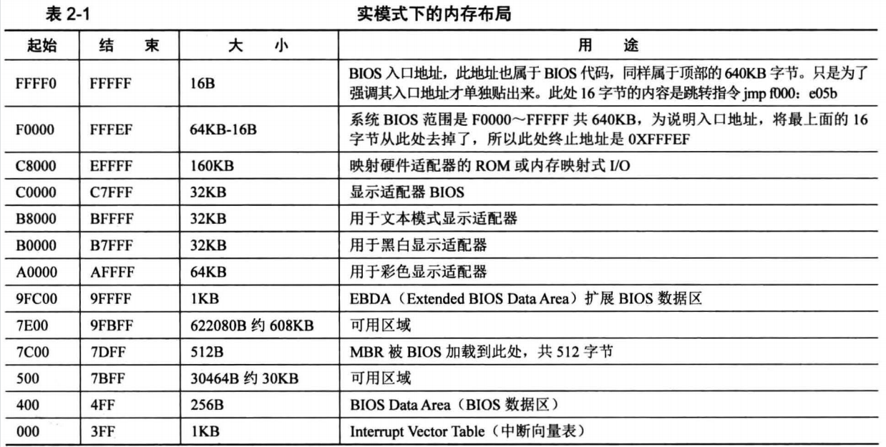

## 计算机的启动

在开机的一瞬间，也就是接电的一瞬间，CPU 的 `cs:ip` 寄存器被强制初始化为 `OxF000:0xFFF0`。由于开机的时候处于实模式，在实模式下的段基址要乘以 16，也就是左移 4 位，于是 `0xF000:0xFFF0` 的等效地址将是 `0xFFFF0`。这个地址就是 BIOS 的入口地址。

### 一、BIOS

BIOS 的全称 `Base Input & Output System`，即基本输入输出系统。

实模式下的内存布局如下：

Intel 8086 有 20 条地址线，故其可以访问 1MB 的内存空间（2 的 20 次方），地址范围：`0x00000 - 0xFFFFF`。如上图，

- 其中内存地址 `0 - 0x9FFFF` 的空间范围是 640KB，这片地址对应到了 DRAM（Dynamic Random Access Memory，动态随机访问内存），也就是插在主板上的内存条。
- 其中内存地址 `0xF0000 - 0xFFFFF` 这 64KB 的内存是 ROM。这里面存的是 BIOS 的代码。

BIOS 的主要工作是检测、初始化硬件。硬件自己提供了一些初始化的功能调用，BIOS 直接调用就好了。BIOS 还会建立中断向量表，这样就可以通过 "int 中断号" 来实现相关的硬件调用，当然 BIOS 建立的这些功能就是对硬件的 IO 操作，也就是输入输出，但由于就只有 64 KB 大小的空间，而且是在实模式下，不可能把所有硬件的 IO 操作实现的面面俱到，所以挑一些重要的、保证计算机能够运行的那些硬件的基本 IO 操作就可以了，这也是 BIOS 称为“基本输入输出系统”的原因。

BIOS 的入口地址处只有 16 字节，这里只是存储一个跳转指令：`jmp far F000:E05B`。即跳转到 `0xFE05B` 这个地址，这个位置才是 BIOS 代码真正开始的地方。接下来 BIOS 开始检测内存、显卡等外设信息，当检测通过，并初始化好硬件后，开始在内存中 `0x000 - 0x3FF` 处建立数据结构，中断向量表 IVT（Interrupt Vector Table） 并填写中断例程。

### 二、MBR

BIOS 的最后一项工作是校验启动盘中位于 0 盘 0 道 1 扇区的内容。

> 0 盘 0 道 1 扇区其实也是  0 盘 0 道 0 扇区。这是硬盘扇区表示方法 CHS 的方法，即柱面 Cylinder、磁头 Header、扇区 Sector。在 CHS 方式中扇区的编号是从 1 开始的，不是 0。

如果此扇区末尾的两个字节分别是魔数 0x55 和 0xaa，BIOS 便认为这个扇区中确实存在可执行的程序，这个可执行程序便是“主引导记录 MBR”，于是便把这个程序加载到物理地址：`0x7c00` 处，随后跳转到此地址，继续执行。

MBR 的全称为：`Master Boot Record`，即硬盘的主引导记录，又叫主引导扇区。

>问题：为什么要把 MBR 程序加载到物理地址 `0x7c00` 处？
>
>早期的个人计算机 DOS 1.0 操作系统，此系统要求的最小内存为 32KB，所以此版本 BIOS 是按照最小内存 32KB 研发的。其中 8086 CPU 要求物理地址 `0x0 - 0x3FF` 存放中断向量表，所以这个地方不能动。
>
>MBR 首先不能覆盖已有的数据，其次不能过早的被其他数据覆盖。通常 MBR 的任务是加载某个程序（这个程序一般是内核加载器，很少有直接加载内核的）到指定位置，并将控制权交给他。所谓的交控制权就是 jmp 过去而已。之后 MBR 就没用了，被覆盖也没关系。过早的覆盖指的是不能让 MBR 破坏自己，比如被加载的程序，如内核加载器，其放置的内存位置若是 MBR 自己所在的范围，就会破坏自己，所以需要等 MBR 执行完才行。
>
>MBR 本身也是程序，是程序就需要用到栈，栈也是在内存中，MBR 虽然本身只有 512 字节，但还需要为他所用的栈分配点空间。所以实际所需的空间要大于 512 字节的，估计 1MB 内存够用了。
>
>因此结合以上三点，选择 32 KB 中的最后 1KB 最为合适，32KB 换算为地址是：`0x8000`，减去 1KB（`0x400`）的话，等于 `0x7c00`。这就是 `0x7c00` 的由来。

接下来我们来写一个 MBR 程序。