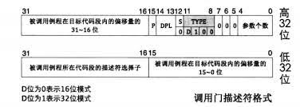

## 中断

### 一、中断分类

内部中断：来自 CPU 内部的中断。按中断是否正常来划分，分为“软中断” 和 “异常”

外部中断：来自 CPU 外部的中断。按是否导致宕机来划分，分为“可屏蔽中断” 和 “不可屏蔽中断”

#### 1. 外部中断

外部的中断源必须是某个硬件。因此外部中断又称为硬件中断。

CPU 提供了两条信号线，分别是 INTR（INTeRrupt）和 NMI（Non Maskable Interrupt）。外部中断是通过这两根信号线通知 CPU 的。

如下，所说的内容都是基于单核 CPU。

- 从 INTR 引脚收到的中断不影响系统运行，可以随时处理，甚至 CPU 可以不处理，因为不影响 CPU 的运行
- 从 NMI 引脚收到的中断，影响CPU的运行，所以必须响应

于是衍生出新的概念名词

- 可屏蔽中断：通过 INTR 引脚引入 CPU 的，CPU 可以不理会。外部设备如网卡、硬盘发出的中断都是可屏蔽中断
  - 因为不会让系统宕机，所以可以通过 eflags 寄存器中的 IF 位将所有这些外部设备的中断屏蔽
  - linux 中，CPU 处理这类中断时，会分为上半部和下半部，分开来处理。上半部是需要立即执行的部分，所以通常情况是只完成中断应答或硬件复位等重要紧迫的工作。而中断处理程序中那些不紧急的部分则被推迟到下半部中完成。比如网络中的数据到达网卡后，中断的上半部会将网卡缓冲区中的数据拷贝到内核缓冲区中；下半部则是 CPU 拿到网络数据后，处理数据的操作，这部分操作倒显得不那么紧急。
- 不可屏蔽中断：通过 NMI 引脚引入 CPU 的，表示系统发生了致命的错误，比如：电源掉电、内存读写错误、总线奇偶校验错误。

中断发起时，相应的中断向量号通过 NMI 或 INTR 引脚被送入 CPU，中断向量号是中断向量表或中断描述符表里的中断项的下标，CPU 根据此中断向量号在中断向量表或中断描述符表中检索对应的中断处理程序并执行。

不可屏蔽中断，一般都是硬件问题（物理上的问题），对于软件来说没有必要区分，分配一个中断向量号就足够了，因此不可屏蔽中断的中断向量号为 2。

#### 2. 内部中断

分为软中断和异常。

软中断：由软件主动发起的中断，所以主观上，并不是客观上的某种内部错误

- `int  8位立即数`：通过他进行系统调用，8位立即数可表示 256 种中断
- `int3`：他是调试断点指令，其所触发的中断向量号是 3
- `into`：中断溢出指令，触发的中断向量号为 4。能否引发 4 号中断是要看 elfags 标志寄存器中的 OF 位是否为 1，如果是 1 才会引发中断，否则指令什么都不做
- `bound`：检查数组索引越界指令，触发 5 号中断，用于检查数组的索引下标是否在上下边界之内。指令格式：`bound 16/32位寄存器  16/32位内存`，目的操作数是用寄存器来存储的，其内容是待检测的数组下标值。源操作数是内存，其内容是数组下标的下边界和上边界。
- `ud2`：未定义指令，触发 7 号中断。表示指令无效，CPU 无法识别

以上几种软中断指令，除第一种的 “int 8位立即数” 之外，其他的几种又可以称为异常。异常是指令执行期间 CPU 内部产生的错误引起的。由于是运行时错误，所以他不受标志寄存器 eflags 中的 IF 位影响。只要中断关系到 “正常” 运行，就不受 IF 位影响。

异常按照轻重程序分为三种：

-  Fault，也称为故障，可以被修复的一种类型，属于最轻的一种异常。当发生此类异常时 CPU 将机器状态恢复到异常之前的状态，之后调用中断处理程序时，CPU 将返回地址依然指向导致 Fault 异常的那条指令。通常中断处理程序会将此问题修复，待中断处理程序返回后便能充实。比如：缺页异常 Page fault。
- Trap，也称为陷阱，此异常通常用于调试中，比如 int3 指令便能引发此类异常，为了让中断处理程序返回后能够继续向下执行，CPU 将中断处理程序的返回地址指向导致异常指令的下一个指令地址。
- Abort，也称为终止，由于错误无法修复，程序将无法继续运行，操作系统为了自保，只能将程序从进程表中去掉。导致此异常的错误通常是硬件错误，或者某些系统数据结构出错。

CPU 为了统一中断管理，把来自外部设备、内部指令的各种中断类型统统归结为一种管理方式，即为每个中断信号分配一个整数，用此整数作为中断的 ID，而这个整数就是中断向量，用此 ID 作为中断描述符表中的索引，就能找到对应的表项，进而找到对应的中断处理程序。

### 二、中断描述符表

中断描述符表（Interrupt Descriptor Table，IDT）是保护模式下用于存储中断处理程序入口的表。多提一句，实模式下，用于存储中断处理程序入口的表叫做中断向量表（Interrupt Vector Table，IVT）。

中断描述符表地址不限制，在哪里都可以；且每个描述符用 8 字节描述。

中断描述符表中的 “描述符” 也称为 “门”。 接下来我们看下不同种类的门描述符。

#### 1. 任务门描述符

任务门和任务状态段（Task Status Segment，TSS）是 Intel 处理器在硬件一级提供的任务切换机制，所以任务门需要和 TSS 配合在一起使用，在任务门中记录的是 TSS 选择子，偏移量未使用。任务门可以存在于全局描述符表 GDT、局部描述符表 LDT、中断描述符表 IDT 中。描述符中任务门的 type 值为二进制 0101。大多数操作系统（包括 Linux）都未用 TSS 实现任务切换，所以少关注

#### 2. 中断门描述符

中断门包含了中断处理程序所在段的段选择子和段内偏移地址。当通过此方式进入中断后，标志寄存器 eflags 中的 IF 位自动置 0，也就是在进入中断后，自动把中断关闭，避免中断嵌套。Linux 就是利用中断门实现的系统调用，就是那个著名的 `int 0x80`。中断门只允许存在于 IDT 中。描述符中中断门的 type 值为二进制 1110。

#### 3. 陷阱门描述符

陷阱门进入中断后，标志寄存器 eflags 中的 IF 位不会自动置 0，只允许存在于 IDT 中。描述符中陷阱门的 type 值为二进制 1111。

#### 4. 调用门描述符

调用门是提供给用户进程进入特权 0 级的方式，其 DPL 为 3。调用门中记录例程的地址，他不能用 int 指令调用，只能用 call 和 jmp 指令。调用门可以安装在 GDT 和 LDT 中。描述符中调用门的 type 值为二进制 1100。

#### 5. 中断描述符寄存器

我们把精力放在中断门，像 Linux 那样，用它来实现系统调用。现代的操作系统很少用到调用门和任务门。

在门描述符中有个 P 位，将 P 位置 0 表示门描述符中的中断处理程序不在内存中。

在 CPU 中有个中断描述符表寄存器（Intrrupt Descriptor Table Register，IDTR），该寄存器分为两部分：

- 第 0 - 15 位是表界限，即 IDT 大小减一。16 位表界限最大范围是 0xffff，可容纳的描述符个数是：`64KB / 8 = 8192` 个。并且第 0 个门描述符也可用（区别 GDT 中第 0 个描述符不可用）
- 第 16 - 47 位是 IDT 的基地址

使用指令 “ `lidt  48位内存数据`” 来加载 IDTR。

### 三、中断处理过程以及保护、中断发生时的压栈、中断错误码

### 四、可编程中断控制器 8259A

8259A 的作用是负责所有来自外设的中断，其中就包括来自时钟的中断。8259A 用于管理和控制可屏蔽中断，他表现在屏蔽外设中断，对他们实行优先级判决，向 CPU 提供中断向量号等功能。并且可以通过编程的方式来设置这些功能。

